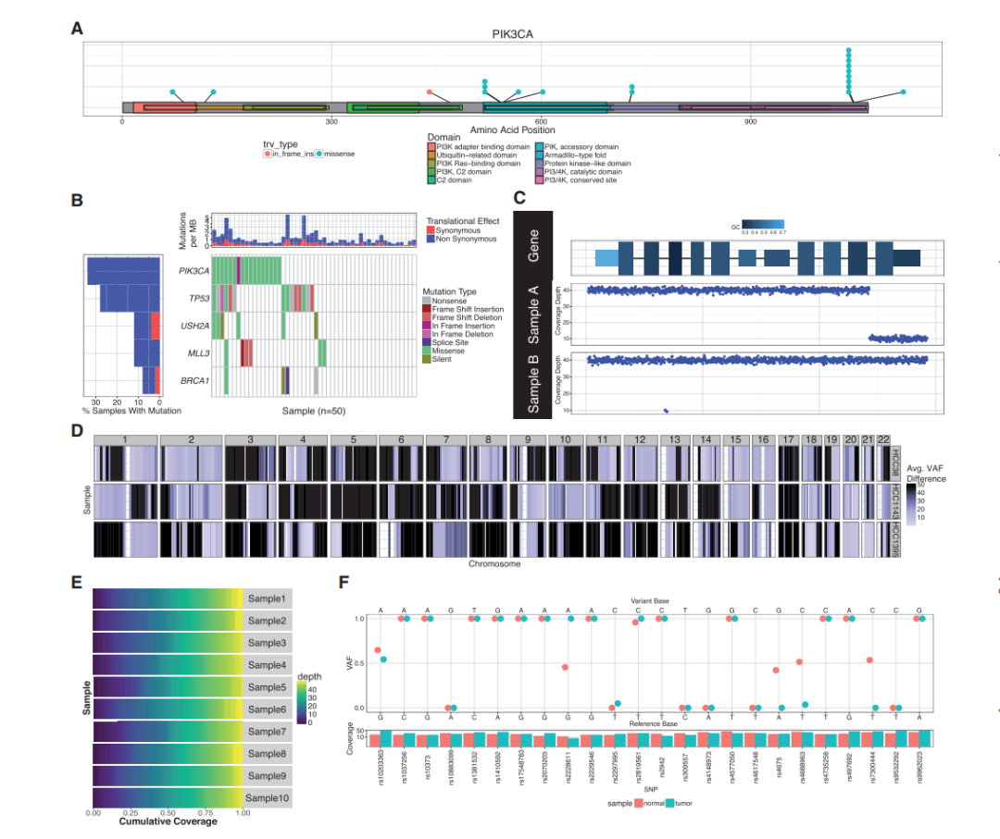
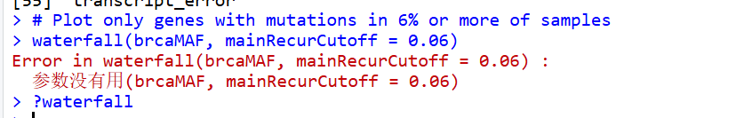
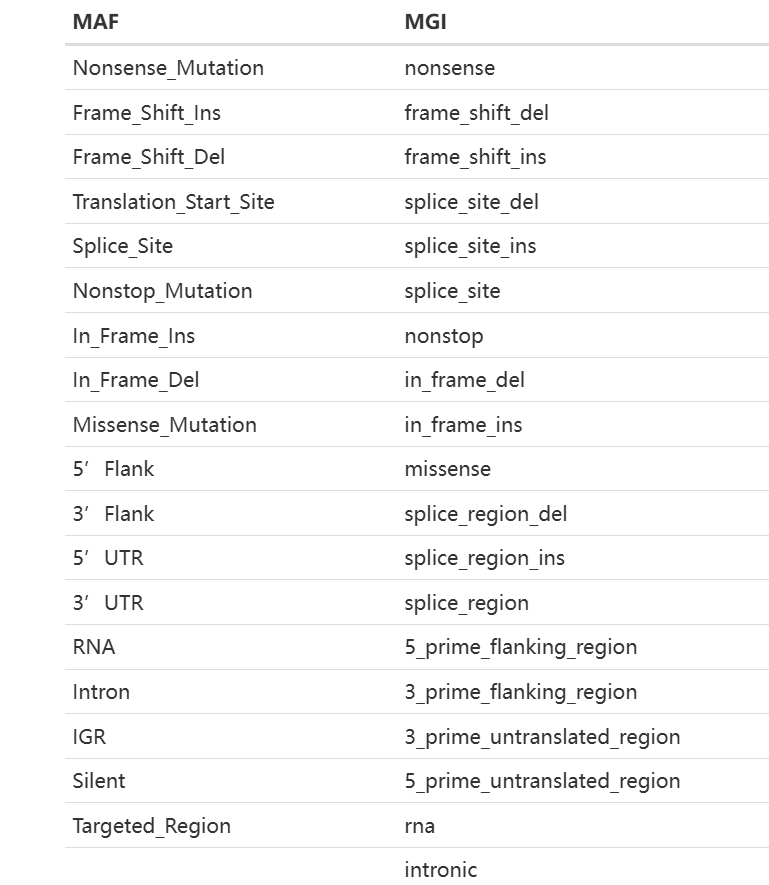
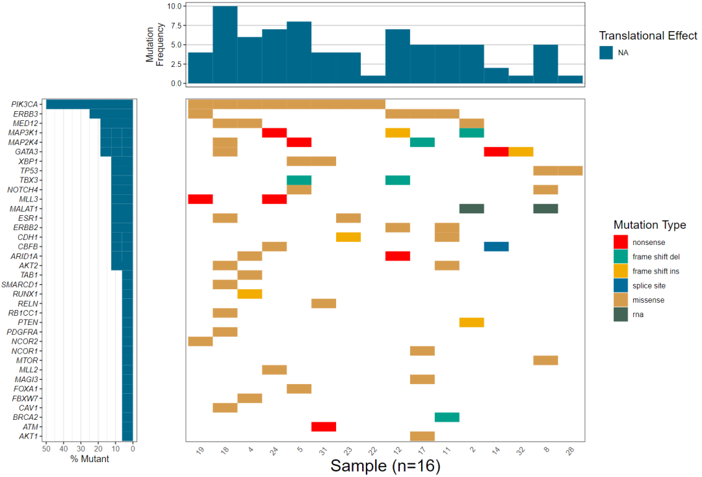
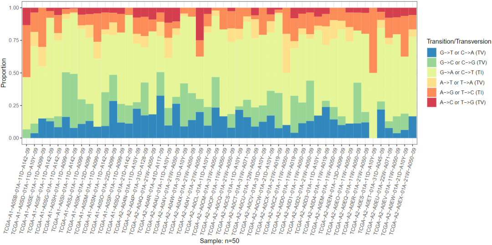
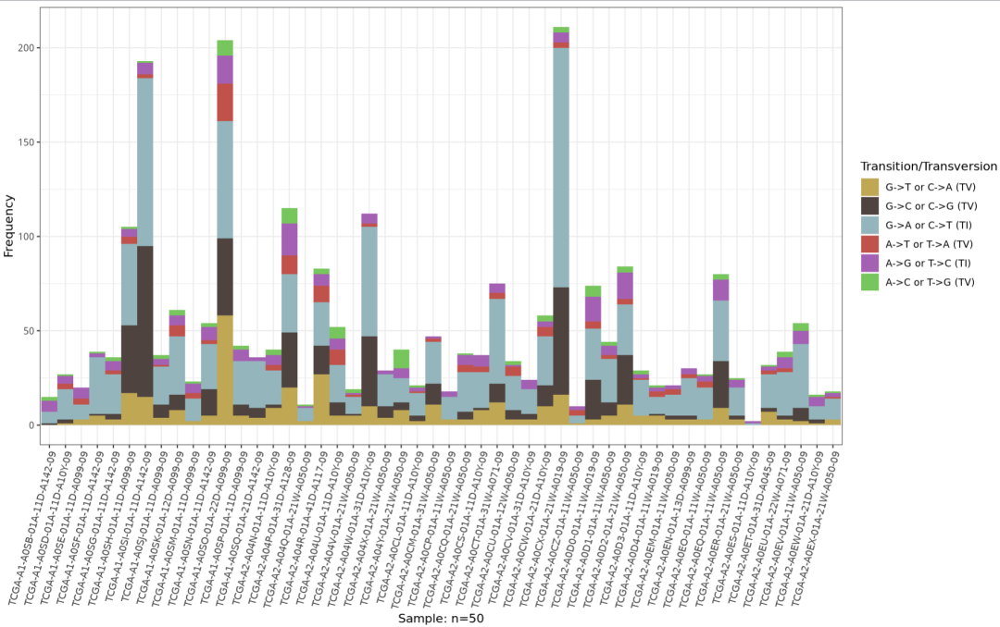
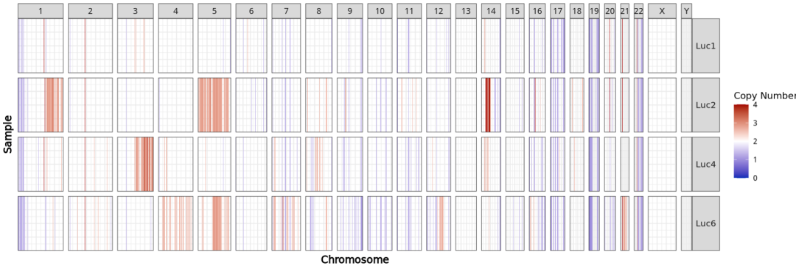
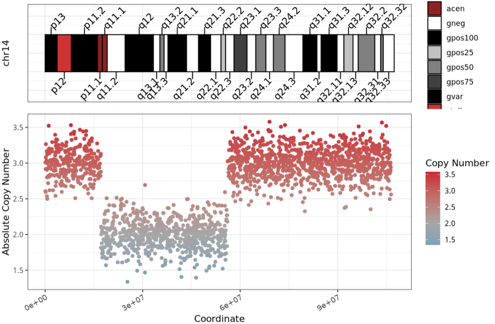
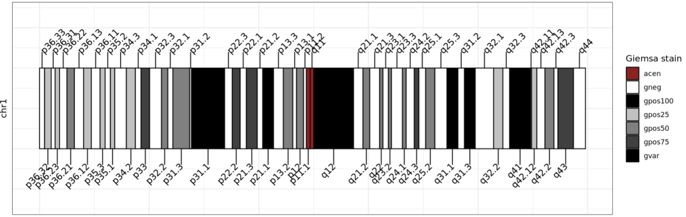
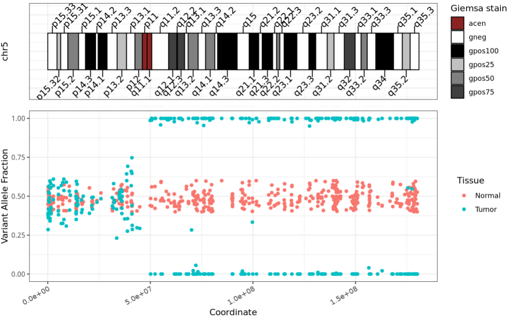

# GenVisR（r包）介绍：基因组可视化工具

- 专辑：绘图小技巧2025
- 公众号：生信技能树
- 发布时间：2025-01-29 14:12
- 原文：[微信公众平台](https://mp.weixin.qq.com/s?__biz=MzAxMDkxODM1Ng%3D%3D&mid=2247537617&idx=2&sn=c9f6907c800f4db038ff49198d74d077&chksm=9b4b136aac3c9a7c041885e511343748b2cb7666a7f39b850266af3a4d7c39285a12ad96bc59)

---
> 前面我们已经给大家介绍了两款绘制基因棒棒图的软件：《[maftools（r包）绘制棒棒图等](https://mp.weixin.qq.com/s?__biz=MzAxMDkxODM1Ng==&mid=2247537553&idx=2&sn=8512c282fdeaaa54642fbe5a4ba5c396&scene=21#wechat_redirect)》，《[trackview（r包）包绘制 基因棒棒图](https://mp.weixin.qq.com/s?__biz=MzAxMDkxODM1Ng==&mid=2247537475&idx=2&sn=8cf87ed30689c8d1cdbea85ec3233643&scene=21#wechat_redirect)》，今天来学习第三个软件：GenVisR。该软件于2016年10月发表在Bioinformatics杂志上，文章标题：GenVisR: Genomic Visualizations in R，DOI为10.1093/bioinformatics/btw325。

首先，还是老习惯，推荐大家去学习官网：https://github.com/griffithlab/GenVisR。

GenVisR提供了一套快速且易于使用的基因组可视化工具，同时通过利用ggplot2和Bioconductor的功能保持了高度的灵活性。可视化示例结果如下：



Fig. 1. Selected representation of GenVisR visualizations.

## 安装一下

```r
## 使用西湖大学的 Bioconductor镜像
options(BioC_mirror="https://mirrors.westlake.edu.cn/bioconductor")
options("repos"=c(CRAN="https://mirrors.westlake.edu.cn/CRAN/"))
library(devtools)
# install GenVisR from github
install_github("griffithlab/GenVisR")
```

## 绘图：小试牛刀

### 1、瀑布图（突变概览图）

瀑布图的输入数据是一个数据框，该数据框可以来源于 **.maf（版本 2.4）文件** 或者 **MGI 注释格式** 的文件。瀑布图在主面板中显示突变的发生情况和类型，同时在顶部和侧面的子图中展示突变负荷以及携带突变的样本所占的百分比。

示例数据为 GenVisR 中提供的`brcaMAF`数据结构，包含了部分来自TCGA数据库的50个乳腺浸润性癌样本。可以从这里进行下载：https://github.com/griffithlab/GenVisR/tree/master/data。

```r
rm(list=ls())
library(GenVisR)
set.seed(383)

load("GenVisR-master/data/brcaMAF.rda")
head(brcaMAF)
colnames(brcaMAF)
```

`mainRecurCutoff` 取值为0-1，控制展示那些突变样本比例\> x 的基因。例如，如果希望绘制在 ≥6% 的样本中存在突变的基因：

```r
# Plot only genes with mutations in 6% or more of samples
waterfall(brcaMAF, mainRecurCutoff = 0.06)
```



运行到这里发现数据报错虽然解决了，但是绘图也报错，然后看帮助函数提示新的教程在这：https://currentprotocols.onlinelibrary.wiley.com/doi/full/10.1002/cpz1.252

重新来一遍：

```r
rm(list=ls())
library(GenVisR)
library(data.table)
set.seed(383)

myVars <- fread("http://genomedata.org/gen-viz-workshop/GenVisR/BKM120_Mutation_Data.tsv")
head(myVars)
colnames(myVars)
```

`Waterfall()` 函数会在数据表（`data.table`）中查找特定的列名：列名应为“sample”、“gene”和“mutation”。

重命名一下：

```r
myVars <- myVars[,.(`patient`, `gene name`, `trv type`, `amino acid change`)]
setnames(myVars, c("sample", "gene", "mutation", "amino acid change"))
```

在同一个基因/样本中存在多个突变的情况下，我们需要指定在绘图时哪种突变类型应被优先考虑。优先级如下：



```r
myHierarchy <- data.table("mutation"=c("nonsense", "frame_shift_del", "frame_shift_ins", "in_frame_del", "splice_site_del", "splice_site", "missense","splice_region", "rna"),
color=c("#FF0000", "#00A08A", "#F2AD00", "#F98400", "#5BBCD6", "#046C9A", "#D69C4E", "#000000", "#446455"))

# 绘图
plotData <- Waterfall(myVars, mutationHierarchy = myHierarchy)

# 保存
pdf(file="Figure_1.pdf", height=8, width=12)
drawPlot(plotData)
dev.off()
```



### 2、TvTi（转换/颠换图）

`TvTi` 用于可视化给定队列中转换（Transition）和颠换（Transversion），输入数据为 **.maf（版本 2.4）文件**，其中包含样本和等位基因信息。

```r
load("GenVisR-master/data/brcaMAF.rda")
head(brcaMAF)
colnames(brcaMAF)

# Call TvTi
pdf(file = "TvTi_plot.pdf",width = 12,height = 6)
TvTi(brcaMAF, lab_txtAngle=75, fileType="MAF")
dev.off()
```



如果将 `type` 参数设置为“Frequency”，`TvTi` 还会绘制每种转换（Transition）/颠换（Transversion）类型的观察频率，而不是比例。

```r
# Plot the frequency with a different color pallete
TvTi(brcaMAF, type = "Frequency", palette = c("#77C55D", "#A461B4", "#C1524B", "#93B5BB",
                                              "#4F433F", "#BFA753"), lab_txtAngle = 75, fileType = "MAF")
```



### 3、cnSpec（拷贝数变异队列图）

`cnSpec` 绘制在队列水平上显示拷贝数片段的图。输入为数据框，其中列名为“chromosome”、“start”、“end”、“segmean”和“sample”，每一行表示一个具有拷贝数变异的片段。此外还需要一个 UCSC 基因组（默认为“hg19”）以确定染色体边界。这里使用附带的数据集 `LucCNseg`，其中包含来自全基因组测序数据的4个样本的拷贝数片段。

```r
# Call cnSpec with minimum required inputs
cnSpec(LucCNseg, genome = "hg19")
```



### 4、cnView（单样本拷贝数变异图）

与 GenVisR 中的大多数绘图不同，`cnView` 主要用于单个样本的分析。输入数据为数据框，其中列名为“chromosome”、“coordinate”、“cn”以及可选的“p_value”。此外，还需要通过参数 `chr` 指定要绘制的染色体，以及通过参数 `genome` 指定用于确定染色体边界的基因组组装版本。这里通过第14号染色体的示例数据来展示 `cnView` 的功能。

```r
# Create data
chromosome <- "chr14"
coordinate <- sort(sample(0:106455000, size = 2000, replace = FALSE))
cn <- c(rnorm(300, mean = 3, sd = 0.2), rnorm(700, mean = 2, sd = 0.2), rnorm(1000,
                                                                              mean = 3, sd = 0.2))
data <- as.data.frame(cbind(chromosome, coordinate, cn))
data
head(data)

# Call cnView with basic input
cnView(data, chr = "chr14", genome = "hg19", ideogram_txtSize = 4)
```



### 5、ideoView（染色体图）

`ideoView` 函数绘制代表给定组装版本中感兴趣染色体的染色体图（ideogram）。基本输入为数据框，其列名为：“chrom”、“chromStart”、“chromEnd”、“name”和“gieStain”，这些列名与从 UCSC SQL 数据库中可获取的格式相匹配。此外，还需要指定要显示的染色体。在这里，使用附带的数据集 `cytoGeno` 中预加载的基因组 `hg38`。

```r
# Obtain cytogenetic information for the genome of interest
data <- cytoGeno[cytoGeno$genome == "hg38", ]

# Call ideoView for chromosome 1
ideoView(data, chromosome = "chr1", txtSize = 4)
```



### 6、lohView（杂合性缺失视图）

`lohView` 用于可视化单个样本中单个染色体或所有染色体的**杂合性缺失（Loss of Heterozygosity, LOH）**。输入数据为数据框，其列名为“chromosome”、“position”、“n_vaf”（正常组织的变异等位基因频率）、“t_vaf”（肿瘤组织的变异等位基因频率）和“sample”，以及通过参数`chr`指定要绘制的染色体，和通过参数`genome`指定用于确定染色体边界的基因组组装版本。

```r
# Call lohView with basic input, make sure input contains only Germline calls
lohView(HCC1395_Germline, chr = "chr5", genome = "hg19", ideogram_txtSize = 4)
```



嗯，看完没发现这个包有绘制棒棒图的功能额，好多地方也不更新了。**但是这个包的绘制染色体图还不错**。

### 友情宣传：

[生信入门&数据挖掘线上直播课2025年1月班](https://mp.weixin.qq.com/s?__biz=MzI1Njk4ODE0MQ==&mid=2247527230&idx=1&sn=7156afcd5ab734c7d391b9048695747a&scene=21#wechat_redirect)

[时隔5年，我们的生信技能树VIP学徒继续招生啦](http://mp.weixin.qq.com/s?__biz=MzAxMDkxODM1Ng==&mid=2247524148&idx=1&sn=7806da6feb41a36493c519c1cfc1d3ac&chksm=9b4bdf8fac3c569960369602f1ef26639cb366b250f233b2297d1f059471c0458335bfc0b829&scene=21#wechat_redirect)

[满足你生信分析计算需求的低价解决方案](https://mp.weixin.qq.com/s?__biz=MzAxMDkxODM1Ng==&mid=2247535760&idx=2&sn=1e02a2e982a046ecf6389231e6768d5b&scene=21#wechat_redirect)

<!-- wechat-article-fetcher: complete -->
