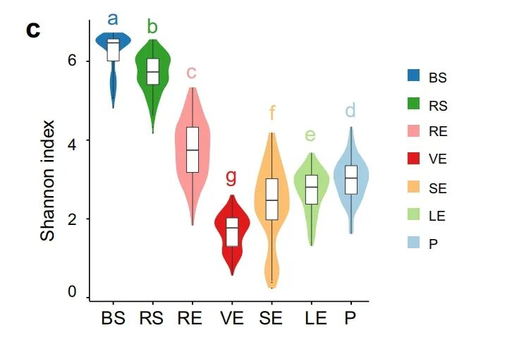
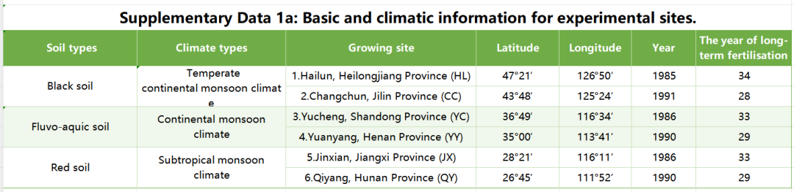
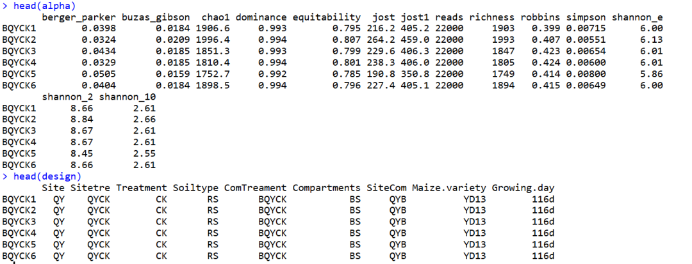
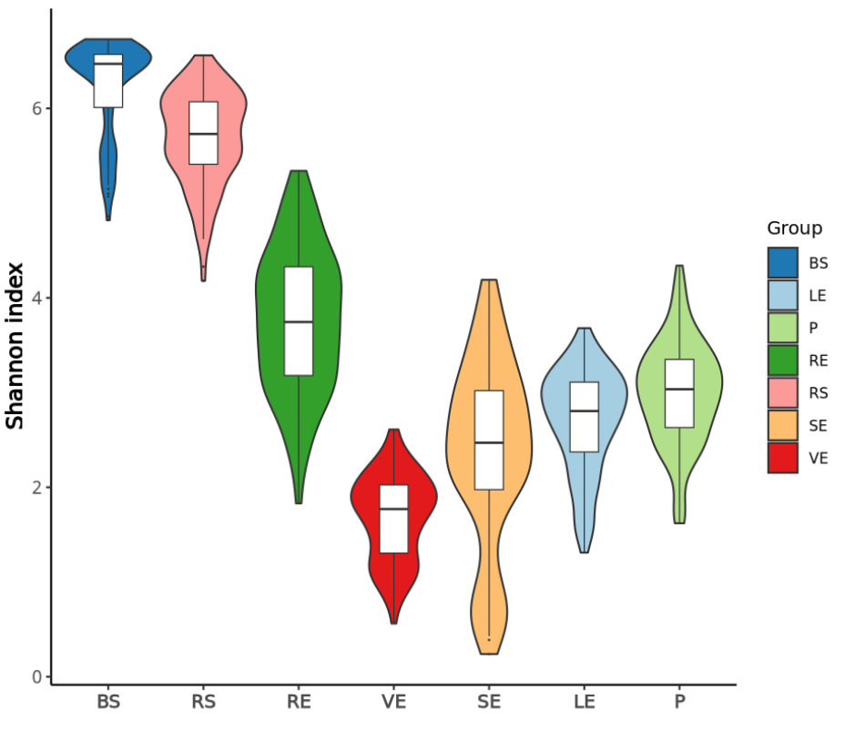

# 绘制NC杂志同款高颜值小提琴图

- 专辑：绘图小技巧2025
- 公众号：生信技能树
- 发布时间：2025-01-27 21:29
- 原文：[微信公众平台](https://mp.weixin.qq.com/s?__biz=MzAxMDkxODM1Ng%3D%3D&mid=2247537553&idx=1&sn=d60bcf0ec06858a21c2e0eb52e55fea3&chksm=9b4b132aac3c9a3c468a264ccb2cdbf7e45dc0dca951cb59cb61c72bb19523c82afb3518e346)

---
> **小提琴很多，但是好看配色又高端的可不多**，今天来学习一篇2022年6月发表在 nature communicattions  杂志中的小提琴图，文献为《**A highly conserved core bacterial microbiota with nitrogen-fixation capacity inhabits the xylem sap in maize plants**》。图片如下：



Fig. 1 Effects of soil type and fertilisation on the maize microbiome

图注：小提琴图显示了每个部位细菌群落的香农指数分布。植物多样性分析显示，与BS和其他植物隔室相比，VE的微生物群多样性显著较低（PFDR \< 0.05）。

> 图c：Violin plot showing distribution of Shannon’s index of the bacterial community in each compartment. Horizontal bars within boxes denote medians. Tops and bottoms of boxes represent 25th and 75th percentiles, and lines extend to the 1.5× interquartile range. Letters indicate statistical significance among groups using two-sided Wilcoxon test (adjusted P \< 0.05 by Benjamini and Hochberg method). The sample sizes are as follows: BS, 126; RS, 141; RE, 138; VE, 119; SE, 120; LE, 158; P, 152.

## 数据背景

为了检测沿土壤-玉米连续体中不同植物部位的玉米微生物群落的差异，作者从中国中温带到亚热带区域的六个长期施肥实验点采集了植物样本，这些实验点涵盖了三种土壤类型（黑土，BSA；红土，RSA；潮土，FSA）（补充数据1和补充图1）。



这些地区的土壤至少已经施肥29年，按照三种施肥制度（不施肥，对照；施用氮、磷、钾化肥，NPK；以及施用有机肥料加化肥，NPKM），这导致了土壤肥力水平和细菌群落的巨大差异（补充表1和补充图2）。

通过**16S rRNA扩增子测序（V5-V7区域）**对团聚土（BS）、根际土（RS）、根内圈（RE）、木质部汁液（VE）、茎内圈（SE）、叶内圈（LE）和叶表面（P）中的细菌群落进行分析。

#### 数据地址：https://github.com/PlantNutrition/Liyu

- metadata.txt：样本表型信息，分组

- alpha.txt：每个样本的香农指数

## 小提琴X坐标轴

因此，根据上面的数据背景了解，这里小提琴图的x轴指的是不同的土壤取样中的微生物：

- **Bulk Soil (BS)**: 土壤整体样本，指的是未受植物根系直接影响的土壤。

- **Rhizosphere Soil (RS)**: 根际土壤，指的是受植物根系分泌物和微生物活动影响的土壤区域。

- **Root Endosphere (RE)**: 根内圈，指的是植物根系内部的微生物群落。

- **Xylem Sap (VE)**: 木质部汁液，指的是在植物木质部中运输的液体，含有水分和溶解的矿物质。

- **Stem Endosphere (SE)**: 茎内圈，指的是植物茎内部的微生物群落。

- **Leaf Endosphere (LE)**: 叶内圈，指的是植物叶片内部的微生物群落。

- **Phylloplane (P)**: 叶表面，指的是植物叶片的外部表面，通常覆盖着微生物群落。

## 小提琴Y轴：Shannon’s index

> ### Shannon’s index of the bacterial community
>
> **Shannon’s index**，也称为**香农指数**或**香农-威纳指数（Shannon-Wiener index）**，是一种用于描述微生物群落多样性的指标。它综合考虑了群落中物种的丰富度和均匀度，反映了群落结构的复杂性。
>
> - **丰富度（Species Richness）**：指群落中不同物种的数量。
>
> - **均匀度（Evenness）**：指群落中各个物种个体分配的均匀程度。物种个体分配越均匀，香农指数值就越大。
>
> 香农指数的计算公式为：
>
> H=−∑i=1spiln(pi)
>
> 其中：
>
> - H 是香农指数。
>
> - s 是群落中物种的总数。
>
> - pi 是第 i 个物种在群落中的相对丰度，即第 i 个物种的个体数占群落总个体数的比例。
>
> ### 举例说明
>
> 假设有一个群落，包含三个物种，其个体数分别为：
>
> - 物种A：50个个体
>
> - 物种B：30个个体
>
> - 物种C：20个个体
>
> 群落总个体数为 N=50+30+20=100。
>
> 则各物种的相对丰度为：
>
> - pA=50/100=0.5
>
> - pB=30/100=0.3
>
> - pC=20/100=0.2
>
> 香农指数计算如下：
>
> H=−(0.5ln(0.5)+0.3ln(0.3)+0.2ln(0.2))
>
> H≈−(0.5×(−0.693)+0.3×(−1.204)+0.2×(−1.609))
>
> H≈0.346+0.361+0.322
>
> H≈1.029
>
> ### 香农指数的特点
>
> - **最大值**：当群落中所有物种的个体数相等时，香农指数达到最大值，此时群落的多样性最高。
>
> - **最小值**：当群落中所有个体都属于同一个物种时，香农指数为0，此时群落的多样性最低。
>
> ### 应用
>
> 香农指数广泛应用于生态学、微生物学和信息科学等领域，用于评估群落的生物多样性、生态系统的稳定性和信息的不确定性。在微生物群落研究中，香农指数可以帮助研究人员了解不同环境条件下微生物群落的结构和功能变化。

## 小提琴图绘制

### 1、数据读取

```r
rm(list=ls())
library(Hmisc)
library(car) # Test for normality and homogeneity of variance
library(ggplot2)

# 每个样本的香农指数
alpha = read.table("Fig1/alpha.txt", header=T, row.names=1, sep="\t", comment.char="")
head(alpha)

# 样本分组信息
design = read.table("Fig1/metadata.txt", header=T, row.names=1, sep="\t")
head(design)

# 两个取交集
idx = rownames(design) %in% rownames(alpha)
design = design[idx,]
alpha = alpha[rownames(design),]
head(alpha)
head(design)
```

两个数据的行现在是一一对应的：



取出两个表格中的样本分组以及香农指数信息

```r
# 列名变成首字母大写
colnames(alpha) = capitalize(colnames(alpha))

# 取出 样本分组信息列 Compartments
sampFile = as.data.frame(design[, "Compartments"],row.names = row.names(design))
# 取出样本的香农指数列 Shannon_e 并与上面的分组信息合并
df <- cbind(alpha[rownames(sampFile),"Shannon_e"], sampFile)
# 重新命名数据列名
colnames(df) <- c("Shannon_e","Group")
df$Group <- factor(df$Group)
head(df)

# Shannon_e Group
# BQYCK1      6.00    BS
# BQYCK2      6.13    BS
# BQYCK3      6.01    BS
# BQYCK4      6.01    BS
# BQYCK5      5.86    BS
# BQYCK6      6.00    BS
```

### 2、绘图

```r
## plot
# violin plotting
col <- c("#1F78B4","#A6CEE3","#B2DF8A","#33A02C","#FB9A99","#FDBF6F","#E31A1C")
p <- ggplot(df, aes(x=Group, y=Shannon_e, fill=Group)) +
  geom_violin(position = position_dodge(width = 0.1), scale = 'width') +  # 小提琴
  geom_boxplot(alpha=1,outlier.size=0, size=0.3, width=0.3,fill="white") + # 小提琴中的箱线图
  scale_fill_manual(values = col) + # 手动填充颜色
  labs(x="", y="Shannon index", color="Group")+
  scale_x_discrete(limits=c("BS","RS","RE","VE","SE","LE","P")) +
  theme_classic() +
  theme(axis.text.x = element_text(size = 10,face = "bold"),axis.text.y = element_text(size = 10))+
  theme(axis.title.y= element_text(size=12,face = "bold"))+theme(axis.title.x = element_text(size = 12))+
  theme(legend.title=element_text(size=10),legend.text=element_text(size=8))

p
```

结果如下：



### 友情宣传：

[生信入门&数据挖掘线上直播课2025年1月班](https://mp.weixin.qq.com/s?__biz=MzI1Njk4ODE0MQ==&mid=2247527230&idx=1&sn=7156afcd5ab734c7d391b9048695747a&scene=21#wechat_redirect)

[时隔5年，我们的生信技能树VIP学徒继续招生啦](http://mp.weixin.qq.com/s?__biz=MzAxMDkxODM1Ng==&mid=2247524148&idx=1&sn=7806da6feb41a36493c519c1cfc1d3ac&chksm=9b4bdf8fac3c569960369602f1ef26639cb366b250f233b2297d1f059471c0458335bfc0b829&scene=21#wechat_redirect)

[满足你生信分析计算需求的低价解决方案](https://mp.weixin.qq.com/s?__biz=MzAxMDkxODM1Ng==&mid=2247535760&idx=2&sn=1e02a2e982a046ecf6389231e6768d5b&scene=21#wechat_redirect)

<!-- wechat-article-fetcher: complete -->
