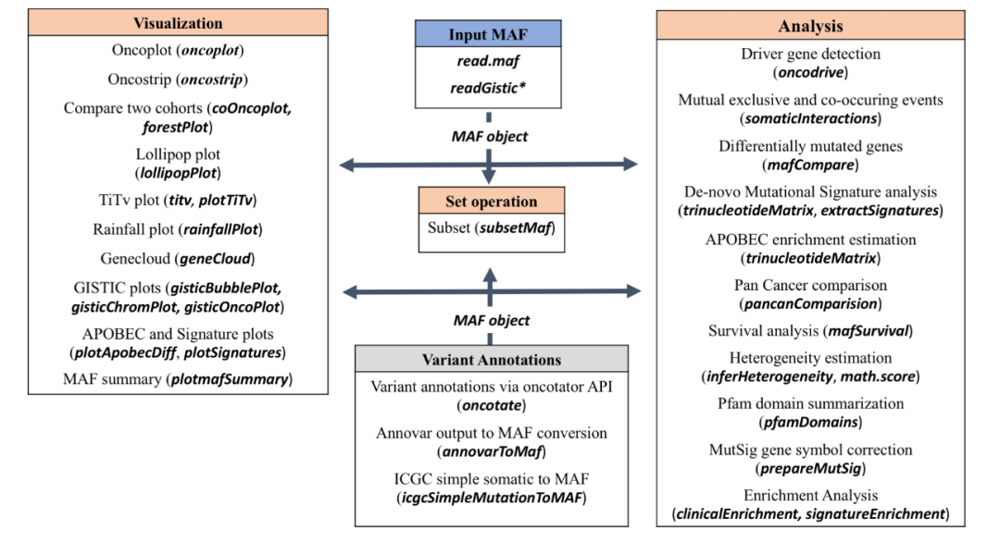
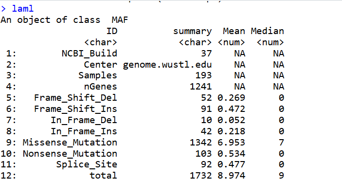
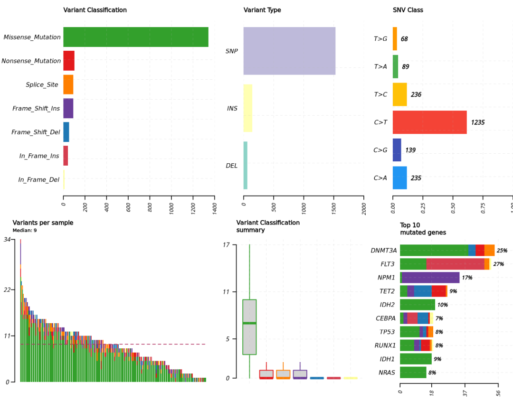
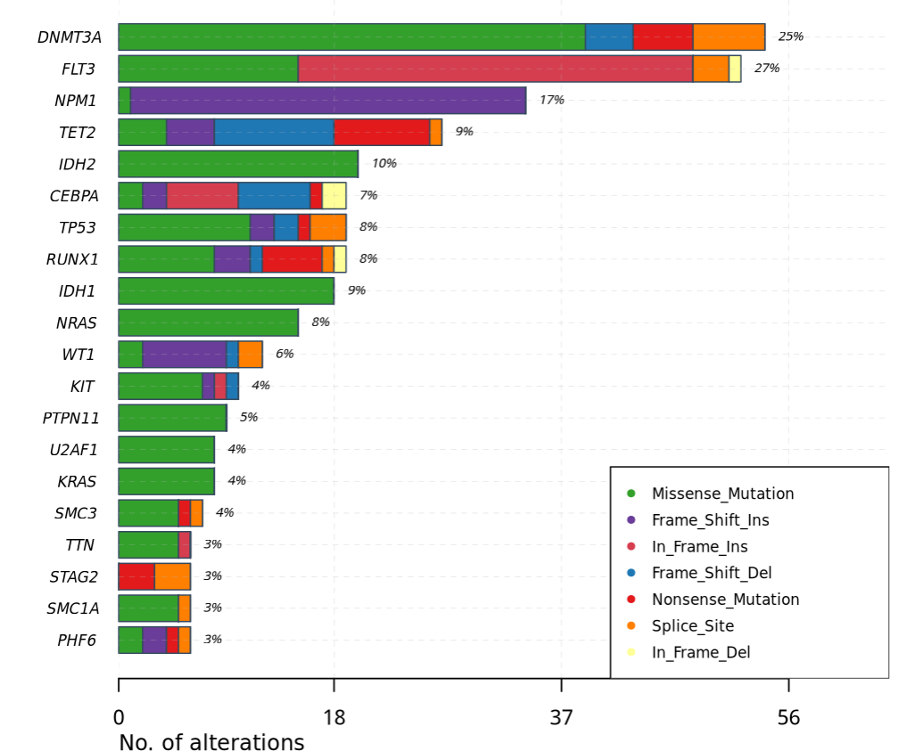
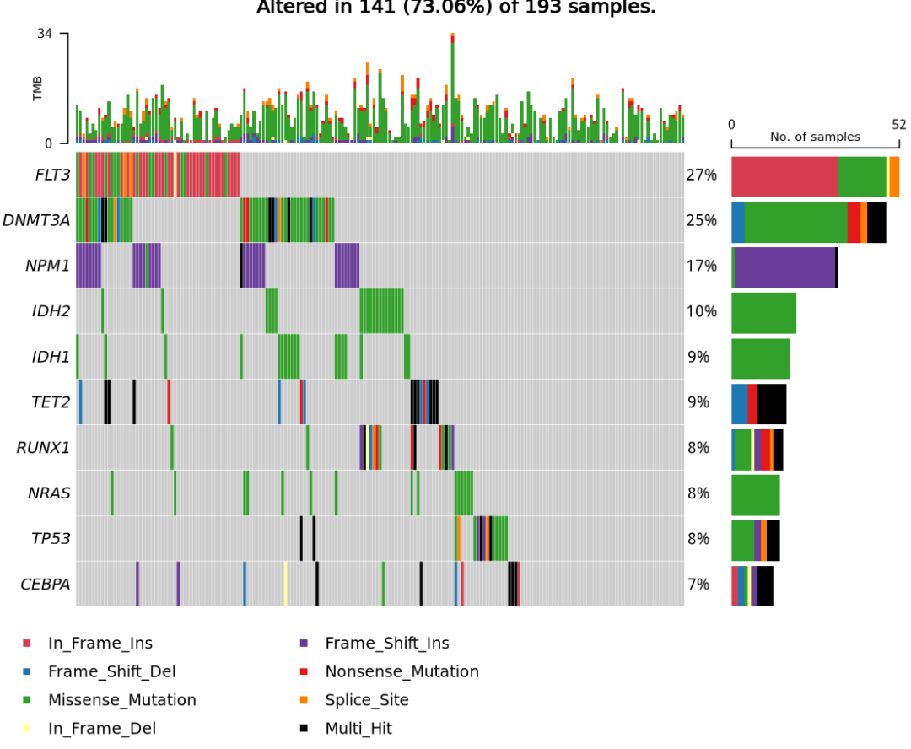
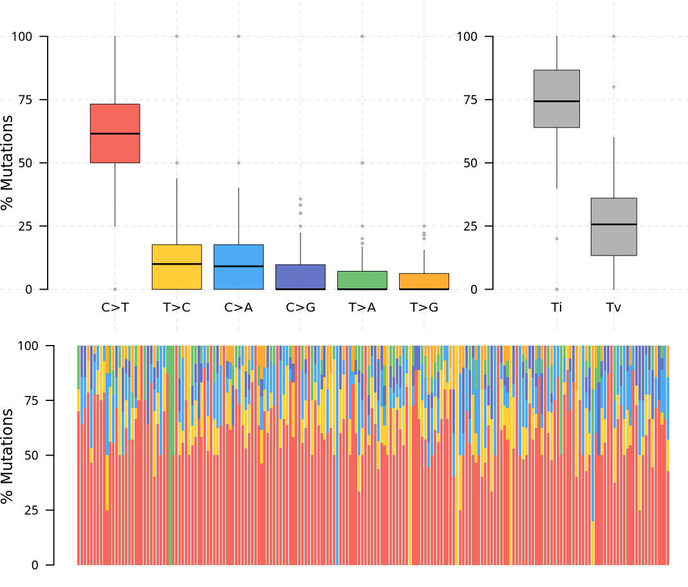
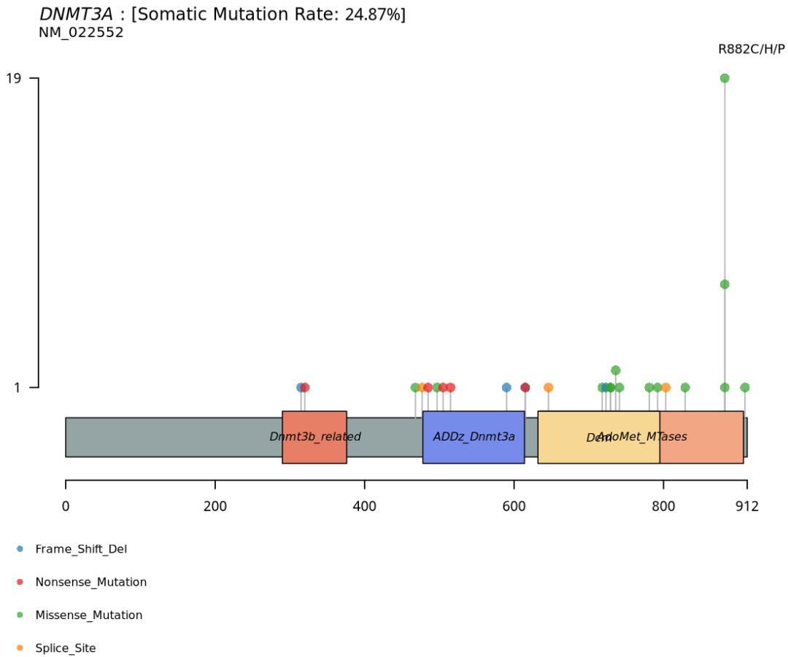
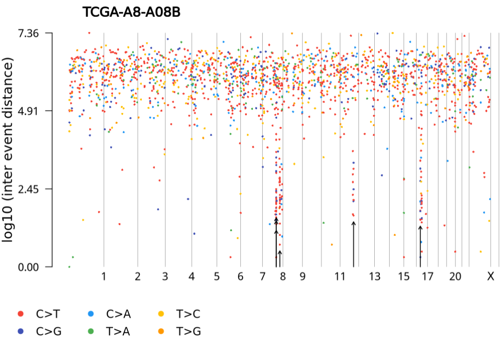
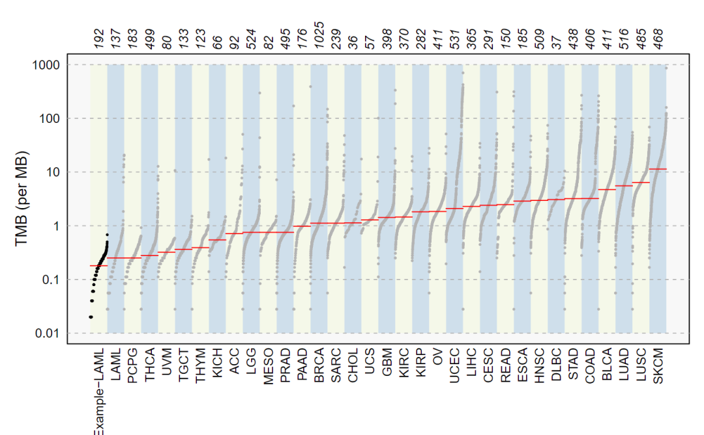
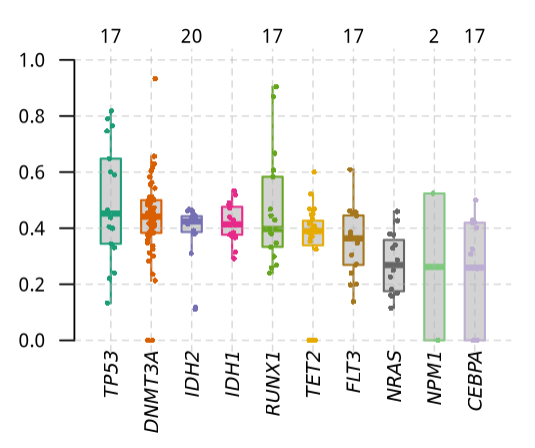

# maftools（r包）绘制棒棒图等

- 专辑：绘图小技巧2025
- 公众号：生信技能树
- 发布时间：2025-01-27 21:29
- 原文：[微信公众平台](https://mp.weixin.qq.com/s?__biz=MzAxMDkxODM1Ng%3D%3D&mid=2247537553&idx=2&sn=8512c282fdeaaa54642fbe5a4ba5c396&chksm=9b4b132aac3c9a3cf64de46009cab39c6ac680e0aaa96bdbe8c9d80f0afa3ad1d58e8ef0ef95)

---
maftools包，一个专门对MAF文件进行总结，分析和可视化的工具，工具于2018年11月发表在Genome Research上：

> Mayakonda A, Lin DC, Assenov Y, Plass C, Koeffler HP. 2018. Maftools: efficient and comprehensive analysis of somatic variants in cancer. Genome Research. PMID: 30341162

学习官网：https://bioconductor.org/packages/devel/bioc/vignettes/maftools/inst/doc/maftools.html

这个包主要分为分析与可视化两个模块：



## 0、安装

首先简单的安装一下：

```r
## 使用西湖大学的 Bioconductor镜像
options(BioC_mirror="https://mirrors.westlake.edu.cn/bioconductor")
options("repos"=c(CRAN="https://mirrors.westlake.edu.cn/CRAN/"))
# 安装
if (!require("BiocManager"))
    install.packages("BiocManager")
BiocManager::install("maftools")
```

## 1、读取maf文件并预处理

输入数据要求：

- MAF文件 - 可以是gz压缩的。必需的。

- 与MAF中的每个样本/Tumor_Sample_Barcode相关联的临床数据，可选但推荐。

- 如果有的话，可选的拷贝数数据。可以是GISTIC输出，或者是一个包含样本名称、基因名称和拷贝数状态（扩增或缺失）的自定义表格。

`read.maf` 函数用于读取 MAF 文件，以多种方式对其进行总结，并将其存储为一个 MAF 对象。

```r
rm(list=ls())
library(maftools)

# path to TCGA LAML MAF file
laml.maf = system.file('extdata', 'tcga_laml.maf.gz', package = 'maftools')
laml.maf
#"/usr/local/software/miniconda3/envs/R4.4/lib/R/library/maftools/extdata/tcga_laml.maf.gz"

# clinical information containing survival information and histology. This is optional
laml.clin = system.file('extdata', 'tcga_laml_annot.tsv', package = 'maftools')
laml.clin
#/usr/local/software/miniconda3/envs/R4.4/lib/R/library/maftools/extdata/tcga_laml_annot.tsv

# 读取
laml = read.maf(maf = laml.maf, clinicalData = laml.clin)

# Typing laml shows basic summary of MAF file.
laml
```

现在是一个MAF对象，MAF对象包含主要的MAF文件、总结数据以及任何相关的样本注释。



简单探索一下maf对象：

```r
# Shows sample summry.
getSampleSummary(laml)

# Shows gene summary.
getGeneSummary(laml)

# shows clinical data associated with samples
getClinicalData(laml)

# Shows all fields in MAF
getFields(laml)

# Writes maf summary to an output file with basename laml.
write.mafSummary(maf = laml, basename = 'laml')
```

## 2、可视化

### 2.1 绘制 MAF summary

我们可以使用`plotmafSummary`来绘制MAF文件的总结，它以堆叠条形图显示每个样本中的变异数量，并以箱线图显示按`Variant_Classification`总结的变异类型。

```r
## plot
plotmafSummary(maf = laml, rmOutlier = TRUE, addStat = 'median', dashboard = TRUE, titvRaw = FALSE)
```



`mafbarplot`函数：绘制每个基因的突变情况，默认绘制top20个基因

```r
mafbarplot(maf = laml)
```



### 2.2 Oncoplots

MAF文件的更好表示可以是癌基因图（oncoplots），也被称为瀑布图。

```r
# oncoplot for top ten mutated genes.
oncoplot(maf = laml, top = 10)
```



### 2.3 转换和颠换

`titv` 函数将单核苷酸多态性（SNPs）分类为转换（Transitions）和颠换（Transversions），并以多种方式返回总结表格的列表。总结数据也可以通过箱线图可视化，展示六种不同转换的整体分布，以及通过堆叠条形图展示每个样本中转换的比例。

```r
laml.titv = titv(maf = laml, plot = FALSE, useSyn = TRUE)
# plot titv summary
plotTiTv(res = laml.titv)
```



### 2.4 氨基酸变化的棒棒糖图

`lollipopPlot` 函数要求我们在 MAF 文件中具有氨基酸变化的信息。然而，MAF 文件对于命名氨基酸变化的字段没有明确的指导方针，不同的研究对氨基酸变化有不同的字段（或列）名称。默认情况下，`lollipopPlot` 查找列 `AAChange`，如果在 MAF 文件中找不到该列，它会打印所有可用字段并显示警告信息。在下面的例子中，MAF 文件在字段/列名 `Protein_Change` 下包含氨基酸变化。我们将使用参数 `AACol` 手动指定这一点。

默认情况下，`lollipopPlot` 使用基因的最长异构体。

```r
# lollipop plot for DNMT3A, which is one of the most frequent mutated gene in Leukemia.
lollipopPlot(
  maf = laml,
  gene = 'DNMT3A',
  AACol = 'Protein_Change',
  showMutationRate = TRUE,
  labelPos = 882
)
```



### 2.5 Rainfall plots

癌症基因组，尤其是实体瘤，其特征是在基因组的特定区域存在局部高突变。这种超突变的基因组区域可以通过在基因组线性尺度上绘制变异间距离来可视化。这些图通常被称为降雨图，我们可以使用 `rainfallPlot` 来绘制这样的图。如果将 `detectChangePoints` 设置为 `TRUE`，降雨图还会突出显示潜在的变异间距离变化所在的区域。

```r
brca <- system.file("extdata", "brca.maf.gz", package = "maftools")
brca
brca = read.maf(maf = brca, verbose = FALSE)
rainfallPlot(maf = brca, detectChangePoints = TRUE, pointSize = 0.4)
```



### 2.6 将突变负荷与TCGA队列进行比较

`tcgaCompare` 使用来自TCGA MC3的突变负荷数据，与33个TCGA队列的突变负担进行比较。生成的图表类似于Alexandrov等人描述的图表。

```r
laml.mutload = tcgaCompare(maf = laml, cohortName = 'Example-LAML', logscale = TRUE, capture_size = 50)
```



### 2.7 绘制VAF

这个函数以箱线图的形式绘制变异等位基因频率，这有助于快速估计突变基因的克隆状态（假设样本纯净，克隆基因的平均等位基因频率通常在~50%左右）。

```r
plotVaf(maf = laml, vafCol = 'i_TumorVAF_WU')
```



以上是关于maf文件的处理与可视化，后面还可以处理拷贝数等数据，见官网学习：https://bioconductor.org/packages/devel/bioc/vignettes/maftools/inst/doc/maftools.html

### 友情宣传：

[生信入门&数据挖掘线上直播课2025年1月班](https://mp.weixin.qq.com/s?__biz=MzI1Njk4ODE0MQ==&mid=2247527230&idx=1&sn=7156afcd5ab734c7d391b9048695747a&scene=21#wechat_redirect)

[时隔5年，我们的生信技能树VIP学徒继续招生啦](http://mp.weixin.qq.com/s?__biz=MzAxMDkxODM1Ng==&mid=2247524148&idx=1&sn=7806da6feb41a36493c519c1cfc1d3ac&chksm=9b4bdf8fac3c569960369602f1ef26639cb366b250f233b2297d1f059471c0458335bfc0b829&scene=21#wechat_redirect)

[满足你生信分析计算需求的低价解决方案](https://mp.weixin.qq.com/s?__biz=MzAxMDkxODM1Ng==&mid=2247535760&idx=2&sn=1e02a2e982a046ecf6389231e6768d5b&scene=21#wechat_redirect)

<!-- wechat-article-fetcher: complete -->
