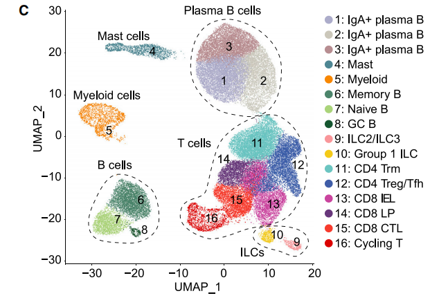
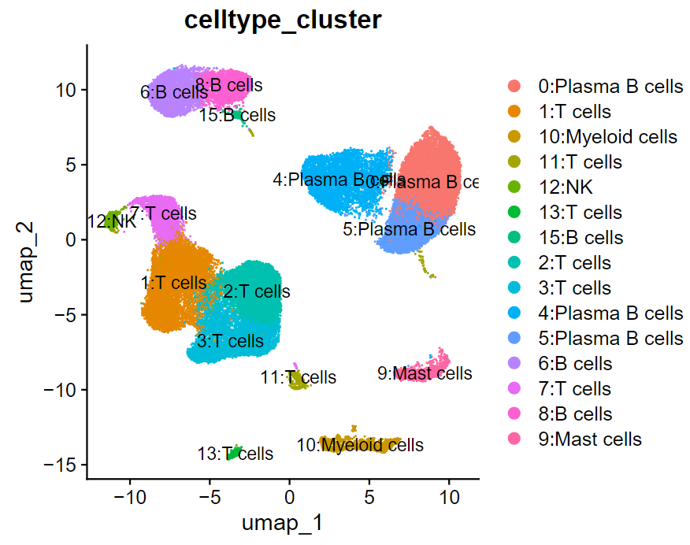
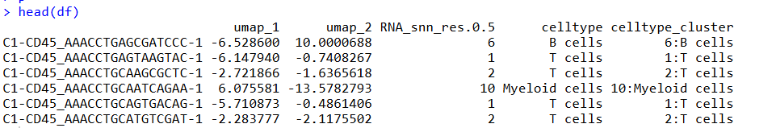
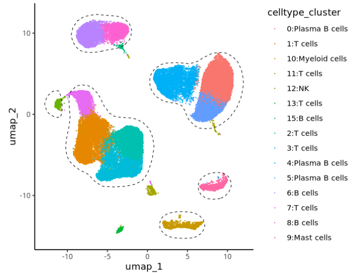
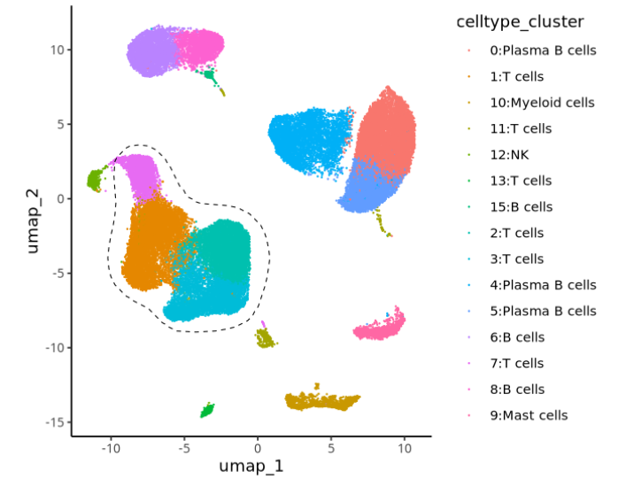
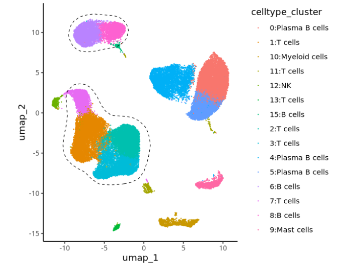
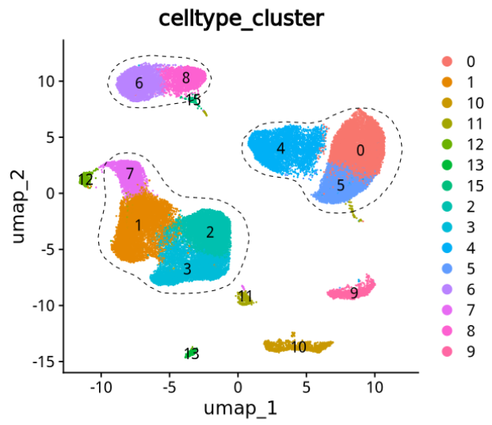

# 给你的单细胞umap图加个cell杂志同款的圈

- 专辑：绘图小技巧2025
- 公众号：生信技能树
- 发布时间：2025-01-21 20:50
- 原文：[微信公众平台](https://mp.weixin.qq.com/s?__biz=MzAxMDkxODM1Ng%3D%3D&mid=2247537290&idx=1&sn=ad76831349df67bb5236370dab088536&chksm=9b4b1231ac3c9b278f9cad27e561fdefdcbab76dbf68b7dbbac6fbddbf373e10d0a8976294f0)

---
> 我们经常看到 很多单细胞高分文章中都给它的umap注释结果加了一个圈圈，让读者的视角更集中在一个无形的圈圈上面，今天来学习一下怎么操作吧。这个加了圈的高颜值UMAP散点图来自文献：《**Molecular Pathways of Colon Inflammation Induced by Cancer Immunotherapy**》，**于 2020年8月份发表在顶刊Cell上**。



图注：图中为所有的CD45+ 免疫细胞

> **Figure 1** **Global Analysis of Immune Cell Populations in CPI Colitis**
>
> \(C\) Identification of colon CD45+ immune cell clusters across all samples (n = 5–6 subjects per cohort).

## 数据背景：三个分组

+CPI colitis全称：Check point inhibitor-induced colitis

**(1) +CPI colitis**：经免疫检查点抑制剂（CPI）治疗且经组织学确诊为结肠炎的黑色素瘤患者（n = 8，+CPI结肠炎）；

**(2) Normal control**：接受筛查性肠镜检查的健康成年人，其年龄与上述患者相近（n = 8，对照组）；

**(3) +CPI no colitis**：经免疫检查点抑制剂（CPI）治疗的黑色素瘤患者，这些患者因疑似+CPI结肠炎接受了内镜检查，但内镜和组织学检查均显示其结肠黏膜正常（n = 6，+CPI无结肠炎）（图1B）

这个研究设计能够区分由药物暴露引起的分子变化与实际的疾病过程。除每组中有1例患者接受抗CTLA-4单药治疗外，所有接受CPI治疗的患者最近都接受了CTLA-4和PD-1抗体的治疗。

作者通过荧光激活细胞分选（FACS）技术，依次分离出活的**CD45⁺单个核细胞**以及**CD3⁺T细胞**，并使用10X Genomics 5‘端技术进行单细胞RNA测序（scRNA-seq）。


## 数据可下载：

GSE144469：https://www.ncbi.nlm.nih.gov/geo/query/acc.cgi?acc=GSE144469

> Samples from 22 patients from 3 different cohorts (Normal control, +CPI no colitis, +CPI colitis)

```r
GSE144469_RAW.tar
GSE144469_TCR_filtered_contig_annotations_all.csv.gz
```

GSE144469_RAW.tar：这个包中包括了 CD45+、CD3+细胞。此次我们使用图片中的 CD45+ 进行分析。

数据下载下来后，整理成如下格式：每个样本下面三个标准文件

```r
├── outputs
│   ├── C1-CD45
│   │   ├── barcodes.tsv.gz
│   │   ├── features.tsv.gz
│   │   └── matrix.mtx.gz
│   ├── C2-CD45
│   │   ├── barcodes.tsv.gz
│   │   ├── features.tsv.gz
│   │   └── matrix.mtx.gz
│   ├── C3-CD45
│   │   ├── barcodes.tsv.gz
│   │   ├── features.tsv.gz
│   │   └── matrix.mtx.gz
...........................
```

## 简单处理一下这个数据

上面的数据下载并整理成上面的目录后，批量读取并创建seurat对象：

```r
###
### Create: Jianming Zeng
### Date:  2023-12-31
### Email: jmzeng1314@163.com
### Blog: http://www.bio-info-trainee.com/
### Forum:  http://www.biotrainee.com/thread-1376-1-1.html
### CAFS/SUSTC/Eli Lilly/University of Macau
### Update Log: 2023-12-31   First version
### Update Log: 2024-12-09   by juan zhang (492482942@qq.com)
###

rm(list=ls())
library(Seurat)
library(data.table)
library(Matrix)
library(qs)

# 参考：https://mp.weixin.qq.com/s/tw7lygmGDAbpzMTx57VvFw
# https://ftp.ncbi.nlm.nih.gov/geo/series/GSE128nnn/GSE128531/suppl/GSE128531_RAW.tar
dir <- "GSE144469/cd45/outputs/"
samples <- list.dirs(dir, recursive = F, full.names = F)
samples
scRNAlist <- lapply(samples, function(pro){
  folder <- file.path(dir, pro)
  print(folder)
  counts <- Read10X(folder, gene.column = 2)
  sce <- CreateSeuratObject(counts, project=pro)
  return(sce)
})
names(scRNAlist) <-  samples
scRNAlist

# merge
scRNA <- merge(scRNAlist[[1]], y=scRNAlist[-1], add.cell.ids=samples)
scRNA <- JoinLayers(scRNA) # seurat v5
scRNA

head(scRNA@meta.data)
table(scRNA@meta.data$orig.ident)

temp <- as.data.frame(table(scRNA@meta.data$orig.ident))
temp

# qs保存速度快
qsave(scRNA, file="GSE144469/cd45/sce.all.qs")
```

然后经过简单的降维聚类分群、初始的注释，得到下面的UMAP图：



## UMAP加轮廓

我们这里借助 R包 mascarade，官网为：

- https://github.com/alserglab/mascarade

- https://rpubs.com/asergushichev/mascarade-tutorial

### 首先安装一下：

```r
## 使用西湖大学的 Bioconductor镜像
options(BioC_mirror="https://mirrors.westlake.edu.cn/bioconductor")
options("repos"=c(CRAN="https://mirrors.westlake.edu.cn/CRAN/"))
# 安装
remotes::install_github("alserglab/mascarade")
```

### 制作加圈需要的数据：

```r
## Seurat对象
library(Seurat)
library(SeuratData)
library(mascarade)
library(tidyverse)
library(Seurat)
library(data.table)

# 带有注释的seurat对象 v5
sce.all.filt_sub

df <- FetchData(object=sce.all.filt_sub, vars=c("umap_1","umap_2","RNA_snn_res.0.5","celltype","celltype_cluster"))
head(df)
str(df)
dim(df)
```

提取出来的umap坐标以及细胞亚群注释结果：



### 制作masktable

`generateMask`函数中的

- `minDensity `：控制 加圈的松紧成都，值越小，加的圈边界与umap散点距离越大越宽松

- `smoothSigma = 0.05`：控制加圈的平滑成都，值越大加的圈越平滑

```r
maskTable <- generateMask( dims=df[,1:2], cluster=df$celltype, minDensity = 1.5,smoothSigma = 0.05 )
class(maskTable)
dim(maskTable)
head(maskTable)
```

### 先简单加个圈看看：

- `linewidth=0.3`：控制加的线粗细

- `linetype = 2`：控制加的线类型，虚线、实线等，2为虚线

```r
p <- ggplot(df, aes(x=umap_1, y=umap_2)) +
  geom_point(aes(color=celltype_cluster),size = 0.05) +
  geom_path(data=maskTable, aes(group=group),linewidth=0.3,linetype = 2) +
  coord_fixed() +
  theme_classic()

p
```

结果如下：



### 特定的亚群上加圈：

```r
p <- ggplot(df, aes(x=umap_1, y=umap_2)) +
  geom_point(aes(color=celltype_cluster),size = 0.05) +
  geom_path(data=maskTable[cluster=="T cells"], aes(group=group),linewidth=0.3,linetype = 2) +
  coord_fixed() +
  theme_classic()
p
```

结果如下：



两个亚群圈：

```r
p <- ggplot(df, aes(x=umap_1, y=umap_2)) +
  geom_point(aes(color=celltype_cluster),size = 0.05) +
  geom_path(data=maskTable[cluster=="T cells" | cluster=="B cells"], aes(group=group),linewidth=0.3,linetype = 2) +
  coord_fixed() +
  theme_classic()
p
```



### 再优化一下，加上细胞亚群 cluster 标签：

加上标签并同时圈住文中的三个亚群：

```r
## 文章中的
head(maskTable)

p1 <- DimPlot(sce.all.filt_sub, reduction = "umap", group.by = "RNA_snn_res.0.5", label = T) +
  ggtitle("celltype_cluster")
p1


plots <- lapply(p1, `+`,
                list(
                  geom_path(data=maskTable[cluster=="T cells" | cluster=="B cells"| cluster=="Plasma B cells"],
                            aes(x=umap_1, y=umap_2, group=group),linewidth=0.3,linetype = 2),
                  # so that borders aren't cropped:
                  scale_x_continuous(expand = expansion(mult = 0.05)),
                  scale_y_continuous(expand = expansion(mult = 0.05)))
)

patchwork::wrap_plots(plots)
```



还是很好看的！

唯一不足的地方：细胞亚群注释label PS 加上去吧，后面看看源码是不是可以再优化一下。

### **友情宣传：**

[生信入门&数据挖掘线上直播课2025年1月班](https://mp.weixin.qq.com/s?__biz=MzI1Njk4ODE0MQ==&mid=2247527230&idx=1&sn=7156afcd5ab734c7d391b9048695747a&scene=21#wechat_redirect)

[时隔5年，我们的生信技能树VIP学徒继续招生啦](http://mp.weixin.qq.com/s?__biz=MzAxMDkxODM1Ng==&mid=2247524148&idx=1&sn=7806da6feb41a36493c519c1cfc1d3ac&chksm=9b4bdf8fac3c569960369602f1ef26639cb366b250f233b2297d1f059471c0458335bfc0b829&scene=21#wechat_redirect)

[满足你生信分析计算需求的低价解决方案](https://mp.weixin.qq.com/s?__biz=MzAxMDkxODM1Ng==&mid=2247535760&idx=2&sn=1e02a2e982a046ecf6389231e6768d5b&scene=21#wechat_redirect)

<!-- wechat-article-fetcher: complete -->
