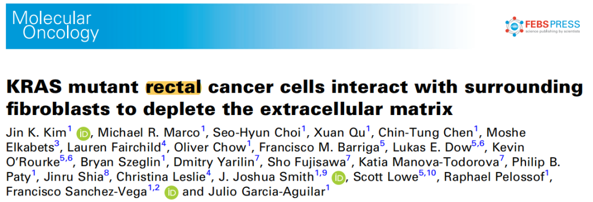
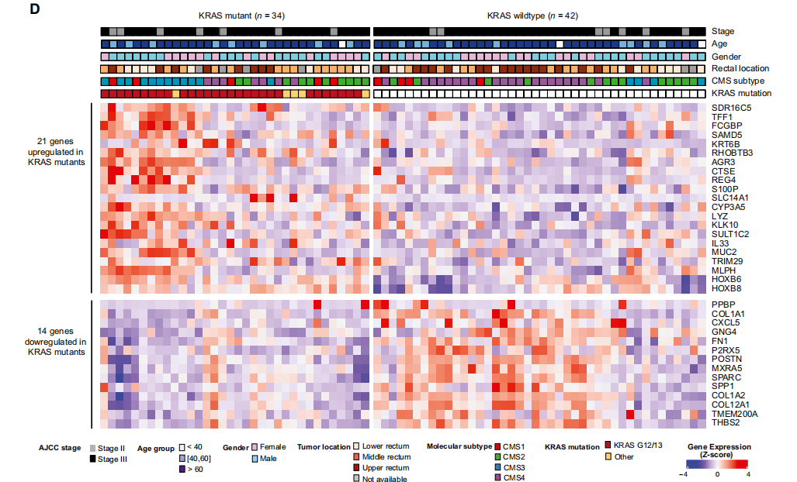
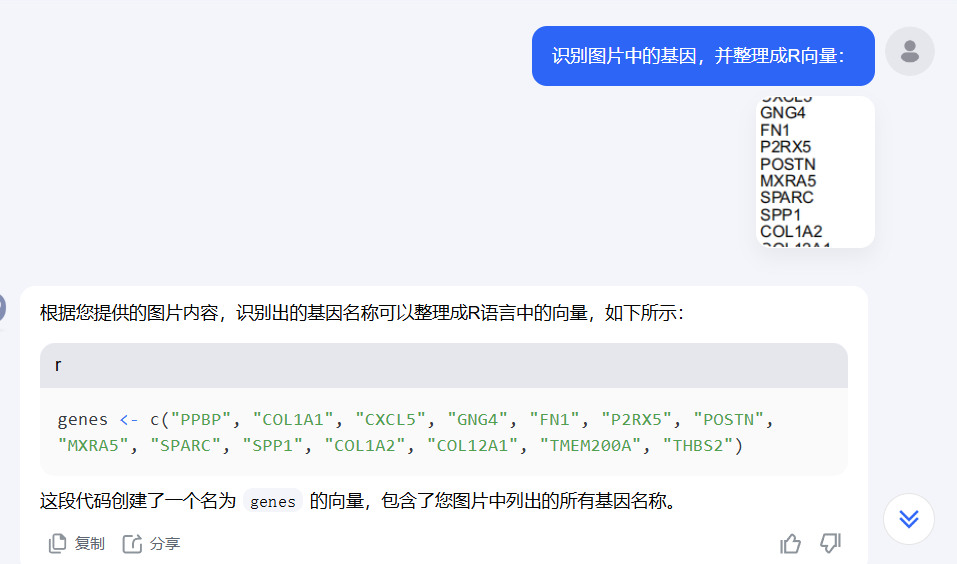
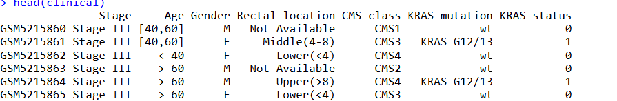
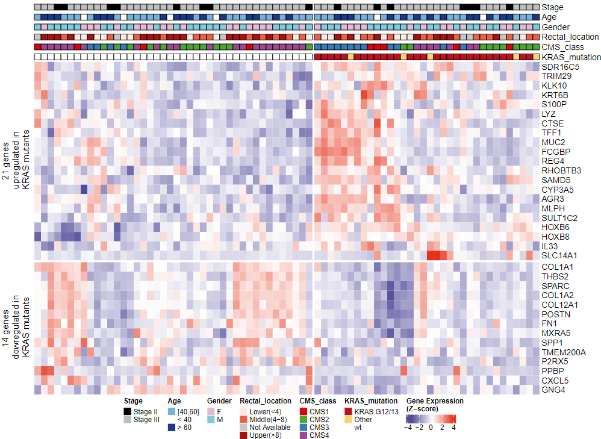

# 高颜值复杂热图绘制小技巧

- 专辑：绘图小技巧2025
- 公众号：生信技能树
- 发布时间：2025-01-18 21:01
- 原文：[微信公众平台](https://mp.weixin.qq.com/s?__biz=MzAxMDkxODM1Ng%3D%3D&mid=2247537091&idx=1&sn=23f4aa643cf8c731221c3abe857ce150&chksm=9b4b1178ac3c986e3e8d109b1570f46bdbcbc5a21882da87020345f6e8b919b376e7723f4d8b)

---
> 今天学习一篇高分杂志中的复杂热图绘制，文献标题为：《**KRAS mutant rectal cancer cells interact with surrounding fibroblasts to deplete the extracellular matrix**》，于 2021 年 10 月发表在 Mol Oncol 杂志上：



## 复杂热图介绍

这幅图展示了 两分组（KRAS-mt vs KRAS-wt）差异分析结果中 21个上调基因 与 14 个下调 差异基因在不同样本中的基因表达水平模式，热图上方 展示了 样本的许多临床性状特征 如 Stage分期，年龄，性别，CMS 分子分期等。热图如下：



**图注**：

> To gain further insight into the biological role of KRAS mutations in LARC, we investigated differences in gene expression between KRAS-mt and KRAS-wt tumors. A set of 35 genes were differentially expressed, including 21 upregulated genes and 14 downregulated genes in KRAS-mt specimens (Fig. 1D and Table S3).

## 数据背景

**这幅热图对应的数据在 GEO 中**：https://www.ncbi.nlm.nih.gov/geo/query/acc.cgi?acc=GSE170999

**差异分析结果在 附件** ：**Table S3**. Differentially Expressed Genes in KRAS-mt vs KRAS-wt Patients from the LARC-TIMING Cohort.

差异分析参数：

> Differential analysis of mRNA expression was conducted using the ‘DESeq2’ package in R \[26\]. Significant differences were required to exhibit \|log2FoldChange\| \> 1 and FDR \< 0.05.

**样本临床信息在**：**Table S1**. Clinicopathological Features of LARC-TIMING Patients

由于不管怎么设置差异基因筛选阈值都得不到图中的那个上下调基因数，这里直接 使用 kimi 从图片中获取了 21个上调基因 以及 14个下调基因，方法如下：

在 kimi （https://kimi.moonshot.cn/）对话框输入如下信息，并黏贴图片，就可以得到基因向量 直接复制到代码中



## 图片绘制

### 1、得到基因表达矩阵

GEO 数据我们已经非常熟悉了，代码如下：

```r
rm(list=ls)
## 加载R包
library(AnnoProbe)
library(GEOquery)
library(ggplot2)
library(ggstatsplot)
library(patchwork)
library(reshape2)
library(stringr)
library(limma)
library(tidyverse)
getOption('timeout')
options(timeout=10000)

## 1.获取并且检查表达量矩阵
## ～～～gse编号需修改～～～
gse_number <- "GSE170999"
dir.create(gse_number)
setwd(gse_number)
getwd()
list.files()

#gset <- geoChina(gse_number)
gset <- getGEO(gse_number, destdir = '.', getGPL = T)
gset[[1]]
a <- gset[[1]]

## 2.样本分组
## 挑选一些感兴趣的临床表型。
pd <- pData(a)
colnames(pd)
pd$title
pd$characteristics_ch1
table(pd$characteristics_ch1)

## ～～～分组信息编号需修改～～～
group_list <- pd[, c("geo_accession","title","kras_mutant or wild_type:ch1")]
head(group_list)

## 3.提取探针水平表达矩阵
dat <- exprs(a) # a现在是一个对象，取a这个对象通过看说明书知道要用exprs这个函数
dim(dat)        # 看一下dat这个矩阵的维度
dat[1:4,1:4]    # 查看dat这个矩阵的1至4行和1至4列，逗号前为行，逗号后为列


## ～～～查看数据是否需要log～～～
range(dat)

## 4.探针转换为基因symbol
## 查看注释平台gpl 获取芯片注释信息
gpl_anno <- fData(a)
colnames(gpl_anno)

id2name <- gpl_anno[,c("ID" ,"Gene Symbol")]
colnames(id2name) <- c("ID","GENE_SYMBOL")
# 1.过滤掉空的探针
id2name <- na.omit(id2name)
id2name <- id2name[which(id2name$GENE_SYMBOL!=""), ]
# 2.过滤探针一对多
id2name <- id2name[!grepl("\\///",id2name$GENE_SYMBOL), ]
head(id2name)
# 3.多对一取均值
# 合并探针ID 与基因，表达谱对应关系
# 提取表达矩阵
dat <- dat %>%
  as.data.frame() %>%
  rownames_to_column("ID")

exp <- merge(id2name, dat, by.x="ID", by.y="ID")

# 多对一取均值
exp <- avereps(exp[,-c(1,2)],ID = exp$GENE_SYMBOL) %>%
  as.data.frame()

dat <- as.matrix(exp[,pd$geo_accession])
dim(dat)
fivenum(dat['CRP',])
fivenum(dat['GAPDH',])
dat[1:5, 1:6]
save(gse_number, dat, group_list, pd, file = 'step1_output.Rdata')
```

### 2、读取样本临床信息

使用 excel 读取进来，并进行一些预处理，如 连续值的 Age 变为分组的：

```r
library(readxl)

# 临床信息
table_s1 <- readxl::read_xlsx("mol212960-sup-0005-tables1-s8.xlsx", sheet = "Table S1")
head(table_s1)
head(group_list)
group_list$SampleID <- str_split(group_list$title, pattern = "r, ", n=2, simplify = T)[,2]
clinical <- merge(group_list, table_s1, by="SampleID")
head(clinical)
rownames(clinical) <- clinical$geo_accession

## 处理 KRAS_mutation
grep(">|_|Q61|A146P",clinical$KRAS_details, value = T)
grep("G12|G13",clinical$KRAS_details, value = T, invert = F)
grep("wt",clinical$KRAS_details, value = T)

clinical$KRAS_mutation <- clinical$KRAS_details
clinical$KRAS_mutation[ grep(">|_|Q61|A146P",clinical$KRAS_details) ] <- "Other"
clinical$KRAS_mutation[ grep("G12|G13",clinical$KRAS_details) ] <- "KRAS G12/13"
table(clinical$KRAS_mutation)

# 处理 AJCC stage
table(clinical$PreCRT_AJCC_classification)
clinical$Stage <- ifelse(clinical$PreCRT_AJCC_classification==2, "Stage II", "Stage III")
table(clinical$Stage)

# 处理 Age
clinical$Age <- "[40,60]"
clinical$Age[ clinical$Age.Dx < 40 ] <- "< 40"
clinical$Age[ clinical$Age.Dx > 60 ] <- "> 60"
table(clinical$Age)
table(clinical$Gender)
table(clinical$Rectal_location)
table(clinical$CMS_class)
table(clinical$KRAS_status)

# 选择图中的临床性状
clinical <- clinical[, c("Stage", "Age", "Gender","Rectal_location","CMS_class","KRAS_mutation","KRAS_status")]

head(clinical)
```

clinical结果如下：



### 3、拿到差异基因的表达矩阵

直接用 kimi 拿到图片中的基因：

```r
# 21个上调
genes <- c("SDR16C5", "TFF1", "FCGBP", "SAMD5", "KRT6B", "RHOBTB3", "AGR3", "CTSE", "REG4", "S100P",
           "SLC14A1", "CYP3A5", "LYZ", "KLK10", "SULT1C2", "IL33", "MUC2", "TRIM29", "MLPH", "HOXB6", "HOXB8")
exp_up <- dat[genes, ]

# 14个下调
genes <- c("PPBP", "COL1A1", "CXCL5", "GNG4", "FN1", "P2RX5", "POSTN", "MXRA5", "SPARC", "SPP1",
           "COL1A2", "COL12A1", "TMEM200A", "THBS2")
exp_down <- dat[genes, ]

# 合并在一起
exp <- rbind(exp_up, exp_down)

# 对表达矩阵 进行行聚类
exp_scale <- t(scale(t(exp)))
exp_scale[exp_scale>4] <- 4
exp_scale[exp_scale< -4] <- -4
```

### 4、使用 complexheatmap绘图

`complexheatmap` 功能使用起来比较复杂，这里简单介绍一下各种参数。

首先进行列注释条构建，使用的函数为 `HeatmapAnnotation`，

- `df` 参数 输入一个矩阵，行名 与 表达矩阵列名对应；

- `simple_anno_size` 参数可以设置 列注释条的高度；

- `col` 可以设置 每一个 注释条里面的 颜色，是一个list对象。获取文章中的颜色配置 可以 使用 Snipaste 工具，非常方便；

- `gp`参数 设置 注释条的边框颜色；

- `gap = unit(2, "mm"))`：控制每两个相邻注释之间的空间。

```r
# 列注释条
annotation_col <- data.frame(clinical)
row.names(annotation_col) <- colnames(exp)
head(annotation_col)

df <- annotation_col[, -7]

# 列注释条
ha = HeatmapAnnotation(
  df = df,
  annotation_name_side="right",
  simple_anno_size = unit(0.3, "cm"), # 设置注释条高度
  col = list(Stage = c("Stage II" = "black", "Stage III" = "grey"),
             Age = c("< 40" = "white", "[40,60]" = "#75b1da", "> 60" = "#1a3a87"),
             Gender = c("F" = "#e6b8d7", "M" = "#7fccdf"),
             Rectal_location = c("Lower(<4)" = "#fdeae1", "Middle(4-8)" = "#ec6143", "Upper(>8)" = "#a51410","Not Available"="#c8c5c5"),
             CMS_class =c("CMS1"="#dc020d","CMS2"="#4ba733","CMS3"="#357cb9","CMS4"="#9e4795"),
             KRAS_mutation=c("wt"="white","KRAS G12/13"="#be111f","Other"="#fcd16f")
             ),
  annotation_legend_param = list(
    Stage = list(direction = "horizontal",ncol = 1),
    Age = list(direction = "horizontal",ncol = 1),
    Gender = list(direction = "horizontal",ncol = 1),
    Rectal_location = list(direction = "horizontal",ncol = 1),
    CMS_class = list(direction = "horizontal",ncol = 1),
    KRAS_mutation = list(direction = "horizontal",ncol = 1)),
  gp = gpar(col = "black"),
  gap = unit(2, "mm") # 控制每两个相邻注释之间的空间
)
```

进行绘图：

```r
p <- Heatmap(exp_scale, # 表达矩阵
             col = colorRampPalette(c("#524b9a","white","#e63118"))(100),#颜色定义
             name = "Gene Expression\n(Z-score)", # 设置表达矩阵的图例标题
             heatmap_legend_param = list(direction = "horizontal",nrow = 1),
             show_row_names = T,     # 展示行名
             show_column_names = F,  # 不显示列名
             show_row_dend = F,
             show_column_dend = F,
             top_annotation = ha,       # 顶部分组信息
             column_title_side = c("top"),
             column_split = annotation_col$KRAS_status, # 用group 信息将热图分开，以 group 聚类
             row_split = annotation_row$gene_class,
             column_title = T
             )
p

# 保存
pdf(file = "diff_heatmap.pdf", height = 9, width = 12)
draw(p, heatmap_legend_side = "bottom", annotation_legend_side = "bottom",merge_legend = TRUE)
dev.off()
```

结果如下：



最后，超多参数 推荐大家去官网阅读学习：https://jokergoo.github.io/ComplexHeatmap-reference/book/index.html

如果你有好看的图，可以 留言区给出你的图片来源，我们尽可能的复现出来，学会更多的高颜值绘图技巧！

### 文末友情宣传：

[生信入门&数据挖掘线上直播课2025年1月班](https://mp.weixin.qq.com/s?__biz=MzI1Njk4ODE0MQ==&mid=2247527230&idx=1&sn=7156afcd5ab734c7d391b9048695747a&scene=21#wechat_redirect)

[时隔5年，我们的生信技能树VIP学徒继续招生啦](http://mp.weixin.qq.com/s?__biz=MzAxMDkxODM1Ng==&mid=2247524148&idx=1&sn=7806da6feb41a36493c519c1cfc1d3ac&chksm=9b4bdf8fac3c569960369602f1ef26639cb366b250f233b2297d1f059471c0458335bfc0b829&scene=21#wechat_redirect)

[满足你生信分析计算需求的低价解决方案](https://mp.weixin.qq.com/s?__biz=MzAxMDkxODM1Ng==&mid=2247535760&idx=2&sn=1e02a2e982a046ecf6389231e6768d5b&scene=21#wechat_redirect)

<!-- wechat-article-fetcher: complete -->
