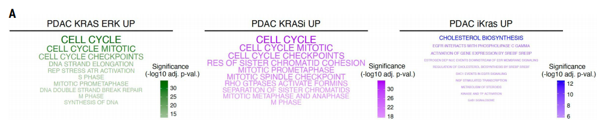
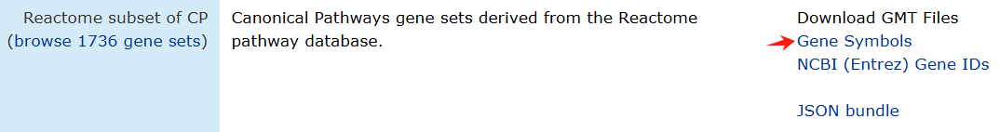
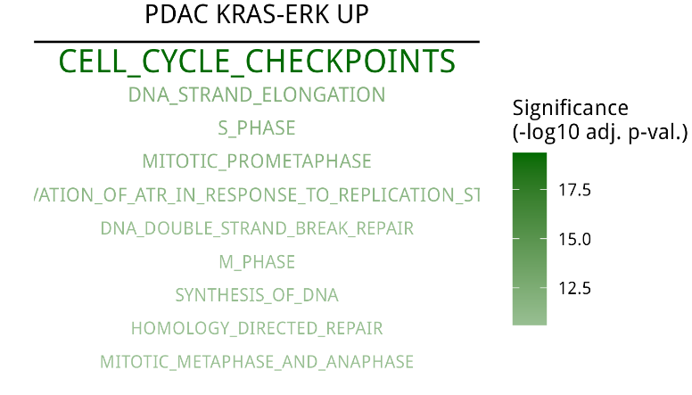
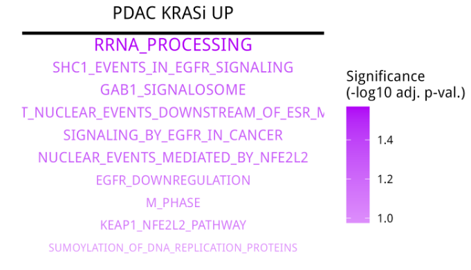
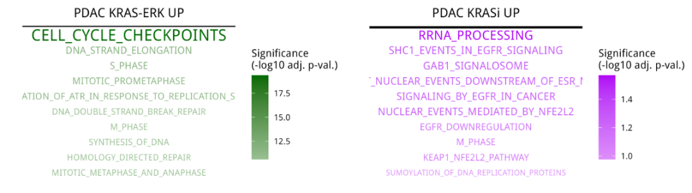

# 一种很新的功能富集结果展示方法

- 专辑：绘图小技巧2025
- 公众号：生信技能树
- 发布时间：2025-01-16 16:54
- 原文：[微信公众平台](https://mp.weixin.qq.com/s?__biz=MzAxMDkxODM1Ng%3D%3D&mid=2247537055&idx=1&sn=26544d5687fbe6001391e869ea84e692&chksm=9b4b1124ac3c9832e3c8fe0a7fbfe921260a107be774a3b70a4e5ddad091098870449c874135)

---
> 在我们新专辑**《绘图小技巧2025》**中，已经给大家介绍过一个高颜值两组间差异FC值比较散点图：[顶刊 Science 文献两分组差异结果比较图复现](https://mp.weixin.qq.com/s?__biz=MzAxMDkxODM1Ng==&mid=2247536875&idx=1&sn=7e42be92f977c2a134f529e82b895ac9&scene=21#wechat_redirect)。今天我们继续来学习绘制其中另一幅的功能富集结果展示图，是一种很新的展示方法哦，且颜值高：

#### 含义：三组 KRAS signatures 基因做 Reactome 数据库的功能富集，并挑选 top10进行展示。



**图注：**Fig. 4. KRAS-ERK–dependent genes are essential for cell proliferation in PDAC. (A) Overrepresentation analysis for Reactome terms in three KRAS signatures: PDAC KRAS-ERK UP, PDAC KRASi UP, and PDAC iKras UP. The top 10 terms are shown.

## 数据准备

### 1、Reactome 数据库通路

Reactome 数据库：是一个免费、开源、数据经过手动筛选和同行评审的生物分子通路知识数据库。数据库链接：https://reactome.org/。

我们在 GSEA 的 MSigDB 数据库去下载 gmt 格式：https://www.gsea-msigdb.org/gsea/msigdb/human/collections.jsp#C2



### 2、三组 KRAS signatures 基因

这个数据在文章的附件：**science.adk0775_data_s4.xlsx** 中


## 开始绘图

这里依然是使用 ggplot2 进行绘制，ggplot2拥有强大的绘图系统。

### 1、读取数据

先看图中的最左边那个 signature：PDAC KRAS-ERK UP

```r
###
### Create: juan zhang
### Date:   2025-01-16
### Email:  492482942@qq.com
### Blog:   http://www.bio-info-trainee.com/
### Forum:  http://www.biotrainee.com/thread-1376-1-1.html
### Update Log: 2025-01-16   First version
###

rm(list=ls())
library(ggplot2)
library(clusterProfiler)
library(org.Hs.eg.db)
library(GSEABase)
library(tidyverse)

# three KRAS signatures:
# 1.PDAC KRAS-ERK UP
# 2.PDAC KRASi UP
# 3.PDAC iKras UP

# 首先是 Reactome pathways 功能富集
# 1.PDAC KRAS-ERK UP: 表格 PDAC_siKRAS_ERKi_UP
sig1 <- readxl::read_xlsx("data/science.adk0775_data_s4.xlsx", sheet = "PDAC_siKRAS_ERKi_UP")
head(sig1)
gene <- na.omit(sig1$external_gene_name)
head(gene)

# [1] "AEN"    "ANTXR2" "AREG"   "AURKA"  "CDCA3"  "CDCA8"
```

### 2、读取 reactome 通路并富集：

```r
## === reactome 数据库通路富集
geneset <- read.gmt("data/c2.cp.reactome.v2024.1.Hs.symbols.gmt")
table(geneset$term)
geneset$term <- gsub(pattern = "REACTOME_","", geneset$term)

# 富集
my_path <- enricher(gene=gene, pvalueCutoff = 1, qvalueCutoff = 1, TERM2GENE=geneset)

# 整理数据，挑选fdr top 10
dat <- my_path@result
dat <- dat[order(dat$p.adjust, decreasing = F),]
dat <- dat[1:10, ]
dat$Description <- factor(dat$Description, levels = dat$Description)
dat$xlab <- 1
head(dat)
colnames(dat)

# 字体大小
max(-log10(dat$p.adjust))*1.01
```

### 3、使用 ggplot2 定制化绘图

```r
p1 <- ggplot(data = dat, aes(x = 1, y = rev(Description), colour = -log10(p.adjust))) +
  geom_text(size=-log10(dat$p.adjust)*0.3, aes( label = Description), hjust = 0.5) + # hjust = 0.5,居中对齐
  scale_color_gradient(low = "#98bf92", high = "#006a01") +   # 创建颜色渐变
  scale_x_continuous(expand = c(0,0)) + # 调整柱子底部与y轴紧贴
  labs(x = " ", y = " ", title = "PDAC KRAS-ERK UP", color="Significance\n(-log10 adj. p-val.)") +
  theme(axis.text = element_blank(),  # 隐藏x/y轴标签
        axis.ticks = element_blank(), # 隐藏x/y轴刻度
        # 隐藏其他边框线
        panel.grid.major = element_blank(),
        panel.grid.minor = element_blank(),
        plot.background = element_rect(fill = "white", color = NA),
        panel.background = element_rect(fill = "white", color = NA),
        # 隐藏边框线
        panel.border = element_blank(),
        plot.title = element_text(hjust = 0.5) # 标题居中
        ) +
  # 添加顶部横着的黑线
  annotate("segment", x = 0, xend = 2, y = 10.6, yend = 10.6, color = "black", size = 1.1)

p1

# 保存，这里的保存宽和高进行了调整，可以使得结果比较美观
ggsave(filename = "p1.png", width = 5.0, height = 3, plot = p1)
```

结果如下：



### 4、同样的方法得到 PDAC KRASi UP signature 结果

Note：注意字体大小有调整

```r
################################################################################
# PDAC KRASi UP: 表格 PDAC_siKRAS_KRASi_iKras_UP
sig2 <- readxl::read_xlsx("data/science.adk0775_data_s4.xlsx", sheet = "PDAC_siKRAS_KRASi_iKras_UP")
head(sig2)
gene <- na.omit(sig2$external_gene_name)
head(gene)

## === 其他数据库通路富集
geneset <- read.gmt("data/c2.cp.reactome.v2024.1.Hs.symbols.gmt")
table(geneset$term)
geneset$term <- gsub(pattern = "REACTOME_","", geneset$term)

# 富集
my_path <- enricher(gene=gene, pvalueCutoff = 1, qvalueCutoff = 1, TERM2GENE=geneset)

dat <- my_path@result
dat <- dat[order(dat$p.adjust, decreasing = F),]
dat <- dat[1:10, ]
dat$Description <- factor(dat$Description, levels = dat$Description)
dat$xlab <- 1
head(dat)
colnames(dat)

# 字体大小
-log10(dat$p.adjust)*1.01

p2 <- ggplot(data = dat, aes(x = 1, y = rev(Description), colour = -log10(p.adjust))) +
  geom_text(size=-log10(dat$p.adjust)*3, aes( label = Description), hjust = 0.5) + # hjust = 0.5,居中对齐
  scale_color_gradient(low = "#dd8efb", high = "#b000f6") +   # 创建颜色渐变
  scale_x_continuous(expand = c(0,0)) + # 调整柱子底部与y轴紧贴
  labs(x = " ", y = " ", title = "PDAC KRASi UP", color="Significance\n(-log10 adj. p-val.)") +
  theme(axis.text = element_blank(),  # 隐藏x/y轴标签
        axis.ticks = element_blank(), # 隐藏x/y轴刻度
        # 隐藏其他边框线
        panel.grid.major = element_blank(),
        panel.grid.minor = element_blank(),
        plot.background = element_rect(fill = "white", color = NA),
        panel.background = element_rect(fill = "white", color = NA),
        # 隐藏边框线
        panel.border = element_blank(),
        plot.title = element_text(hjust = 0.5) # 标题居中
  ) +
  # 添加顶部横着的黑线
  annotate("segment", x = 0, xend = 2, y = 10.5, yend = 10.5, color = "black", size = 1.1)

# 保存，这里的保存宽和高进行了调整，可以使得结果比较美观
ggsave(filename = "p2.png", width = 5.0, height = 3, plot = p2)
```

结果如下：



### 5、两个图片拼接在一起

第三个图就不绘制了，同样的技巧。这里将上面两个 signature 的结果拼在一起：

```r
p <- p1 + p2
p
# 保存，这里的保存宽和高进行了调整，可以使得结果比较美观
ggsave(filename = "p1_p2.png", width = 10, height = 3, plot = p)
```

完美：



**友情宣传：**

**[生信入门&数据挖掘线上直播课2025年1月班](https://mp.weixin.qq.com/s?__biz=MzI1Njk4ODE0MQ==&mid=2247527230&idx=1&sn=7156afcd5ab734c7d391b9048695747a&scene=21#wechat_redirect)**

**[时隔5年，我们的生信技能树VIP学徒继续招生啦](http://mp.weixin.qq.com/s?__biz=MzAxMDkxODM1Ng==&mid=2247524148&idx=1&sn=7806da6feb41a36493c519c1cfc1d3ac&chksm=9b4bdf8fac3c569960369602f1ef26639cb366b250f233b2297d1f059471c0458335bfc0b829&scene=21#wechat_redirect)**

[满足你生信分析计算需求的低价解决方案](https://mp.weixin.qq.com/s?__biz=MzAxMDkxODM1Ng==&mid=2247535760&idx=2&sn=1e02a2e982a046ecf6389231e6768d5b&scene=21#wechat_redirect)

<!-- wechat-article-fetcher: complete -->
