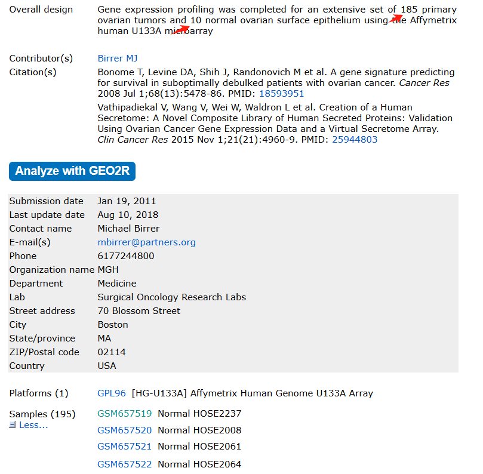
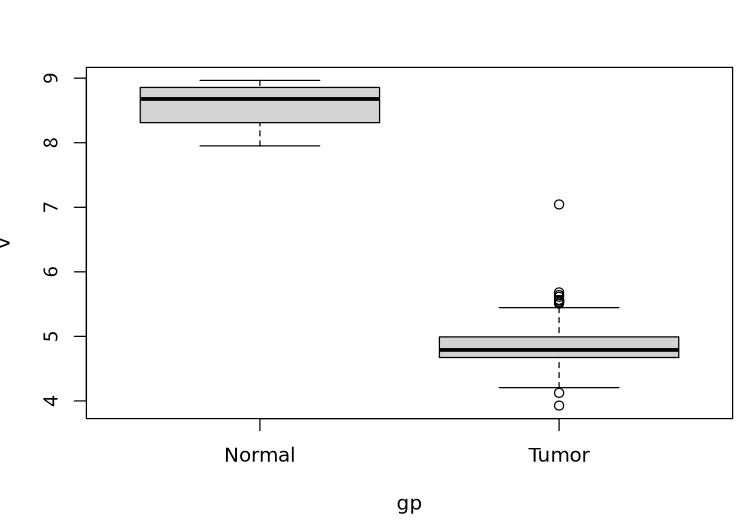
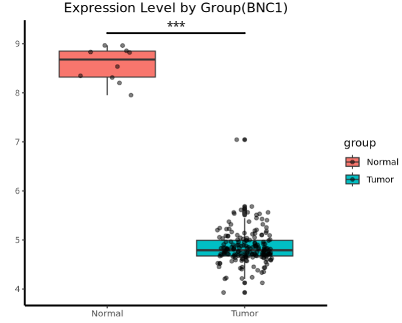
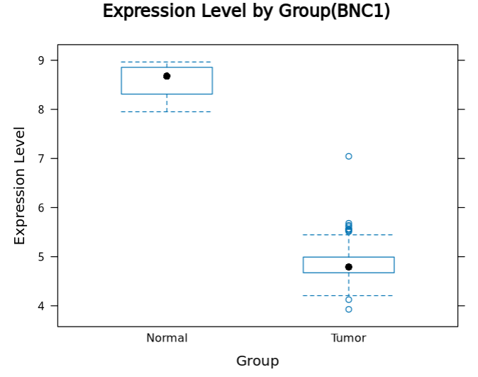
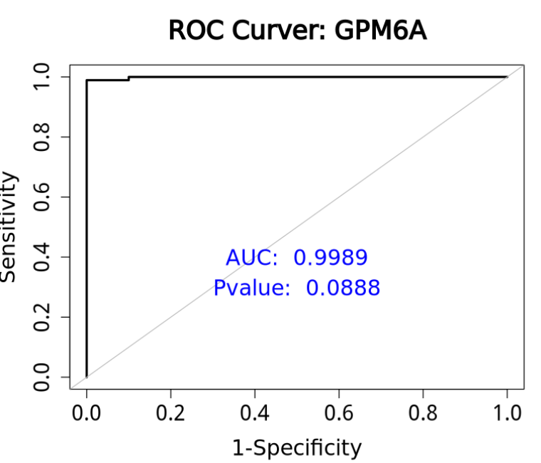

# 单基因绘制组间差异箱线图及ROC曲线

- 专辑：绘图小技巧2025
- 公众号：生信技能树
- 发布时间：2025-01-14 19:12
- 原文：[微信公众平台](https://mp.weixin.qq.com/s?__biz=MzAxMDkxODM1Ng%3D%3D&mid=2247536968&idx=1&sn=8290856996b9aefc2f2ba7325d636554&chksm=9b4b11f3ac3c98e5d9c46017e88a0b294cc662576459a9ed04e139e95b0260b2aa062d9647c3)

---
> 大家在做数据挖掘时，做完数据预处理，差异分析以及功能富集分析后，**往往会挑选一些关键基因，绘制其在组间的差异以及判断两组差异性能的ROC曲线**，下面借用人工智能来看看吧。

## 首先，我们可以问一下人工智能大模型：在 R 编程语言里面如何绘制一个箱线图？

> 在 R 编程语言中，绘制箱线图主要有以下几种常用方法：
>
> ### 1. 使用 base R 的 `boxplot` 函数
>
> 这是 R 语言自带的绘图功能，无需额外安装包。
>
> - **基本用法**：
```r
# 假设有一个向量数据
data <- c(23, 45, 67, 89, 34, 56, 78, 90, 12, 34)
boxplot(data, main = "箱线图示例", ylab = "数值")
```
>
>   - `data` 是要绘制箱线图的数据，可以是向量、矩阵或数据框的某一列。
>
>   - `main` 用于设置图形的主标题。
>
>   - `ylab` 用于设置 y 轴的标签。
>
> - **分组绘制**：
```r
# 假设有一个数据框，包含两组数据
df <- data.frame(
  Group = c(rep("A", 10), rep("B", 10)),
  Value = c(rnorm(10, mean = 50, sd = 10), rnorm(10, mean = 70, sd = 10))
)
boxplot(Value ~ Group, data = df, main = "分组箱线图", xlab = "组别", ylab = "数值")
```
>
>   - `Value ~ Group` 表示以 `Group` 为分组变量，对 `Value` 进行箱线图绘制。
>
> ### 2. 使用 `ggplot2` 包
>
> `ggplot2` 是 R 语言中一个非常强大的绘图包，能够绘制出更加美观和复杂的图形。
>
> - **安装和加载包**：
```r
install.packages("ggplot2")
library(ggplot2)
```
>
> - **基本用法**：
```r
# 使用上述 df 数据框
ggplot(df, aes(x = Group, y = Value)) +
  geom_boxplot() +
  labs(title = "分组箱线图", x = "组别", y = "数值") +
  theme_minimal()
```
>
>   - `aes(x = Group, y = Value)` 定义了 x 轴和 y 轴的变量。
>
>   - `geom_boxplot()` 表示绘制箱线图。
>
>   - `labs` 函数用于设置图形的标题、轴标签等。
>
>   - `theme_minimal()` 用于设置简洁的主题风格。
>
> ### 3. 使用 `lattice` 包
>
> `lattice` 包也是一个用于创建复杂图形的 R 包。
>
> - **安装和加载包**：
```r
install.packages("lattice")
library(lattice)
```
>
> - **基本用法**：
```r
# 使用上述 df 数据框
bwplot(Value ~ Group, data = df, main = "分组箱线图", xlab = "组别", ylab = "数值")
```
>
>   - `bwplot` 是 `lattice` 包中用于绘制箱线图的函数。

人工智能大模型给我们介绍了三个包，下面来看看。

## 示例数据 GSE26712

本次使用 数据集 **https://www.ncbi.nlm.nih.gov/geo/query/acc.cgi?acc=GSE26712** 作为演示，这个数据集包括10个正常样本以及185个肿瘤样本：



根据我们已经很熟悉的芯片处理代码，很快就能拿到样本分组以及芯片表达矩阵：

```r
## 加载R包
library(AnnoProbe)
library(GEOquery)
library(ggplot2)
library(ggstatsplot)
library(patchwork)
library(reshape2)
library(stringr)
library(limma)
library(tidyverse)
getOption('timeout')
options(timeout=10000)

## 1.获取并且检查表达量矩阵
## ～～～gse编号需修改～～～
gse_number <- "GSE26712"
dir.create(gse_number)
setwd(gse_number)
getwd()
list.files()

#gset <- geoChina(gse_number)
gset <- getGEO(gse_number, destdir = '.', getGPL = T)
gset[[1]]
a <- gset[[1]]


## 2.样本分组
## 根据生物学背景及研究目的人为分组
## 通过查看说明书知道取对象a里的临床信息用pData
## 挑选一些感兴趣的临床表型。
pd <- pData(a)
colnames(pd)
pd$title
pd$characteristics_ch1
table(pd$characteristics_ch1)

## ～～～分组信息编号需修改～～～
group_list <- ifelse(grepl('Normal',pd$title ,ignore.case = T ), "Normal","Tumor")
group_list <- factor(group_list, levels = c("Normal","Tumor"))
table(group_list)


## 3.提取探针水平表达矩阵
dat <- exprs(a) # a现在是一个对象，取a这个对象通过看说明书知道要用exprs这个函数
dim(dat)        # 看一下dat这个矩阵的维度
dat[1:4,1:4]    # 查看dat这个矩阵的1至4行和1至4列，逗号前为行，逗号后为列


## ～～～查看数据是否需要log～～～
range(dat)

## 4.探针转换为基因symbol
## 查看注释平台gpl 获取芯片注释信息
a@annotation
gpl <- getGEO(filename=paste0(a@annotation,".soft.gz"))
class(gpl)
gpl_anno <- gpl@dataTable@table
colnames(gpl_anno)

id2name <- gpl_anno[,c("ID" ,"Gene Symbol")]
colnames(id2name) <- c("ID","GENE_SYMBOL")
# 1.过滤掉空的探针
id2name <- na.omit(id2name)
id2name <- id2name[which(id2name$GENE_SYMBOL!=""), ]
# 2.过滤探针一对多
id2name <- id2name[!grepl("\///",id2name$GENE_SYMBOL), ]
head(id2name)

# 3.多对一取均值
# 合并探针ID 与基因，表达谱对应关系
# 提取表达矩阵
dat <- dat %>%
  as.data.frame() %>%
  rownames_to_column("ID")

exp <- merge(id2name, dat, by.x="ID", by.y="ID")

# 多对一取均值
exp <- avereps(exp[,-c(1,2)],ID = exp$GENE_SYMBOL) %>%
  as.data.frame()

dat <- as.matrix(exp[,pd$geo_accession])
dim(dat)
fivenum(dat['CRP',])
fivenum(dat['GAPDH',])
dat[1:5, 1:6]
save(gse_number, dat, group_list, pd, file = 'step1_output.Rdata')
```

## 方式一：使用 base R 的 `boxplot` 函数

非常简单，拿到某个基因的表达以及样本分组信息：

```r
load("step1_output.Rdata")
v <- as.numeric(dat['BNC1',])
gp <- group_list

boxplot(v~gp)
```

结果如下：



## 方式二：使用 `ggplot2` 包

这中绘图方式也是我们最常使用的，前面我们也介绍过多组的组间差异绘制小技巧：[带有疾病进展的多分组差异结果如何展示？](https://mp.weixin.qq.com/s?__biz=MzAxMDkxODM1Ng==&mid=2247536217&idx=1&sn=3f1893e79b3474230cd3993c37d2aa34&scene=21#wechat_redirect)

还是同样的配方，灵活使用。首先构造一个数据框：

```r
# 载入ggplot2包
library(ggplot2)
df <- data.frame(group=gp,expression=v)
head(df)
# group expression
# 1 Normal   8.311357
# 2 Normal   8.965637
# 3 Normal   8.856947
# 4 Normal   8.534809
# 5 Normal   8.830902
# 6 Normal   8.346746

p <- ggplot(data = df, aes(x = group, y = expression, fill = group)) +
  geom_boxplot(width = 0.7) +
  geom_jitter(width = 0.2, color = "black", alpha = 0.5) +
  labs(title = "Expression Level by Group", x = "Group", y = "Expression Level") +
  theme_minimal()

# 添加显著性检验
max_pos <- max(df$expression)
p1 <- p +
  geom_signif(mapping=aes(x=group,y=expression), #不同组别的显著性
              comparisons = list(c("Normal", "Tumor")),
              map_signif_level=T, # T显示显著性，F显示p value
              tip_length=c(0,0,0,0,0,0,0,0,0,0,0,0), # 修改显著性线两端的长短
              y_position = c(max_pos, max_pos*1.02), # 设置显著性线的位置高度
              size=0.8, # 修改线的粗细
              textsize = 4, # 修改显著性标记的大小
              test = "t.test")  # 检验的类型,可以更改
p1
```

结果如下：



## 方式三：使用 `lattice` 包

```r
# lattice
library(lattice)
# 使用上述 df 数据框
head(df)

bwplot(expression ~ group, data = df, main = "Expression Level by Group(BNC1)",
       xlab = "Group", ylab = "Expression Level")
```

结果如下：



## 单个基因ROC曲线绘制

评估某个基因的表达水平作为⽣物标志物区分肿瘤样本还是正常样本的准确性，使⽤pROC等R包构建ROC曲线以及计算各项统计参数。

```r
# 挑选一个不一样的基因
load("step1_output.Rdata")
#v <- as.numeric(dat['BNC1',])
v <- as.numeric(dat['GPM6A',])
gp <- group_list
df <- data.frame(group=gp,expression=v)
head(df)

# 拟合逻辑回归模型
library(pROC)
as.factor(df$group)
table(df$group)
as.numeric(as.factor(df$group))
df$group <- as.numeric(as.factor(df$group))-1
table(df$group)
head(df)
str(df)

# 构建模型
model <- glm(group ~ expression,  data = df, family = binomial('logit'))
GSum <- summary(model)
# 提取P值
PValue <- (GSum$coefficients[,4])[2]
PValue

# 预测新数据
probability <- predict(object = model, newdata = df, type = 'response')

# 画模型预测的ROC曲线
roc_curve <- roc(df$group ~ probability)
Train_roc_x <- 1 - roc_curve$specificities
Train_roc_y <- roc_curve$sensitivities
Train_AUC = roc_curve$auc
Train_AUC

p <- plot(x = Train_roc_x, y = Train_roc_y, xlim = c(0,1), ylim = c(0,1),
     xlab = '1-Specificity', ylab = 'Sensitivity', main = paste0('ROC Curver: GPM6A'),
     type = 'l', lwd = 2.5, cex.axis=1.5, cex.lab=1.5, cex.main=1.8)
p <- p + abline(a = 0, b = 1, col = 'gray')
p <- p +
  text(0.5,0.4,paste('AUC: ',round(Train_AUC, digits = 4)), col = 'blue',cex=1.5) +
  text(0.5,0.3,paste('Pvalue: ',round(PValue, digits = 4)), col = 'blue',cex=1.5)
print(p)
```

结果如下：



#### 更多演示，可以观看生信技能树的视频号：


#### 文末友情宣传

强烈建议你推荐给身边的**博士后以及年轻生物学PI**，多一点数据认知，让他们的科研上一个台阶：

- [**生信入门&数据挖掘线上直播课2025年1月班**](https://mp.weixin.qq.com/s?__biz=MzAxMDkxODM1Ng==&mid=2247536035&idx=2&sn=dab1e47f7ca8aa2ff26a6e440d9bb044&scene=21#wechat_redirect)**，你的生物信息学入门课**

- [**时隔5年，我们的生信技能树VIP学徒继续招生啦**](http://mp.weixin.qq.com/s?__biz=MzAxMDkxODM1Ng==&mid=2247524148&idx=1&sn=7806da6feb41a36493c519c1cfc1d3ac&chksm=9b4bdf8fac3c569960369602f1ef26639cb366b250f233b2297d1f059471c0458335bfc0b829&scene=21#wechat_redirect)

- [**满足你生信分析计算需求的低价解决方案**](https://mp.weixin.qq.com/s?__biz=MzUzMTEwODk0Ng==&mid=2247530048&idx=1&sn=28aa7bbd5e00521f79e074496a5f5d66&scene=21#wechat_redirect)

<!-- wechat-article-fetcher: complete -->
