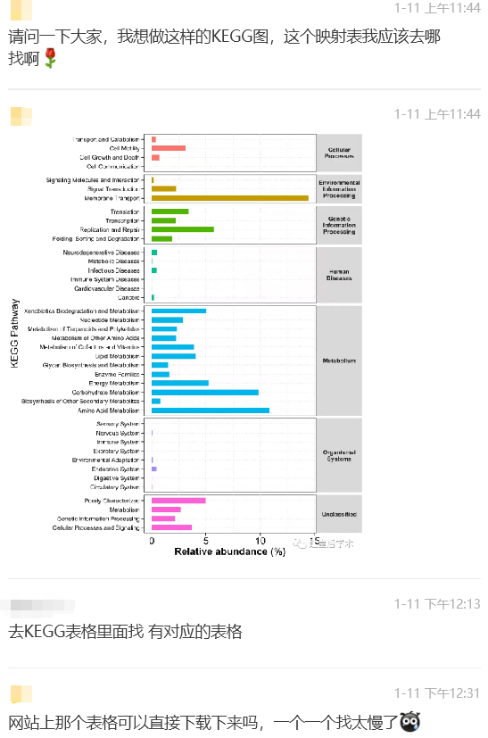
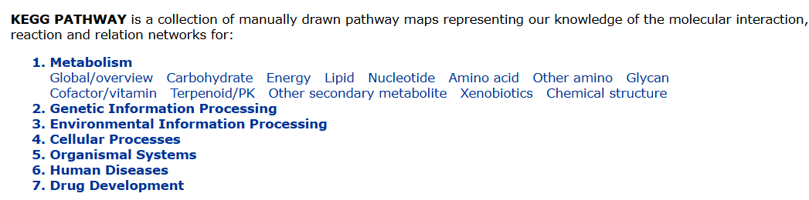
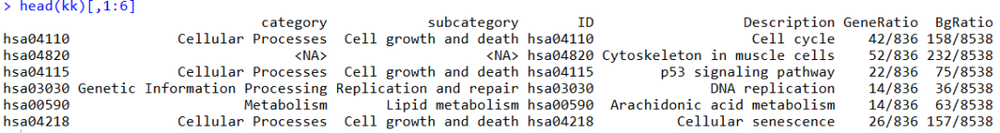
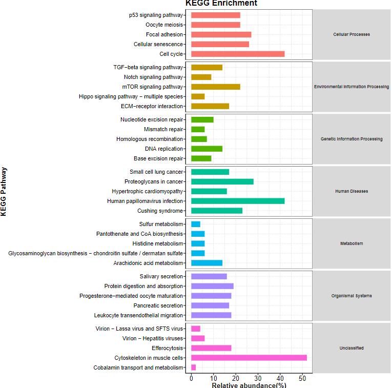

# KEGG富集结果7大分类展示

- 专辑：绘图小技巧2025
- 公众号：生信技能树
- 发布时间：2025-01-12 14:01
- 原文：[微信公众平台](https://mp.weixin.qq.com/s?__biz=MzAxMDkxODM1Ng%3D%3D&mid=2247536875&idx=2&sn=67fe96abc9c8a139edebfa8a89728df8&chksm=9b4b1050ac3c9946fd6f17f2eddec245da333854d32dd9392f6950723227b2b7dd9196f3d426)

---
> 我们生信入门马拉松授课群里有一个学员在学完课程后，开始了自己的数据分析，到了KEGG Pathway富集结果进行barplot展示时，**他遇到了一个问题：想在KEGG富集结果中添加每条通路的类别，但是不知道这个通路类别去哪里对应或者手动去KEGG数据库不方便！**



## 首先，看看KEGG Pathway数据库的7大分类

可能很多人做KEGG Pathway富集时，还没有了解过KEGG 通路数据库也有分类呢？

来到KEGG官网：https://www.genome.jp/kegg/pathway.html



让人工智能大模型帮我们介绍一下这7大类吧：

> KEGG（Kyoto Encyclopedia of Genes and Genomes）数据库是一个综合数据库资源，旨在通过整合基因组、生物化学通路、疾病、化学物质等信息，为理解高级功能和生物系统提供帮助。以下是 KEGG 数据库的 7 大分类详细介绍：
>
> ### 1. Metabolism（代谢）
>
> - **描述**：这一分类涵盖了生物体内的各种代谢通路，包括碳水化合物代谢、脂质代谢、氨基酸代谢、核苷酸代谢、能量代谢等。这些通路描述了生物体内小分子的合成、分解和转化过程。
>
> - **应用场景**：用于研究代谢疾病、药物代谢、微生物代谢工程等。例如，通过分析糖酵解通路，可以了解糖尿病等代谢疾病的机制。
>
> - **示例通路**：
>
>   - 糖酵解 / 糖异生（Glycolysis / Gluconeogenesis）
>
>   - 三羧酸循环（TCA Cycle）
>
>   - 脂肪酸合成（Fatty Acid Synthesis）
>
> ### 2. Genetic Information Processing（遗传信息处理）
>
> - **描述**：涉及 DNA 和 RNA 的合成、修复、复制、转录和翻译等过程。这一分类帮助理解基因如何被表达和调控，以及如何应对 DNA 损伤等应激条件。
>
> - **应用场景**：在基因编辑、基因治疗、癌症研究等领域有重要应用。例如，研究 DNA 修复机制有助于开发新的抗癌药物。
>
> - **示例通路**：
>
>   - DNA 复制（DNA Replication）
>
>   - RNA 转录（Transcription）
>
>   - 蛋白质合成（Protein Synthesis）
>
> ### 3. Environmental Information Processing（环境信息处理）
>
> - **描述**：包括信号转导、膜运输等过程，这些过程帮助细胞感知和响应外界环境变化，如激素信号、神经信号、离子通道等。
>
> - **应用场景**：在神经科学、内分泌学、植物学等领域有广泛应用。例如，研究胰岛素信号转导通路可以深入了解糖尿病的发病机制。
>
> - **示例通路**：
>
>   - 胰岛素信号转导（Insulin Signaling Pathway）
>
>   - 神经递质释放（Neurotransmitter Release）
>
>   - 钙信号通路（Calcium Signaling Pathway）
>
> ### 4. Cellular Processes（细胞过程）
>
> - **描述**：涉及细胞的生命周期、细胞死亡、细胞周期、细胞骨架等基本细胞过程。这些通路描述了细胞如何生长、分裂、迁移和凋亡。
>
> - **应用场景**：在细胞生物学、发育生物学、癌症研究等领域有重要应用。例如，研究细胞周期调控机制有助于开发新的抗癌药物。
>
> - **示例通路**：
>
>   - 细胞周期（Cell Cycle）
>
>   - 细胞凋亡（Apoptosis）
>
>   - 细胞骨架重组（Cytoskeleton Remodeling）
>
> ### 5. Organismal Systems（生物体系统）
>
> - **描述**：涵盖多细胞生物的系统级功能，如免疫系统、循环系统、神经系统等。这些通路描述了生物体各个系统之间的协调和功能。
>
> - **应用场景**：在系统生物学、生理学、病理学等领域有广泛应用。例如，研究免疫系统通路可以深入了解自身免疫疾病和感染性疾病。
>
> - **示例通路**：
>
>   - 免疫系统（Immune System）
>
>   - 循环系统（Circulatory System）
>
>   - 神经系统（Nervous System）
>
> ### 6. Human Diseases（人类疾病）
>
> - **描述**：整合了与人类疾病相关的基因、通路和化合物信息。这一分类帮助研究人员理解疾病的分子机制，开发新的诊断和治疗方法。
>
> - **应用场景**：在医学研究、药物开发、临床诊断等领域有重要应用。例如，研究癌症相关的通路可以开发新的抗癌药物。
>
> - **示例通路**：
>
>   - 癌症（Cancer）
>
>   - 糖尿病（Diabetes）
>
>   - 心血管疾病（Cardiovascular Diseases）
>
> ### 7. Drug Development（药物开发）
>
> - **描述**：涉及药物靶点、药物作用机制、药物代谢等信息。这一分类帮助研究人员设计和开发新的药物，优化药物疗效和减少副作用。
>
> - **应用场景**：在药理学、药物化学、临床药理学等领域有重要应用。例如，研究药物代谢通路可以优化药物的剂量和给药频率。
>
> - **示例通路**：
>
>   - 药物代谢（Drug Metabolism）
>
>   - 药物靶点（Drug Targets）
>
>   - 药物作用机制（Mechanism of Action）
>
> 这些分类为研究人员提供了一个全面的视角，帮助他们从分子水平到系统水平理解生物过程和疾病机制，从而推动生物医学研究和药物开发。

## 来绘制一下上面那个图

使用前面做过的一个芯片数据的差异结果吧：[2万个基因少一半也不影响最后的差异分析富集结果啊？](https://mp.weixin.qq.com/s?__biz=MzAxMDkxODM1Ng==&mid=2247535787&idx=1&sn=e53c68f76fe89c9ab47a2aeb9745ee40&scene=21#wechat_redirect)

```r
rm(list=ls())
library(ggplot2)
library(clusterProfiler)
library(org.Hs.eg.db)

deg <- read.csv("GSE17351/DEG.csv")
head(deg)
table(deg$g)

# 挑选显著差异暴打基因
deg <- deg[deg$g!="stable", ]

# symbol 转entrzid
df <- bitr(unique(deg$name), fromType = "SYMBOL",
           toType = c( "ENTREZID"),
           OrgDb = org.Hs.eg.db)

# 富集
kk <- enrichKEGG(gene = df$ENTREZID,
                 organism     = 'hsa',
                 pvalueCutoff = 0.9,
                 qvalueCutoff =0.9)

kk <- DOSE::setReadable(kk, OrgDb='org.Hs.eg.db', keyType='ENTREZID')#按需替换
barplot(kk)

head(kk)[,1:6]
```

## 可以看到，在新版的clusterProfiler包中，是已经包含了KEGG通路的分类信息的：

- **category**：为level A，总共有7大类

- **subcategory**：为level B，为7大类下面的更加细分一点的类别

- **ID**：为level C，为第三大类别，也即KEGG Pathway数据库中最详细的一层，就是通路本身。



## 现在绘图吧：

```r
# 选取每个 category 类别中的top5通路进行绘图
library(dplyr)
dat_top5 <- dat %>%
  group_by(category) %>%
  slice_head(n = 5) %>%
  ungroup()
colnames(dat_top5)


g_kegg <- ggplot(dat_top5, aes(y=Description, x=Count, fill=category)) +
  geom_bar(stat="identity",width = 0.6) +
  scale_x_continuous(name ="Relative abundance(%)") +
  scale_y_discrete(name ="KEGG Pathway") +
  ggtitle("KEGG Enrichment") +
  theme(panel.background = element_rect(fill = "white",colour='black'),
        panel.grid.major = element_line(color = "grey",linetype = "dotted",size = 0.3),
        panel.grid.minor = element_line(color = "grey",linetype = "dotted",size = 0.3),
        title = element_text(colour='black', size=20,face = "bold"),
        axis.ticks.length = unit(0.4,"lines"),
        axis.ticks = element_line(color='black'),
        axis.line = element_line(colour = "black"),
        axis.title.x=element_text(colour='black', size=20,face = "bold"),
        axis.title.y=element_text(colour='black', size=20),
        axis.text.x=element_text(colour='black',size=20),
        axis.text.y = element_text(color = "black",size = 16),
        legend.position = "none",
        strip.text.y = element_text(angle = 0,size = 12,face = "bold")) +
  facet_grid(category~.,space = "free_y",scales = "free_y")
g_kegg

ggsave(g_kegg,width =16,height =16,filename = 'KEGG_barplot_class.pdf' )
```

结果如下：



**友情宣传：**

**[生信入门&数据挖掘线上直播课2025年1月班](https://mp.weixin.qq.com/s?__biz=MzI1Njk4ODE0MQ==&mid=2247527230&idx=1&sn=7156afcd5ab734c7d391b9048695747a&scene=21#wechat_redirect)**

**[时隔5年，我们的生信技能树VIP学徒继续招生啦](http://mp.weixin.qq.com/s?__biz=MzAxMDkxODM1Ng==&mid=2247524148&idx=1&sn=7806da6feb41a36493c519c1cfc1d3ac&chksm=9b4bdf8fac3c569960369602f1ef26639cb366b250f233b2297d1f059471c0458335bfc0b829&scene=21#wechat_redirect)**

[满足你生信分析计算需求的低价解决方案](https://mp.weixin.qq.com/s?__biz=MzAxMDkxODM1Ng==&mid=2247535760&idx=2&sn=1e02a2e982a046ecf6389231e6768d5b&scene=21#wechat_redirect)

<!-- wechat-article-fetcher: complete -->
