# 5种方式美化你的单细胞umap散点图

- 专辑：绘图小技巧2025
- 公众号：生信技能树
- 发布时间：2025-01-11 15:46
- 原文：[微信公众平台](https://mp.weixin.qq.com/s?__biz=MzAxMDkxODM1Ng%3D%3D&mid=2247536822&idx=1&sn=5f695d4ee6d8ba00a0961c02c4cf83bd&chksm=9b4b100dac3c991bc25f288cafbba4a3058eb1607ac25e3a2731840430c6476b6594411f1d86)

---
> 我们生信技能树的**单细胞月更群**里面经常看到小伙伴提出的图片美化需求，这就来看看单细胞umap美化工具吧！

## 第一种：SCP 包（这个包非常的出色）

关于SCP，我们前面也有一个专门的专辑对其进行了大篇幅的介绍，不知道大家用起来了没呢？

- [端到端的单细胞管道SCP-整合流程](http://mp.weixin.qq.com/s?__biz=MzI1Njk4ODE0MQ==&mid=2247517655&idx=1&sn=661d1bb5d5c2112d60a572de239c88f9&chksm=ea1c8355dd6b0a43f1acebd4f571e832be9fbcf685c0be3f9eb41765172935edbce0c0bd5e46&scene=21#wechat_redirect)

- [端到端的单细胞管道SCP-细胞质控](http://mp.weixin.qq.com/s?__biz=MzI1Njk4ODE0MQ==&mid=2247516911&idx=1&sn=94259ac2862e09c10cc3a7e71d241a85&chksm=ea1c846ddd6b0d7b507c0f18f3219e6c65e81019c77972354a4310a7180345193e85902356e0&scene=21#wechat_redirect)

- [端到端的单细胞管道SCP-标准流程](http://mp.weixin.qq.com/s?__biz=MzI1Njk4ODE0MQ==&mid=2247516824&idx=1&sn=86f24a931da03ccb5b5e60fc016bfc5c&chksm=ea1c841add6b0d0c56b29df0031264a484f9f00feb5910438db2b5e2f5c7ef01a32eafbd0206&scene=21#wechat_redirect)

- [端到端的单细胞管道SCP-快速开始](http://mp.weixin.qq.com/s?__biz=MzI1Njk4ODE0MQ==&mid=2247516309&idx=1&sn=7fd2a66dac92f22feab668c632f8b650&chksm=ea1c8617dd6b0f014d8c5904ef1b18e5ea467503545a5c319e45c0e5e9728e8b809c6e9741cb&scene=21#wechat_redirect)

- [SCP—为单细胞分析设计的端到端解决方案](http://mp.weixin.qq.com/s?__biz=MzI1Njk4ODE0MQ==&mid=2247516307&idx=1&sn=f5239a1179f17fe5477200e6127e8bab&chksm=ea1c8611dd6b0f07954ac24b18dad02e56f096d7b49f5c3d829cb4e6395b763f78e8ebd3e808&scene=21#wechat_redirect)

- [端到端的单细胞管道SCP-安装](http://mp.weixin.qq.com/s?__biz=MzI1Njk4ODE0MQ==&mid=2247516039&idx=1&sn=9a706da8bacc5801eae7a03b4ccc5c36&chksm=ea1cb905dd6b3013a30c140a8c919b53cb61ce502b335700dbf17e91f09a70b845379255f99c&scene=21#wechat_redirect)

其学习的官网地址为：**https://zhanghao-njmu.github.io/SCP/index.html**

没有安装的，这次就不要再错过啦：

```r
# 安装
devtools::install_github("zhanghao-njmu/SCP")
```

本次，我们使用的数据为来自 **GSE128531** 数据注释后的seurat对象，你自己用的时候可以使用任何一个经过了注释后的seurat对象。

```r
rm(list=ls())
library(COSG)
library(harmony)
library(ggsci)
library(dplyr)
library(future)
library(Seurat)
library(clustree)
library(cowplot)
library(data.table)
library(dplyr)
library(ggplot2)
library(patchwork)
library(stringr)
library(qs)

# 导入数据
sce.all.int <- readRDS('2-harmony/sce.all_int.rds')
sp <- 'human'
head(sce.all.int@meta.data)
load("phe.Rdata")
head(phe)
sce.all.int <- AddMetaData(sce.all.int, metadata = phe)

Idents(sce.all.int) <- "celltype"
table(Idents(sce.all.int))
```

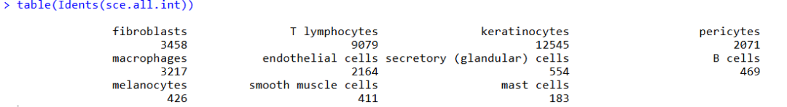

看一下它对UMAP可视化的厉害之处！

### 1、先看默认主题一键出图：

```r
################## umap1
library(SCP)
head(sce.all.int@meta.data)
CellDimPlot(sce.all.int, group.by = "celltype", reduction = "UMAP")
```

这个**配色非常CNS**，且图中展示了总细胞数，每个亚群的细胞数这些信息：

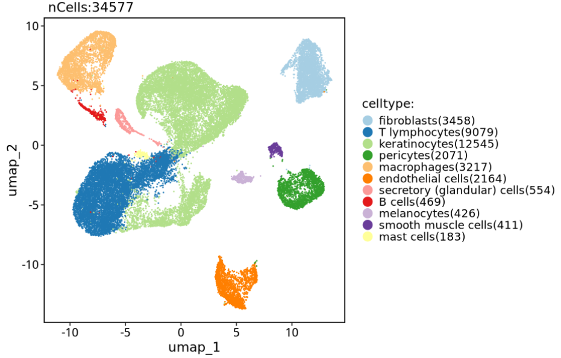

### 2、坐标改成 左下小箭头，也是大家非常常见的需求！

```r
# 左下小箭头
CellDimPlot(sce.all.int, group.by = "celltype", reduction = "UMAP", theme_use = "theme_blank")
```

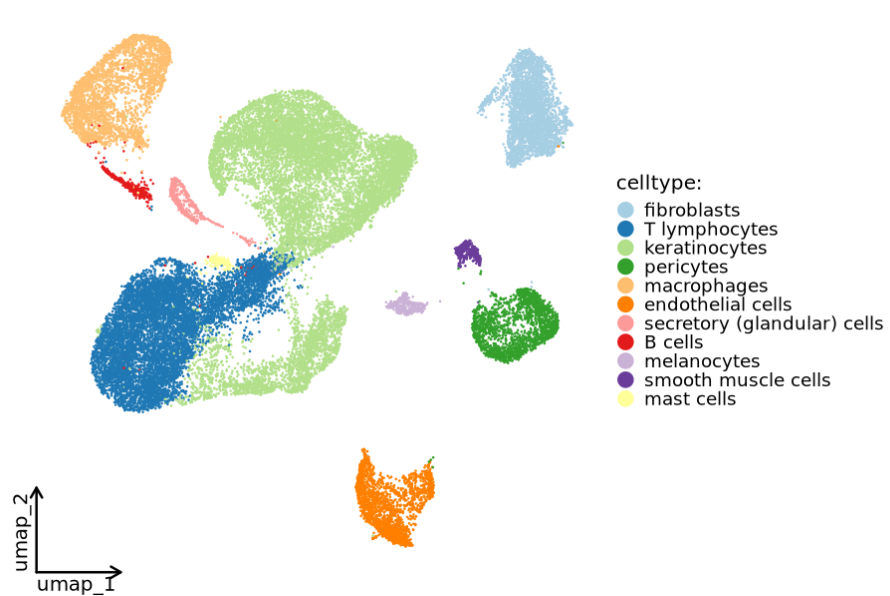

### 3、只显示X、Y轴

还可以**一键调整整体字体大小**：

```r
CellDimPlot(sce.all.int, group.by = "celltype", reduction = "UMAP",
            theme_use = ggplot2::theme_classic, theme_args = list(base_size = 16))
```

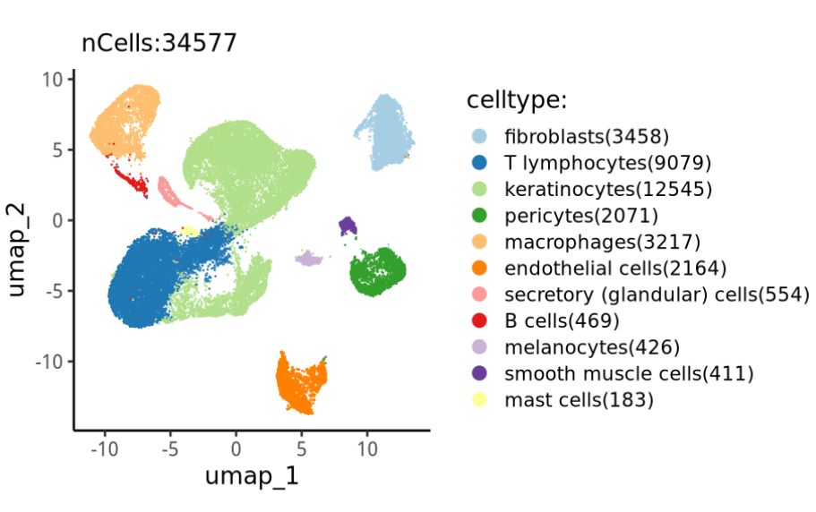

上面三个是我最喜欢的ump风格，还有很多其他，总有你的一款：

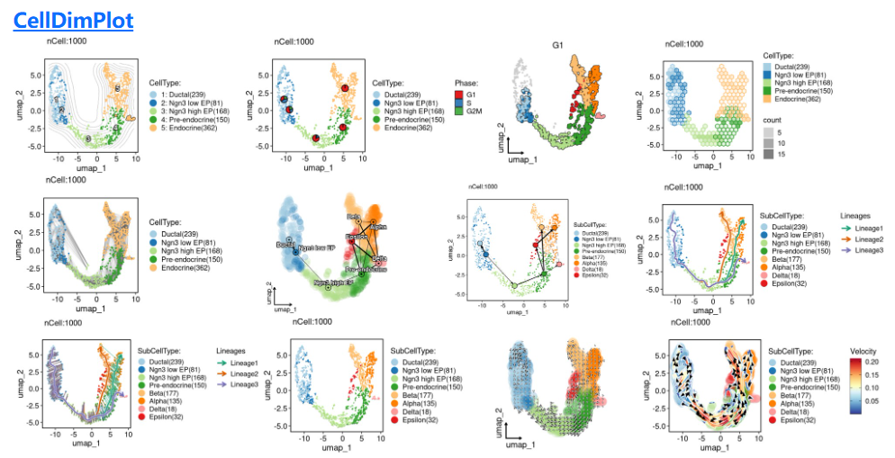

## 第二种：Nebulosa（r包）

Nebulosa 是一个基于核密度估计可视化单细胞数据的 R 包，主要通过结合细胞之间的相似性来恢复丢失特征中的信号，从而实现细胞特征的“卷积”。

学习官网：**https://bioconductor.org/packages/devel/bioc/vignettes/Nebulosa/inst/doc/nebulosa_seurat.html**

Nebulosa 的主要功能是 plot_density，让我们按照以下方式绘制 一些marker基因 的核密度估计图，展示的marker基因表达水平高低：

```r
# 安装一下
options(BioC_mirror="https://mirrors.westlake.edu.cn/bioconductor")
options("repos"=c(CRAN="https://mirrors.westlake.edu.cn/CRAN/"))
BiocManager::install("Nebulosa")
library(Nebulosa)
```

### 1、 绘制一个基因PTPRC

这种图也是在**很多CNS级别**的文章中出现的：

```r
# 绘制一个基因PTPRC
p1 <- plot_density(sce.all.int, c("PTPRC"),size = 0.3)
p1
```

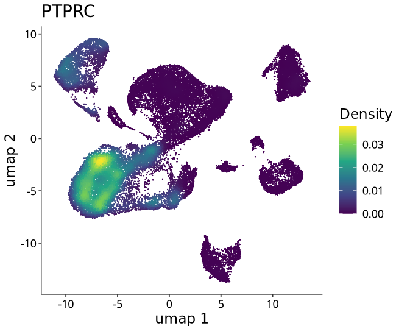

### 2、绘制多个基因

```r
# 同时绘制多个基因
p3 <- plot_density(sce.all.int, c("CD3D","CD4","CD8A","CD68"),size = 0.3)
p3
```

结果如下：

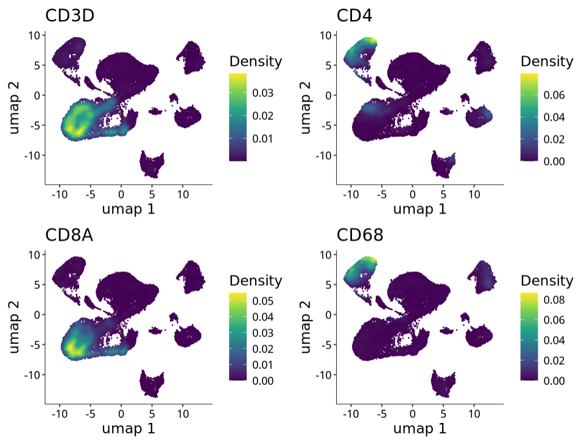

### 3、绘制基因共表达

这里可以**同时展示两个基因都表达**的地方：

```r
# combine = FALSE 只保留两个基因都表达的区域
p4 <- plot_density(sce.all.int, c("CD8A", "CCR7"), joint = TRUE,combine = FALSE)
p4
```

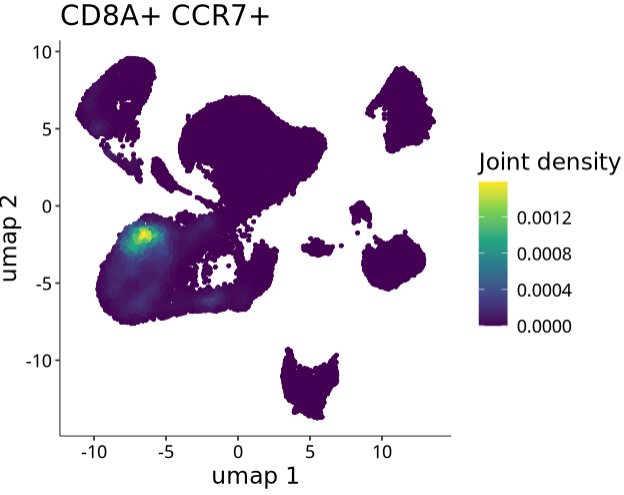

## 第三种：scCustomize（r包）

学习官网：https://samuel-marsh.github.io/scCustomize/index.html

```r
# 安装
# Base R
install.packages("scCustomize")
```

绘图：**可以绘制一个marker，也可以展示多个marker**：

```r
################## umap4：scCustomize
library(viridis)
library(Seurat)
library(scCustomize)

FeaturePlot_scCustom(seurat_object = sce.all.int, features = c("VWF","CD3E"), order = F)
```

这种风格很像早期的**椒盐绘图风格：你看这个着色点是不是很像洒在鸡腿上面的椒盐！**（椒盐风格这个词我在一篇单细胞文献中遇到过，现在找不见了，当时还专门在群里问了来着哈哈哈哈）

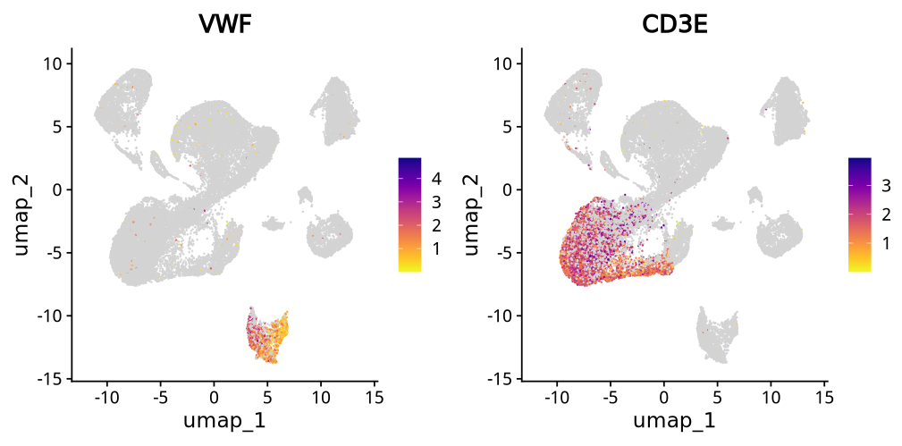

还可以轻松地修改配色：

```r
# 修改颜色
# Set color palette
pal <- viridis(n = 10, option = "D")
FeaturePlot_scCustom(seurat_object = sce.all.int, features = c("VWF","CD3E"),
                     colors_use = pal, order = T,pt.size = 0.3)
```

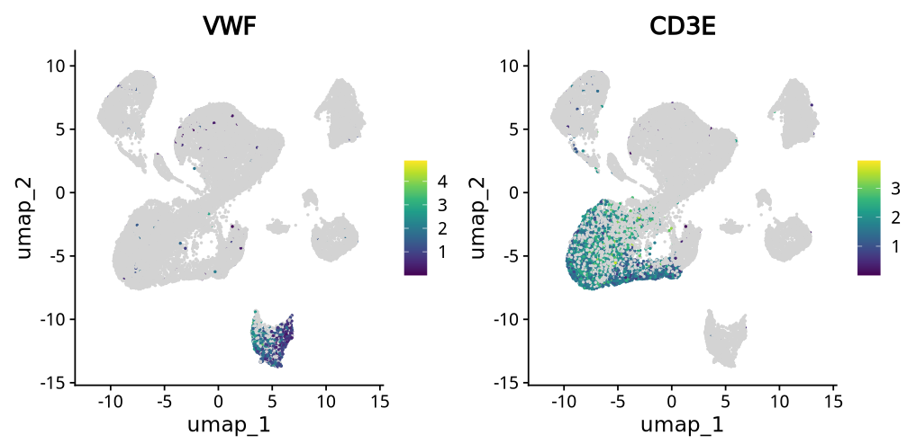

## 第四种：ggplot2绘制细胞密度umap图

在seurat包中有人提出一个绘图需求：https://github.com/satijalab/seurat/issues/6962

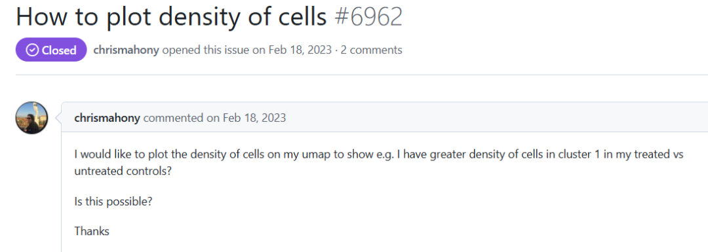

这种图主要用来处理数据点重叠问题时非常有用，使用 `MASS::kde2d()` 进行二维核密度估计，并通过等高线显示结果，`geom_density_2d()` 绘制等高线，而 `geom_density_2d_filled()` 绘制填充的等高线带。

链接：https://ggplot2.tidyverse.org/reference/geom_density_2d.html

```r
library(cetcolor)
library(Seurat)
library(ggplot2)

# 设置颜色
scale.col <- cet_pal(16, name = "fire")

# generate UMAP plot
pl1 <- UMAPPlot(sce.all.int, combine = FALSE) # returns full ggplot object
pl1

# make plot
pl1[[1]] &
  stat_density_2d(aes_string(x = "umap_1", y = "umap_2", fill = "after_stat(level)"),
                  linewidth = 0.2, geom = "density_2d_filled",
                  colour = "ivory", alpha = 0.4, n = 150, h = c(1.2, 1.2)) &
  scale_fill_gradientn(colours = scale.col) &
  DarkTheme()
```

这种风格很独特：

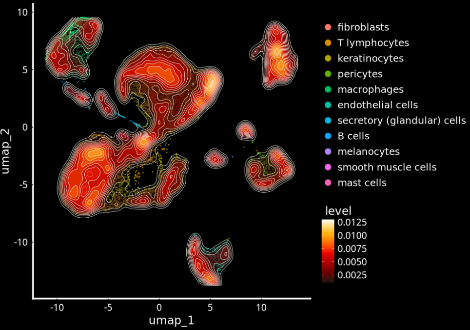

## 第五种：ggpointdensity（r包）

在二维坐标系中可视化数据点有几种方法：如果你有大量的数据点重叠在一起，`geom_point()` 无法为你提供重叠点的数量估计。

刚刚上面介绍的`geom_density2d()` 和 `geom_bin2d()` 可以解决这个问题，但它们使得无法调查个别异常点，而这些异常点可能具有研究价值。

`geom_pointdensity()` 旨在通过结合两者的优点来解决这个问题：各个点根据邻近点的数量进行着色。这使得你既能看到整体分布，也能看到个别点。

学习官网：https://github.com/LKremer/ggpointdensity

细胞密度图：

```r
# 安装
install.packages("ggpointdensity")
library(ggpointdensity)

# 提取umap坐标数据
dat <- Embeddings(sce.all.int, reduction = "umap")
head(dat)
# umap_1    umap_2
# SC67mf2_AAACCTGAGAGTAATC -3.541568  5.127461
# SC67mf2_AAACCTGAGCGCTTAT -6.623588 -3.025122
# SC67mf2_AAACCTGAGGACACCA -4.586405  1.513219

ggplot(data = dat, mapping = aes(x = umap_1, y = umap_2)) +
  geom_pointdensity() +
  scale_color_viridis()
```

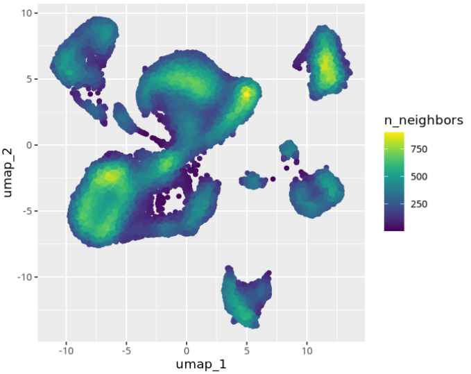

当然，它还可以展示marker特征基因表达：

```r
# 提取umap坐标以及特征基因表达
df <- FetchData(object =sce.all.int, vars = c("umap_1", "umap_2", "CD3D"), layer = "data")
head(df)

# umap_1    umap_2     CD3D
# SC67mf2_AAACCTGAGAGTAATC -3.541568  5.127461 0.000000
# SC67mf2_AAACCTGAGCGCTTAT -6.623588 -3.025122 1.430228
# SC67mf2_AAACCTGAGGACACCA -4.586405  1.513219 0.000000

p <- ggplot(df, aes(x= umap_1, y= umap_2 )) +
  geom_point(data = df %>% filter(CD3D == 0), color = "#440154FF", size = 0.6) +
  ggpointdensity::geom_pointdensity(data = df %>% filter(CD3D > 0), size = 0.6) +
  viridis::scale_color_viridis() +
  theme_classic(base_size = 14) +
  labs(color= "CD3D")
p
```

结果如下：

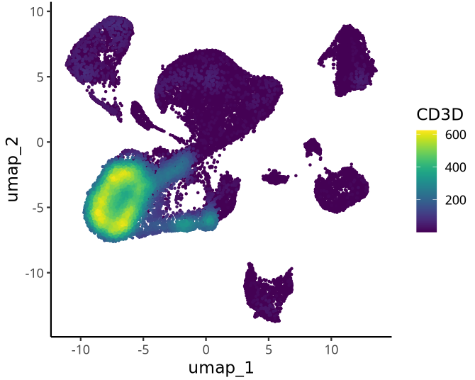

**上面哪一款是你的菜？可以在评论区大声说出来（爱就要勇敢说出来！）。**

**友情宣传：**

**[生信入门&数据挖掘线上直播课2025年1月班](https://mp.weixin.qq.com/s?__biz=MzI1Njk4ODE0MQ==&mid=2247527230&idx=1&sn=7156afcd5ab734c7d391b9048695747a&scene=21#wechat_redirect)**

**[时隔5年，我们的生信技能树VIP学徒继续招生啦](http://mp.weixin.qq.com/s?__biz=MzAxMDkxODM1Ng==&mid=2247524148&idx=1&sn=7806da6feb41a36493c519c1cfc1d3ac&chksm=9b4bdf8fac3c569960369602f1ef26639cb366b250f233b2297d1f059471c0458335bfc0b829&scene=21#wechat_redirect)**

[满足你生信分析计算需求的低价解决方案](https://mp.weixin.qq.com/s?__biz=MzAxMDkxODM1Ng==&mid=2247535760&idx=2&sn=1e02a2e982a046ecf6389231e6768d5b&scene=21#wechat_redirect)

<!-- wechat-article-fetcher: complete -->
