# 你没见过的两种高颜值单细胞亚群相关性热图

- 专辑：绘图小技巧2025
- 公众号：生信技能树
- 发布时间：2025-01-09 11:53
- 原文：[微信公众平台](https://mp.weixin.qq.com/s?__biz=MzAxMDkxODM1Ng%3D%3D&mid=2247536601&idx=1&sn=a9027e4226364f984ccea332c8b6fa28&chksm=9b4b0f62ac3c86749c002125652f558a3d70a487acff87ed89975f396efc63182db2fbbc3f39)

---
> 群里经常接到一些粉丝提问：**单细胞不同亚群间的相关性怎么计算？经过简单检索，发现有两种类型的 相关性热图在已发表的文献中出现过，他们表示的含义不一样，一起来看看吧**。

# 第一种：使用细胞亚群基因表达均值计算亚群间的相关性热图绘制

这种相关性热图计算的是**单细胞亚群间伪bulk基因表达的相关性**，这里有两个应用。

## 文献案例1

文献标题为：《Immunophenotyping of COVID-19 and influenza highlights the role oftype I interferons in development of severe COVID-19》，于2020年7月份发表在杂志 Sci Immunol上。

> 图注：(A) 使用皮尔逊相关系数（PCC）在对不同疾病分组的细胞亚群进行层次聚类，热图中的颜色表示皮尔逊相关系数的数值。热图上方的颜色条表示细胞类型和疾病组。黑色方框标出了在严重COVID-19和流感（FLU）组之间高度相关的细胞类型。

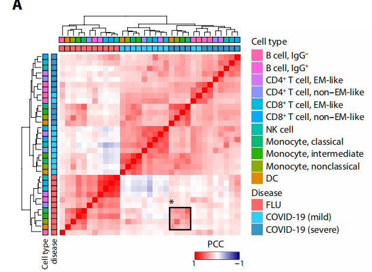

Fig. 2. Immune landscape of COVID-19

## 文献案例2

文献标题为：《Single-Cell Reconstruction of Progression Trajectory Reveals Intervention Principles in Pathological Cardiac Hypertrophy》，于2020年5月发表在Circulation杂志。

> 图注D：10 CM subtypes were grouped into functional clusters (FCs) by Spearman correlation analysis. FC1=CM0+CM2+CM3+CM6, FC2=CM7+CM8, FC3=CM1+CM4+CM9, FC4=CM5。

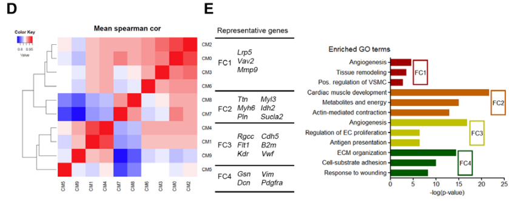

Figure 2

## 实战：基于基因表达 计算相关性热图绘制

这里就简单一点，使用经典的pbmc3k数据进行绘制。

### 1、首选得到数据，从 SeuratData包中获取：

```r
rm(list=ls())
options(timeout=10000)
options(scipen = 1000)
# 加载seurat数据集
library(SeuratData) # pbmc3k 数据
# InstallData("pbmc3k")
library(Seurat)
library(tidyverse)
library(ggpubr)
library(ggplot2)
library(ggrastr)
# devtools::install_github("LKremer/ggpointdensity")
library(ggpointdensity)

## 使用细胞亚群基因表达均值计算亚群间的相关性热图绘制

# 加载数据
data("pbmc3k")
pbmc3k
class(pbmc3k)

pbmc3k.final
sce <- UpdateSeuratObject(pbmc3k.final)
sce
table(sce$seurat_annotations)
head(sce@meta.data)
str(sce@meta.data)

sce <- sce %>%
  NormalizeData %>%
  FindVariableFeatures %>%
  ScaleData(features = rownames(sce))

Idents(sce)
sce$seurat_annotations <- as.character(sce$seurat_annotations)
table(sce$seurat_annotations)
```

### 2、计算每个亚群的基因表达均值

使用经典的**AggregateExpression**函数得到伪bulk 表达谱：

```r
cor_data <- AggregateExpression(sce, group.by = "seurat_annotations", assays = "RNA",return.seurat = TRUE)
cor_data <- cor_data[["RNA"]]$data
range(cor_data)
head(cor_data)
```

现在每一列为一个细胞亚群，每一行为一个基因：

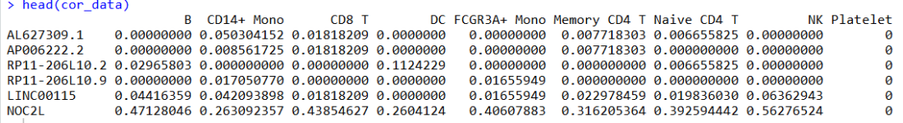

### 3、绘图

使用粗糙的pheatmap简单绘图：

```r
pheatmap::pheatmap(cor(cor_data))
```

结果如下：

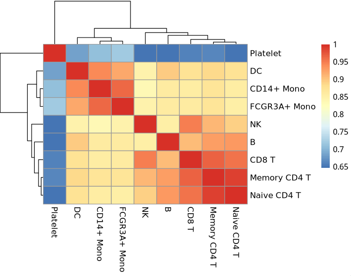

# 第二种：使用**不同样本中各细胞亚群相对百分比**计算亚群间的相关性热图绘制

## 文献案例1

**这种图比下面那个传统热图颜值要高！**

文献：《CAF-macrophage crosstalk in tumour microenvironments governs the response to immune checkpoint blockade in gastric cancer peritoneal  metastases》中：

> **Figure 6** Crosstalk between fibroblasts and macrophages in peritoneal metastases of gastric cancer. (A) Heatmap displaying the correlations across all cell types in the single-cell data. Gastric normal (GN) tissues (n=14), primary gastric cancer (GC) tissues (n=31) and gastric cancer peritoneal metastases (GCPM) tissues (n=24) were included in the analyses. (B) Correlations between cancer-associated fibroblasts (CAFs) and macrophages in the single-cell data

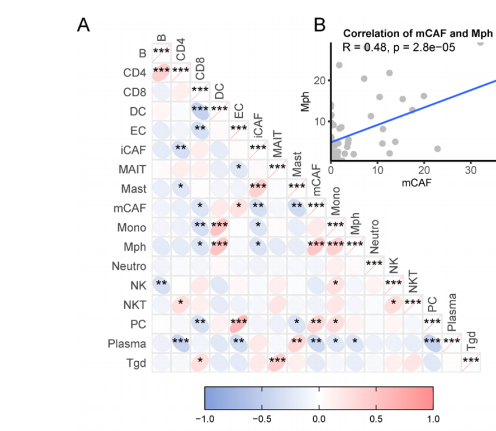

## 文献案例2

文献：《Single-cell and spatial transcriptomics analysis of non-small cell lung cancer》中：

> **Fig. 2 \| Integrated single cell and spatial transcriptomics uncovers different interaction networks in LUAD and LUSC**. A Heatmap showing the Pearson cor-relation between **the relative cell-type abundance for each immune cell type (cal-culated within the CD235− enrichment)**. Colour indicates the Pearson correlation value, asterisks indicate the level of significance of the two-sided association test computed on Pearson’s product-moment correlation coefficients (\*P \< 0.05, \*\* P \< 0.01, \*\*\*P \< 0.001)

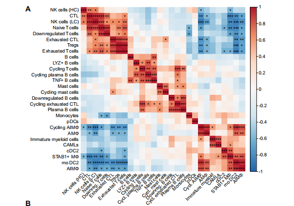

## 实战：细胞比例 相关性热图绘制

我们以 GSE236581为例子，给大家演示 第二种 细胞比例 相关性热图绘制。关于这个 数据集的介绍和分析，可以前往我们前面的两个帖子：

- [百万级别数量的单细胞数据在r里面如何更快处理呢](https://mp.weixin.qq.com/s?__biz=MzAxMDkxODM1Ng==&mid=2247532399&idx=2&sn=d11dbaa1bb7ebf4acbe018b79efcb79b&scene=21#wechat_redirect)

- [百万细胞舍我其谁（一晚上解决战斗）](https://mp.weixin.qq.com/s?__biz=MzI1Njk4ODE0MQ==&mid=2247527245&idx=1&sn=e520bd70a2a07d6cdb566930b8196013&scene=21#wechat_redirect)

这个数据集接近100万个细胞，而且研究者们给出来了比较好的单细胞亚群注释信息，下载文件为：GSE236581_CRC-ICB_metadata.txt.gz，在这里 可以下载到：https://ftp.ncbi.nlm.nih.gov/geo/series/GSE236nnn/GSE236581/suppl/GSE236581%5FCRC%2DICB%5Fmetadata.txt.gz。

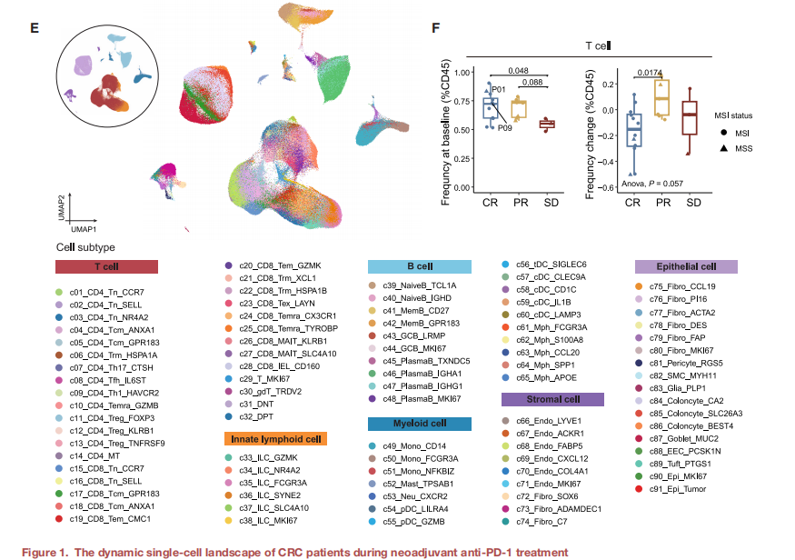

GSE236581

### 1、先导入数据

选取样本ID列：Ident 与细胞细分亚群列：SubCellType

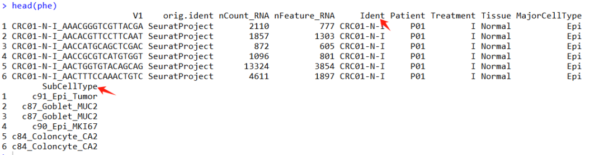

```r
rm(list=ls())
options(scipen = 1000)
# devtools::install_github("LKremer/ggpointdensity")
library(ggpointdensity)
# InstallData("pbmc3k")
# BiocManager::install('caijun/ggcorrplot2')
library(ggcorrplot2) # 绘制下三角相关性椭圆图ggcorrplot
library(ggplot2)
library(sur)
library(reshape2) # 数据长宽变换
library(psych) # 相关性计算

## 使用不同样本中各细胞亚群相对百分比计算亚群间的相关性热图绘制
##

phe <- data.table::fread('GSE236581_CRC-ICB_metadata.txt.gz',data.table = F)
head(phe)
table(phe$Ident)
table(phe$Patient)
table(phe$SubCellType)
length(table(phe$SubCellType))

rownames(phe) <- phe[,1]
phe <- phe[,-1]
table(phe$Ident)
# 169个样本
length(table(phe$Ident))

# 返回的数据tible格式，转成dataframe后为三列，第一列不同样本ID：Ident, 第二列列为细胞亚群 SubCelltype
# 第三列的值为每个样本中每种细胞亚群的细胞数
tbl <- table(phe$Ident, phe$SubCellType)
head(as.data.frame(tbl))
```

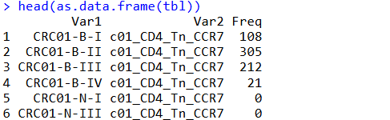

使用 `reshape2`包 中的`dcast`函数 将数据从长格式转换为宽格式，并将结果保存在`df`变量中：

`dcast(..., x~y)`: `dcast`函数用于将数据从长格式转换为宽格式。这里的`x~y`是一个公式，指定了转换的规则：

- `x`：这通常是一个或多个变量，它们在转换后将成为数据框的行名。在转换过程中，`x`变量的每个唯一值都会成为结果数据框中的一行。

- `y`：这是一个变量，它在转换后将成为数据框的列名。`y`变量的每个唯一值都会成为结果数据框中的一列。

```r
x <- phe$Ident
y <- phe$SubCellType
df <- dcast(as.data.frame(tbl), x~y)
head(df[, 1:6])
write.csv(df,'SubCellType-table.csv')
```

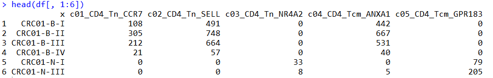

### 2、计算每个样本中不同细胞亚群的相对比例

现在计算比例：每个样本中 不同细胞亚群的相对比例，即**每一行的值除以这一行的行和**。

```r
ptb <- round(100*df[,-1]/rowSums(df[,-1]),3)
```

### 3、绘图

计算相关性并使用 **ggcorrplot** 绘制下三角矩阵相关性图：

```r
cor_data <- ptb
cor_value <- cor(cor_data)
cor_test_mat <- corr.test(cor_data)$p

cor_pp1 <- ggcorrplot(cor_value, method = "ellipse",type = "lower",
                    p.mat = cor_test_mat,col = c("#839EDB", "white", "#FF8D8D"),
                    insig = "label_sig", sig.lvl = c(0.05, 0.01, 0.001))

cor_pp1 <- cor_pp1 +
  theme(axis.text = element_text(size=10))

cor_pp1

# 保存
ggsave(filename = 'SubCelltype_cor.pdf',width = 20,height = 20)
```

结果如下：

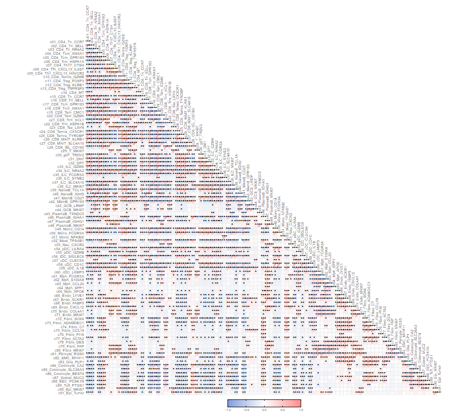

**友情宣传：**

**[生信入门&数据挖掘线上直播课2025年1月班](https://mp.weixin.qq.com/s?__biz=MzI1Njk4ODE0MQ==&mid=2247527230&idx=1&sn=7156afcd5ab734c7d391b9048695747a&scene=21#wechat_redirect)**

**[时隔5年，我们的生信技能树VIP学徒继续招生啦](http://mp.weixin.qq.com/s?__biz=MzAxMDkxODM1Ng==&mid=2247524148&idx=1&sn=7806da6feb41a36493c519c1cfc1d3ac&chksm=9b4bdf8fac3c569960369602f1ef26639cb366b250f233b2297d1f059471c0458335bfc0b829&scene=21#wechat_redirect)**

[满足你生信分析计算需求的低价解决方案](https://mp.weixin.qq.com/s?__biz=MzAxMDkxODM1Ng==&mid=2247535760&idx=2&sn=1e02a2e982a046ecf6389231e6768d5b&scene=21#wechat_redirect)

<!-- wechat-article-fetcher: complete -->
