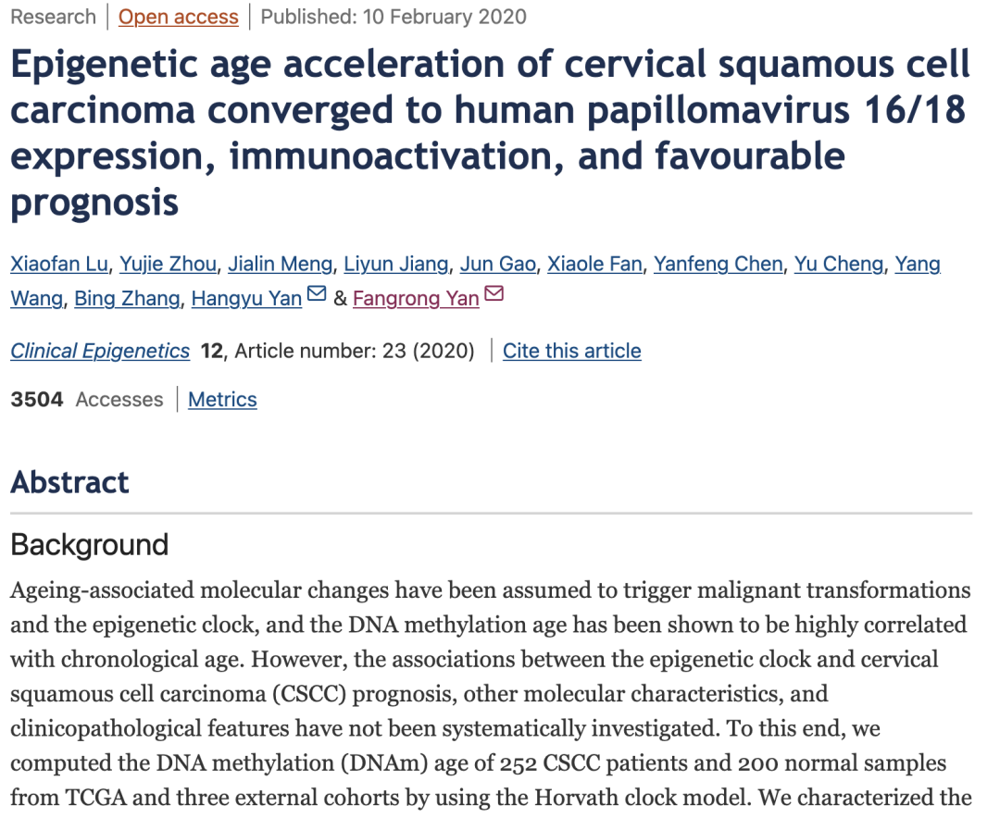
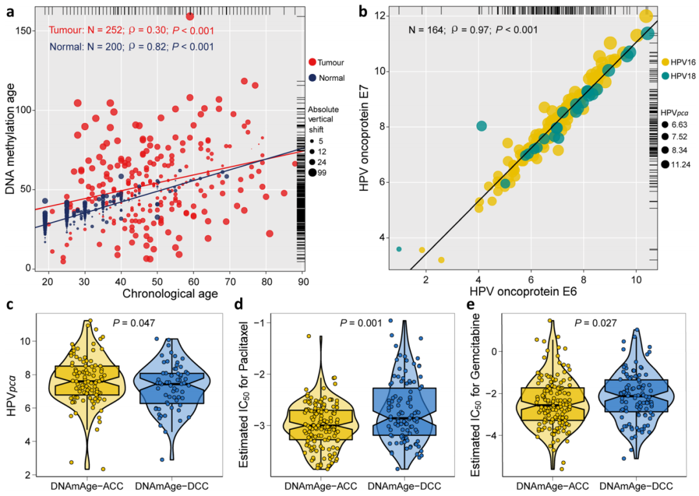
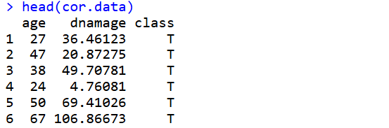
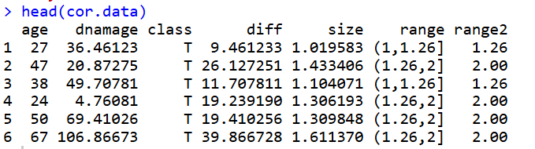
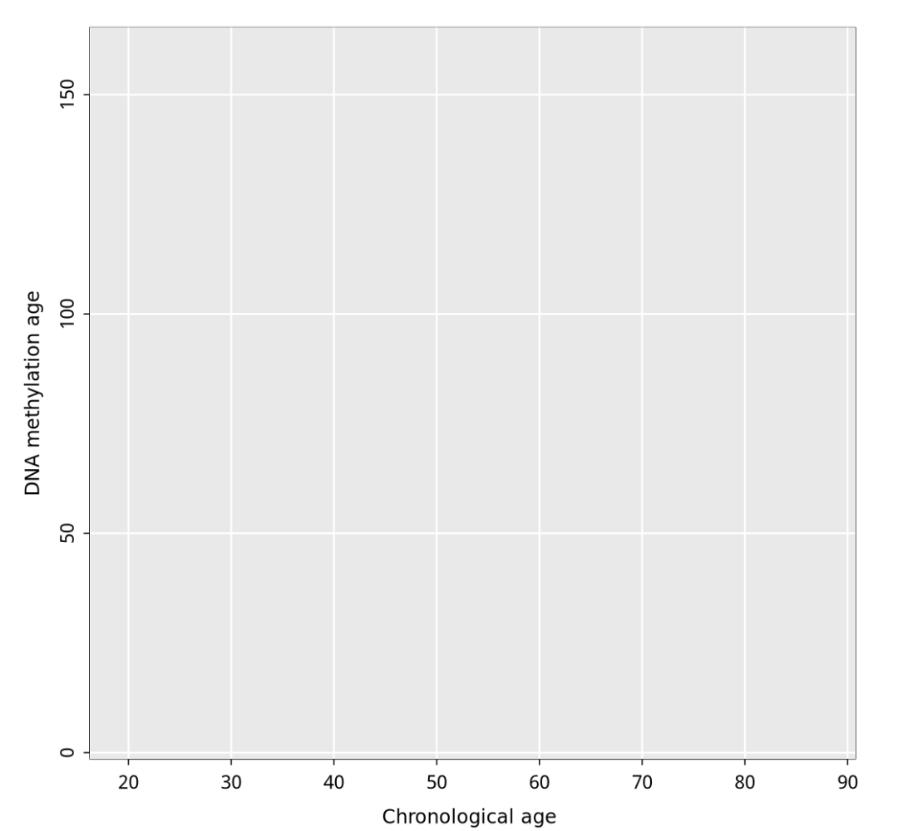
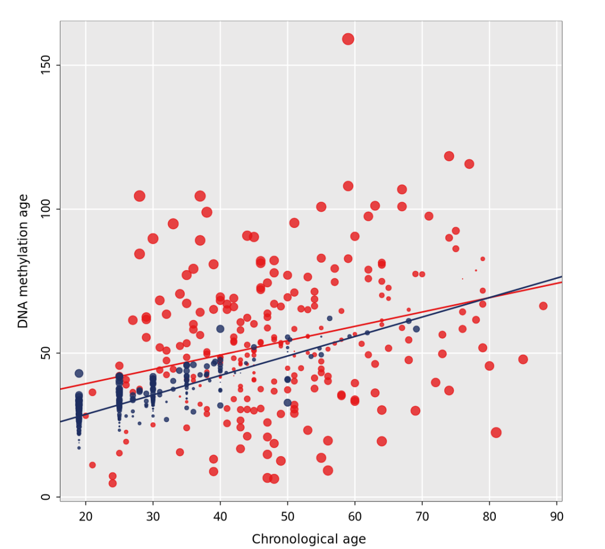
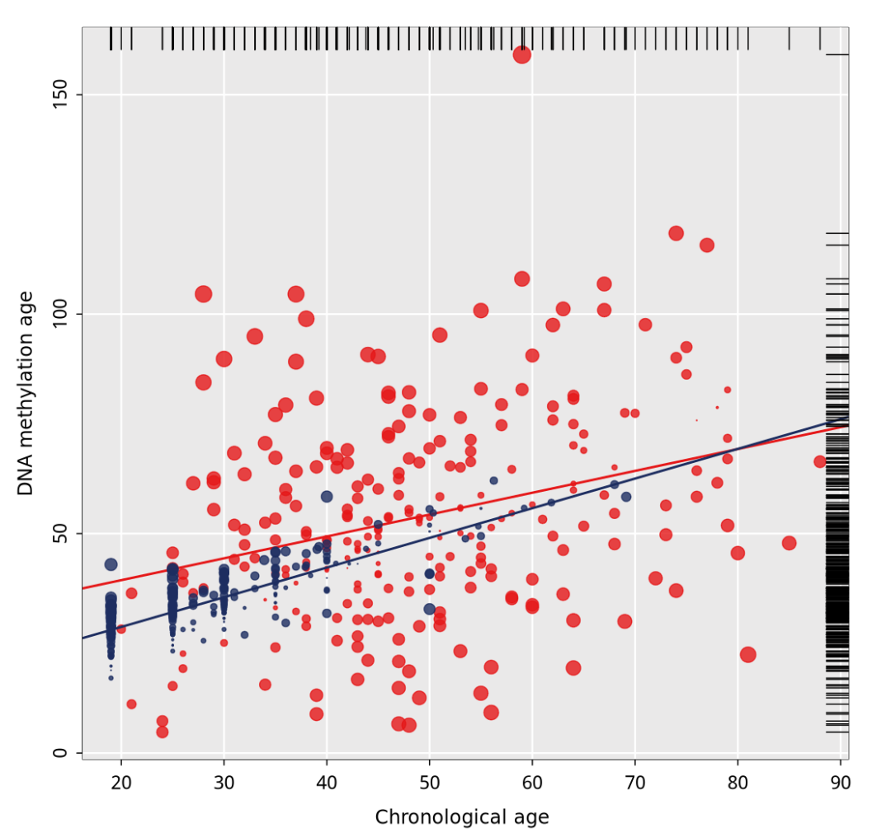
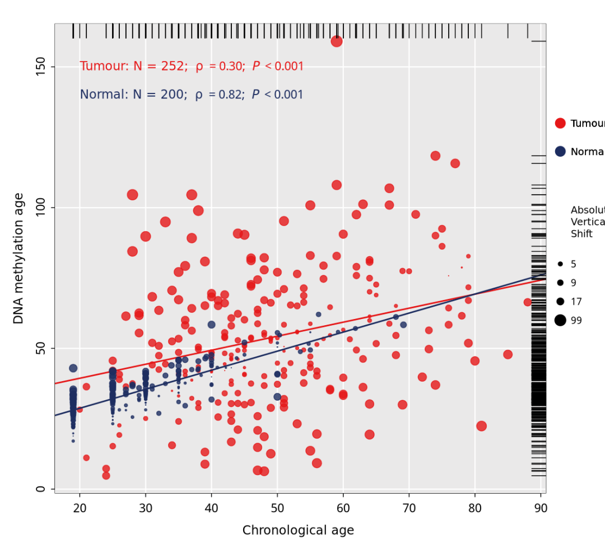
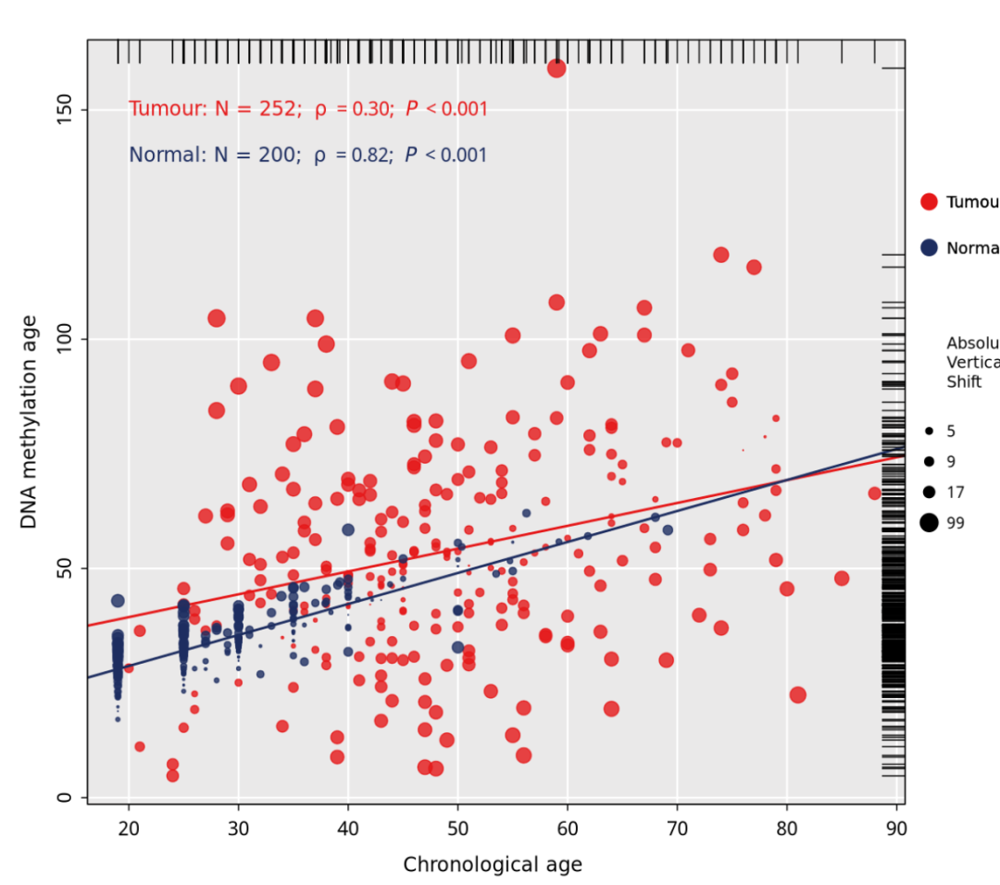
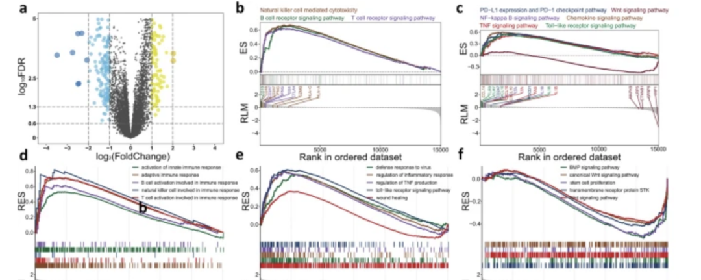

# 复杂相关性散点图复现（ggplot2绘图的层层递进）

- 专辑：绘图小技巧2025
- 公众号：生信技能树
- 发布时间：2025-01-05 23:23
- 原文：[微信公众平台](https://mp.weixin.qq.com/s?__biz=MzAxMDkxODM1Ng%3D%3D&mid=2247536345&idx=1&sn=f8b618d0e1ebf7a2d2f00ae84a3b38fe&chksm=9b4b0e62ac3c8774efe1dab63354b3b1e5283027f4a7f883e176489fbde2988caa86372bcf60)

---
今天给大家复现的图来自文献《Epigenetic age acceleration of cervical squamous cell carcinoma converged to human papillomavirus 16/18 expression, immunoactivation, and favourable prognosis》 



原文的图如下所示，现在我们开始复现里面的a图，可以很清晰的看到

在200个正常样本中，实际年龄与DNAm年龄高度相关（ρ = 0.82）。**然而，这种相关性在肿瘤组织中很大程度上缺失（ρ=0.30），**这表明在正常宫颈组织中观察到的DNA甲基化模式在宫颈肿瘤组织中被破坏（ P \<0.001；图1a ）



Fig. 1 Correlations between DNAm age and chronological age and other molecular characteristics of DNAm age groups

# 数据队列

作者收集了来自TGCA 的252个宫颈鳞状细胞癌样本，TCGA与GEO的 200 个正常组织样本。**Fig1 展示了 在正常组织和肿瘤组织中，DNA甲基化年龄与实际年龄之间的相关性存在差异。**

DNA甲基化年龄的计算方法如下：

> DNA methylation age, based on Horvath’s clock model, **was calculated from the methylation β values using the agep() embedded in R package “wateRmelon”**

生理年龄：就是样本的实际年龄

# 准备数据

```r
## 读取数据
data <- read.csv("input.csv")
head(data)
table(data$class)
```



# 先计算散点图里点的大小

样本根据DNA甲基化年龄与实际年龄之间的差异即差值进一步被分为两类：表观遗传年龄加速组 ‘DNAmAge-ACC’ 或年龄减缓组 ‘DNAmAge-DEC’。如果差值大于零，则被归类为 “DNAmAge-ACC” 或年龄加速组；如果偏移小于零，则被归类为“DNAmAge-DEC”或年龄减缓组。

```r
# 计算甲基化加速年龄
data$diff <- abs(data$dnamage - data$age)
# 根据加速程度计算散点大小，对diff值进行log转换
data$size <- log10(data$diff + 1)

# 计算图例里点的大小，分配散点大小区间
# quantile(data$size)返回四分位数，根据四分位数将数据划分为4个区间
data$range <- cut(data$size, breaks = quantile(data$size), include.lowest = T)
# 取区间的后半部分，用于绘制图例
data$range2 <- as.numeric(gsub("]", "", sapply(strsplit(as.character(data$range),","), "[",2), fixed = T))

head(data)
```



# 计算图中左上角的相关性

Tumor组中的DNAm Age（DNA甲基化年龄）与Chronological Age（生理年龄）相关性：

```r
# Tumor组中的DNAm Age（DNA甲基化年龄）与Chronological Age（生理年龄）相关性
data_t <- data[data$class == "T", ]
cor_t <- cor.test(data_t$age, data_t$dnamage)
cor_t

# Pearson's product-moment correlation
#
# data:  data_t$age and data_t$dnamage
# t = 4.914, df = 250, p-value = 1.615e-06
# alternative hypothesis: true correlation is not equal to 0
# 95 percent confidence interval:
#  0.1798074 0.4054876
# sample estimates:
#       cor
# 0.2967859
```

Normal 组中的DNAm Age（DNA甲基化年龄）与Chronological Age（生理年龄）相关性：

```r
# Normal 组中的DNAm Age（DNA甲基化年龄）与Chronological Age（生理年龄）相关性
data_n <- cor.data[data$class == "N", ]
cor_n <- cor.test(data_n$age, data_n$dnamage)
cor_n

# Pearson's product-moment correlation
#
# data:  data_n$age and data_n$dnamage
# t = 20.296, df = 198, p-value < 2.2e-16
# alternative hypothesis: true correlation is not equal to 0
# 95 percent confidence interval:
#  0.7709783 0.8622419
# sample estimates:
#      cor
# 0.821813
```

# 绘图

## 1、使用 par，plot，rect，grid基础函数 对画布进行基本设置

```r
# 画布基本设置
par(bty="o", mgp = c(2,0.5,0), mar = c(4.1,4.1,2.1,4.1), tcl=-.25, font.main=3)
# 先绘制一个空的画布，仅有边框和坐标名
plot(NULL, NULL, ylim = ylim, xlim = xlim, xlab = "Chronological age ", ylab = "DNA methylation age",col="white",main = "")
# rect基础函数 给画布设置背景色，掩盖边框
rect(par("usr")[1], par("usr")[3], par("usr")[2], par("usr")[4], col = "#EAE9E9",border = F)
# grid函数添加网格
grid(col = "white", lty = 1, lwd = 1.5)
```

得到如下：



## 2、画散点和回归线

```r
# 在画布中添加肿瘤组的散点
points(data_t$age, data_t$dnamage, pch = 19, col = ggplot2::alpha("#E51718",0.8),cex = data_t$size)
# 添加回归线
abline(lm(dnamage~age, data=data_t), lwd = 2, col = "#E51718")

# 在画布中添加正常组的散点
points(data_n$age, data_n$dnamage, pch = 19, col = ggplot2::alpha("#1D2D60",0.8), cex = data_n$size)
abline(lm(dnamage~age, data=data_n), lwd = 2, col = "#1D2D60")
```

结果如下：



## 3、画顶部和右侧地毯线

```r
# 添加边际地毯线显示数据分布情况
rug(data$age, col="black", lwd=1, side=3)
rug(data$dnamage, col="black", lwd=1, side=4)
```



## 4、添加相关性结果

```r
text(20,150, adj = 0,expression("Tumour: N = 252; "~rho~" = 0.30; "~italic(P)~" < 0.001"), col = c("#E51718"), cex=1)
text(20,140,adj = 0,expression("Normal: N = 200; "~rho~" = 0.82; "~italic(P)~" < 0.001"), col = c("#1D2D60"), cex=1)
```

## 5、画图例

```r
# 计算图例里需要绘制多少圆圈
num <- length(unique(data$range2))
num

# 散点图例
points(x = rep(par("usr")[2] + 2.2, num), y = seq(80,60, length.out = num),
       pch = 19, bty = "n", cex = sort(unique(data$range2)), col = "black")

# 点的文字
text(x = rep(par("usr")[2] + 3.8, num + 1), y = c(95, seq(80,60,length.out = num)),
     labels = c("Absolute\nVertical\nShift", round(10^(sort(unique(data$range2))) - 1,0)),
     adj = 0,cex = 0.8)

# 做分组的圆圈（肿瘤和正常）
points(x = rep(par("usr")[2] + 2.2, 2), y = c(130, 120),
       pch = 19, bty = "n", cex = 1.8, col = c("#E51718","#1D2D60"))

# 做分组图图例的文字
text(x = rep(par("usr")[2] + 3.8, num + 1), y = c(130, 120),
     labels = c("Tumour","Normal"),  adj = 0,cex = 0.8)
```



## 6、添加边框

```r
# 设置new = TRUE时，新的图形会叠加在现有的图形上
# 设置bty="o"会使得图形具有一个完整的矩形边框
par(new = T, bty="o")

# 这行代码创建一个空白的图形窗口，具有指定的坐标轴范围，但没有轴标签和刻度。
ylim <- range(data$dnamage)
xlim <- range(data$age)
plot(-1, -1, col = "white",xlim = xlim, ylim = ylim, xlab = "", ylab = "", xaxt = "n", yaxt = "n")
```

最终结果如下：



# 最后

如果你要从ggplot2开始一步步调制成为它这样的美图，需要下很深的功夫，一张统计图就是从数据到几何对象（点、线、条形等）的图形属性（颜色、形状、大小等）的一个映射。

- ✦ 数据（Data），最基础的是可视化的数据和一系列图形映射（aesthetic mappings），该映射描述了数据中的变量如何映射到可见的图形属性。

- ✦ 几何对象（Geometric objects, geoms）代表在图中实际看到的点、线、多边形等。

- ✦ 统计转换（Statistical trassformations, stats）是对数据进行某种汇总，例如将数据分组创建直方图，或将一个二维的关系用线性模型进行解释。

- ✦ 标度（Scales）是将数据的取值映射到图形空间，例如用颜色、大小或形状来表示不同的取值，展现标度的常见做法是绘制图例和坐标轴。

- ✦ 坐标系（Coordinate system, coord）描述数据是如何映射到图形所在的平面，同时提供看图所需的坐标轴和网格线。

- ✦ 分面（faceting）如何将数据分解为子集，以及如何对子集作图并展示。

- ✦  主题（theme）控制细节显示，例如字体大小和图形的背景色。

基础绘图永远是基本功，我们之前讲过一个公开课，欢迎观看：https://www.bilibili.com/video/BV1Wi4y1A7u5/


### 分组后做转录组差异分析

根据 DNAm 年龄和实际年龄之间的变化，将患者进一步分为表观遗传年龄加速组或年龄减速组。

- 如果偏移大于零，它们被分类为“DNAmAge-ACC”或年龄加速；

- 如果偏移小于零，则它们被分类为“DNAmAge-DEC”或年龄减速。

文章里面就做了这个分组后的转录组崔西，大家可以试试看，作为学徒作业哈；

>
>
> we performed differential expression analysis and identified 103 and 184 significantly upregulated genes (fold change \> 2, false discovery rate (FDR) \< 0.05) for the DNAm-ACC and DNAm-DEC groups, respectively




#### 文末友情宣传

强烈建议你推荐给身边的**博士后以及年轻生物学PI**，多一点数据认知，让他们的科研上一个台阶：

- [**生信入门&数据挖掘线上直播课2025年1月班**](https://mp.weixin.qq.com/s?__biz=MzAxMDkxODM1Ng==&mid=2247536035&idx=2&sn=dab1e47f7ca8aa2ff26a6e440d9bb044&scene=21#wechat_redirect)**，你的生物信息学入门课**

- [**时隔5年，我们的生信技能树VIP学徒继续招生啦**](http://mp.weixin.qq.com/s?__biz=MzAxMDkxODM1Ng==&mid=2247524148&idx=1&sn=7806da6feb41a36493c519c1cfc1d3ac&chksm=9b4bdf8fac3c569960369602f1ef26639cb366b250f233b2297d1f059471c0458335bfc0b829&scene=21#wechat_redirect)

- [**满足你生信分析计算需求的低价解决方案**](https://mp.weixin.qq.com/s?__biz=MzUzMTEwODk0Ng==&mid=2247530048&idx=1&sn=28aa7bbd5e00521f79e074496a5f5d66&scene=21#wechat_redirect)

<!-- wechat-article-fetcher: complete -->
