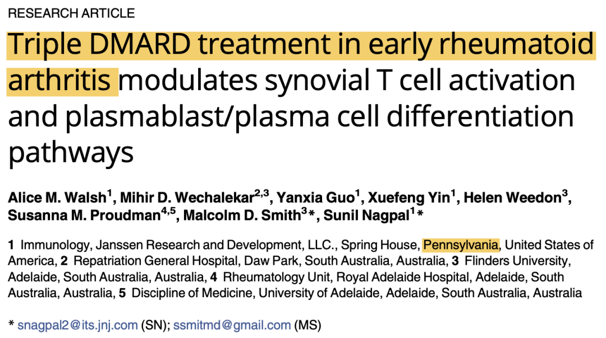
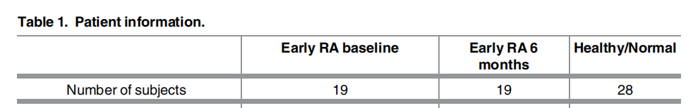
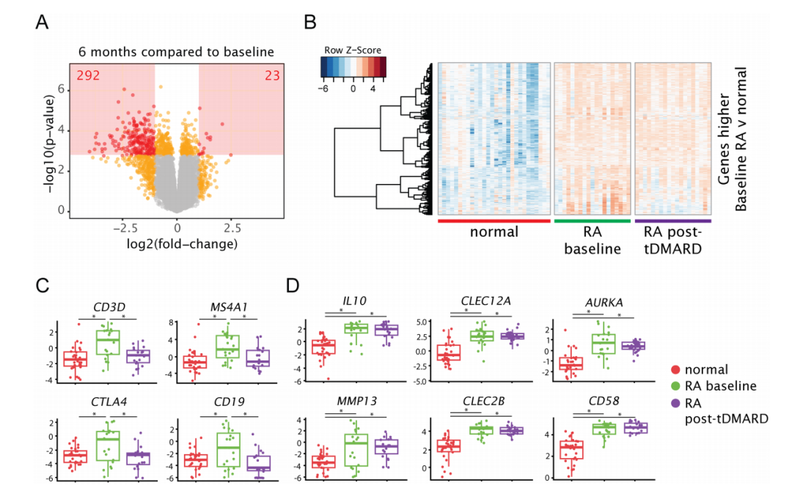
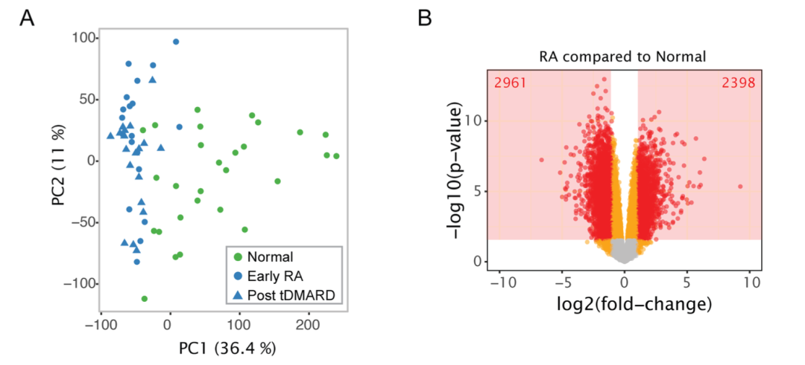
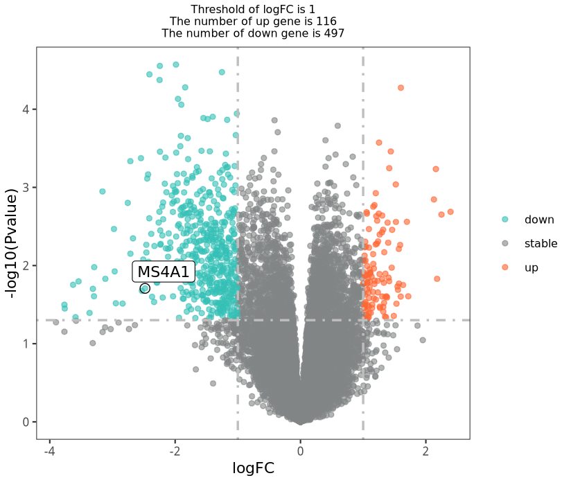
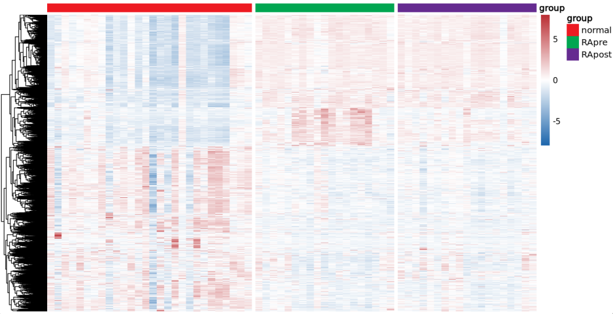
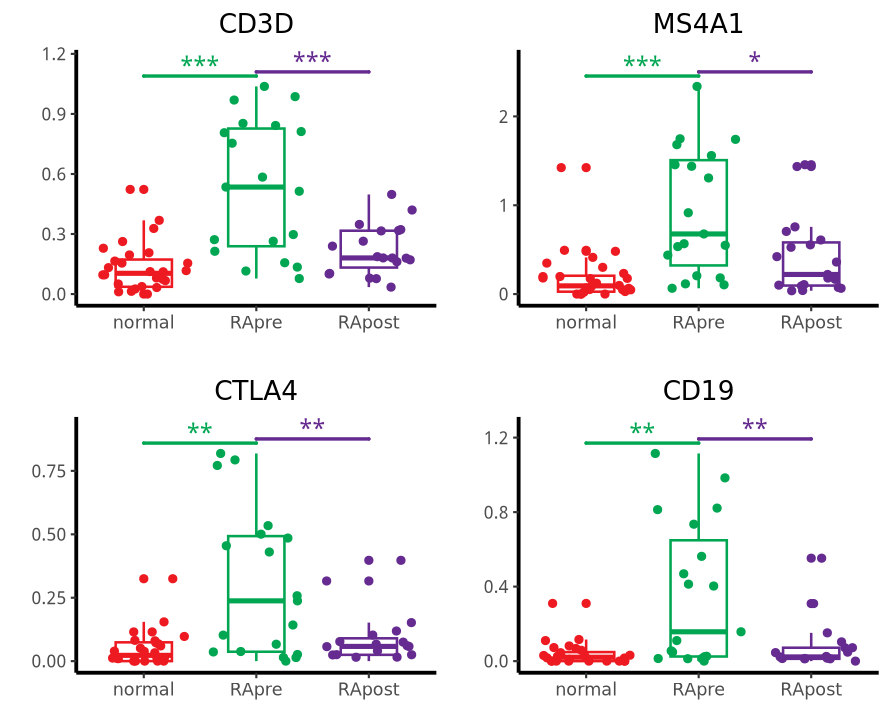
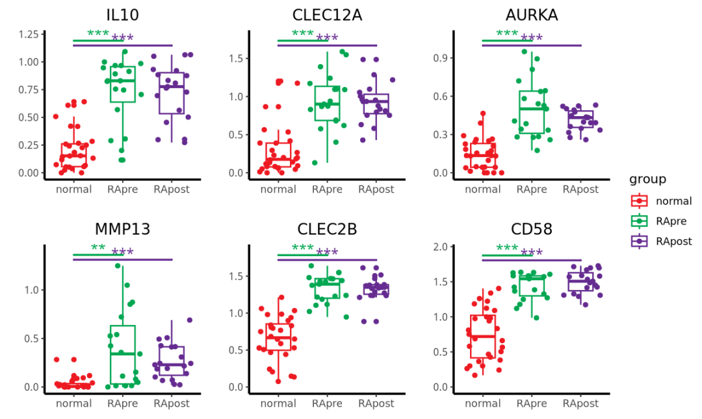
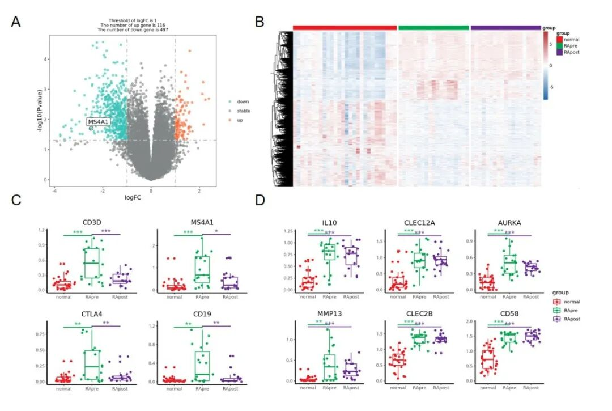

# 带有疾病进展的多分组差异结果如何展示？

- 专辑：绘图小技巧2025
- 公众号：生信技能树
- 发布时间：2025-01-01 22:26
- 原文：[微信公众平台](https://mp.weixin.qq.com/s?__biz=MzAxMDkxODM1Ng%3D%3D&mid=2247536217&idx=1&sn=3f1893e79b3474230cd3993c37d2aa34&chksm=9b4b0ee2ac3c87f41bf62e7e5c5ba7915258468710510fb6b82c65650437d026a1110de4681d)

---
>
>
> 新的一年，大家元旦快乐呀！技能树新开了一个专辑《绘图小技巧2025》，欢迎关注，这是今年这个专辑的第一篇稿子~

###

此次给绘制的图来自文献《Triple DMARD treatment in early rheumatoid arthritis modulates synovial T cell activation and plasmablast/plasma cell differentiation pathways》，是2017发表的，使用了他们团队自己2016发表的转录组测序数据，所以其实是有两个转录组测序数据集。



### 文章中数据情况如下：

```r
Data are available publicly through NCBI GEO database (Healthy samples are under acces sion number GSE89408. RA samples are under accession number GSE97165)
```

GSE89408：有28个正常样本，GSE97165 有19个 RA 治疗前与 19个RA治疗后的样本。



### 复现的图：

这个图主要展示了 A：治疗后 与 治疗前的差异火山图，B：治疗前 与正常对照 差异基因在三组样本中的表达热图，以及 C&D：一些 marker 基因在三个组别中的箱线图+抖动散点+显著性比较 。



Fig 2. Genes selectively expressed by lymphocytes are decreased after 6 months of tDMARD treatment, while other genes remain elevated compared to normal joints

### 首先，整理差异分析所需要的数据

**这里的两个数据集中的count数据作者使用的同一套流程与参数进行分析，这里直接合并在一起进行后续分析。****（两个数据集都是同一个科研团队的，所以理论上可以先不考虑里面的批次效应哈）**

如果实在不放心，可以选择下载fq数据放在一起定量，拿到表达矩阵走后面的分析。

```r
rm(list = ls())#清空当前的工作环境
options(stringsAsFactors = F)#不以因子变量读取
options(scipen = 20)#不以科学计数法显示
library(data.table)
library(tinyarray)

####################### 读取 正常样本：PRJNA352076、GSE89408
acc <- "GSE89408"
data1 <- data.table::fread("GSE89408_GEO_count_matrix_rename.txt.gz", data.table = F)
data1 <- data1[!duplicated(data1$V1), ]

####################### RA样本：PRJNA380832、GSE97165
acc <- "GSE97165"
data2 <- data.table::fread("GSE97165_GEO_count_matrix.txt.gz", data.table = F)
data2 <- data2[!duplicated(data2$V1), ]

mat <- merge(data1, data2, by="V1")
colnames(mat)
symbol_matrix <- mat[,c(grep("normal",colnames(mat)),grep("RA_pre",colnames(mat)),grep("RA_post",colnames(mat))) ]
colnames(symbol_matrix)
rownames(symbol_matrix) <- mat[,1]
symbol_matrix <- floor(symbol_matrix)
symbol_matrix[1:4,1:4]

#过滤低表达
keep_feature <- rowSums (symbol_matrix > 0) > 0.5*ncol(symbol_matrix) ;table(keep_feature)
symbol_matrix <- symbol_matrix[keep_feature, ]
symbol_matrix[1:4,1:4]

group_list <- stringr::str_split(colnames(symbol_matrix), pattern = "_[1-9]", n = 2, simplify = T)[,1]
group_list <- gsub("_tissue", "", group_list)
group_list <- gsub("RA_pre", "RApre", group_list)
group_list <- gsub("RA_post", "RApost", group_list)
group_list
table(group_list)

# group_list
# normal  RApre RApost
#     28     19     19

colnames(symbol_matrix)
group_list
table(group_list)
#dat <- log10(edgeR::cpm(symbol_matrix)+1)
dat <- log2(edgeR::cpm(symbol_matrix)+1)
save(dat, symbol_matrix,group_list,file = 'step1-output.Rdata')
```

### 然后是两次差异分析

文献中使用的是 limma 算法，我们也尽量复现同样的哈，其中，疾病和对照肯定是差异巨大，但是治疗前后就很难说了因为从文献里面的pca来看本来就是分组内的差异并没有显著的小于组间差异！



#### （1）RA 治疗前 vs 正常对照

```r
rm(list = ls())  ## 魔幻操作，一键清空~
options(stringsAsFactors = F)
library(AnnoProbe)
library(GEOquery)
library(ggplot2)
library(ggstatsplot)
library(patchwork)
library(reshape2)
library(stringr)
getOption('timeout')
options(timeout=10000)
load('./step1-output.Rdata')
symbol_matrix[1:4,1:4]
group_list
table(group_list)

gse_number <- 'RA_vs_Normal'
gse_number
dir.create(gse_number)
setwd( gse_number )
getwd()

kp <- group_list %in% c('normal','RApre');table(kp)
symbol_matrix <- symbol_matrix[,kp]
group_list <- group_list[kp]
table(group_list)
group_list <- factor(group_list,levels = c('normal','RApre' ))
group_list
save(symbol_matrix,group_list,file = 'symbol_matrix.Rdata')

# 运行
source('../scripts/step3-deg-limma-voom.R')
```

#### （2）RA 治疗后 vs RA 治疗前

```r
rm(list = ls())  ## 魔幻操作，一键清空~
options(stringsAsFactors = F)
library(AnnoProbe)
library(GEOquery)
library(ggplot2)
library(ggstatsplot)
library(patchwork)
library(reshape2)
library(stringr)
getOption('timeout')
options(timeout=10000)
load('./step1-output.Rdata')
symbol_matrix[1:4,1:4]
group_list
table(group_list)

gse_number <- 'RApost_vs_RApre'
gse_number
dir.create(gse_number)
setwd( gse_number )
getwd()

kp=group_list %in% c('RApre','RApost');table(kp)
symbol_matrix=symbol_matrix[,kp]
group_list=group_list[kp]
table(group_list)
group_list = factor(group_list,levels = c('RApre','RApost'))
group_list
save(symbol_matrix,group_list,file = 'symbol_matrix.Rdata')

# 运行
source('../scripts/step3-deg-limma-voom.R')
```

#### source的 step3-deg-limma-voom.R 代码：

```r
rm(list = ls())
options(stringsAsFactors = F)
library(ggplot2)
library(ggstatsplot)
library(ggsci)
library(RColorBrewer)
library(patchwork)
library(ggplotify)
library(limma)
library(edgeR)
library(DESeq2)

load(file = 'symbol_matrix.Rdata')
symbol_matrix[1:4,1:4]
exprSet = symbol_matrix

design <- model.matrix(~0+factor(group_list))
colnames(design)=levels(factor(group_list))
rownames(design)=colnames(exprSet)
design

dge <- DGEList(counts=exprSet)
dge <- calcNormFactors(dge)
logCPM <- cpm(dge, log=TRUE, prior.count=3)
v <- voom(dge,design,plot=TRUE, normalize="quantile")

fit <- lmFit(v, design)
group_list
g1=levels(group_list)[1]
g2=levels(group_list)[2]
con=paste0(g2,'-',g1)
cat(con)
cont.matrix=makeContrasts(contrasts=c(con),levels = design)
fit2=contrasts.fit(fit,cont.matrix)
fit2=eBayes(fit2)

tempOutput = topTable(fit2, coef=con, n=Inf)
DEG_limma_voom = na.omit(tempOutput)
head(DEG_limma_voom)

save(DEG_limma_voom, file =  'DEG_limma_voom.Rdata' )
```

### 绘制图2A：治疗后 与 治疗前的差异火山图

```r
load( file =  'DEG_limma_voom.Rdata' )
colnames(DEG_limma_voom)
head(DEG_limma_voom)

nrDEG=DEG_limma_voom[,c("logFC", "P.Value"  )]
head(nrDEG)

df=nrDEG
logFC_t <- 1
pvalue_t <- 0.05
df$g=ifelse(df$P.Value > pvalue_t,'stable', #if 判断：如果这一基因的P.Value>0.01，则为stable基因
          ifelse( df$logFC > logFC_t,'up', #接上句else 否则：接下来开始判断那些P.Value<0.01的基因，再if 判断：如果logFC >1.5,则为up（上调）基因
                  ifelse( df$logFC < -logFC_t,'down','stable') )#接上句else 否则：接下来开始判断那些logFC <1.5 的基因，再if 判断：如果logFC <1.5，则为down（下调）基因，否则为stable基因
)
table(df$g)
df$name=rownames(df)
head(df)

this_tile <- paste0('Threshold of logFC is ',round(logFC_t,3),
                  '\nThe number of up gene is ',nrow(df[df$g == 'up',]) ,
                  '\nThe number of down gene is ',nrow(df[df$g == 'down',]) )

this_tile

#～～～火山图p5～～～
target_gene= c('MS4A1')
for_label <-  df %>%
dplyr::filter(df$name %in% target_gene)
head(for_label)

p5 <- ggplot(data = df, aes(x = logFC, y = -log10(P.Value))) +
    geom_point(alpha=0.6, size=1.5, aes(color=g)) +
    geom_point(size = 3, shape = 1, data = for_label) +
    ggrepel::geom_label_repel(aes(label = name),data = for_label,
                              max.overlaps = getOption("ggrepel.max.overlaps", default = 20),
                              color="black") +
    ylab("-log10(Pvalue)")+
    scale_color_manual(values=c("#34bfb5", "#828586","#ff6633"))+
    geom_vline(xintercept=c(-logFC_t,logFC_t),lty=4,col="grey",lwd=0.8) +
    geom_hline(yintercept = -log10(pvalue_t),lty=4,col="grey",lwd=0.8) +
    #coord_flip()+
    #xlim(-5, 5)+
    theme_bw()+
    ggtitle(this_tile )+
    theme(panel.grid = element_blank(),
          plot.title = element_text(size=8,hjust = 0.5),
          legend.title = element_blank(),
          legend.text = element_text(size=8))
p5
```

结果如下：比文献中那个火山图好看，就用我们这个进行后续的拼图好了。



### 绘制图2B：治疗前 与 正常对照的差异基因热图

```r
rm(list = ls())  ## 魔幻操作，一键清空~
options(stringsAsFactors = F)
library(ggplot2)
library(ggstatsplot)
library(patchwork)
library(reshape2)
library(stringr)
library(ggsignif)
getOption('timeout')
options(timeout=10000)

setwd("RA_vs_Normal/")

# 读取差异结果
load("DEG_limma_voom.Rdata")
head(DEG_limma_voom)

# 读取所有样本表达矩阵
load("../step1-output.Rdata")
ls()

###################################### Fig2.B 热图
# 提取所有差异基因的表达矩阵
DEG_limma_voom$name <- rownames(DEG_limma_voom)
DEG_limma_voom$g <- "stable"
DEG_limma_voom$g[ DEG_limma_voom$logFC >1 & DEG_limma_voom$adj.P.Val < 0.05 ] <- "up"
DEG_limma_voom$g[ DEG_limma_voom$logFC < -1 & DEG_limma_voom$adj.P.Val < 0.05 ] <- "down"
table(DEG_limma_voom$g)
head(DEG_limma_voom)

diff <- DEG_limma_voom[DEG_limma_voom$g!="stable", "name"]
head(diff)
length(diff)

library(pheatmap)
dat_plot <- dat[diff,]
head(dat_plot)

anno <- data.frame(group=group_list)
rownames(anno) <- colnames(dat)
head(anno)

ann_color <- list(group =  c(normal="#ed1a22",RApre="#00a651",RApost="#652b90"))

library(RColorBrewer)
color <- colorRampPalette(c('#1f67ad','white','#bb2f34'))(100)
pheatmap(dat_plot, scale = "row",show_rownames = F,show_colnames = F,
         color = color,annotation_col = anno, annotation_colors = ann_color,
         cluster_cols = F,
         border_color = "black",gaps_col=c(28,47))
```

结果如下：文献中那个图感觉只放了 上调基因？



### 绘制图2C与D：marker 基因 箱线图

首先，让kimi（https://kimi.moonshot.cn/）帮我拿到图片中的基因并整理成一个R语言向量，再也不用一个个手动从文献里面抠出来了：

**图C 的比较组别为：list(c("RApre", "normal"), c("RApost", "RApre"))**

```r
###################################### Fig2.C 热图
# 提取所有差异基因的表达矩阵
genes1 <- c("CD3D", "MS4A1", "CTLA4", "CD19")
group_list <- factor(group_list,levels = c("normal","RApre","RApost"))

fig2c <- list()
for(i in 1:length(genes1)) {
  #i <- 4
  box_dat <- data.frame(exp=dat[genes1[i],], group=group_list)
  head(box_dat)
  max_pos <- max(box_dat$exp)

  # 绘制小提琴图和显著性标记
  B <- ggplot(data=box_dat,aes(x=group,y=exp,colour = group)) +
    geom_boxplot(mapping=aes(x=group,y=exp,colour=group), size=0.6, width = 0.5) + # 箱线图
    geom_jitter(mapping=aes(x=group,y=exp,colour = group),size=1.5) +  # 散点
    scale_color_manual(limits=c("normal","RApre","RApost"), values =c( "#ed1a22","#00a651","#652b90") ) + # 颜色
    geom_signif(mapping=aes(x=group,y=exp), # 不同组别的显著性
                comparisons = list(c("RApre", "normal"), c("RApost", "RApre")),
                map_signif_level=T, # T显示显著性，F显示p value
                tip_length=c(0,0,0,0,0,0,0,0,0,0,0,0), # 修改显著性线两端的长短
                y_position = c(max_pos, max_pos*1.02), # 设置显著性线的位置高度
                size=0.8, # 修改线的粗细
                textsize = 4, # 修改显著性标记的大小
                test = "t.test") + # 检验的类型,可以更改
    ylim(c(0,max_pos*1.12)) +
    theme_classic() + #设置白色背景
    labs(x="",y="")  + # 添加标题，x轴，y轴标签
    ggtitle(label = genes1[i]) +
    theme(plot.title = element_text(hjust = 0.5),
          axis.line=element_line(linetype=1,color="black",size=0.9))

  B

  fig2c[[i]] <- B

}

p_c <- wrap_plots(fig2c,guides="collect")
p_c
```

结果如下：




**图D的比较组别为：list(c("RApre", "normal"), c("RApost", "normal"))**

```r
##########################################################################
genes2 <- c("IL10", "CLEC12A", "AURKA", "MMP13","CLEC2B", "CD58")

fig2d <- list()
for(i in 1:length(genes2)) {
  #i <- 4
  box_dat <- data.frame(exp=dat[genes2[i],], group=group_list)
  head(box_dat)
  max_pos <- max(box_dat$exp)

  # 绘制小提琴图和显著性标记
  B <- ggplot(data=box_dat,aes(x=group,y=exp,colour = group)) +
    geom_boxplot(mapping=aes(x=group,y=exp,colour=group), size=0.6, width = 0.5) + # 箱线图
    geom_jitter(mapping=aes(x=group,y=exp,colour = group),size=1.5) +  # 散点
    scale_color_manual(limits=c("normal","RApre","RApost"), values =c( "#ed1a22","#00a651","#652b90") ) + # 颜色
    geom_signif(mapping=aes(x=group,y=exp), # 不同组别的显著性
                comparisons = list(c("RApre", "normal"), c("RApost", "normal")),
                map_signif_level=T, # T显示显著性，F显示p value
                tip_length=c(0,0,0,0,0,0,0,0,0,0,0,0), # 修改显著性线两端的长短
                y_position = c(max_pos*1.04,max_pos), # 设置显著性线的位置高度
                size=0.8, # 修改线的粗细
                textsize = 4, # 修改显著性标记的大小
                test = "t.test") + # 检验的类型,可以更改
    ylim(c(0,max_pos*1.12)) +
    theme_classic() + #设置白色背景
    labs(x="",y="")  + # 添加标题，x轴，y轴标签
    ggtitle(label = genes2[i]) +
    theme(plot.title = element_text(hjust = 0.5),
          axis.line=element_line(linetype=1,color="black",size=0.9))

  B

  fig2d[[i]] <- B

}

p_d <- wrap_plots(fig2d,guides="collect"，ncol=3)
p_d
```

结果如下：




### 拼图环节

将以上峰图 保存成pdf，用ai进行处理，得到下面完整的fig2：



#### 文末友情宣传

强烈建议你推荐给身边的**博士后以及年轻生物学PI**，多一点数据认知，让他们的科研上一个台阶：

- [**生信入门&数据挖掘线上直播课2025年1月班**](https://mp.weixin.qq.com/s?__biz=MzAxMDkxODM1Ng==&mid=2247536035&idx=2&sn=dab1e47f7ca8aa2ff26a6e440d9bb044&scene=21#wechat_redirect)**，你的生物信息学入门课**

- [**时隔5年，我们的生信技能树VIP学徒继续招生啦**](http://mp.weixin.qq.com/s?__biz=MzAxMDkxODM1Ng==&mid=2247524148&idx=1&sn=7806da6feb41a36493c519c1cfc1d3ac&chksm=9b4bdf8fac3c569960369602f1ef26639cb366b250f233b2297d1f059471c0458335bfc0b829&scene=21#wechat_redirect)

- [**满足你生信分析计算需求的低价解决方案**](https://mp.weixin.qq.com/s?__biz=MzUzMTEwODk0Ng==&mid=2247530048&idx=1&sn=28aa7bbd5e00521f79e074496a5f5d66&scene=21#wechat_redirect)

<!-- wechat-article-fetcher: complete -->
