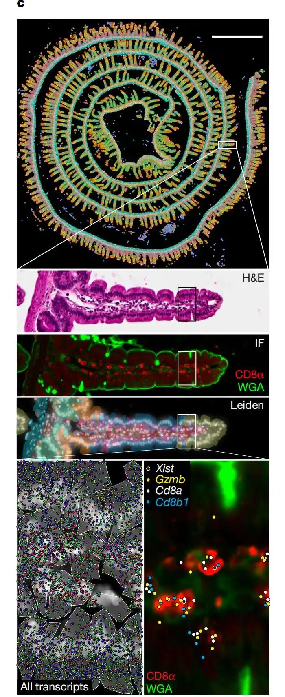
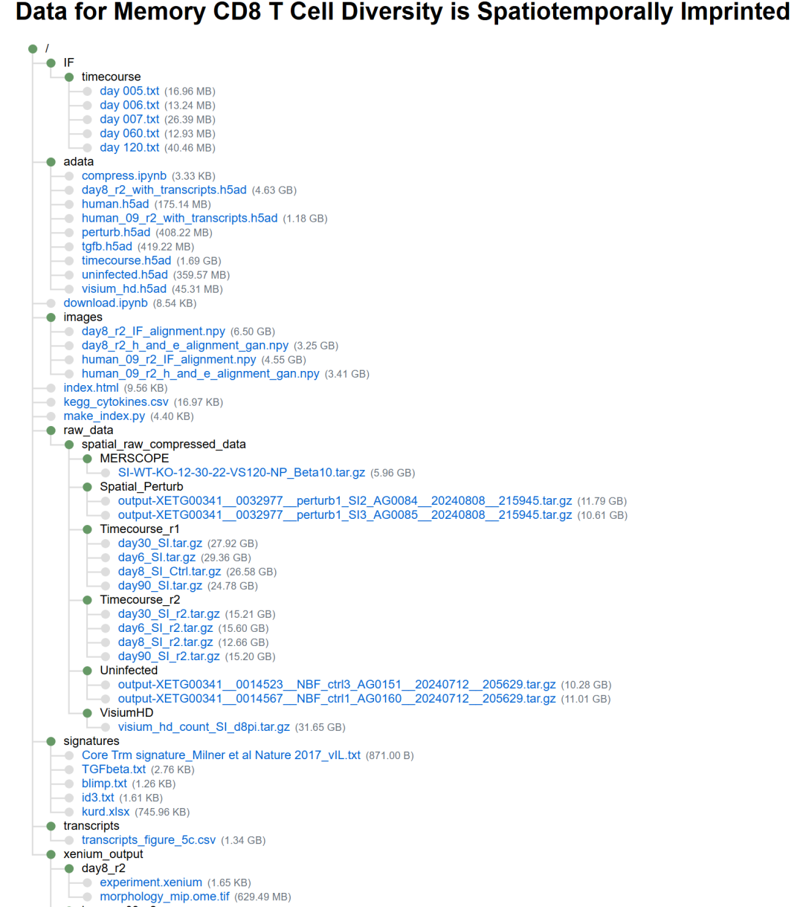
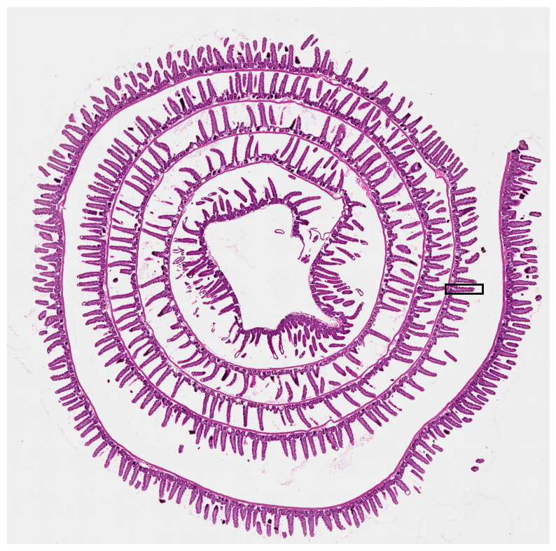
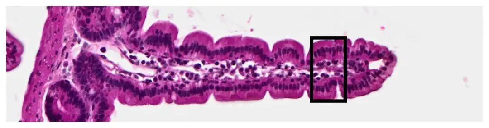
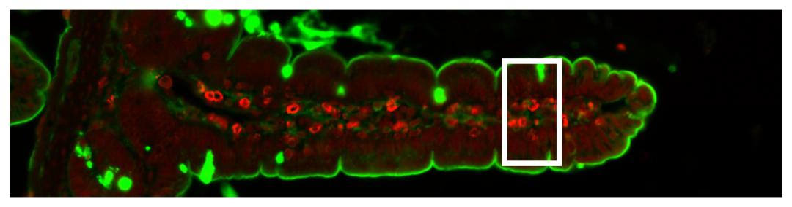
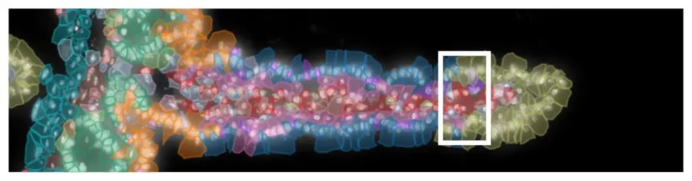

# 最新Nature杂志同款Xenium高精度HE图片绘制（文末有交流群）

- 专辑：绘图小技巧2026
- 公众号：生信技能树
- 发布时间：2026-01-05 23:33
- 原文：[微信公众平台](https://mp.weixin.qq.com/s?__biz=MzAxMDkxODM1Ng%3D%3D&mid=2247548303&idx=1&sn=591d8780ebc0c6d9cffe67d074729e90&chksm=9b4b7d34ac3cf4227c40e0eda81f47e77a9fce8b24663bf03e06dfc80c5c64521c36040571ea)

---
> 2026年啦，今年的绘图专辑准备玩点不一样的。最近看到了一篇超级棒的分析代码，2025 年1月22号发表在Nature杂志上的一篇文献，标题为《Tissue-resident memory CD8 T cell diversity is spatiotemporally imprinted》。

本图利用空间转录组学技术，对小鼠小肠（SI）中响应急性病毒感染的抗原特异性 CD8 T 细胞的空间及转录状态进行表征。

基于 Xenium 的空间转录组学数据结构概览：

- 第一行：小鼠肠道（感染后第8天）的 Xenium 输出，细胞按Leiden聚类着色；

- 第二行：显示 H&E 染色的绒毛放大图；

- 第三行：CD8α 和 WGA 的共聚焦免疫荧光图像；

- 第四行：Xenium DAPI 染色图，带有按 Leiden 聚类着色的细胞边界分割掩膜；

- 第五行：同一绒毛的进一步亚区域放大图，描绘了叠加细胞边界分割的 Xenium DAPI 染色以及分配给细胞的所有转录本（左图），以及叠加了 Cd8a、Cd8b、Gzmb 转录本位置和雌性P14特异性Xist转录本位置的CD8α和WGA免疫荧光图像（右图）。



图注：

> Fig. 1. Characterization of the spatial and transcriptional state of antigen-specific CD8 T cells in response to acute viral infection in the mouse SI with spatial transcriptomics.

## 代码和数据

如果下面的代码看起来有困难，来，直接跳到文章末尾进群学习交流！

作者给了非常详细的代码和数据。

**代码**：https://github.com/Goldrathlab/Spatial-TRM-paper

**原始数据**：

- GSE279254 (VisiumHD)

- GSE279255 (single-nucleus RNA-seq)

- GSE280895 (Xenium and MERSCOPE)

**处理好的数据**：https://2024-spatial-trm.data.heeg.io/



## 本次用到的数据：

**H&E图像文件**，通常是3通道RGB图像 (红、绿、蓝)：../data/images/day8_r2_h_and_e_alignment_gan.npy

**免疫荧光图像文件**，可能是单通道（特定标记物）或多通道（多个标记物组合）：../data/images/day8_r2_IF_alignment.npy

**10x Genomics Xenium平台输出的标准组织形态学图像文件**：./data/xenium_output/day8_r2/morphology_mip.ome.tif

Xenium平台输出的`transcripts.csv`文件经过预处理后的版本：../data/adata/day8_r2_with_transcripts.h5ad

## 环境配置

需要配置python环境，使用vscode运行：

```bash
# bash 命令
conda activate sc2
pip install alphashape -i https://mirrors.pku.edu.cn/pypi/web/simple
pip install opencv-python -i https://mirrors.pku.edu.cn/pypi/web/simple
pip install imagecodecs -i https://mirrors.pku.edu.cn/pypi/web/simple
```

然后加载模块：缺啥补啥

```python
# import libraries
import scanpy as sc
import pandas as pd
import numpy as np
import os
from tqdm.auto import tqdm
import alphashape
import geopandas as gpd
import imageio as io
import shapely.affinity as sa
import cv2
import json
import matplotlib.patches as patches
import matplotlib.pyplot as plt
from matplotlib.patches import Rectangle
import random
```

## 定义文件路径：

```python
# Create an adata "finalized_adata" that contains cells from Day 8 rep 2
experiment_name = "day8_SI_r2"
whole_adata = sc.read("../data/adata/timecourse.h5ad")
finalized_adata = whole_adata[whole_adata.obs.batch == experiment_name]

# the following has the transcripts saved. It is a temporary adata along the processing pipeline
path_to_adata_with_transcripts = "../data/adata/day8_r2_with_transcripts.h5ad"

# all h and e and IF are generated and saved
path_to_h_and_e = "../data/images/day8_r2_h_and_e_alignment_gan.npy"
path_to_if = "../data/images/day8_r2_IF_alignment.npy"

xenium_output_path = "../data/xenium_output/day8_r2"
```

## 定义读取数据的函数：

作者的习惯是放好提前定义的函数：

```python
def import_image(path: str):
    """
    Import the max projected DAPI staining from the provided xenium output folder

    Args:
        path (str): path to the xenium folder

    Returns:
        img (np.array): image as a numpy array
    """

    file = os.path.join(path, "morphology_mip.ome.tif")
    img = io.imread(file)
    return img


def get_pixel_size(path: str) -> float:
    """
    Get the pixel size for micron to pixel transform from the provided xenium output folder

    Args:
        path (str): path to the xenium folder

    Returns:
        pixel_size (float): pixel size in microns
    """
    file = open(os.path.join(path, "experiment.xenium"))
    experiment = json.load(file)
    pixel_size = experiment["pixel_size"]
    return pixel_size


def make_alphashape(points: pd.DataFrame, alpha: float):
    """
    Create a cell boundary with alpha shape from the provided points

    Args:
        points (pd.DataFrame): dataframe with columns "x" and "y" for the positions of the transcripts
        alpha (float): alpha value for the alpha shape

    Returns:
        shape (shapely.geometry.Polygon): alpha shape cell segmentation boundary
    """
    points = np.array(points)
    shape = alphashape.alphashape(points, alpha=alpha)
    return shape


# Function to generate a random color in RGB format
def random_color():
    """
    Generate a random color in RGB format

    Returns:
        color (str): color in RGB format
    """
    return"#{:02x}{:02x}{:02x}".format(
        random.randint(0, 255), random.randint(0, 255), random.randint(0, 255)
    )
```

## 读取文件：

包括： **DAPI, IF, and H&E images**

```python
print(xenium_output_path)
print(path_to_if)
print(path_to_h_and_e)

# load in H&E, DAPI, and IF images
# 加载H&E染色、DAPI染色和免疫荧光（IF）图像
# 使用自定义函数导入Xenium输出的DAPI最大投影图像
xenium_dapi = import_image(xenium_output_path) # ../data/xenium_output/day8_r2/morphology_mip.ome.tif

try:
    # 尝试加载免疫荧光（IF）图像
    IF_image = np.load(path_to_if) # "../data/images/day8_r2_IF_alignment.npy"
except:
    # 如果加载失败，使用DAPI图像作为替代，保持数据结构的完整性
    print("No IF for this experiment")
    IF_image = xenium_dapi

try:
    # 尝试加载H&E染色图像
    h_an_e = np.load(path_to_h_and_e) # "../data/images/day8_r2_h_and_e_alignment_gan.npy"
except:
    # 如果加载失败，使用DAPI图像作为替代，保持数据结构的完整性
    print("No H&E for this experiment")
    h_an_e = xenium_dapi
```

读取转录本数据：

```python
# Read in the adata holding the transcripts
transcripts = sc.read(path_to_adata_with_transcripts) # '../data/adata/day8_r2_with_transcripts.h5ad'
# 转录本空间坐标
points = transcripts.uns["points"]
```

提取转录本坐标：

```python
## save the different parts of the transcripts df for fast indexing
points_x = points.x.values
points_y = points.y.values
points_z = points.z.values
points_gene = points.gene.values
points_cell = points.cell.values
points_split_cell = points.split_cell.values
points["split_cell"] = points["split_cell"].values.astype(int)

# transform the transcript coordinates from microns to pixels
pixel_size = get_pixel_size(xenium_output_path)
transformed_x = points_x * (1 / pixel_size)
transformed_y = points_y * (1 / pixel_size)

# Downscaling the dapi overview by 50x (you can plot the thumbnail to figure out what region you want to zoom in on)

down_factor = 50

new_width = int(xenium_dapi.shape[1] / down_factor)
new_height = int(xenium_dapi.shape[0] / down_factor)

thumbnail = cv2.resize(xenium_dapi, (new_width, new_height))

min_y = 555
max_y = 600

min_x = 368
max_x = 379

# Get the transcripts falling in the box you created

min_x = min_x * down_factor
min_y = min_y * down_factor
max_x = max_x * down_factor
max_y = max_y * down_factor


subsetted_indices = np.where(
    (transformed_x > min_y)
    & (transformed_x < max_y)
    & (transformed_y > min_x)
    & (transformed_y < max_x)
)[0]

transcripts_df = pd.DataFrame(
    zip(
        transformed_x[subsetted_indices],
        transformed_y[subsetted_indices],
        points_gene[subsetted_indices],
        points_split_cell[subsetted_indices],
    ),
    index=points_cell[subsetted_indices],
    columns=["x", "y", "gene", "split_cell"],
)
```

## 绘制整个HE图片

```python
# Downsize by 4 to speed up plotting with minimal resolution loss
plot_down = 4

# Load in the H&E image
thumbnail = cv2.resize(
    h_an_e, (np.shape(h_an_e)[0] // plot_down, np.shape(h_an_e)[1] // plot_down)
)
# Define the RGB value for black
black_color = [0, 0, 0]

# Create a mask for black pixels
black_pixels = np.all(thumbnail[:, :, :3] == black_color, axis=-1)

# Replace black pixels with white
thumbnail[black_pixels] = [255, 255, 255]

# Plot the large H&E staining
plt.figure(figsize=(10, 10))
ax0 = plt.gca()
# 'thumbnail' is the image data
ax0.imshow(thumbnail)
ax0.set_xlim(300, np.shape(thumbnail)[1])
ax0.set_ylim(np.shape(thumbnail)[0], 400)

# Add a black rectangle
rectangle = Rectangle(
    (min_y // plot_down, min_x // plot_down),
    max_y // plot_down - min_y // plot_down,
    max_x // plot_down - min_x // plot_down,
    linewidth=2,
    edgecolor="black",
    facecolor="none",
)
ax0.add_patch(rectangle)
ax0.axis("off")
plt.show()
```



## 定义放大区域并绘制

```python
# Defining a second zoom in box coordinates
second_min_y = 1440
second_max_y = 1600

second_min_x = 150
second_max_x = 450

# Adjusting coordinates based on first window zoom
side1 = min_y + second_min_y
side2 = max_y - (max_y - (min_y + second_max_y))
side3 = second_min_x + min_x
side4 = max_x - (max_x - (second_max_x + min_x))

# Figuring out which coordinates of transcripts lie in the second box
subsetted_indices_second = np.where(
    (transformed_x > side1)
    & (transformed_x < side2)
    & (transformed_y > side3)
    & (transformed_y < side4)
)[0]

# Subsetting the transcripts df
transcripts_df_second = pd.DataFrame(
    zip(
        transformed_x[subsetted_indices_second],
        transformed_y[subsetted_indices_second],
        points_gene[subsetted_indices_second],
        points_split_cell[subsetted_indices_second],
    ),
    index=points_cell[subsetted_indices_second],
    columns=["x", "y", "gene", "split_cell"],
)

plt.figure(figsize=(10, 4), dpi=300)
ax3 = plt.gca()
img_cropped = h_an_e[min_x:max_x, min_y:max_y]
ax3.imshow(img_cropped)

# Add a black rectangle
rectangle = Rectangle(
    (second_min_y, second_min_x),
    second_max_y - second_min_y,
    second_max_x - second_min_x,
    linewidth=4,
    edgecolor="black",
    facecolor="none",
)
ax3.add_patch(rectangle)
ax3.axis("off")
plt.show()
```



## 绘制放大的IF图片

```python
plt.figure(figsize=(10, 4), dpi=300)
ax4 = plt.gca()

# Specify the IF channels that you want to plot
if_channels = [2, 1]

mapped_ims = []
for g in range(len(if_channels)):
    # Grab the current IF channel
    image = IF_image[min_x:max_x, min_y:max_y, if_channels[g]]
    min_val = np.min(image)
    max_val = np.max(image)

    normalized_image = (image - min_val) / (max_val - min_val)

    # If the channel is CD8A, perform a top hat and black hat transform
    if if_channels[g] == 2:
        kernel = cv2.getStructuringElement(cv2.MORPH_ELLIPSE, (30, 30))
        # Top Hat Transform
        topHat = cv2.morphologyEx(normalized_image, cv2.MORPH_TOPHAT, kernel)
        # Black Hat Transform
        blackHat = cv2.morphologyEx(normalized_image, cv2.MORPH_BLACKHAT, kernel)

        normalized_image = normalized_image + topHat - blackHat

        normalized_image = normalized_image * 2

    mapped_ims.append(normalized_image)

# Add a last blank channel
mapped_ims.append(
    np.zeros(np.shape(IF_image[min_x:max_x, min_y:max_y, if_channels[g]]))
)

full_im = np.dstack(mapped_ims)
ax4.imshow(full_im)

# Add a black rectangle
rectangle2 = Rectangle(
    (second_min_y, second_min_x),
    second_max_y - second_min_y,
    second_max_x - second_min_x,
    linewidth=4,
    edgecolor="white",
    facecolor="none",
)

ax4.add_patch(rectangle2)
ax4.axis("off")
plt.show()
```



## 绘制细胞分割边界

```python
plt.figure(figsize=(10, 4), dpi=300)
ax1 = plt.gca()

# Color cells by leiden
segmentation_face_color = "leiden"
inside_alpha = 0.34
outside_alpha = 0.34

# Add the key of facecolor of the cells to each transcript row
celltypes = []
ids = np.array([i.split("_")[-1] for i in finalized_adata.obs.index.values]).astype(int)
id_df = pd.DataFrame(
    zip(ids, finalized_adata.obs[segmentation_face_color].values),
    columns=["id", segmentation_face_color],
)
transcripts_with_obs = transcripts_df.merge(
    id_df, left_on="split_cell", right_on="id", how="left"
)
transcripts_with_obs = transcripts_with_obs.dropna(axis=0)

# Group transcripts by their Baysor assignment
print("Making Shapes")
gby = transcripts_with_obs[
    (transcripts_with_obs.split_cell != 0) & (transcripts_with_obs.split_cell != -1)
].groupby("split_cell")

# Create a cell segmentation boundary for each set of transcripts, and get the color of the mask
shapes = []
for group in tqdm(gby):
    shapes.append(make_alphashape(group[1][["x", "y"]].values, alpha=0.05))
    ctype = group[1][segmentation_face_color].values[0]
    cell_location = np.where(
        finalized_adata.obs[segmentation_face_color].cat.categories == ctype
    )[0]
    try:
        celltypes.append(
            finalized_adata.uns[f"{segmentation_face_color}_colors"][cell_location][0]
        )
    except:
        celltypes.append(
            finalized_adata.uns[f"{segmentation_face_color}_colors"][cell_location[0]]
        )
shapes = gpd.GeoSeries(shapes)
colors = celltypes

# Display the Xenium DAPI image
img_cropped = xenium_dapi[
    min_x:max_x, min_y:max_y
]  # [second_min_x:second_max_x, second_min_y:second_max_y]
ax1.imshow(img_cropped, vmax=np.percentile(img_cropped, 99.9), cmap="Greys_r")

# Create an empty GeoDataFrame to store adjusted polygons
adjusted_shapes = []

# Iterate through the shapes DataFrame and adjust each polygon
for original_polygon in shapes:
    scaled_polygon = sa.translate(original_polygon, -min_y, -min_x)
    adjusted_shapes.append(scaled_polygon)

adjusted_shapes = gpd.GeoSeries(adjusted_shapes)

for geometry, color in zip(adjusted_shapes, colors):
    if geometry.geom_type == "Polygon":
        patch = plt.Polygon(
            list(zip(*geometry.exterior.xy)),
            facecolor=color,
            edgecolor="none",
            alpha=inside_alpha,
            zorder=1,
        )
        ax1.add_patch(patch)
    elif geometry.geom_type == "MultiPolygon":
        for poly in geometry:
            patch = plt.Polygon(
                list(zip(*poly.exterior.xy)),
                facecolor=color,
                edgecolor="none",
                alpha=inside_alpha,
                zorder=1,
            )
            ax1.add_patch(patch)

# Plot polygon edges with edgecolor based on data values
for geometry, color in zip(adjusted_shapes, colors):
    if geometry.geom_type == "Polygon":
        ax1.plot(*geometry.exterior.xy, color=color, alpha=outside_alpha)
    elif geometry.geom_type == "MultiPolygon":
        for poly in geometry:
            ax1.plot(*poly.exterior.xy, color=color, alpha=outside_alpha)


rectangle2 = Rectangle(
    (second_min_y, second_min_x),
    second_max_y - second_min_y,
    second_max_x - second_min_x,
    linewidth=4,
    edgecolor="white",
    facecolor="none",
    zorder=2,
)
ax1.add_patch(rectangle2)
ax1.set_xlim(0, max_y - min_y)
ax1.set_ylim(0, max_x - min_x)
ax1.invert_yaxis()
# ax1.axis('equal')
ax1.axis("off")
plt.show()
```



上面的代码看起来困难吗？难就对了，我们搞了一个学习交流群，由新叶老师带领大家一起来学习！2026年，拿下！话不多说，直接上二维码：


**还是老规矩，因为微信自己的交流群限制，所以只能说前面的200个小伙伴可以扫码自助入群哈！**

**「但是如果上面的二维码无法进群」**，这个时候需要我们生信技能树的官方拉群小助手帮忙拉群哦！！！（免费，但是名额有限，500人，先到先得！！！另外，因为每次人数太多， 所以是**「工作日的每天上午十点准时拉群」**，其他时间不予回复，望见谅）


转发：

- [生信入门&数据挖掘线上直播课2026年1月班](https://mp.weixin.qq.com/s?__biz=MzAxMDkxODM1Ng%3D%3D&mid=2247547917&idx=1&sn=76afb50b6e9e433e3f2b3d039f72dac4#wechat_redirect)，你的生物信息学入门课

- [时隔5年，我们的生信技能树VIP学徒继续招生啦](https://mp.weixin.qq.com/s?__biz=MzAxMDkxODM1Ng%3D%3D&mid=2247525079&idx=1&sn=0b997af16a58195b4192691373048fd5#wechat_redirect)

- [满足你生信分析计算需求的低价解决方案](https://mp.weixin.qq.com/s?__biz=MzUzMTEwODk0Ng%3D%3D&mid=2247530048&idx=1&sn=28aa7bbd5e00521f79e074496a5f5d66#wechat_redirect)

- [生信故事会](https://mp.weixin.qq.com/mp/appmsgalbum?__biz=MzAxMDkxODM1Ng%3D%3D&action=getalbum&album_id=1679199708449144836#wechat_redirect)，来看看他们的生信入门故事

- [生信马拉松答疑专辑](https://mp.weixin.qq.com/mp/appmsgalbum?__biz=MzAxMDkxODM1Ng%3D%3D&action=getalbum&album_id=3690970204957147140#wechat_redirect)，获取你的生信专属答疑

<!-- wechat-article-fetcher: complete -->
