# 年度盘点之单细胞的各种花式UMAP图，你见过哪款？

- 专辑：绘图小技巧2026
- 公众号：生信技能树
- 发布时间：2026-01-06 00:36
- 原文：[微信公众平台](https://mp.weixin.qq.com/s?__biz=MzAxMDkxODM1Ng%3D%3D&mid=2247548356&idx=1&sn=374667b7351cff0b2a0dbd3881b114ae&chksm=9b4b7d7fac3cf4695669f65c8b798bd3287bdab1324ee056d147214a7358c9232c41f9691432)

---
> 从2025年第一天，到现在已经过去一年啦，时间如白驹过隙转瞬即逝，附一张当时疯狂上班的记录，绝对是第一名（那个时候充满干劲来着）：

#### 当时好像正在搞一个画热图的稿子：

#### 看看我们的专辑《绘图小技巧2025》：77篇，15.2w的阅读量！

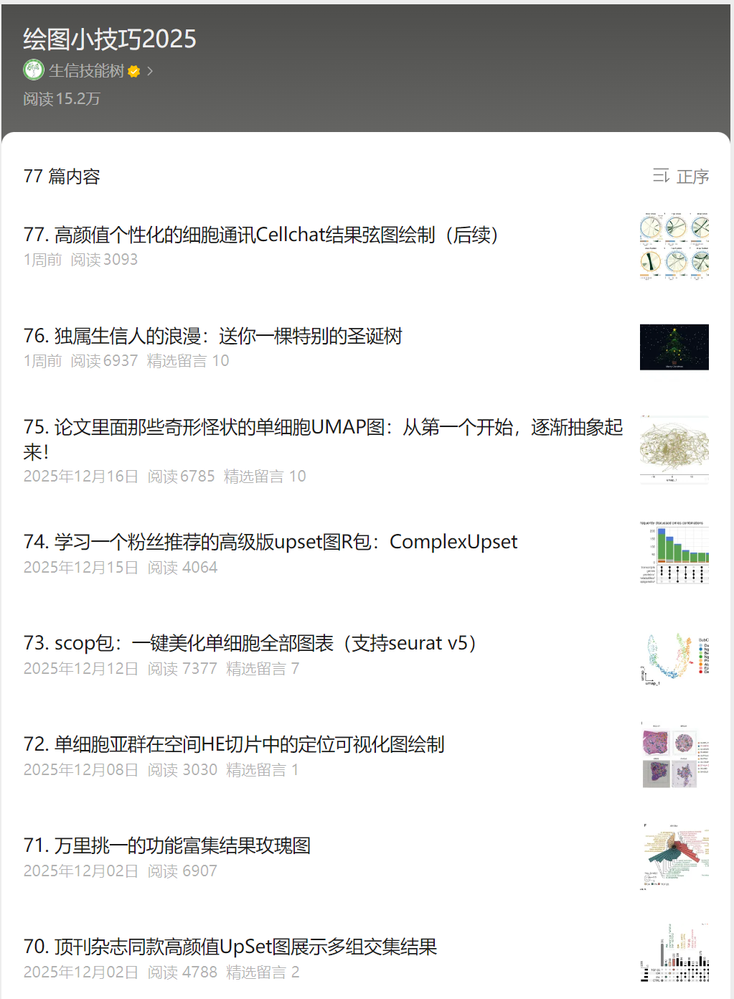

#### 本次盘一盘里面的单细胞UMAP图！

## 第一篇：五种选择

阅读量1.7万，详细链接：[5种方式美化你的单细胞umap散点图](https://mp.weixin.qq.com/s?__biz=MzAxMDkxODM1Ng%3D%3D&mid=2247536822&idx=1&sn=5f695d4ee6d8ba00a0961c02c4cf83bd#wechat_redirect)

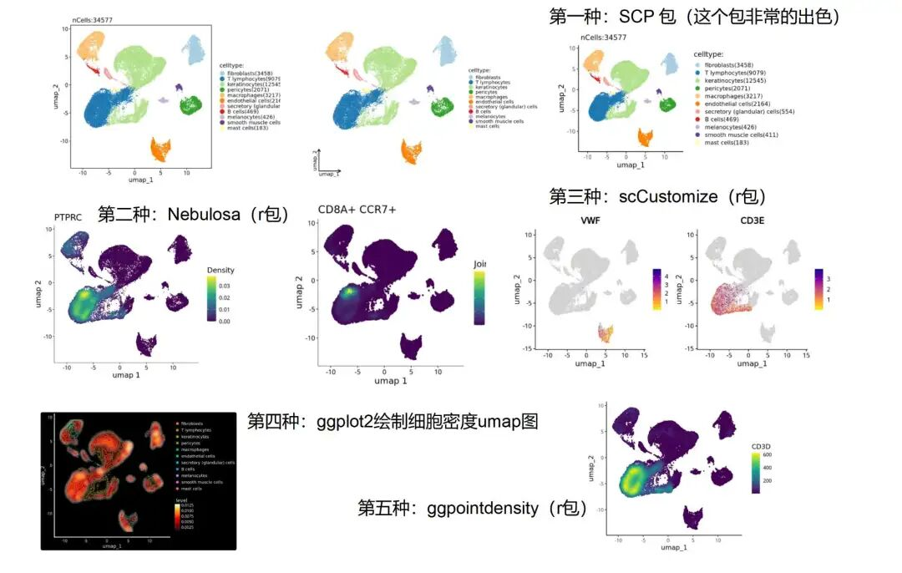

## 第二篇：加个圈圈

阅读量1.1万，详细链接：[给你的单细胞umap图加个cell杂志同款的圈](https://mp.weixin.qq.com/s?__biz=MzAxMDkxODM1Ng%3D%3D&mid=2247537290&idx=1&sn=ad76831349df67bb5236370dab088536#wechat_redirect)

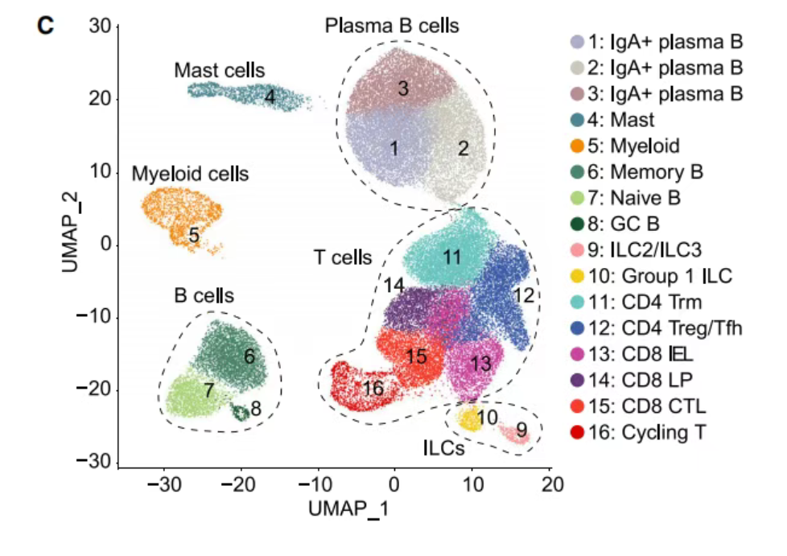

## 第三篇：星系UMAP图

阅读量5k+，详细链接：[画个同款新奇的“Galaxy”星系UMAP图（Nat Immunol：IF27.8）](https://mp.weixin.qq.com/s?__biz=MzAxMDkxODM1Ng%3D%3D&mid=2247538773&idx=1&sn=094b2cef83702267589de13dd50a0b58#wechat_redirect)

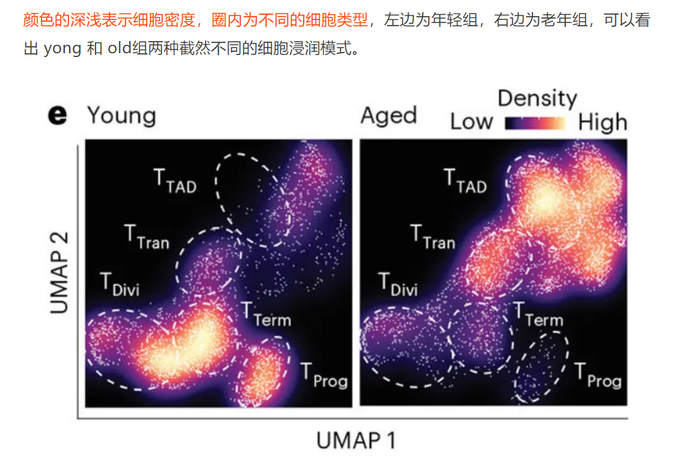

## 第四篇："辣椒粉"

阅读量6k+，详细链接：[展示你的特征基因：带"辣椒粉"的markers基因umap图](https://mp.weixin.qq.com/s?__biz=MzAxMDkxODM1Ng%3D%3D&mid=2247539400&idx=1&sn=ffa29d61d95453199ad6157d743403d7#wechat_redirect)

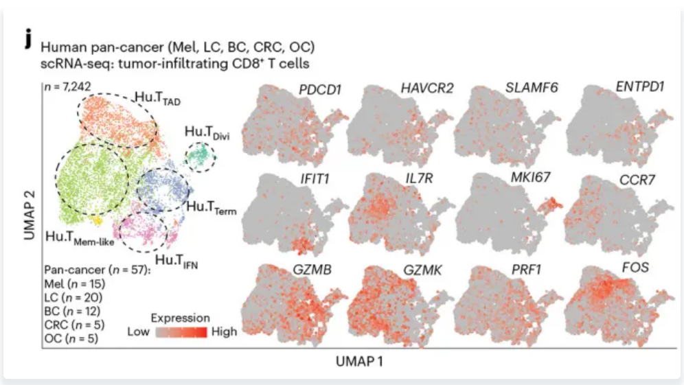

换个色系：

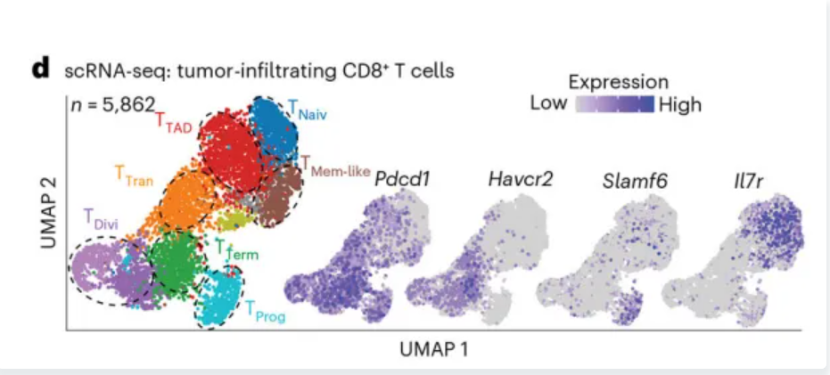

## 第五篇：signature score的umap

阅读量3k+，详细链接：[顶刊杂志同款CD8+ T cells亚群signature score的umap图绘制（IF=58.7）](https://mp.weixin.qq.com/s?__biz=MzAxMDkxODM1Ng%3D%3D&mid=2247543628&idx=1&sn=744ce66821f9501950c357b401ac9129#wechat_redirect)

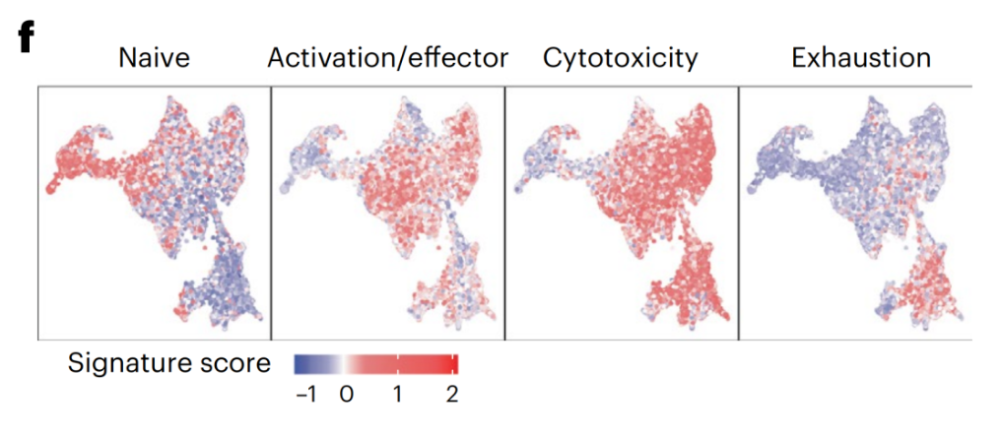

## 第六篇：”云雾感“ UMAP 图

阅读量1.8w，风靡全网，来自院士团队：[张泽民院士团队爱用的”云雾感“ UMAP 图](https://mp.weixin.qq.com/s?__biz=MzAxMDkxODM1Ng%3D%3D&mid=2247545487&idx=1&sn=497b176fdc10855214d36d2a00413be5#wechat_redirect)

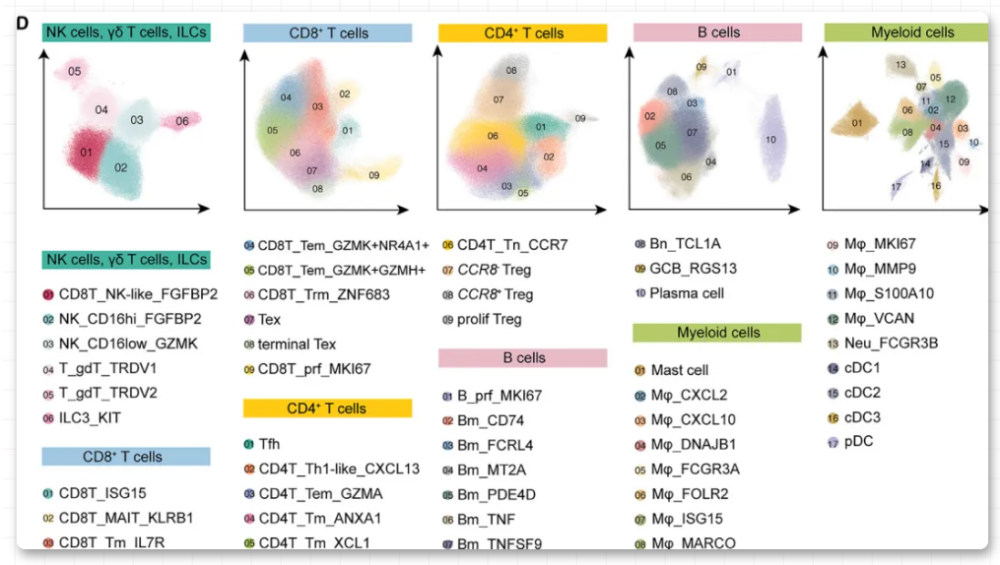

## 第七篇：星云+圈款UMAP图

阅读量3k+，将上面两种风格结合，详细链接：[Nature杂志同款高颜值单细胞星云+圈款UMAP图](https://mp.weixin.qq.com/s?__biz=MzAxMDkxODM1Ng%3D%3D&mid=2247545881&idx=1&sn=08f74aef7c233b8d4725408c628ece2d#wechat_redirect)

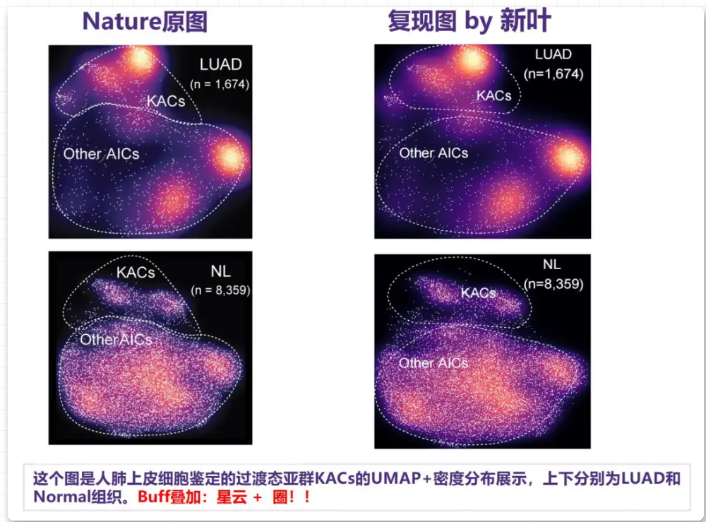

1

## 第八篇：小箭头坐标轴UMAP

阅读量5k+，还在为小箭头发愁吗，来看详细链接：[一行代码给你的单细胞UMAP图添加左下角小箭头坐标轴](https://mp.weixin.qq.com/s?__biz=MzAxMDkxODM1Ng%3D%3D&mid=2247546483&idx=1&sn=acea4ccfb046a373c767523ccc41a266#wechat_redirect)

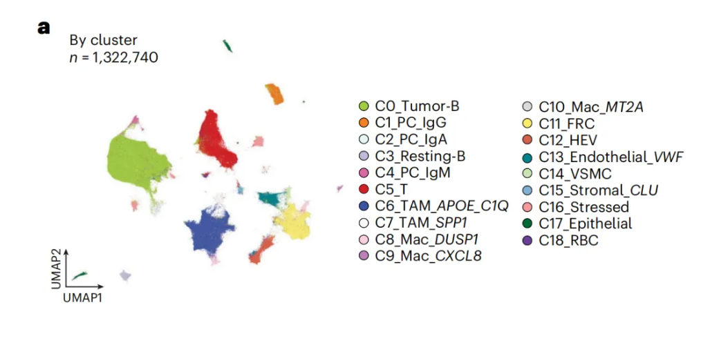

## 最后一篇：抽象UMAP

阅读量6k+，2025年最后一个月啦：[论文里面那些奇形怪状的单细胞UMAP图：从第一个开始，逐渐抽象起来！](https://mp.weixin.qq.com/s?__biz=MzAxMDkxODM1Ng%3D%3D&mid=2247547770&idx=1&sn=10ad80de61aee8e2d02677e9b660a5ee#wechat_redirect)

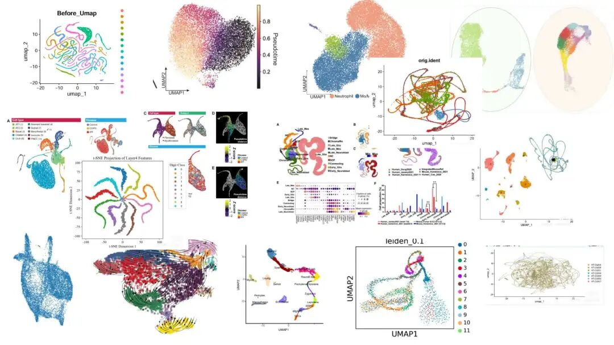

## 最后，新的开始

你肯定也发现了，我们的绘图专辑跟别人不一样，我们每次绘图，都有精心准备的数据预处理，展示绘图，更多的是展示绘图前的数据处理，以及每个图的应用，在文献中的解读！而不是单单的绘图！

2026年，新的绘图小技巧群，来吗？

这一次，我们直接免费，不收取任何费用：

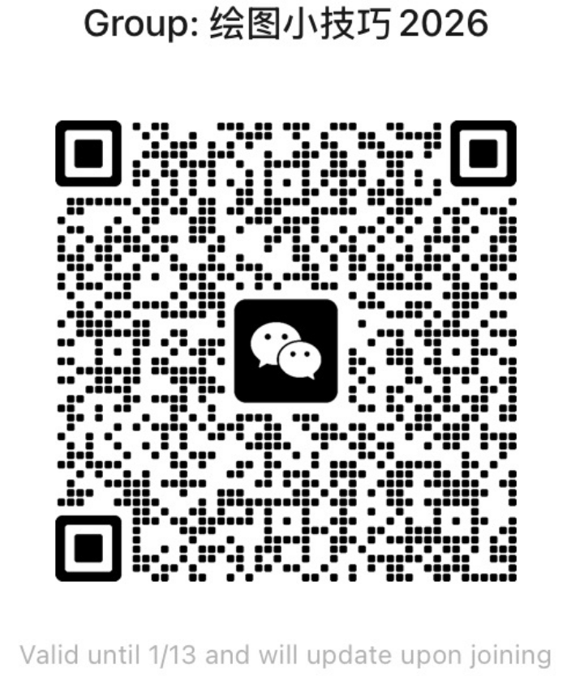

**还是老规矩，因为微信自己的交流群限制，所以只能说前面的200个小伙伴可以扫码自助入群哈！**

**「但是如果上面的二维码无法进群」**，这个时候需要我们生信技能树的官方拉群小助手帮忙拉群哦！！！（免费，但是名额有限，500人，先到先得！！！另外，因为每次人数太多， 所以是**「工作日的每天上午十点准时拉群」**，其他时间不予回复，望见谅）

转发：

- [生信入门&数据挖掘线上直播课2026年1月班](https://mp.weixin.qq.com/s?__biz=MzAxMDkxODM1Ng%3D%3D&mid=2247547917&idx=1&sn=76afb50b6e9e433e3f2b3d039f72dac4#wechat_redirect)，你的生物信息学入门课

- [时隔5年，我们的生信技能树VIP学徒继续招生啦](https://mp.weixin.qq.com/s?__biz=MzAxMDkxODM1Ng%3D%3D&mid=2247525079&idx=1&sn=0b997af16a58195b4192691373048fd5#wechat_redirect)

- [满足你生信分析计算需求的低价解决方案](https://mp.weixin.qq.com/s?__biz=MzUzMTEwODk0Ng%3D%3D&mid=2247530048&idx=1&sn=28aa7bbd5e00521f79e074496a5f5d66#wechat_redirect)

- [生信故事会](https://mp.weixin.qq.com/mp/appmsgalbum?__biz=MzAxMDkxODM1Ng%3D%3D&action=getalbum&album_id=1679199708449144836#wechat_redirect)，来看看他们的生信入门故事

- [生信马拉松答疑专辑](https://mp.weixin.qq.com/mp/appmsgalbum?__biz=MzAxMDkxODM1Ng%3D%3D&action=getalbum&album_id=3690970204957147140#wechat_redirect)，获取你的生信专属答疑

<!-- wechat-article-fetcher: complete -->
