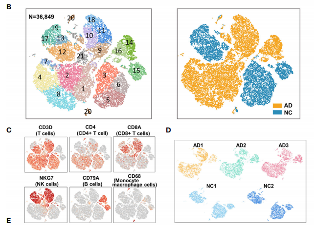
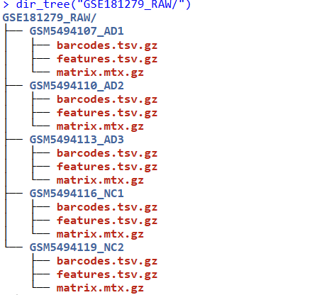
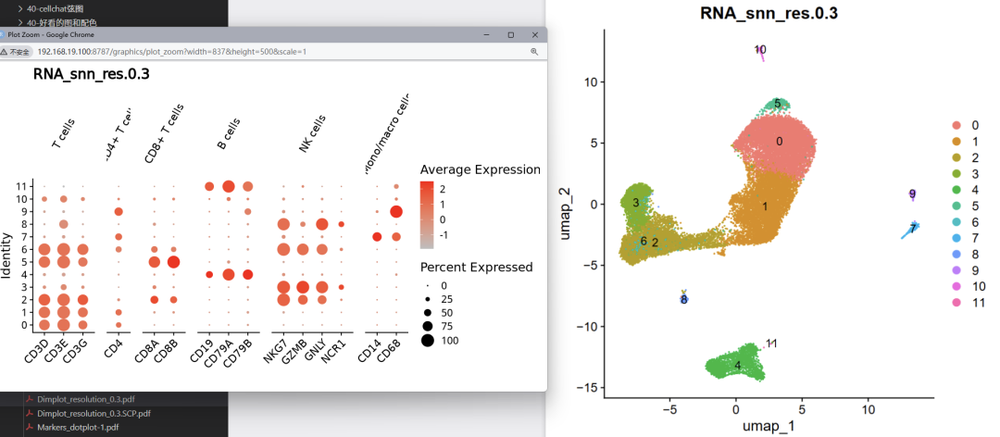
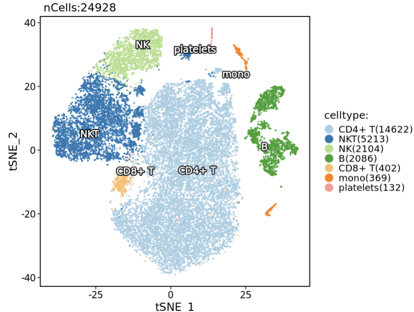
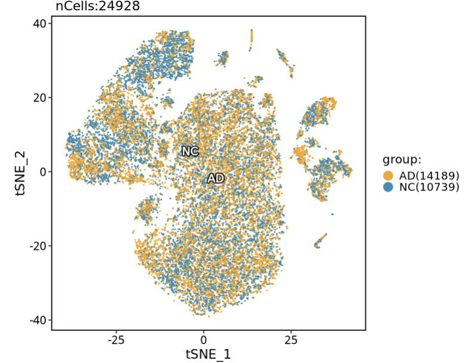
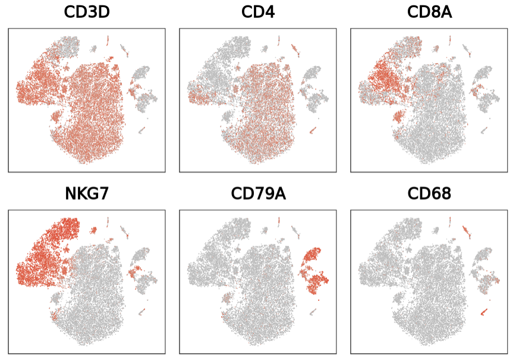
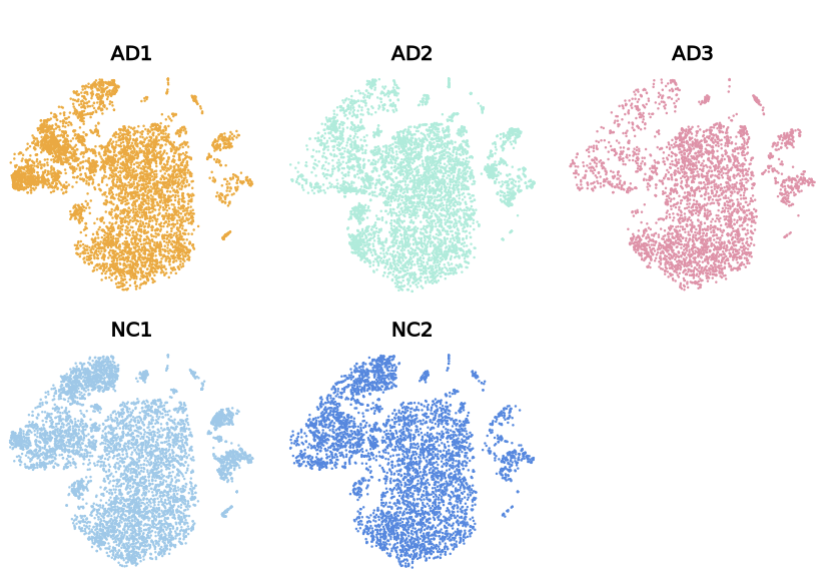
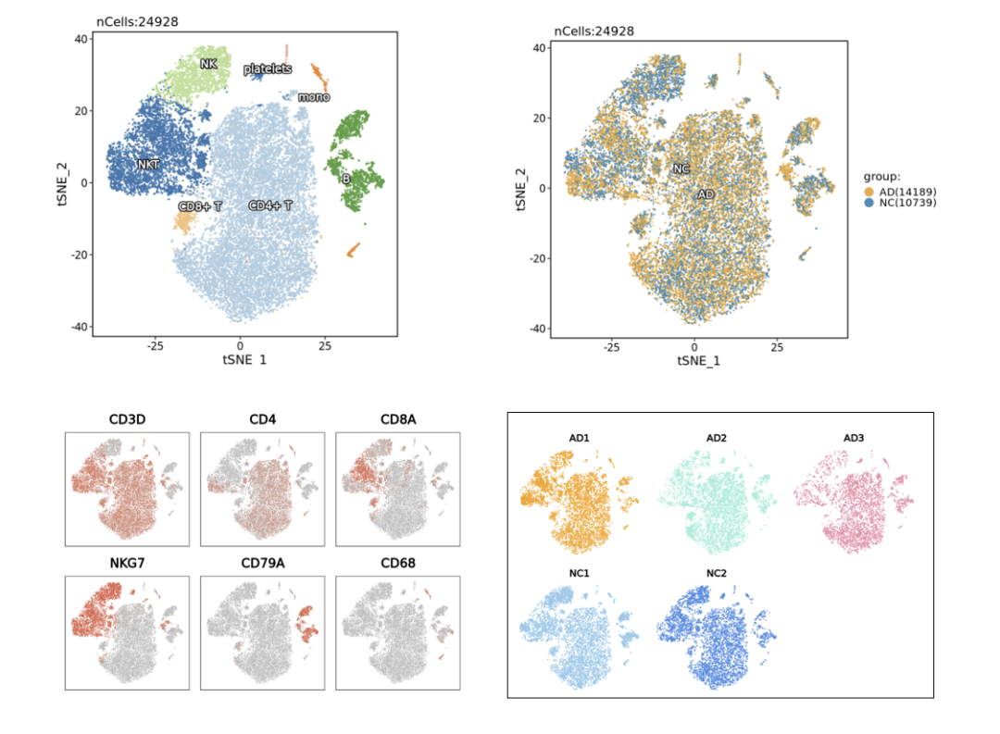

# 使用4个高颜值单细胞tsne图绘制你的Figure1

- 专辑：绘图小技巧2026
- 公众号：生信技能树
- 发布时间：2026-01-20 23:28
- 原文：[微信公众平台](https://mp.weixin.qq.com/s?__biz=MzAxMDkxODM1Ng%3D%3D&mid=2247548688&idx=1&sn=22f98098f25d008eec2cd1943580b3f7&chksm=9b4b7fabac3cf6bd3ea76128440fe21ab17678b339fdf2d47945c6aeb5dfcfb4eb4283f82bc5)

---
>
>
> 绘图专题继续，前面看文献收集了不少好看的图，今天学习一下 2021 年9月发表在 Front Immunol 上的文献：《Single-Cell RNA Sequencing of Peripheral Blood Reveals Immune Cell Signatures in Alzheimer’s Disease》。主要是文章中的一个 tsne 图挺好看的，颜色配置Nice，如下：

值得注意的是：作者并没有对此数据进行去整合批次，见第二列的两张图，AD 和 NC 组分别聚成了两个色块，没有融合在一起。个人觉得还是需要做整合的，毕竟 AD 虽然与 NC 存在一定的生物学差异，但是不可能改变具体的细胞类型比如 CD8 不管是在 AD 还是 NC 中肯定都是 CD8，不会变成其他细胞类型。



## 简单背景介绍

外周免疫系统被认为会影响阿尔茨海默病（Alzheimer’s disease，AD）的中枢神经系统病理。然而，目前的知识还不足以理解 AD 中外周免疫细胞的特征。本研究旨在探索外周免疫细胞的分子基础以及适应性免疫库在单细胞水平上的特征。作者通过 5' 单细胞转录组和免疫库测序，对具有淀粉样蛋白阳性状态的AD患者和正常对照组的 36,849 个外周血单个核细胞进行了分析。作者揭示了五种免疫细胞亚群：CD4+ T细胞、CD8+ T细胞、B细胞、自然杀伤细胞和单核-巨噬细胞，并解析了 AD 中细胞亚群比例和基因表达模式的特征性变化。

样本类型：

>
>
> 36,849 peripheral blood mononuclear cells from AD patients with amyloid-positive status and normal controls

## 数据介绍

数据有5个样本，3个 AD，2个正常对照。数据上传到了GEO数据库中：GSE181279。

文献中的 tsne 主要采用了 Cloupe 软件进行的分析，我们这里用 Seurat 分析好了。

### 数据预处理

首先去GEO将数据下载下来并解压：

```r
rm(list=ls())
## 数据下载
# 下载raw文件夹
# https://mp.weixin.qq.com/s/uEso7yRZB300MnMhSpXH_Q
library(stringr)
library(GEOquery)
# filter_regex: 指定下载的
# fetch_files = F, 返回下载链接
getGEOSuppFiles(GEO = "GSE181279",fetch_files = F)[,2]


# 解压缩获取数据
# 一般下载下来的都是tar结尾的压缩文件
setwd("GSE181279/")
untar("GSE181279_RAW.tar",exdir = "GSE181279_RAW/")
list.files("GSE181279_RAW/")
getwd()
```

现在一键整理为每个样本一个文件夹：

```r
# 列出所有文件
files <- list.files("GSE181279_RAW/",full.names = T,pattern = "gz$")
files

# 遍历文件并移动到对应的样本文件夹
for (file in files) {
# 提取样本名
# file <- files[2]
  sample_name <- gsub("_barcodes.tsv.gz|_genes.tsv.gz|_features.tsv.gz|_matrix.mtx.gz","", basename(file))
# 创建样本文件夹（如果不存在）
  sample_folder <- file.path("GSE181279_RAW/", sample_name)
if (!dir.exists(sample_folder)) {
    dir.create(sample_folder, showWarnings = FALSE)
  }
# 移动文件到对应的样本文件夹
  target_file <- file.path(sample_folder, gsub(paste0(sample_name,"_"),"", basename(file), fixed = T) )
# 修改 genes.tsv.gz 为 features.tsv.gz
if(grepl("genes.tsv.gz",target_file)) {
    target_file <- gsub("genes.tsv.gz","features.tsv.gz", target_file)
  }
  file.rename(file, target_file)
}
library(fs)
dir_tree("GSE181279_RAW/")
```



### 细胞注释

文章中主要注释到了5个细胞亚群，使用的marker如下：

- CD4+ T cells：CD3D, CD3E, CD3G, and CD4

- CD8+ T cells：CD3D, CD3E, CD3G, CD8A, and CD8B

- B cells：CD19, CD79A, and CD79B

- natural killer (NK) cells：NKG7, GZMB, GNLY, and NCR1

- monocyte–macrophage cells：CD14 and CD68

过滤红细胞与血小板细胞亚群marker：hemoglobin and platelets HBB, HBA2, PF4, and PPBP



注释好的，文件见：

https://pan.baidu.com/s/1IYaKCa106MNT2sJalI-ZMQ?pwd=43hn

## 开始绘图

#### 先来绘制第一个子图：

```r
rm(list=ls())
library(Seurat)
library(SCP)
# library(scop)
library(scales)
library(scCustomize)
library(scRNAtoolVis)


###### step4:  看标记基因库 ######
# 原则上分辨率是需要自己肉眼判断，取决于个人经验
# 为了省力，我们直接看  0.1和0.8即可
sce.all.filt <- readRDS("3-check-by-0.3/sce.Rds")
sce.all.filt
sce.all.filt$sample <- str_split(sce.all.filt$orig.ident,simplify = T, pattern = "_")[,2]
table(Idents(sce.all.filt))
head(sce.all.filt@meta.data)

# 美化版
# by celltype
p1 <- CellDimPlot(sce.all.filt, group.by = "celltype", reduction = "TSNE", label = T,
                  label.size = 4, label_repel = T, label_insitu = T,pt.size = 0.2,
                 label_point_size = 1, label_point_color =NA ,label_segment_color = NA)
p1
```



#### 子图2：

```r
# by group
color <- c("#f6a520","#2b8cb7")
p2 <- CellDimPlot(sce.all.filt, group.by = "group", reduction = "TSNE", label = T,palcolor = color,
                  label.size = 4, label_repel = T, label_insitu = T,
                  label_point_size = 1, label_point_color =NA ,label_segment_color = NA)
p2
```



我这里做了去批次，所以这两个分组会融合在一起。

#### 子图3：

```r
# marker基因
gene <- c("CD3D","CD4","CD8A","NKG7","CD79A","CD68")
# # scRNAtoolVis
# p3 <- scRNAtoolVis::featurePlot(sce.all.filt, genes = gene, dim = "tsne",ncol = 3)
# p3
# scCustomize
p3 <- FeaturePlot_scCustom( seurat_object= sce.all.filt,order = T, features = gene,pt.size = 0.25,stroke.size=0.1,
                            num_columns = 3,reduction = "tsne") &
  scale_color_gradient(low = "grey", high = "#f32a1f") &
  NoLegend() &
  theme(
    panel.grid = element_blank(),
    panel.background = element_rect(fill = NA, colour = "black", linewidth = 0.5),
    plot.background = element_blank(),
    axis.line = element_line(colour = "black", linewidth = 0.1),
    # 移除坐标轴刻度和标签
    axis.text = element_blank(),    # 刻度标签
    axis.title = element_blank(),   # 坐标轴标题
    axis.ticks = element_blank()   # 刻度线
  )
p3
```



#### 子图4：

```r
p4 <- DimPlot(sce.all.filt,group.by = "sample",split.by = "sample",stroke.size=0.4,
              cols = c("#f6a520","#9fedda","#eb8ea8","#93caeb","#4489e5"),
              reduction = "tsne",ncol = 3,combine = T) +
  NoLegend() +
  ggtitle(label = "") +
  theme(
    panel.grid = element_blank(),
    # panel.background = element_rect(fill = NA, colour = "black", linewidth = 0.5),
    plot.background = element_blank(),
    axis.line = element_line(colour = "black", linewidth = 0),
    # 移除坐标轴刻度和标签
    axis.text = element_blank(),    # 刻度标签
    axis.title = element_blank(),   # 坐标轴标题
    axis.ticks = element_blank()   # 刻度线
  )
p4
```



#### 最后拼在一起，效果如下：



今天分享到这里，如果对你有帮助，求一键三连！

转发：

- [生信入门&数据挖掘线上直播课2026年1月班](https://mp.weixin.qq.com/s?__biz=MzAxMDkxODM1Ng%3D%3D&mid=2247547917&idx=1&sn=76afb50b6e9e433e3f2b3d039f72dac4#wechat_redirect)，你的生物信息学入门课

- [时隔5年，我们的生信技能树VIP学徒继续招生啦](https://mp.weixin.qq.com/s?__biz=MzAxMDkxODM1Ng%3D%3D&mid=2247525079&idx=1&sn=0b997af16a58195b4192691373048fd5#wechat_redirect)

- [满足你生信分析计算需求的低价解决方案](https://mp.weixin.qq.com/s?__biz=MzUzMTEwODk0Ng%3D%3D&mid=2247530048&idx=1&sn=28aa7bbd5e00521f79e074496a5f5d66#wechat_redirect)

- [生信故事会](https://mp.weixin.qq.com/mp/appmsgalbum?__biz=MzAxMDkxODM1Ng%3D%3D&action=getalbum&album_id=1679199708449144836#wechat_redirect)，来看看他们的生信入门故事

- [生信马拉松答疑专辑](https://mp.weixin.qq.com/mp/appmsgalbum?__biz=MzAxMDkxODM1Ng%3D%3D&action=getalbum&album_id=3690970204957147140#wechat_redirect)，获取你的生信专属答疑

<!-- wechat-article-fetcher: complete -->
