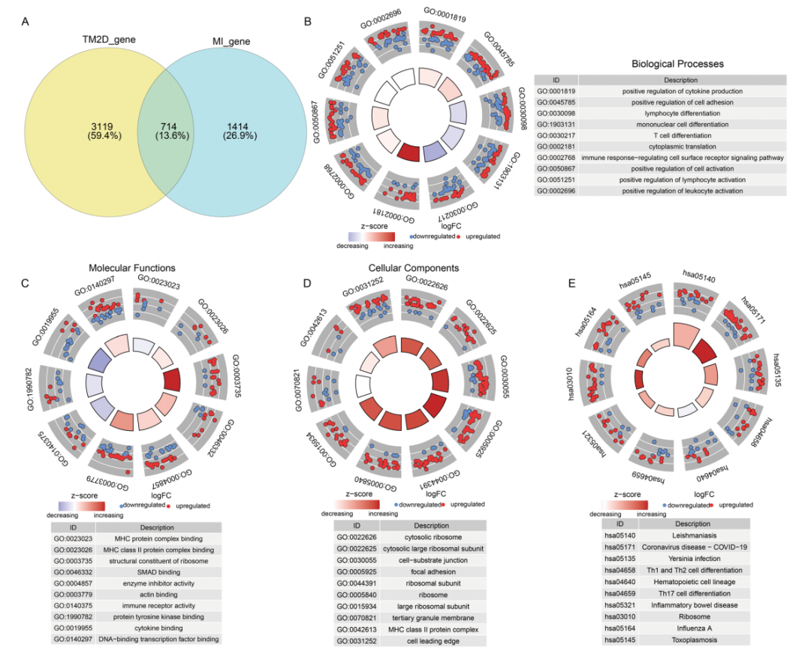
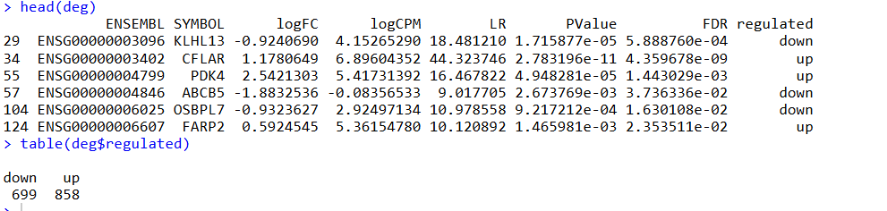
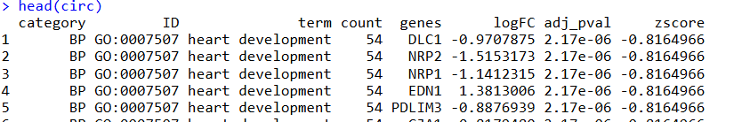
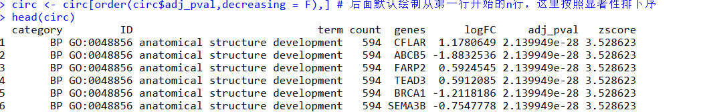
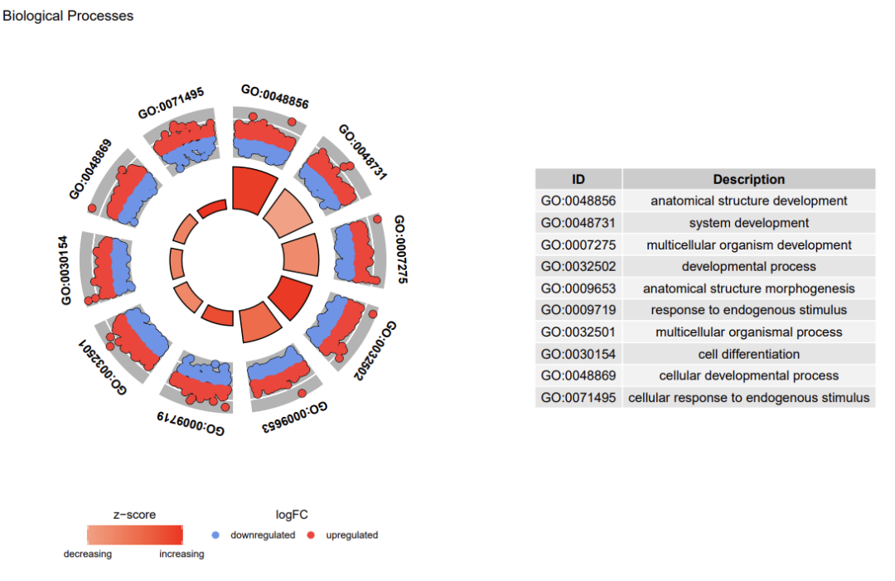
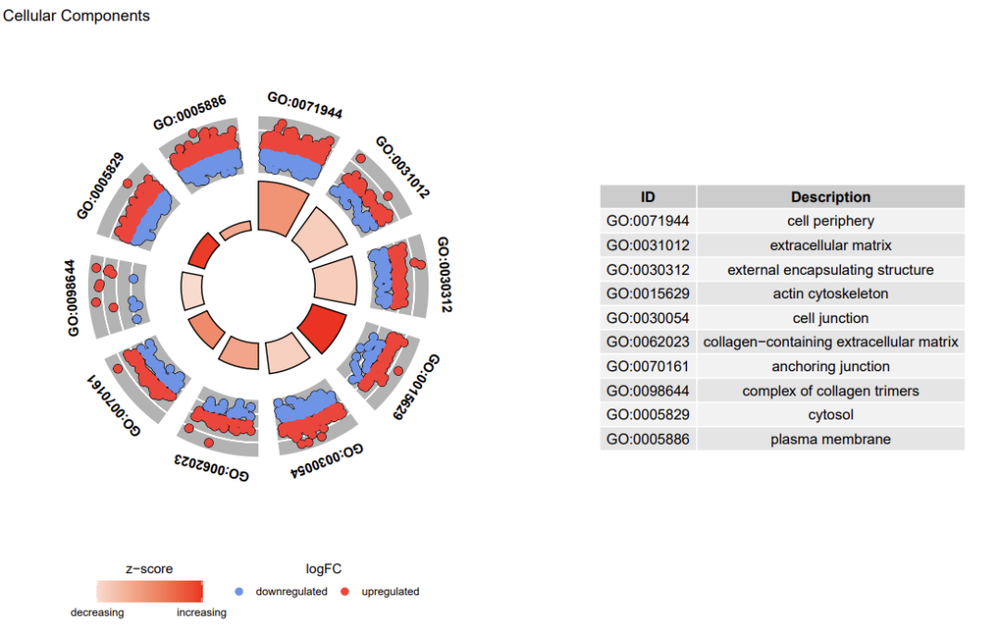
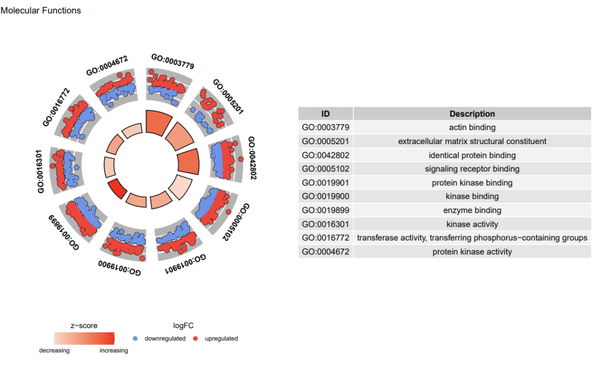
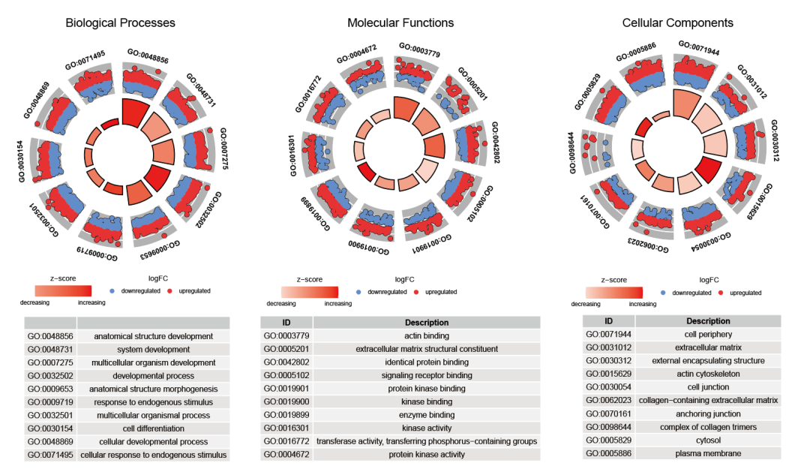

# 富集分析结果展示还有什么花样可以用呢？

- 专辑：绘图小技巧2026
- 公众号：生信技能树
- 发布时间：2026-02-02 21:41
- 原文：[微信公众平台](https://mp.weixin.qq.com/s?__biz=MzAxMDkxODM1Ng%3D%3D&mid=2247549084&idx=1&sn=aaa7593d7e5a0ec91e82ea66bfad42b9&chksm=9b4b4027ac3cc931b3b4ce7bef6284b07afe30ec9dd0289489ed5fa4a5acbc94e285658c0d01)

---
>
>
> 收到我们生信入门学习班一个学员发来的图，问能不能画一个给他。那必须可以啊！（我们的学员福利就是这么好！）图来自数据挖掘类的文献《Identification of comorbid genes between type 2 diabetes and migraine through peripheral blood single-cell and Mendelian randomization analysis》，是一个展示功能富集结果的圈图。图如下：

0基础入门班：[生信入门&数据挖掘线上直播课2026年1月班](https://mp.weixin.qq.com/s?__biz=MzAxMDkxODM1Ng%3D%3D&mid=2247547917&idx=1&sn=76afb50b6e9e433e3f2b3d039f72dac4#wechat_redirect)（年后会有最新一期，可以先来玩~）

下面B-D展示的是A图中714个交集基因的GO数据库ORA功能富集分析结果，E图是KEGG Pathway的富集结果。每个圈图的含义：

- 外圈以散点图形式展示各 Term/Pathway 对应基因的logFC。默认设置中，红色圆点代表表达上调，蓝色圆点代表表达下调。

- 中间的内圈为柱状图，每个柱子表示一个功能Term/Pathway，颜色表示 z-score。

- z-score 提示生物过程（或分子功能/细胞组分）更可能减弱（负值）还是增强（正值）。其计算方法如下：up上调基因数，down下调基因数，count为通路中的差异基因数。


图注：Fig. 3 Identification of candidate genes. A Identification of candidate genes. B-D GO enrichment analysis. E KEGG enrichment analysis

## 示例数据

文献中的图使用了两个单细胞数据 GSE280401_T2DM 和 GSE269117_migraine，分别分析了每种亚群在实验组和对照组中的差异基因，然后所有亚群差异基因取并集得到 T2DM基因和migraine基因，上面的A图，然后对这两种基因取交集做的功能富集分析。

但是文献这里的基因表格都没有给出来（为什么这么重要的结果却没有提供表格呢？有点匪夷所思。）

那我这里就随便用一组差异基因的结果吧。可下载： 链接 https://pan.baidu.com/s/1I6AvQ9GzS9hH3fQ1cJ5T9g?pwd=da26

读取数据：

```r
rm(list=ls())
library(GOplot)
library(clusterProfiler) #功能富集分析包，统计学原理累计超几何分布
library(org.Hs.eg.db) # 数据包，做基因ID转换，是物种特异性包Hs表示人
library(GSEABase) # 读取gmt格式数据
library(ggplot2)
library(tidyverse)

# 导入差异基因
# 这里随便导入的一个
load("edgeR_nrDEG.Rdata")
head(DEG_edgeR_symbol)

deg <- DEG_edgeR_symbol[DEG_edgeR_symbol$regulated!="normal",]
head(deg)
table(deg$regulated)
```



## 做一下功能富集分析

这里使用 clusterProfiler 包做GO, KEGG Pathway数据库的功能富集分析：

```r
# 做一下GO与KEGG Pathway富集
# ont="ALL"，一次性分析上面三个本体论
ego_CC <- enrichGO(gene=deg$SYMBOL, OrgDb= 'org.Hs.eg.db', keyType='SYMBOL', ont="CC", pvalueCutoff= 1,qvalueCutoff= 1,
                   minGSSize = 1, maxGSSize = 10000)
ego_MF <- enrichGO(gene=deg$SYMBOL, OrgDb= 'org.Hs.eg.db', keyType='SYMBOL', ont="MF", pvalueCutoff= 1,qvalueCutoff= 1,
                   minGSSize = 1, maxGSSize = 10000)
ego_BP <- enrichGO(gene=deg$SYMBOL, OrgDb= 'org.Hs.eg.db', keyType='SYMBOL', ont="BP", pvalueCutoff= 1,qvalueCutoff= 1,
                   minGSSize = 1, maxGSSize = 10000)
head(ego_BP[,1:6])


options(timeout = 99999)
# 三种方法解决KEGG功能富集总是出现的断网报错：cannot read from connection
# https://mp.weixin.qq.com/s/W4qIj7Q2kvDndJpxUmsrrQ
genelist <- bitr(gene=deg$SYMBOL, fromType="SYMBOL", toType="ENTREZID", OrgDb='org.Hs.eg.db')
head(genelist)
ekegg <- enrichKEGG(gene = genelist$ENTREZID, organism = 'hsa', pvalueCutoff = 1, qvalueCutoff = 1,
                    minGSSize = 1, maxGSSize = 10000)
```

到这里 结果已经初步准备好，开始画图。

## 绘制圈图

使用GOplot这个R包中的函数GOCircle绘制，先看下数据输入要求。需要下面这几列：

1.  category：功能通路类别

2.  ID：通路ID

3.  term：通路名字

4.  count：通路中的差异基因数

5.  gene：通路中的基因

6.  logFC：差异结果的logFC值

7.  adj_pval：差异基因的显著性fdr

8.  zscore：开头给的zscore



根据我们前面的数据，整理成这种格式，以GO BP结果为准：

```r
# Generate the plotting object
deg_input <- deg[, c("SYMBOL","logFC")]
colnames(deg_input) <- c("ID","logFC")
colnames(ego_BP@result)
ego_BP_input <- cbind("BP",ego_BP@result[,c("ID","Description","geneID","p.adjust")])
colnames(ego_BP_input) <- c("Category","ID","Term","Genes","adj_pval")
ego_BP_input$Genes <- gsub("/",",",ego_BP_input$Genes)
circ <- circle_dat(ego_BP_input, deg_input)
circ <- circ[order(circ$adj_pval,decreasing = F),] # 后面默认绘制从第一行开始的n行，这里按照显著性排下序
head(circ)
```



#### 绘图

```r
# Generate a circular visualization of the results of gene- annotation enrichment analysis
GOCircle(circ,nsub = 10, title = "Biological Processes",label.size=4,rad1 = 2,rad2 = 3)
```



#### 同理绘制 CC， MF：

```r
ego_CC_input <- cbind("CC",ego_CC@result[,c("ID","Description","geneID","p.adjust")])
colnames(ego_CC_input) <- c("Category","ID","Term","Genes","adj_pval")
ego_CC_input$Genes <- gsub("/",",",ego_CC_input$Genes)
circ <- circle_dat(ego_CC_input, deg_input)
circ <- circ[order(circ$adj_pval,decreasing = F),] # 后面默认绘制从第一行开始的n行，这里按照显著性排下序
head(circ)
pdf(file = "CC.pdf",height = 8,width = 12)
GOCircle(circ,nsub = 10, title = "Cellular Components",label.size=4,rad1 = 2,rad2 = 3)
dev.off()
```



MF：

```r
ego_MF_input <- cbind("MF",ego_MF@result[,c("ID","Description","geneID","p.adjust")])
colnames(ego_MF_input) <- c("Category","ID","Term","Genes","adj_pval")
ego_MF_input$Genes <- gsub("/",",",ego_MF_input$Genes)
circ <- circle_dat(ego_MF_input, deg_input)
circ <- circ[order(circ$adj_pval,decreasing = F),] # 后面默认绘制从第一行开始的n行，这里按照显著性排下序
head(circ)
pdf(file = "MF.pdf",height = 8,width = 12)
GOCircle(circ,nsub = 10, title = "Molecular Functions",label.size=4,rad1 = 2,rad2 = 3)
dev.off()
```



#### 最后将三张图拼在一起

使用的软件为 AI，我现在细节调整发现还是这个好用啊，哈哈哈哈哈。


拼好的结果如下：



完美！

今天分享到这里~

如果上面的内容对你有用，欢迎一键三连~

转发：

- [生信入门&数据挖掘线上直播课2026年1月班](https://mp.weixin.qq.com/s?__biz=MzAxMDkxODM1Ng%3D%3D&mid=2247547917&idx=1&sn=76afb50b6e9e433e3f2b3d039f72dac4#wechat_redirect)，你的生物信息学入门课

- [时隔5年，我们的生信技能树VIP学徒继续招生啦](https://mp.weixin.qq.com/s?__biz=MzAxMDkxODM1Ng%3D%3D&mid=2247525079&idx=1&sn=0b997af16a58195b4192691373048fd5#wechat_redirect)

- [满足你生信分析计算需求的低价解决方案](https://mp.weixin.qq.com/s?__biz=MzUzMTEwODk0Ng%3D%3D&mid=2247530048&idx=1&sn=28aa7bbd5e00521f79e074496a5f5d66#wechat_redirect)

- [生信故事会](https://mp.weixin.qq.com/mp/appmsgalbum?__biz=MzAxMDkxODM1Ng%3D%3D&action=getalbum&album_id=1679199708449144836#wechat_redirect)，来看看他们的生信入门故事

- [生信马拉松答疑专辑](https://mp.weixin.qq.com/mp/appmsgalbum?__biz=MzAxMDkxODM1Ng%3D%3D&action=getalbum&album_id=3690970204957147140#wechat_redirect)，获取你的生信专属答疑

<!-- wechat-article-fetcher: complete -->
