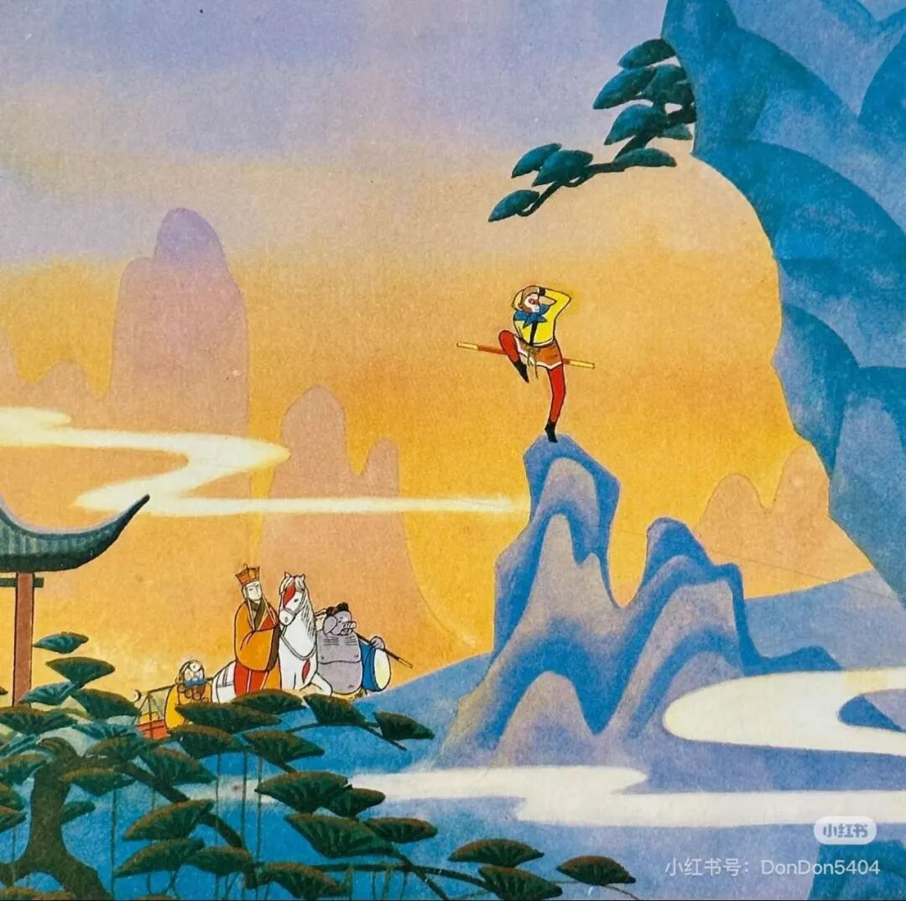
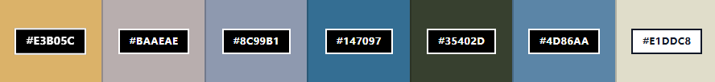
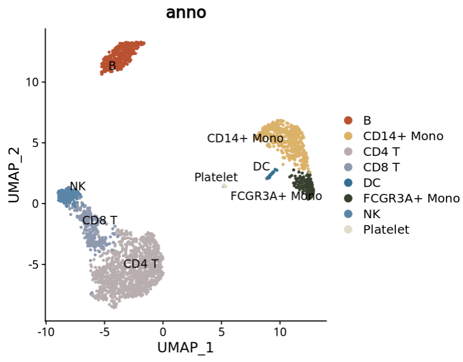
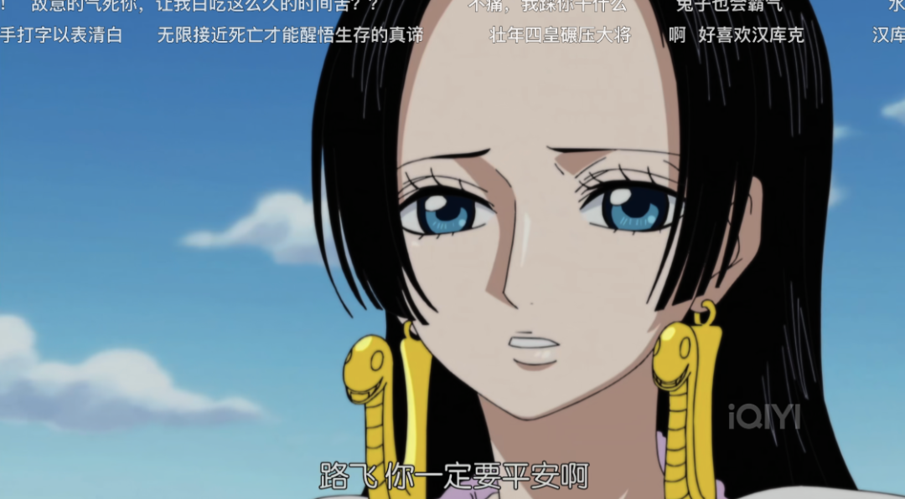
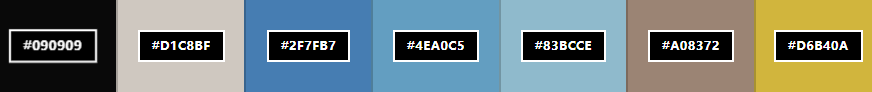
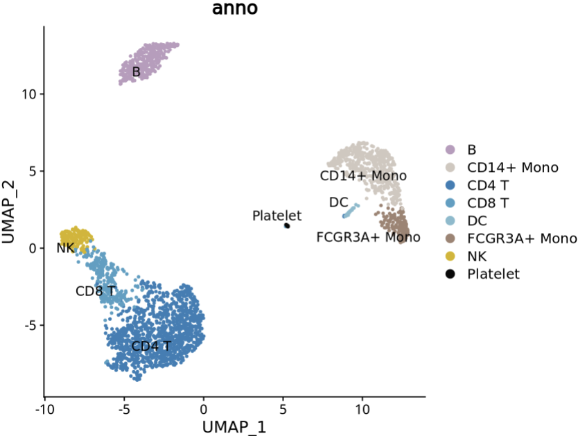
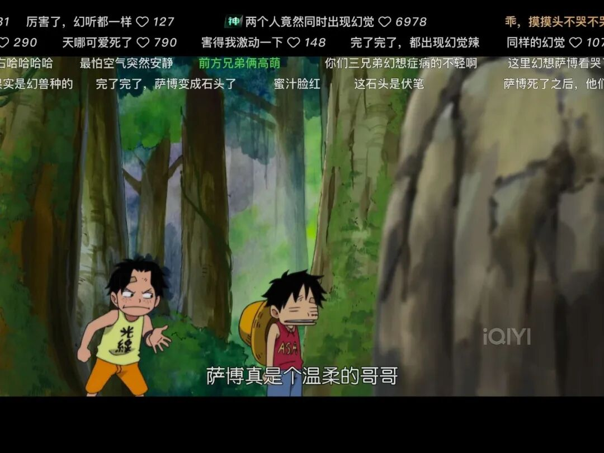
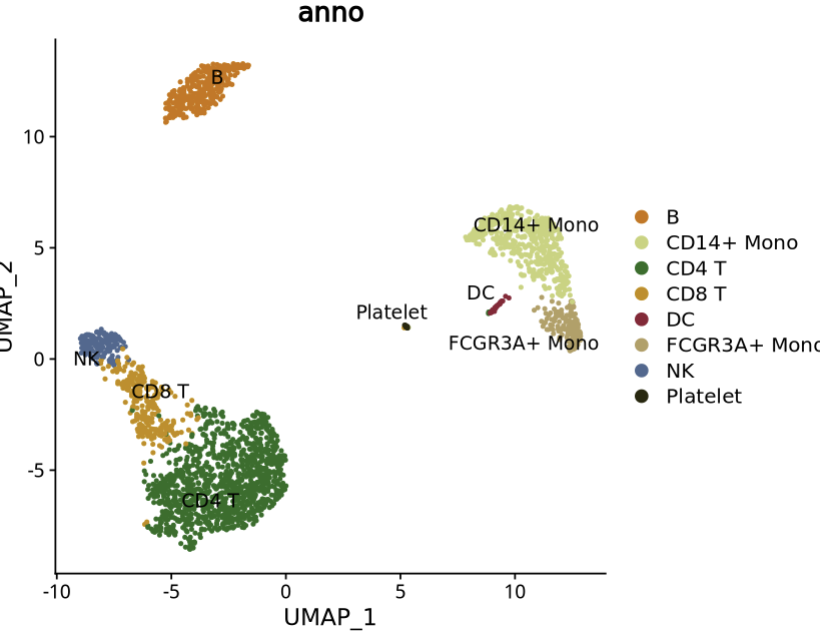
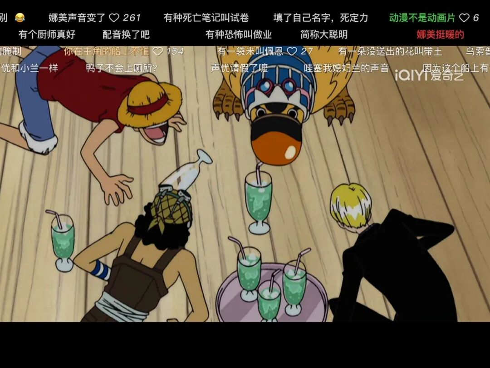
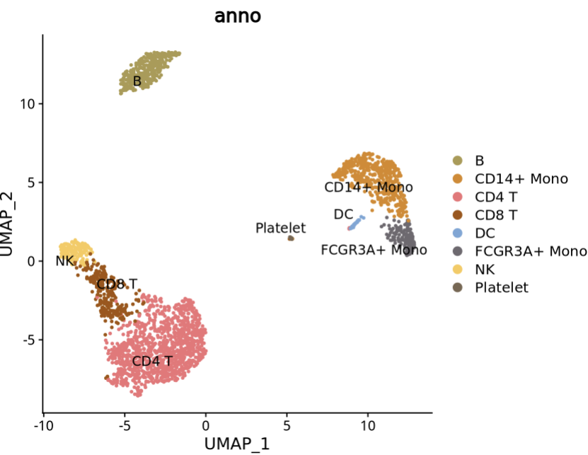

# 如果将喜欢的动漫配色使用到科研绘图中，会有什么化学反应？

- 专辑：绘图小技巧2026
- 公众号：生信技能树
- 发布时间：2026-02-02 23:57
- 原文：[微信公众平台](https://mp.weixin.qq.com/s?__biz=MzAxMDkxODM1Ng%3D%3D&mid=2247549106&idx=1&sn=fe6b828efd1975e1fac7a857861ab80a&chksm=9b4b4009ac3cc91fa2668451d48454c0b3ea495c0653551e1c5284019a8cf13b4f0b7858256b)

---
>
>
> 作为一个超级喜欢看动画的人，每次看到各种好看的动画片，都要感叹：里面的配色也太好看了吧！他们的配色应该都是专业的美术做的是不是！那我们直接拿来用，配色不就上升一个层面了吗？来看看~

## 西游记配色

首先，我找了个经典的动画：西游记。去网上找了张高清图，下面这个配色AI也做不出来啊。



然后我找了个网站一键提取里面的颜色，网址：

>
>
> https://oneimage.co/colors/zh\#tool

可以提取3、5、7种颜色，然后提取出来的颜色如下：看起来整幅画中颜色占比少但是亮眼的颜色提取不到，我就手动提取了其中的红色，手动方法：[独家私藏秘技：如何获取高分文章中的图片配色？](https://mp.weixin.qq.com/s?__biz=MzAxMDkxODM1Ng%3D%3D&mid=2247540968&idx=1&sn=e6d61914bf98a2e5044c5fc5429039b5#wechat_redirect)。



搞个图看看：

```r
## 加载R包
library(Seurat)
library(ggplot2)
library(tidyverse)
library(SeuratData)
# InstallData("pbmc3k")   #  (89.4 MB)
data("pbmc3k")
sce <-  UpdateSeuratObject(pbmc3k.final)
sce$anno <- sce$seurat_annotations
sce$anno <- gsub("Naive CD4 T","CD4 T",sce$anno)
sce$anno <- gsub("Memory CD4 T","CD4 T",sce$anno)
# sce$anno <- gsub("CD8 T","T",sce$anno)
head(sce@meta.data)
cols = c("#c84825","#E3B05C","#BAAEAE","#8C99B1","#147097","#35402D","#4D86AA","#E1DDC8")
DimPlot(sce,reduction = 'umap',label = T,repel = T,group.by = "anno",cols = cols)
```



好像还可以！

## 女帝配色：

我又找了其它几张《海贼王》配色图玩了一下，结合前面的软件 Snipaste：[独家私藏秘技：如何获取高分文章中的图片配色？](https://mp.weixin.qq.com/s?__biz=MzAxMDkxODM1Ng%3D%3D&mid=2247540968&idx=1&sn=e6d61914bf98a2e5044c5fc5429039b5#wechat_redirect)



网页提取颜色如下：



绘图：

```r
cols <- c("#bb9cbe", "#D1C8BF", "#2F7FB7", "#4EA0C5", "#83BCCE", "#A08372", "#D6B40A","#090909")
DimPlot(sce,reduction = 'umap',label = T,repel = T,group.by = "anno",cols = cols)
```



## 路飞与萨博小时候配色



网页提取配色不是很好，就用  Snipaste手动提取了：

```r
# 路飞与萨博小时候配色
cols <- c("#cd7400", "#c8d378", "#276f23", "#c58d00", "#8e2036", "#b59f62", "#4d6991","#28280c")
DimPlot(sce,reduction = 'umap',label = T,repel = T,group.by = "anno",cols = cols)
```



## 给快跑鸭喝酒配色

下面是发生在船上搞笑的一幕：



效果如下：

```r
cols <- c("#ac9a4f", "#da871e", "#f07277", "#a35305", "#77a7d8", "#6e696f", "#fac956","#796652")
DimPlot(sce,reduction = 'umap',label = T,repel = T,group.by = "anno",cols = cols)
```



是不是很有意思！

来评论区交作业，不管是游戏，还是其他的影视，电视剧，杂志等，搞个你喜欢的配色画 pbmc3k UMAP图来！

转发：

- [生信入门&数据挖掘线上直播课2026年1月班](https://mp.weixin.qq.com/s?__biz=MzAxMDkxODM1Ng%3D%3D&mid=2247547917&idx=1&sn=76afb50b6e9e433e3f2b3d039f72dac4#wechat_redirect)，你的生物信息学入门课

- [时隔5年，我们的生信技能树VIP学徒继续招生啦](https://mp.weixin.qq.com/s?__biz=MzAxMDkxODM1Ng%3D%3D&mid=2247525079&idx=1&sn=0b997af16a58195b4192691373048fd5#wechat_redirect)

- [满足你生信分析计算需求的低价解决方案](https://mp.weixin.qq.com/s?__biz=MzUzMTEwODk0Ng%3D%3D&mid=2247530048&idx=1&sn=28aa7bbd5e00521f79e074496a5f5d66#wechat_redirect)

- [生信故事会](https://mp.weixin.qq.com/mp/appmsgalbum?__biz=MzAxMDkxODM1Ng%3D%3D&action=getalbum&album_id=1679199708449144836#wechat_redirect)，来看看他们的生信入门故事

- [生信马拉松答疑专辑](https://mp.weixin.qq.com/mp/appmsgalbum?__biz=MzAxMDkxODM1Ng%3D%3D&action=getalbum&album_id=3690970204957147140#wechat_redirect)，获取你的生信专属答疑

<!-- wechat-article-fetcher: complete -->
