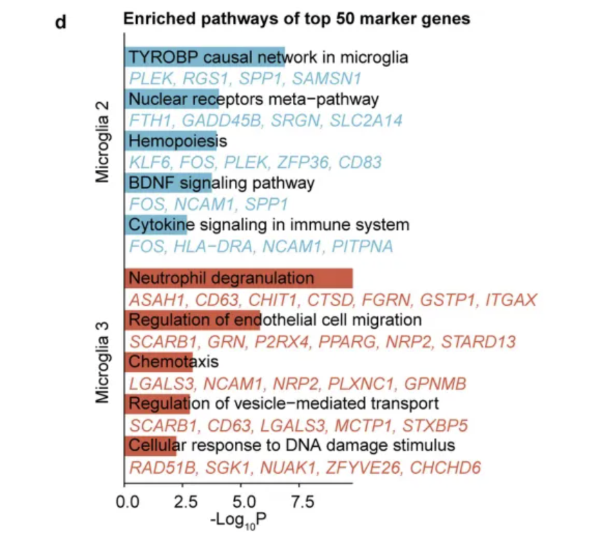
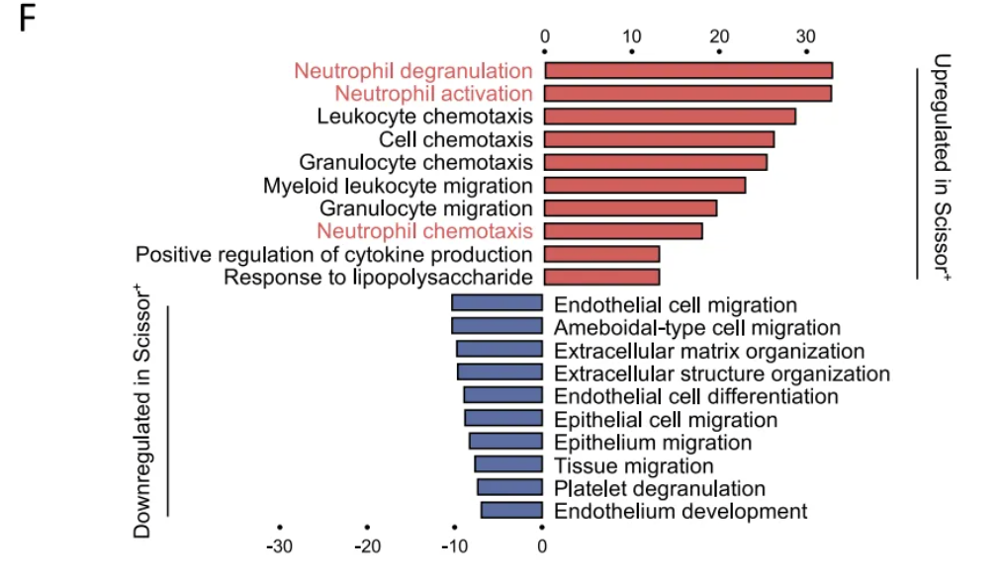
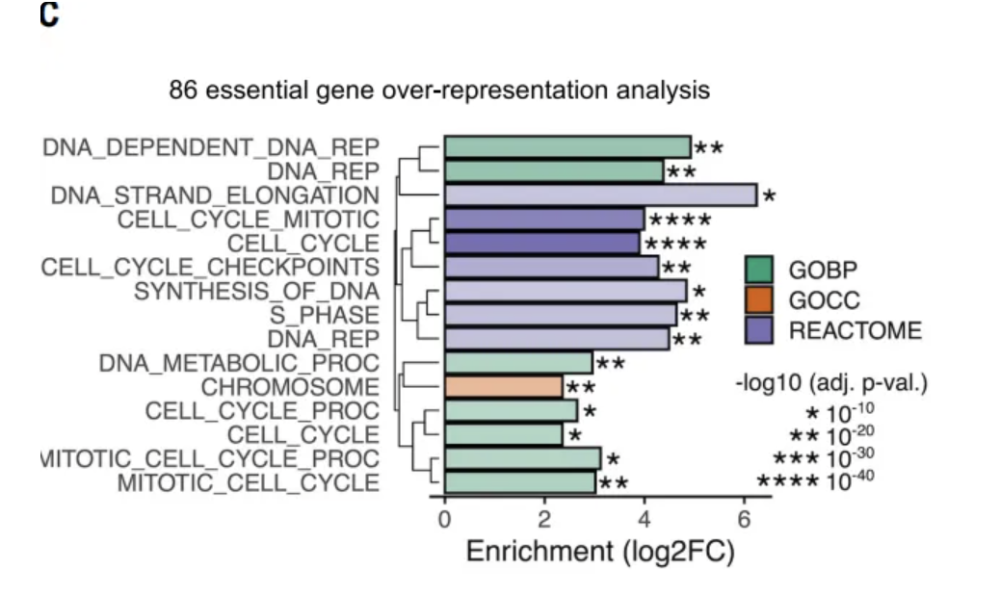
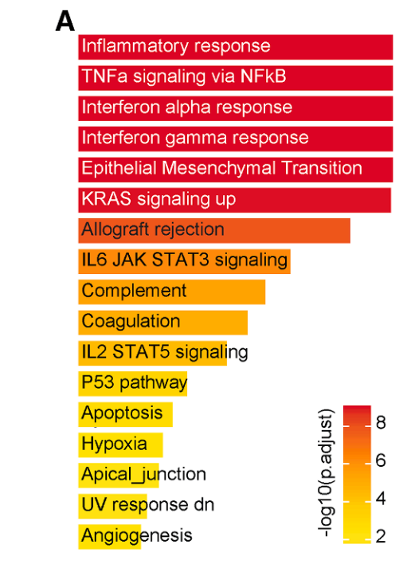
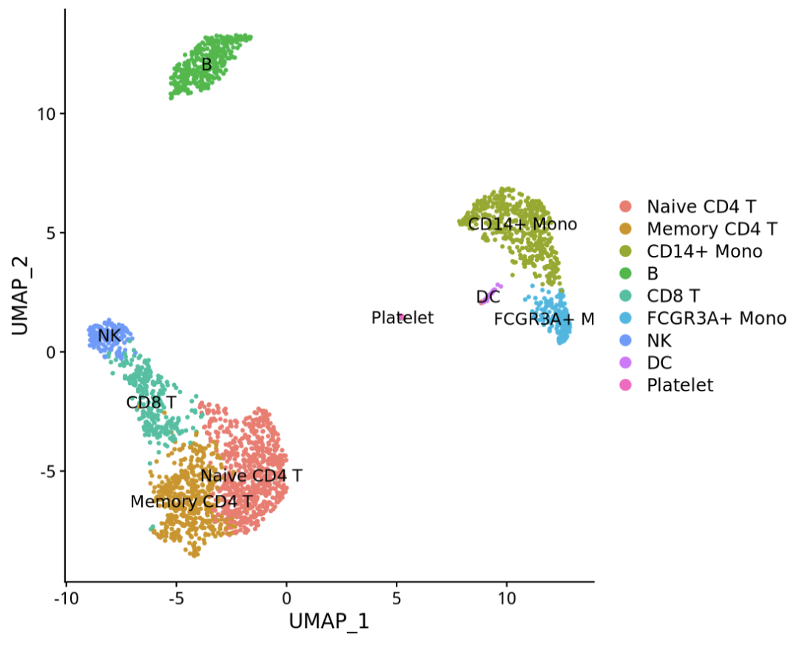
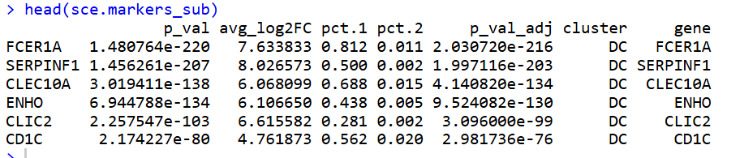
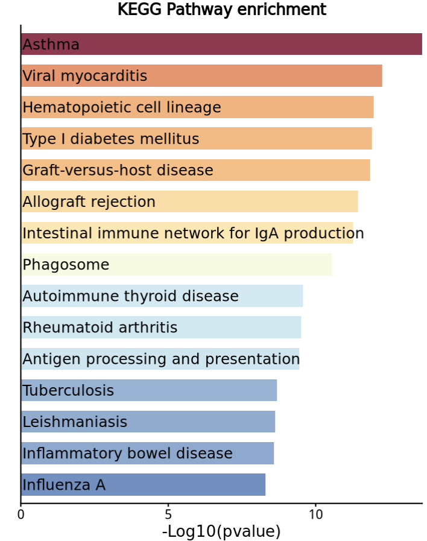
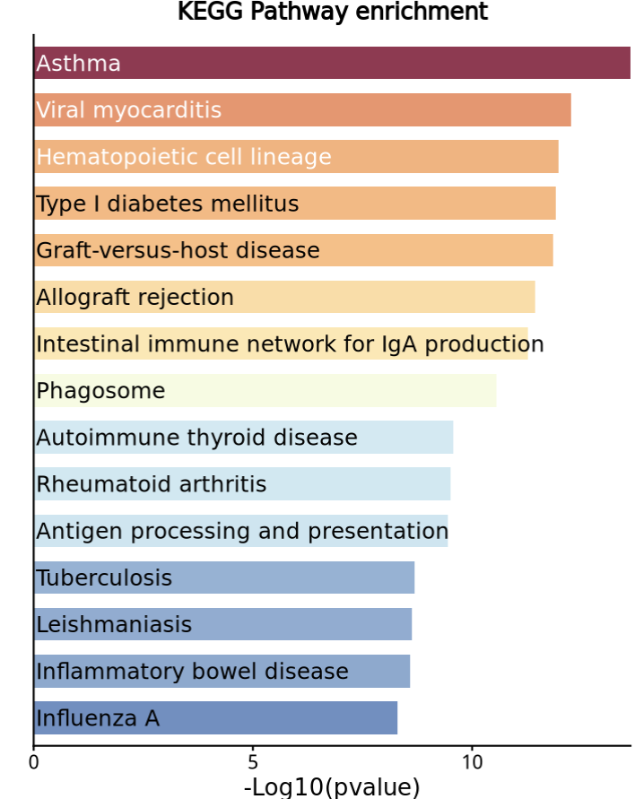
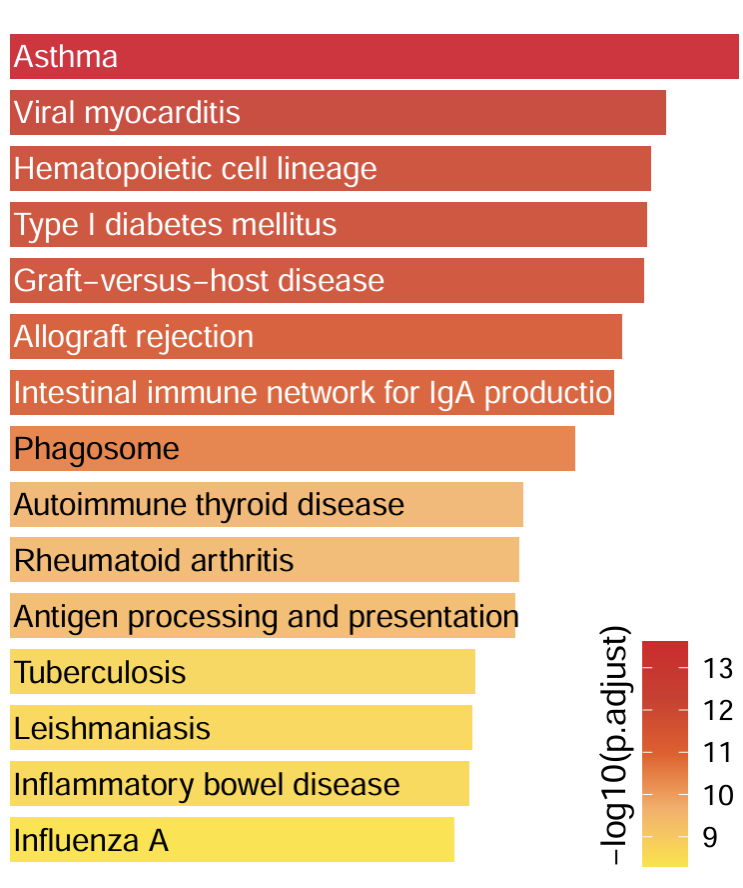

# 同款高分杂志的富集分析结果展示：变体条形图绘制

- 专辑：绘图小技巧2026
- 公众号：生信技能树
- 发布时间：2026-02-18 22:46
- 原文：[微信公众平台](https://mp.weixin.qq.com/s?__biz=MzAxMDkxODM1Ng%3D%3D&mid=2247549542&idx=1&sn=c5507ded92ef3a30fd93fca6056354c9&chksm=9b4b42ddac3ccbcb81596862975ccf65d7c283845569f4fdbe13ee01c8b90c3431d7ed2d92f3)

---
>
>
> 每周一画的时间！今天学习这篇 2026年2月9日发表在Cancer Cell杂志的文献，文献标题为《Multimodal spatial-omics reveal co-evolution of alveolar progenitors and proinflammatory niches in progression of lung precursor lesions》，来看看这个富集结果条形图~

下面这个图展示的任意基因集的任意数据库选了10-20条的功能富集结果展示，同款的我们前面有这些：

款式一：[Nature单细胞富集分析条形图复现](https://mp.weixin.qq.com/s?__biz=MzUzMTEwODk0Ng%3D%3D&mid=2247520754&idx=1&sn=9898733681986811c40c4a6dcc1a9b23#wechat_redirect)



款式二：[突出你的新发现：高亮富集结果中的关键通路绘制](https://mp.weixin.qq.com/s?__biz=MzAxMDkxODM1Ng%3D%3D&mid=2247538234&idx=1&sn=f262f1933ebd7902c5a72d87249053d5#wechat_redirect)



款式三：[Science杂志：富集结果条形图还可以聚类吗？](https://mp.weixin.qq.com/s?__biz=MzAxMDkxODM1Ng%3D%3D&mid=2247539059&idx=1&sn=4fc44a010cf87ecc0cad48258b9157c6#wechat_redirect)



款式四：今天学习的图！



>
>
> Figure 4. Reactive pneumocytes reside in niches enriched with proinflammatory macrophages (A) Pathway enrichment results of KACs relative to other epithelial subsets from snRNA-seq data.

## 数据处理

上面这个图是作者的单细胞结果中 KACs亚群与其他所有亚群差异分析基因的功能富集结果，数据见

https://www.ncbi.nlm.nih.gov/geo/query/acc.cgi?acc=GSE308103

但是呢这个数据实在太大了，我们这里使用经典的pbmc3k来做示例数据。

如果是你的，那就是seurat对象注释后亚群差异分析。

```r
rm(list=ls())
library(Seurat)
library(patchwork)
library(dplyr)
library(ggplot2)

# install.packages('devtools')
# devtools::install_github('satijalab/seurat-data')
library(SeuratData) #加载seurat数据集
getOption('timeout')
options(timeout=10000)
# InstallData("pbmc3k")
data("pbmc3k")

sce <- updateObject(pbmc3k.final  )
table(Idents(sce))
p1 <- DimPlot(sce,label = T)
p1
```



### 差异分析：

随便选择其中的 DC 亚群差异结果：

```r
library(future)
# check the current active plan
plan()
plan("multisession", workers = 3)
plan()
# 有了多线程加上，FindAllMarkers 速度就很快
sce.markers <- FindAllMarkers(object = sce, only.pos = TRUE, min.pct = 0.25, thresh.use = 0.25)
DT::datatable(sce.markers)
head(sce.markers)
table(sce.markers$cluster)

sce.markers_sub <- sce.markers[sce.markers$cluster=="DC" & sce.markers$p_val_adj<0.05,]
head(sce.markers_sub)
```



### 功能富集

这里用 KEGG Pathway 数据库做：

```r
# 转换ID
genelist <- bitr(gene=sce.markers_sub$gene, fromType="SYMBOL", toType="ENTREZID", OrgDb='org.Hs.eg.db')
head(genelist)
# 三种方法解决KEGG功能富集总是出现的断网报错：cannot read from connection
# https://mp.weixin.qq.com/s/W4qIj7Q2kvDndJpxUmsrrQ
options(timeout = 99999)
ekegg <- enrichKEGG(gene = genelist$ENTREZID, organism = 'hsa', pvalueCutoff = 1, qvalueCutoff = 1)
ekegg <- ekegg@result[ekegg@result$pvalue<0.05,]
```

## 绘图

### 先设置一下因子水平：

```r
# top15
dt <- ekegg[order(ekegg$p.adjust,decreasing = F), ]
dt <- dt[1:15,]
dt$Description <- factor(dt$Description, levels = rev(dt$Description))
colnames(dt)
```

### ggplot2绘图

基本上就是barplot+text：

```r
p <- ggplot(data = dt, aes(x = -log10(p.adjust), y = Description, fill = -log10(p.adjust))) +
  scale_fill_gradientn(values = seq(0,1,0.1),colours = c("#4575b4","#abd9e9","#e0f3f8","#ffffbf","#fdae61","#d73027","#800026")) +
  geom_bar(stat = "identity", width = 0.7, alpha = 0.8) +
  scale_x_continuous(expand = c(0,0)) + # 调整柱子底部与y轴紧贴
  labs(x = "-Log10(pvalue)", y = "", title = "KEGG Pathway enrichment") +
# x = 0.61 用数值向量控制文本标签起始位置
  geom_text(size=4.3, aes(x = 0.05, label = Description), hjust = 0) + # hjust = 0,左对齐
  theme_classic() +
  theme(
    axis.title = element_text(size = 13),
    axis.text = element_text(size = 11),
    axis.text.y = element_blank(), # 在自定义主题中去掉 y 轴通路标签:
    axis.ticks.length.y = unit(0,"cm"),
    plot.title = element_text(size = 13, hjust = 0.5, face = "bold"),
    legend.title = element_text(size = 13),
    legend.text = element_text(size = 11),
    plot.margin = margin(t = 5.5, r = 10, l = 5.5, b = 5.5)
  ) +
  NoLegend()

p
```



### 改一下通路名颜色：

颜色比较深的地方，字体黑色看不清楚，来换一下颜色。

关键代码：`geom_text(..., color=rep(c("white","black"),times=c(3,12)) )`

```r
p <- ggplot(data = dt, aes(x = -log10(p.adjust), y = Description, fill = -log10(p.adjust))) +
  scale_fill_gradientn(values = seq(0,1,0.1),colours = c("#4575b4","#abd9e9","#e0f3f8","#ffffbf","#fdae61","#d73027","#800026")) +
  geom_bar(stat = "identity", width = 0.7, alpha = 0.8) +
  scale_x_continuous(expand = c(0,0)) + # 调整柱子底部与y轴紧贴
  labs(x = "-Log10(pvalue)", y = "", title = "KEGG Pathway enrichment") +
# x = 0.61 用数值向量控制文本标签起始位置
  geom_text(size=4.3, aes(x = 0.05, label = Description), hjust = 0, color=rep(c("white","black"),times=c(3,12)) ) + # hjust = 0,左对齐
  theme_classic() +
  theme(
    axis.title = element_text(size = 13),
    axis.text = element_text(size = 11),
    axis.text.y = element_blank(), # 在自定义主题中去掉 y 轴通路标签:
    axis.ticks.length.y = unit(0,"cm"),
    plot.title = element_text(size = 13, hjust = 0.5, face = "bold"),
    legend.title = element_text(size = 13),
    legend.text = element_text(size = 11),
    plot.margin = margin(t = 5.5, r = 10, l = 5.5, b = 5.5)
  ) +
  NoLegend()

p
```



### 改成与文献相同的配色与主题：

```r
#### 改颜色和主题
# 改颜色
p <- ggplot(data = dt, aes(x = -log10(p.adjust), y = Description, fill = -log10(p.adjust))) +
  scale_fill_gradientn(values = seq(0,1,0.1),colours = c("#ffe10f","#fdae61","#ee561a","#d73027","#dc0224")) +
  geom_bar(stat = "identity", width = 0.8, alpha = 0.9) +
  scale_x_continuous(expand = c(0,0)) + # 调整柱子底部与y轴紧贴
  labs(x = "", y = "", title = "") +
# x = 0.61 用数值向量控制文本标签起始位置
  geom_text(size=4.3, aes(x = 0.05, label = Description), hjust = 0, color=rep(c("white","black"),times=c(7,8)) ) + # hjust = 0,左对齐
  theme_void() +  # 使用完全空白的主题
  theme(
    axis.title = element_text(size = 13),
    axis.text = element_blank(), # 在自定义主题中去掉 y 轴通路标签:
    axis.ticks.length.y = unit(0,"cm"),
    plot.title = element_text(size = 13, hjust = 0.5, face = "bold"),
    legend.title = element_text(size = 13,angle = 90),
    legend.text = element_text(size = 11),
    legend.title.position = "left",  # 设置图例标题在左侧
    legend.position = c(0.90, 0.15),  # 图例整体位置：右下角 (x=0.95, y=0.05)
    plot.margin = margin(t = 5.5, r = 10, l = 5.5, b = 5.5)
  )

p
```



完美！今天分享到这~

友情转发：

- [生信入门&数据挖掘线上直播课1月班](https://mp.weixin.qq.com/s?__biz=MzAxMDkxODM1Ng%3D%3D&mid=2247548238&idx=1&sn=59dc7e38745a4febb6d9b91731c6652b#wechat_redirect)，你的生物信息学入门课

- [时隔5年，我们的生信技能树VIP学徒继续招生啦](https://mp.weixin.qq.com/s?__biz=MzAxMDkxODM1Ng%3D%3D&mid=2247525079&idx=1&sn=0b997af16a58195b4192691373048fd5#wechat_redirect)

- [满足你生信分析计算需求的低价解决方案](https://mp.weixin.qq.com/s?__biz=MzUzMTEwODk0Ng%3D%3D&mid=2247530048&idx=1&sn=28aa7bbd5e00521f79e074496a5f5d66#wechat_redirect)

- [生信故事会](https://mp.weixin.qq.com/mp/appmsgalbum?__biz=MzAxMDkxODM1Ng%3D%3D&action=getalbum&album_id=1679199708449144836#wechat_redirect)，来看看他们的生信入门故事

- [生信马拉松答疑专辑](https://mp.weixin.qq.com/mp/appmsgalbum?__biz=MzAxMDkxODM1Ng%3D%3D&action=getalbum&album_id=3690970204957147140#wechat_redirect)，获取你的生信专属答疑

<!-- wechat-article-fetcher: complete -->
