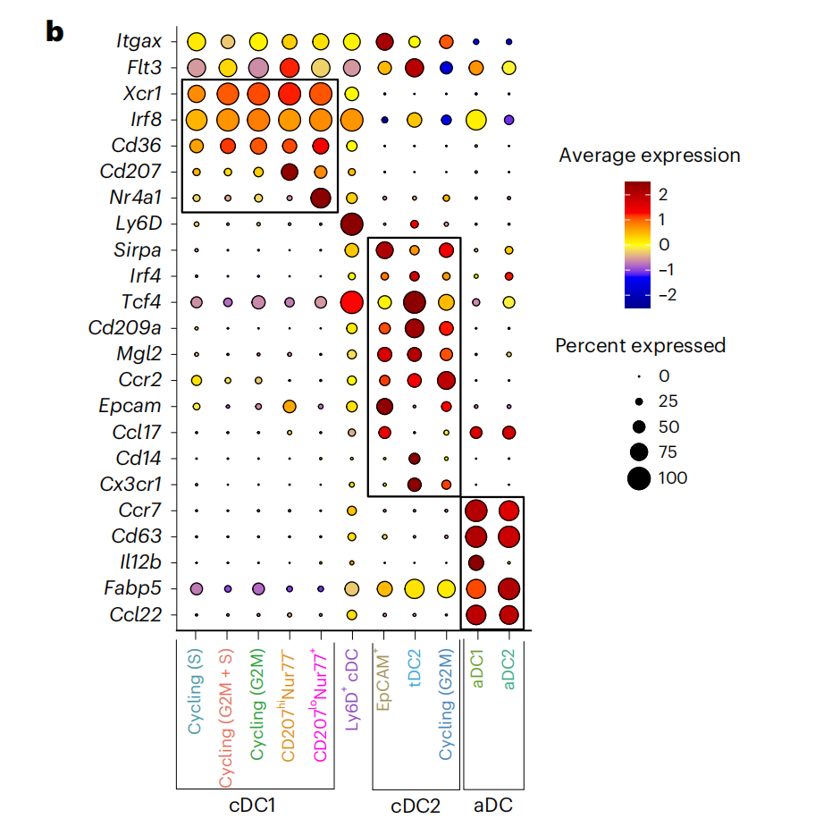
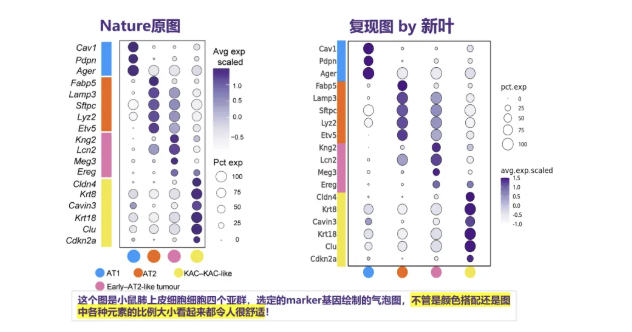
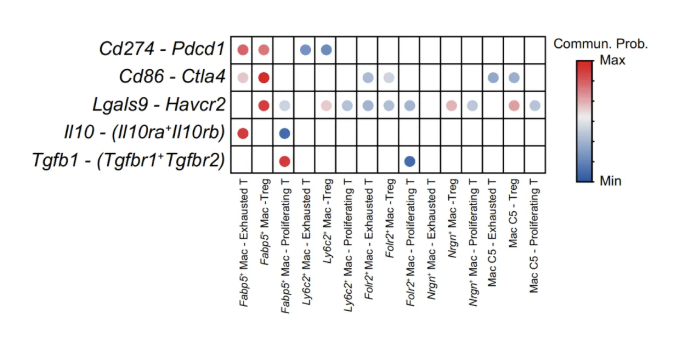
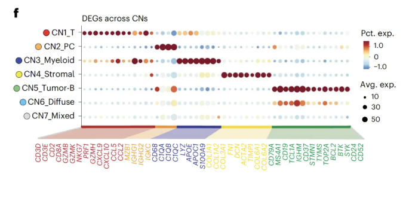
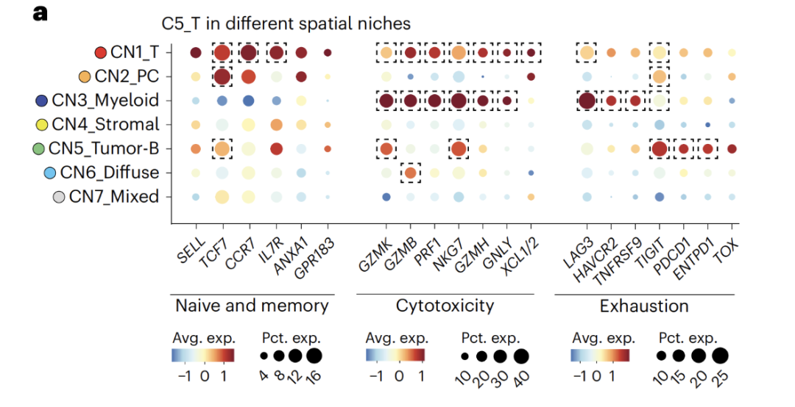
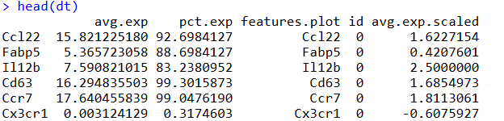
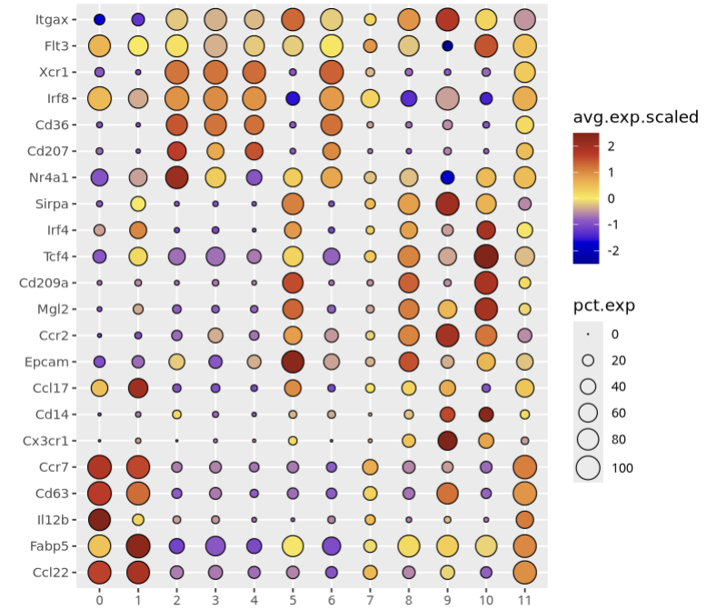
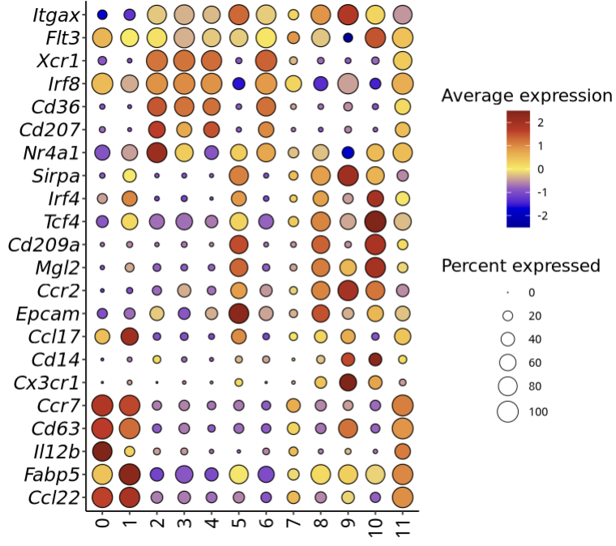
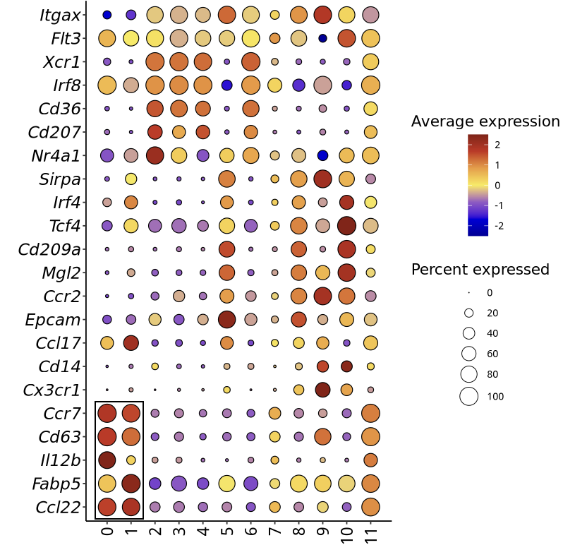
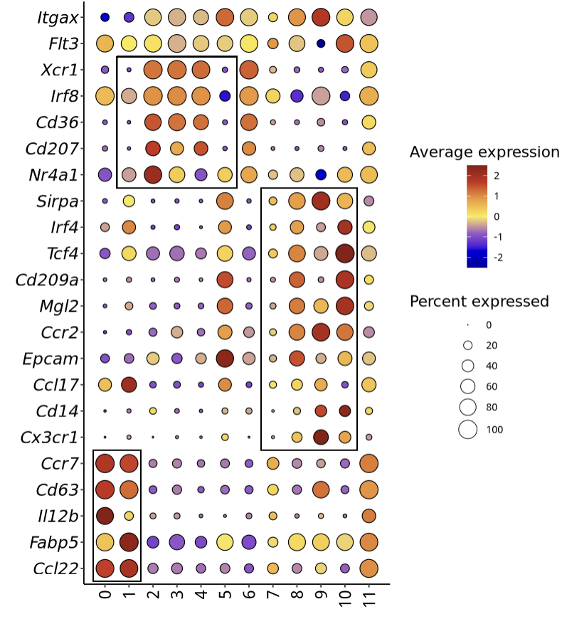

# 顶刊杂志同款单细胞marker基因气泡图：加个框框突出marker

- 专辑：绘图小技巧2026
- 公众号：生信技能树
- 发布时间：2026-02-23 22:30
- 原文：[微信公众平台](https://mp.weixin.qq.com/s?__biz=MzAxMDkxODM1Ng%3D%3D&mid=2247549658&idx=1&sn=2da2450ac2b4e71b28cf08141260bf7b&chksm=9b4b4261ac3ccb77758f07d7912d202346ce4f6d5d538e49cdcac173d77a670080802d19e67f)

---
>
>
> 每周一的固定绘图，今天学习 2026年1月8号发表在 Nature Immunology杂志上的一篇文献，标题为《The differentiation and function of heterogeneous thymic dendritic cell subsets require signals provided by distinct thymocyte cell types》。这篇文献对 胸腺经典树突状细胞亚群进行了细分，得到了11个不同的亚群，亚群marker基因如下：



图注：

>
>
> Fig. 1 \| scRNA-seq reveals transcriptional heterogeneity in the thymic DC compartment. b, Normalized expression (z-score) of select DC marker genes across the transcriptionally defined cDC clusters from a.

## 前面的类似气泡图有：

[Nature杂志同款高颜值单细胞基因表达气泡图（王凌华团队）](https://mp.weixin.qq.com/s?__biz=MzAxMDkxODM1Ng%3D%3D&mid=2247545796&idx=1&sn=bb7ae79db9b3c3a0542187e1b6b31bc5#wechat_redirect)



[高分杂志同款cellchat细胞通讯结果气泡图绘制（IF=25.083）](https://mp.weixin.qq.com/s?__biz=MzAxMDkxODM1Ng%3D%3D&mid=2247544734&idx=1&sn=afb7ead473e91445b695efea54807327#wechat_redirect)



[Nature Genetics杂志特别版单细胞marker基因气泡图](https://mp.weixin.qq.com/s?__biz=MzAxMDkxODM1Ng%3D%3D&mid=2247546635&idx=1&sn=8a9fbdb461f7c704e07e61f054b3e200#wechat_redirect)



[突出显示：Nature Genetics杂志带注释框版单细胞marker基因气泡图](https://mp.weixin.qq.com/s?__biz=MzAxMDkxODM1Ng%3D%3D&mid=2247547054&idx=1&sn=f87d661c8e4b8f90f793f3e3d4d7454b#wechat_redirect)



## 数据背景

为鉴定转录特征差异的胸腺 DC 亚群，我们对1月龄 C57BL/6J 小鼠经荧光激活细胞分选纯化的 8,404 个 CD45+ MHC-II+ 胸腺造血 APC 进行了单细胞RNA测序分析。通过谱系特异性基因表达鉴定出  HAPC 亚群和胸腺细胞。对 cDC 的再聚类进一步划分出 11 个转录特征迥异的亚群：

- 5个表达 Xcr1、Irf8 和 Cd36 的 cDC1 cluster

- 3个表达 Sirpa、Irf4 和 Mgl2 的 cDC2 cluster

- 1个异质性 Ly6d+ cDC  cluster, 共表达 Zbtb46、Xcr1 和 Sirpa

- 2个表达 DC 成熟相关基因（Ccr7、Cd63 和 Ccl22）的 aDC cluster

上面的缩写：

thymic hematopoietic APCs (HAPCs)

thymic antigen-presenting cells (APCs)

activated cDC1s (aDCs)

作者将数据传到了GEO：GSE239780

```r
GSE239780_RAW.tar 352.2 Mb (http)(custom) TAR (of MTX, TSV)
GSE239780_WT-cDC-Hashtagged_scRNA.tar.gz 106.4 Mb (ftp)(http) TAR
```

简单的处理，创建seurat对象：

```r
###
### Create: Jianming Zeng
### Date:  2023-12-31
### Email: jmzeng1314@163.com
### Blog: http://www.bio-info-trainee.com/
### Forum:  http://www.biotrainee.com/thread-1376-1-1.html
### CAFS/SUSTC/Eli Lilly/University of Macau
### Update Log: 2023-12-31   First version
### Update Log: 2024-12-09   by juan zhang (492482942@qq.com)
###
rm(list=ls())
library(ggsci)
library(dplyr)
library(future)
library(Seurat)
library(clustree)
library(cowplot)
library(data.table)
library(ggplot2)
library(patchwork)
library(stringr)
library(qs)
library(Matrix)

# 创建目录
getwd()
gse <- "GSE239780"
dir.create(gse)

# 解压到指定目录
setwd("GSE239780/")
untar("GSE239780_WT-cDC-Hashtagged_scRNA.tar.gz",
      exdir = "GSE239780_WT-cDC")

# 重命名
library(stringr)
(files <- list.files(pattern = "^WT-cDC-Hashtagged_.*\.gz$",recursive = T))
(new_files <- str_remove(files, "WT-cDC-Hashtagged_"))
file.rename(files, new_files)


# 方式一：标准文件夹
###### step1: 导入数据 ######
counts <- Read10X("GSE239780_WT-cDC/", gene.column = 2)
sce <- CreateSeuratObject(counts$`Gene Expression`, project="WT-cDC", min.cells = 3)
sce

# 查看特征
as.data.frame(sce@assays$RNA$counts[1:10, 1:2])
head(sce@meta.data, 10)
table(sce$orig.ident)

library(qs)
qsave(sce, file="sce.all.qs")
```

## 基础气泡图

上面的 sce 经过简单的质控，降维聚类分群，得到的数据是一个 seurat 对象（这里偷懒并没有做详细的注释，直接就用 聚类的 cluster 结果吧）。

先利用 seurat 的 dotplot 取出来里面的数据：

```r
sce.all.filt <- sce
sce.all.filt
head(sce.all.filt@meta.data)

genes <- c("Itgax", "Flt3", "Xcr1", "Irf8", "Cd36", "Cd207", "Nr4a1",
           "Ly6D", "Sirpa", "Irf4", "Tcf4", "Cd209a", "Mgl2", "Ccr2",
           "Epcam", "Ccl17", "Cd14", "Cx3cr1", "Ccr7", "Cd63", "Il12b",
           "Fabp5", "Ccl22")

p <- DotPlot(sce.all.filt, features = rev(genes), group.by = "RNA_snn_res.0.5") +
  coord_flip()
p

# 取出来绘图数据
dt <- p@data
head(dt)
range(dt$avg.exp.scaled)
range(dt$pct.exp)
```



有了上面的数据框，就可以很方便的使用 ggplot2 来绘制基础气泡图了：

```r
p <- ggplot(dt, aes(x = id, y = features.plot)) +
  geom_point( aes(fill = avg.exp.scaled, size = pct.exp), color = 'black', shape = 21,stroke = 0.5) + # 带边的气泡图
  xlab("") + ylab("") +
  scale_fill_gradientn( colours = c("#01009c","#0000de","#9559c8","#faea4d","#f09b37","#ca2b1c","#8b1a10") ) +
  scale_size( range = c(0, 7),limits = c(0, 100),breaks = c(0,20,40,60,80,100) )
p
```



## 修改图的细节

现在有了AI，当然是免费的AI，你只需要告诉他如何调整细节，基本上都有代码给到。

这里如调整图的背景，修改图例标题，x、y轴的字体大小和标签等：

```r
p1 <- p +
  labs( fill = "Average expression",  size = "Percent expressed"  ) +  # 修改图例标题
  theme(
    panel.grid.major = element_blank(),
    panel.grid.minor = element_blank(),
    panel.background = element_blank(),
    axis.line = element_line(colour = "black"),
    axis.text.x = element_text(angle = 90, vjust = 0.5, hjust = 1,size = 14,color = "black"), # x轴文本靠右对齐
    axis.text.y = element_text(angle = 0, vjust = 0.5, hjust = 1,size = 14, face = "italic",color = "black"), # y轴文本靠右对齐
    legend.position = "right", # 将图例放在右侧
    legend.title = element_text(size = 13)
  ) +
  guides(
    size = guide_legend( title.position = "top", title.hjust = 0.5, ncol = 1, byrow = TRUE, override.aes = list(stroke = 0.4) ),
    fill = guide_colourbar( title.position = "top", title.hjust = 0.5 )
    )
p1
```



## 添加方框

当然我觉得这里面最方便的还是使用 ps 工具，这期先用代码加吧，下周出个使用 ps 工具的案例来。

#### 第一个框：x 轴的0-1，y 轴的1-5

```r
# 添加方框
p2 <- p1 +
  scale_x_discrete(expand = expansion(mult = c(0.08, 0.08))) + # 增加x轴与y轴的距离（在左侧和右侧添加更多空间）
  geom_rect(aes(xmin=0.5,xmax=2.5, ymin=0.5, ymax=5.5),fill=NA,linetype = 1,linewidth = 0.3,color="black")
p2
```



#### 添加后面的框

以此类推：

- 第二个框：x 轴的 8-11，y 轴的6-15；

- 第三个框：x 轴的 2-6，y 轴的 16-20。

```r
# 添加方框
p3 <- p2 +
  geom_rect(aes(xmin=7.5,xmax=11.5, ymin=5.5, ymax=15.5),fill=NA,linetype = 1,linewidth = 0.3,color="black") +
  geom_rect(aes(xmin=1.5,xmax=6.5, ymin=15.5, ymax=20.5),fill=NA,linetype = 1,linewidth = 0.3,color="black")
p3
```



是不是很简单！

#### 最后有一些问题，欢迎留言区讨论：

1、现在关于AI的讨论随处可见，这样的手动绘图帖子，还会有人看吗？付费的 AI 我还一直没有入局过，包括什么模型的训练等。

2、如果付费的都超好用， 这个费用一般的学生能负担起吗？

3、关于AI的使用：是否有门槛？与网页工具的区别在哪里？（对于本身不会代码和本身会代码的人还是有超大区别的，会的应该还是不会）包括使用的指令，模型的训练，硬件的支持，这些都能普及到一般人吗？

4、现在市面上是否有成熟的 AI 使用培训班？

友情转发：

- [生信入门&数据挖掘线上直播课1月班](https://mp.weixin.qq.com/s?__biz=MzAxMDkxODM1Ng%3D%3D&mid=2247548238&idx=1&sn=59dc7e38745a4febb6d9b91731c6652b#wechat_redirect)，你的生物信息学入门课

- [时隔5年，我们的生信技能树VIP学徒继续招生啦](https://mp.weixin.qq.com/s?__biz=MzAxMDkxODM1Ng%3D%3D&mid=2247525079&idx=1&sn=0b997af16a58195b4192691373048fd5#wechat_redirect)

- [满足你生信分析计算需求的低价解决方案](https://mp.weixin.qq.com/s?__biz=MzUzMTEwODk0Ng%3D%3D&mid=2247530048&idx=1&sn=28aa7bbd5e00521f79e074496a5f5d66#wechat_redirect)

- [生信故事会](https://mp.weixin.qq.com/mp/appmsgalbum?__biz=MzAxMDkxODM1Ng%3D%3D&action=getalbum&album_id=1679199708449144836#wechat_redirect)，来看看他们的生信入门故事

- [生信马拉松答疑专辑](https://mp.weixin.qq.com/mp/appmsgalbum?__biz=MzAxMDkxODM1Ng%3D%3D&action=getalbum&album_id=3690970204957147140#wechat_redirect)，获取你的生信专属答疑

<!-- wechat-article-fetcher: complete -->
