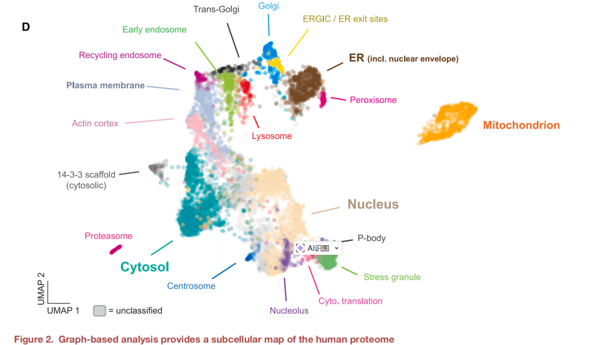
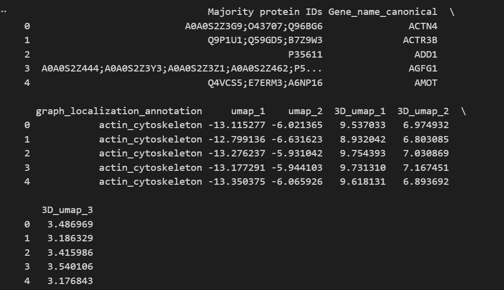
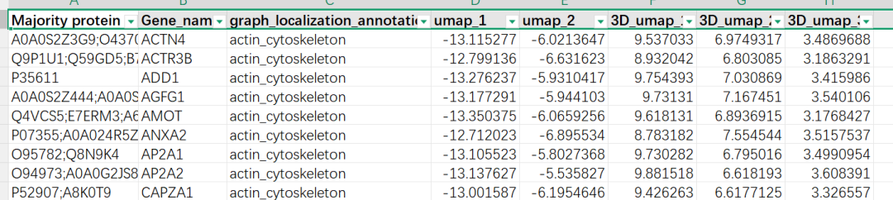
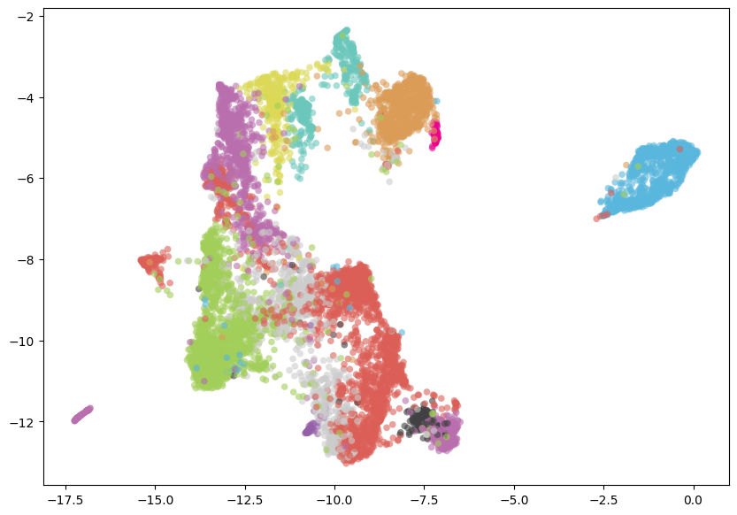
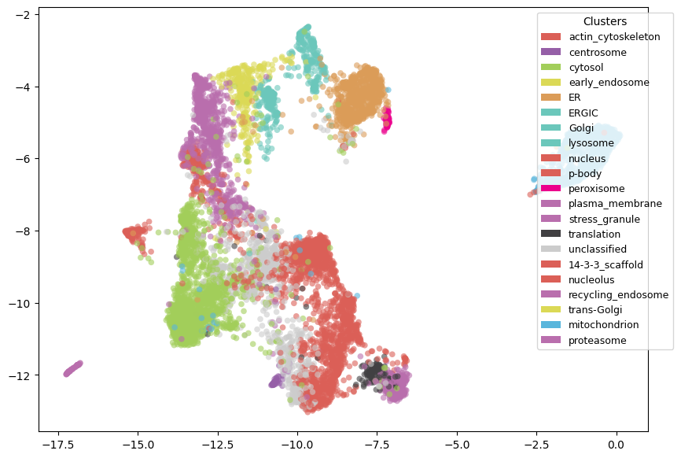
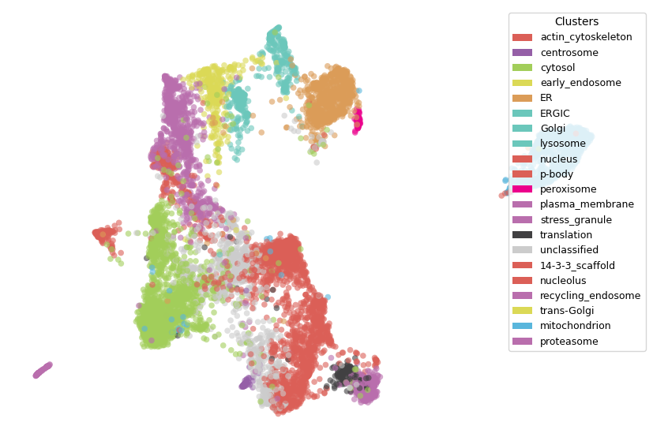
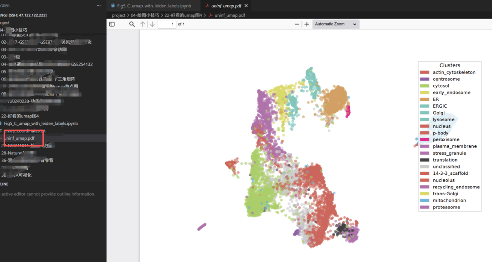

# 绘制Cell杂志同款umap图：这次使用python来做！

- 专辑：绘图小技巧2026
- 公众号：生信技能树
- 发布时间：2026-03-02 23:08
- 原文：[微信公众平台](https://mp.weixin.qq.com/s?__biz=MzAxMDkxODM1Ng%3D%3D&mid=2247549832&idx=1&sn=9386f0908d7b7555347e81017ff2154d&chksm=9b4b4333ac3cca2512aeb6f70a7bb9f89209cd0b6ca1c8aa7e3e70b5cbe1ba050ecc9b669d14)

---
>
>
> 又是周一的绘图啦，2026年已经过完了2个月！今天来学习一下2025年2月20号发表在Cell杂志上的文献，里面的python版本 umap 图绘制，标题为《Global organelle profiling reveals subcellular localization and remodeling at proteome scale》。

此外，我们2026年的生信入门班开始招生啦，详细链接：[生信入门&数据挖掘线上直播课2026年3月班](https://mp.weixin.qq.com/s?__biz=MzAxMDkxODM1Ng%3D%3D&mid=2247549672&idx=1&sn=e376079bdfdc8ffd8f8c58ee3067ae15#wechat_redirect)，给你最好的答疑服务！

umap 图我们做了非常多期，总结见：[年度盘点之单细胞的各种花式UMAP图，你见过哪款？](https://mp.weixin.qq.com/s?__biz=MzAxMDkxODM1Ng%3D%3D&mid=2247548356&idx=1&sn=374667b7351cff0b2a0dbd3881b114ae#wechat_redirect)

上面这些基本上都是R版本的，今天看看python版本。

图如下：（D）**二维 UMAP 图**，展示了通过（C）中富集分析识别出的 20 个亚细胞区室。每个点代表一种单独的蛋白质。



我们需要的是umap坐标，这里作者直接将数据放在了 table s3，下载地址：

>
>
> https://www.cell.com/cms/10.1016/j.cell.2024.11.028/attachment/50d341e4-701b-4d3b-b672-2cda01934c0a/mmc3.xlsx

## 数据读取

先加载python模块：

```python
import os, re, sys
from pathlib import Path
import anndata as ad
import matplotlib.pyplot as plt
import pandas as pd # 读取数据
import requests
import matplotlib.patches as mpatches
```

使用python的包pandas读取：

```python
# 读取tab分割的文件，自动使用第一行作为列名
df = pd.read_csv('umap_coordinates.txt', sep='	')
# 查看数据
print(df.head())
```



这个作者给的表格总共有8列：第三列是蛋白的亚细胞定位，我们绘制umap图的点的颜色分类。



设置每个类别对应的颜色：颜色我根据原有的代码瞎改的哈，真的瞎改的。

```r
u_df = df.copy()
# 统计这一列的种类
u_df[f"graph_localization_annotation"].value_counts()

# specify the colors for each clusters
colorDict = {
    "14-3-3_scaffold": "#DB5F57",
    "actin_cytoskeleton": "#DB5F57",
    "centrosome": "#955FA7",
    "cytosol": "#A2CE5A",
    "early_endosome": "#DBD956",
    "ER": "#DB9C58",
    "ERGIC": "#6BC7BB",
    "Golgi": "#6BC7BB",
    "lysosome": "#6BC7BB",
    "mitochondrion": "#59B6DC",
    "nucleolus": "#DB5F57",
    "nucleus": "#DB5F57",
    "p-body": "#DB5F57",
    "peroxisome": "#EC008C",
    "plasma_membrane": "#B96EAD",
    "proteasome": "#B96EAD",
    "recycling_endosome": "#B96EAD",
    "stress_granule": "#B96EAD",
    "trans-Golgi": "#DBD956",
    "translation": "#414042",
    "unclassified": "#cccccc"
}
```

## 绘图

umap图的本质就是散点图，先来个基本的散点图：

```python
fig, ax = plt.subplots(figsize=(10, 7))
ax.scatter(
    u_df["umap_1"], u_df["umap_2"],
    c=[colorDict[cat] for cat in u_df[f"graph_localization_annotation"]],
    s=120, alpha=0.6, label="uninfected", marker=".", linewidths=0, edgecolor=None,
)
```



### 添加图例:

```python
fig, ax = plt.subplots(figsize=(10, 7))
ax.scatter(
    u_df["umap_1"], u_df["umap_2"],
    c=[colorDict[cat] for cat in u_df[f"graph_localization_annotation"]],
    s=120, alpha=0.6, label="uninfected", marker=".", linewidths=0, edgecolor=None,
)

# create legend elements from colorDict
legend_elements = [
    mpatches.Patch(facecolor=colorDict[cat], label=cat)
    for cat in u_df[f"graph_localization_annotation"].unique()
]

# add legend to the plot
ax.legend(handles=legend_elements, title="Clusters", bbox_to_anchor=(1.05, 1), loc='upper right',
          prop={'size': 9})
```



### 去掉边框：

```python
fig, ax = plt.subplots(figsize=(10, 7))
ax.scatter(
    u_df["umap_1"], u_df["umap_2"],
    c=[colorDict[cat] for cat in u_df[f"graph_localization_annotation"]],
    s=120, alpha=0.6, label="uninfected", marker=".", linewidths=0, edgecolor=None,
)

# create legend elements from colorDict
legend_elements = [
    mpatches.Patch(facecolor=colorDict[cat], label=cat)
    for cat in u_df[f"graph_localization_annotation"].unique()
]

# add legend to the plot
ax.legend(handles=legend_elements, title="Clusters", bbox_to_anchor=(1.05, 1), loc='upper right',
          prop={'size': 9})

ax.xaxis.set_major_formatter(plt.NullFormatter())
ax.yaxis.set_major_formatter(plt.NullFormatter())
ax.xaxis.set_visible(False)
ax.yaxis.set_visible(False)

# remove splines
for spine in ax.spines.values():
    spine.set_visible(False)
```



### 最后保存

保存为pdf，然后使用 AI 工具 加上标签即可。

```python
# plot uninfected side of the aligned UMAP
plt.rcParams["pdf.fonttype"] = 42
fig, ax = plt.subplots(figsize=(10, 7))
ax.scatter(
    u_df["umap_1"], u_df["umap_2"],
    c=[colorDict[cat] for cat in u_df[f"graph_localization_annotation"]],
    s=120, alpha=0.6, label="uninfected", marker=".", linewidths=0, edgecolor=None,
)

# create legend elements from colorDict
legend_elements = [
    mpatches.Patch(facecolor=colorDict[cat], label=cat)
    for cat in u_df[f"graph_localization_annotation"].unique()
]

# add legend to the plot
ax.legend(handles=legend_elements, title="Clusters", bbox_to_anchor=(1.05, 1), loc='upper right',
          prop={'size': 9})

ax.xaxis.set_major_formatter(plt.NullFormatter())
ax.yaxis.set_major_formatter(plt.NullFormatter())
ax.xaxis.set_visible(False)
ax.yaxis.set_visible(False)

# remove splines
for spine in ax.spines.values():
    spine.set_visible(False)
plt.savefig(os.path.join("./", "uninf_umap.pdf"), format="pdf")
plt.show()
```



完美！

是不是很简单，学会了吗？（最后，这篇文献的python代码很棒，一般人我不会告诉他，偷摸学习去吧。）

友情转发：

- [生信入门&数据挖掘线上直播课2026年3月班](https://mp.weixin.qq.com/s?__biz=MzAxMDkxODM1Ng%3D%3D&mid=2247549672&idx=1&sn=e376079bdfdc8ffd8f8c58ee3067ae15#wechat_redirect)，你的生物信息学入门课

- [生信故事会](https://mp.weixin.qq.com/mp/appmsgalbum?__biz=MzAxMDkxODM1Ng%3D%3D&action=getalbum&album_id=1679199708449144836#wechat_redirect)，来看看他们的生信入门故事

- [生信马拉松答疑专辑](https://mp.weixin.qq.com/mp/appmsgalbum?__biz=MzAxMDkxODM1Ng%3D%3D&action=getalbum&album_id=3690970204957147140#wechat_redirect)，获取你的生信专属答疑

- [花小钱办大事—你生信入门的第一款服务器](https://mp.weixin.qq.com/s?__biz=MzUzMTEwODk0Ng%3D%3D&mid=2247536917&idx=1&sn=a38efde1fd1b01616fa2bf961926beab#wechat_redirect)

<!-- wechat-article-fetcher: complete -->
