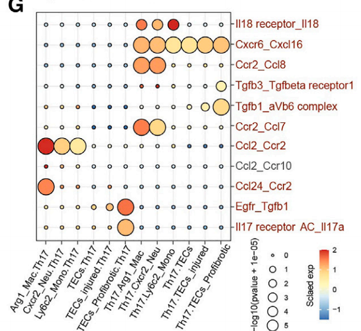
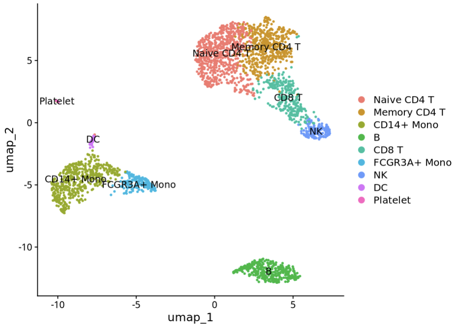
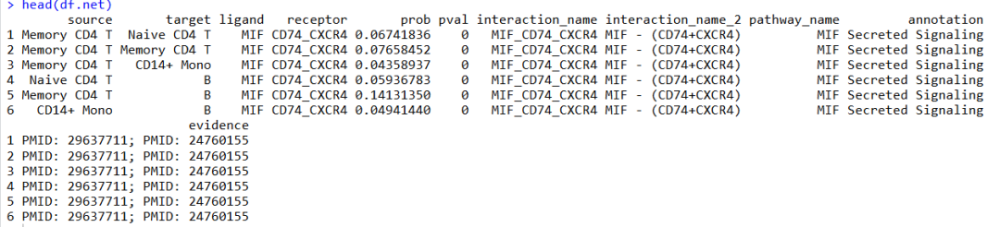
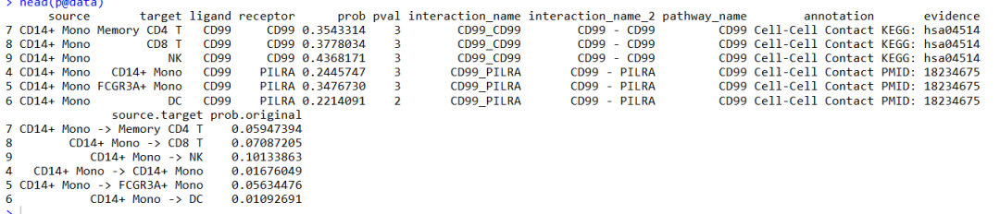
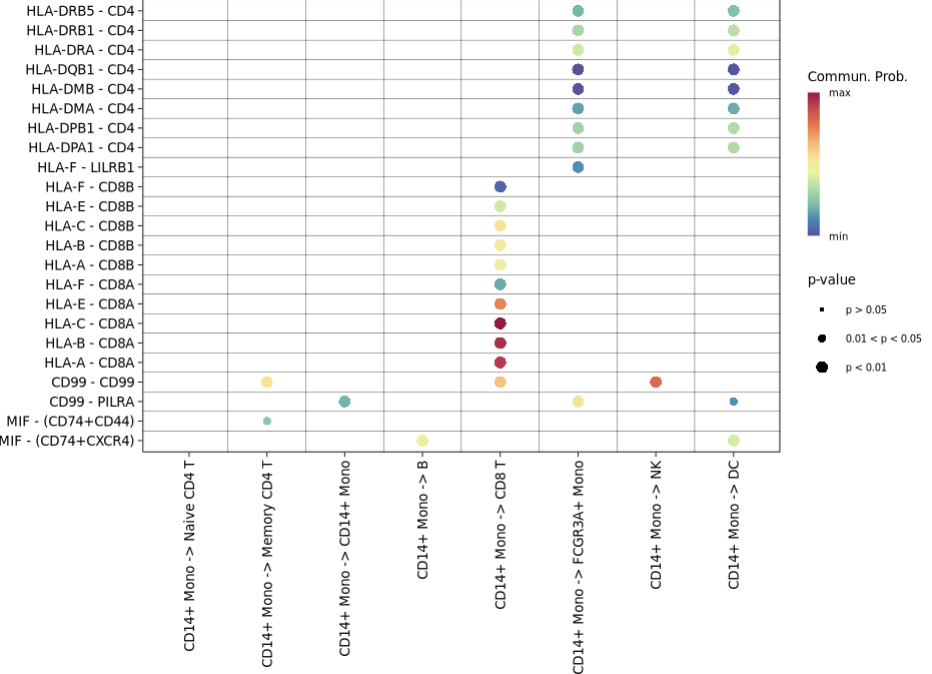
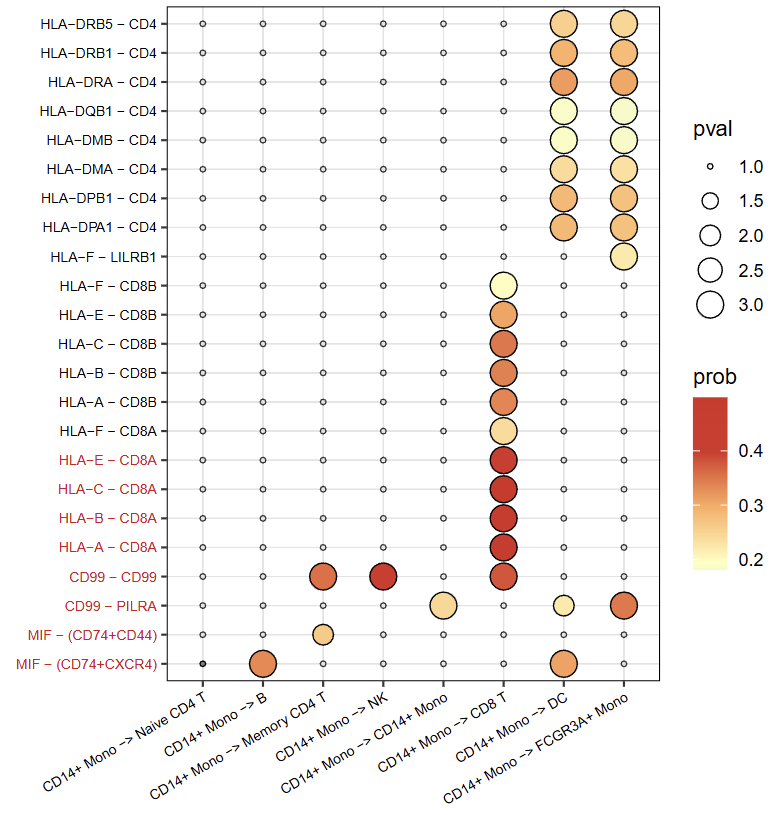

# 好看的高分杂志同款单细胞通讯结果气泡图

- 专辑：绘图小技巧2026
- 公众号：生信技能树
- 发布时间：2026-03-10 23:09
- 原文：[微信公众平台](https://mp.weixin.qq.com/s?__biz=MzAxMDkxODM1Ng%3D%3D&mid=2247550178&idx=1&sn=cb6e64cb4ef19ec076ca9636f95602f9&chksm=9b4b4459ac3ccd4f1f8be21045a3221b49f4edee949329cf0672325a30780006a4fe5a49f7bf)

---
>
>
> 这篇文献于2023年10月4号发表在Mol Ther（12.4/Q1），文献标题为：《**Single-cell dissection of cellular and molecular features underlying mesenchymal stem cell therapy in ischemic acute kidney injury**》。里面的细胞通讯结果和含义如下。

结果描述：

几种配体-受体对（IL18-IL18r1、Ccl2-Ccr2 和 Cxcl16-Cxcr6）可能有助于炎症性单核细胞招募 Th17 细胞（图 5G）。Th17 细胞还高表达 Tgfb1/3 和 Il17a RNA，提示其与表达 Tgfbr1、aVb6 复合物和 Il17ra/c 的促纤维化肾小管上皮细胞存在细胞间互作（图 5G）。



>
>
> Figure 5. MSC treatment suppressed the activation of Th17 cells and secretion of TGF-b1 (G) Interaction analysis for immune cell subsets and TEC subsets showing significant receptor-ligand pairs

有个小疑问：但是上面那个图的y轴名字我感觉有点问题，好像不是按照配体\_\_受体的格式放的？

## 数据读取

上面文献的数据，我们有这些稿子都用到了：

数据读取见之前的推文：[创建Seurat对象时忽略的两个参数竟然有这样的功能？](https://mp.weixin.qq.com/s?__biz=MzAxMDkxODM1Ng%3D%3D&mid=2247539626&idx=3&sn=3777fe488001afe9e6e72c824367a7fa#wechat_redirect)

数据注释见推文：[单细胞数据重新挖掘会有什么意外惊喜吗？（IF=12.4/Q1）](https://mp.weixin.qq.com/s?__biz=MzAxMDkxODM1Ng%3D%3D&mid=2247540930&idx=1&sn=609ca51dad791c1691cf08b4bc1048f7#wechat_redirect)

可视化：[高分杂志同款单细胞堆叠小提琴图：Mol Ther（IF=12.4/Q1）](https://mp.weixin.qq.com/s?__biz=MzAxMDkxODM1Ng%3D%3D&mid=2247540944&idx=1&sn=2155a2274a710a3eb1127ffc4bf491a9#wechat_redirect)

如果你想要同款数据，可以联系微信：Biotree123 或者百度网盘：链接: https://pan.baidu.com/s/1l8fMsokPOoo_sluGf4in4g?pwd=4ax2 提取码: 4ax2

当然任何一个做了注释或者分群的单细胞数据seurat对象都可以，再加上自己精心挑选的想展示的marker基因，这里的marker基因为每种细胞亚群中特异性表达的，也可以是其他的你想要展示的基因~

这里上面数据比较大，我直接用经典的pbmc3k了：

```r
rm(list=ls())
getOption('timeout')
options(timeout=10000)
library(SeuratData) #加载seurat数据集
library(Seurat)
library(tidyverse)
library(CellChat)
library(patchwork)
packageVersion("CellChat")

# InstallData("pbmc3k")
data("pbmc3k")
sce <- UpdateSeuratObject(pbmc3k)
table(sce$seurat_annotations)
colnames(sce@meta.data)
dim(sce)
# 去掉没有注释信息的细胞
sce <- sce[ , which(!is.na(sce@meta.data$seurat_annotations))]
sce <- sce %>%
  NormalizeData %>%
  FindVariableFeatures %>%
  ScaleData %>%
  RunPCA() %>%
  FindNeighbors(dims = 1:10, verbose = FALSE) %>%
  FindClusters(resolution = 0.5, verbose = FALSE) %>%
  RunUMAP(dims = 1:10)

sce
table(Idents(sce))
Idents(sce) <- "seurat_annotations"
DimPlot(sce,label = T)
```



## cellchat分析

这里也是大家很熟悉的步骤啦：

```r
## 1.输入数据
# For the gene expression data matrix, genes should be in rows with rownames and cells in columns with colnames.
# Normalized data (e.g., library-size normalization and then log-transformed with a pseudocount of 1) is required
# as input for CellChat analysis
data.input = sce@assays$RNA@data # normalized data matrix
data.input[1:4,1:4]
meta = sce@meta.data[, "seurat_annotations",drop=F] # a dataframe with rownames containing cell mata data
colnames(meta) <- "labels"
head(meta)
table(meta)

## 2.创建对象
cellchat <- createCellChat(object = data.input, meta = meta, group.by = "labels")
cellchat
levels(cellchat@idents) # show factor levels of the cell labels
groupSize <- as.numeric(table(cellchat@idents)) # number of cells in each cell group
groupSize


## 3.数据库
CellChatDB <- CellChatDB.human # use CellChatDB.mouse if running on mouse data
showDatabaseCategory(CellChatDB)

# use all CellChatDB except for "Non-protein Signaling" for cell-cell communication analysis
CellChatDB.use <- subsetDB(CellChatDB)
# set the used database in the object
cellchat@DB <- CellChatDB.use
cellchat


## 4.鉴定亚群高表达基因
# subset the expression data of signaling genes for saving computation cost
cellchat <- subsetData(cellchat) # This step is necessary even if using the whole database
future::plan("multisession", workers = 20) # do parallel
# CellChat identifies over-expressed ligands or receptors in one cell group
cellchat <- identifyOverExpressedGenes(cellchat)
cellchat <- identifyOverExpressedInteractions(cellchat)
cellchat


## 5.计算probability
cellchat <- computeCommunProb(cellchat, type = "triMean")
#> triMean is used for calculating the average gene expression per cell group.


## 6.通路水平的通讯
cellchat <- computeCommunProbPathway(cellchat)


## 7.计算汇总的通讯网络
cellchat <- aggregateNet(cellchat)


## 8.提取细胞通讯结果
# returns a data frame consisting of all the inferred cell-cell communications at the level of ligands/receptors
# 默认 thresh ：threshold of the p-value for determining significant interaction
df.net <- subsetCommunication(cellchat, thresh = 0.05)
head(df.net)
```

通讯的结果就是这一张表格：



先保存一下结果：

```r
save(cellchat, file = "cellchat.RData")
```

## 绘图

先来个基础图，从基础图里面得到数据然后用ggplot2做个性化：

```r
# 这里的数字为注释水平的顺序，从1开始，比如 5表示 "CD8 T"
levels(cellchat@idents) # show factor levels of the cell labels
# [1] "Naive CD4 T"  "Memory CD4 T" "CD14+ Mono"   "B"            "CD8 T"        "FCGR3A+ Mono" "NK"           "DC"           "Platelet"

# 指定通路
unique(df.net$pathway_name)
pairLR.use <- extractEnrichedLR(cellchat, signaling = c("MIF","CD99","MHC-I","MHC-II"))
pairLR.use

# 基础散点图
p <- netVisual_bubble(cellchat, sources.use = c(3), targets.use = c(1,2,3,4,5,6,7,8), remove.isolate = FALSE,pairLR.use = pairLR.use,
                      grid.on=T,color.grid = "black")
p
head(p@data)
```



默认的就是这个丑图：



### 美化开始！

看看颜色范围，设置x轴展示顺序：

```r
# 看颜色范围
range(p$data$prob,na.rm = T)
summary(p$data$prob,na.rm = T)
dt <- p@data
head(dt)
unique(dt$source.target)
dt$source.target <- factor(dt$source.target, levels = c("CD14+ Mono -> Naive CD4 T","CD14+ Mono -> B",
                                                        "CD14+ Mono -> Memory CD4 T","CD14+ Mono -> NK","CD14+ Mono -> CD14+ Mono",
                                                        "CD14+ Mono -> CD8 T","CD14+ Mono -> DC","CD14+ Mono -> FCGR3A+ Mono") )
```

这个图有个地方：

>
>
> 每一条背景格子线上面没有通讯结果的地方都有一个小点，上面的默认图是没有的，这里添加一个图层放在最底层。

```r
# 创建网格线交点
x_positions <- 1:8
y_positions <- 1:23
grid_points <- expand.grid(x = x_positions, y = y_positions)
```

所有美化部分都放一起：

```r
p1 <- ggplot(data = grid_points, aes(x = x, y = y)) +
  # 添加网格线
  geom_hline(yintercept = y_positions, color = "gray90", linewidth = 0.2) +
  geom_vline(xintercept = x_positions, color = "gray90", linewidth = 0.2) +
# # 网格交点上的小点
  geom_point(size = 1, color = "gray20",shape = 21,stroke = 0.5) +
  geom_point(data = dt, aes(x = source.target, y = interaction_name_2,fill = prob, size = pval), color = 'black', shape = 21,stroke = 0.5) + # 带边的气泡图
  scale_fill_gradientn(values = seq(-0.5,1,0.1),colours = c("#4575b4","#abd9e9","#ffffbf","#fdae61","#d73027","#d62b23")) +
  scale_x_discrete() +
  scale_y_discrete() +
  xlab("") + ylab("") +
  theme_bw() +
  theme(
    panel.grid.major = element_line(color = "gray80",linewidth = 0.2,linetype = "solid" ),     # 颜色
    panel.grid.minor = element_line( color = "gray90", linewidth = 0.2,linetype = "solid"),
    panel.border = element_rect(color = "black", fill = NA, linewidth = 0.5),
    axis.line = element_blank(),
    axis.text.x = element_text(angle = 40, hjust = 1,colour = "black",size = 7),  # 旋转45度，右对齐
    axis.text.y = element_text(hjust = 1,size = 7,color = rep(c("#d10a18","black"),times=c(8,15))),  # 旋转45度，右对齐
  )
p1


# 保存
ggsave(filename = "cellchat_bubble-1.pdf", width = 5.6, height = 5.9,plot = p1)
```



完美！

友情转发：

- [生信入门&数据挖掘线上直播课2026年3月班](https://mp.weixin.qq.com/s?__biz=MzAxMDkxODM1Ng%3D%3D&mid=2247549672&idx=1&sn=e376079bdfdc8ffd8f8c58ee3067ae15#wechat_redirect)，你的生物信息学入门课

- [生信故事会](https://mp.weixin.qq.com/mp/appmsgalbum?__biz=MzAxMDkxODM1Ng%3D%3D&action=getalbum&album_id=1679199708449144836#wechat_redirect)，来看看他们的生信入门故事

- [生信马拉松答疑专辑](https://mp.weixin.qq.com/mp/appmsgalbum?__biz=MzAxMDkxODM1Ng%3D%3D&action=getalbum&album_id=3690970204957147140#wechat_redirect)，获取你的生信专属答疑

- [花小钱办大事—你生信入门的第一款服务器](https://mp.weixin.qq.com/s?__biz=MzUzMTEwODk0Ng%3D%3D&mid=2247536917&idx=1&sn=a38efde1fd1b01616fa2bf961926beab#wechat_redirect)

<!-- wechat-article-fetcher: complete -->
