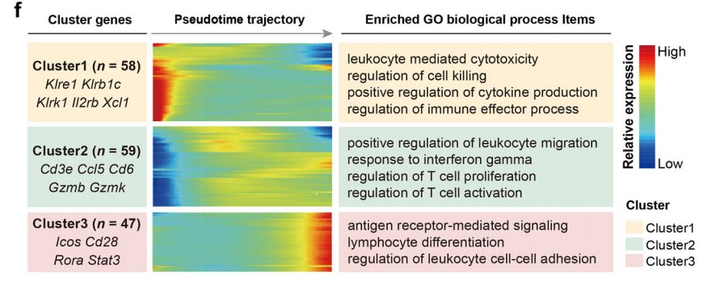
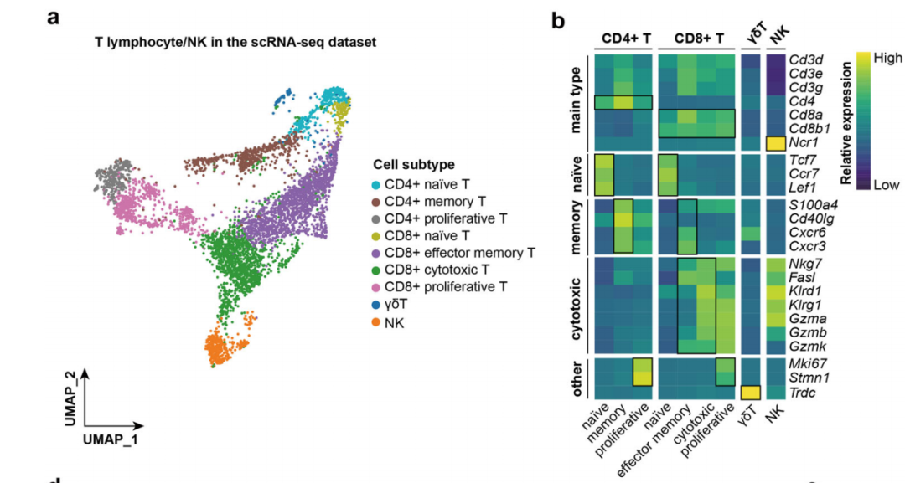
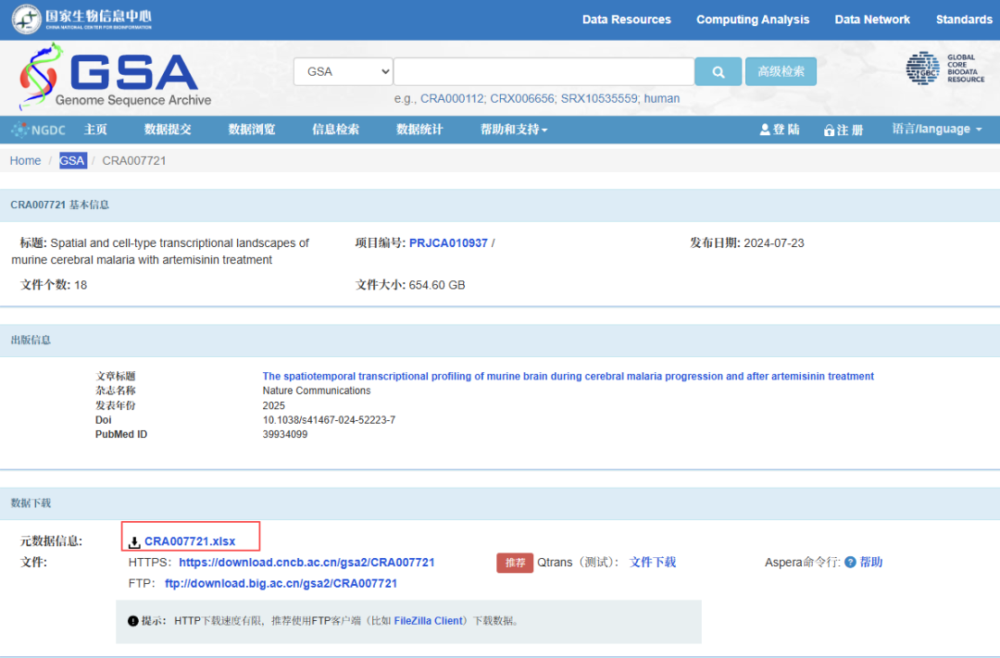
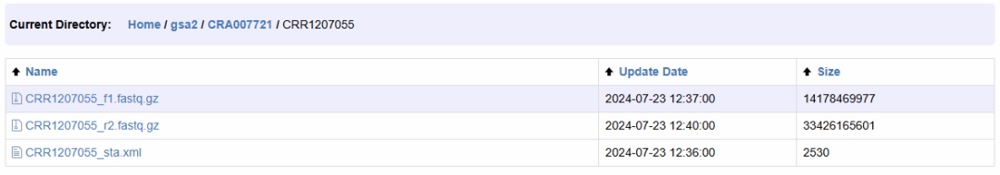
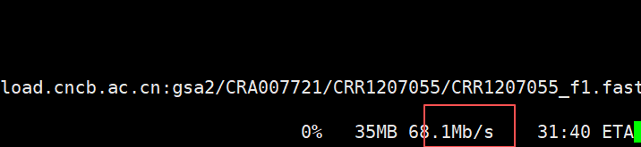

# NC杂志同款的单细胞拟时序分析图（上篇）

- 专辑：绘图小技巧2026
- 公众号：生信技能树
- 发布时间：2026-03-16 23:15
- 原文：[微信公众平台](https://mp.weixin.qq.com/s?__biz=MzAxMDkxODM1Ng%3D%3D&mid=2247550399&idx=1&sn=cf8bf20551cfa7a02fee7842fd3902a5&chksm=9b4b4504ac3ccc124bd4a866d06807604271ffb3781946ee0f512110dfcd69a883e5f331c3f6)

---
>
>
> 绘图时间！看看这篇NC杂志：2025年2月11号发表在Nature Communications杂志，文献标题为《The spatiotemporal transcriptional profiling of murine brain during cerebral malaria progression and after artemisinin treatment》。里面有个拟时序分析图心仪很久了，今天就来画它！

图如下：

为了进一步揭示CD8+细胞毒性T细胞的细胞状态转变，作者进行了拟时序分析。下面这个图描绘的是沿轨迹显著变化的拟时序差异表达基因（DEGs），并对每个聚类基因集进行了GO富集分析（图5f）。

**聚类1基因**（n=58，以Klre1、Klrk1和Xcl1为代表）在轨迹起始端高表达，参与白细胞介导的细胞毒性和细胞杀伤。

**聚类2基因**（n=59）在轨迹中段富集，主要与白细胞迁移和T细胞活化相关。

**聚类3基因**（n=47），如Icos、Cd28及信号转导与转录激活因子3（Stat3），在轨迹末端高表达，参与抗原受体介导的信号传导和淋巴细胞分化。



图注如下：

>
>
> Fig. 5 \| Characterizing the activated CD8+ cytotoxic T cells in mice with ECM
>
> f Pseudotemporal expression pattern analysis shows the representative DEGs in 3 clusters, along with the inferred trajectory and enriched biological processes terms, colored by cluster types.

## 数据背景

上面的数据中T细胞的亚群聚类结果如下：5,088 lymphocytes细胞，9个亚类。



作者将数据放到了 Genome Sequence Archive (GSA) 数据库中，编号如下：https://ngdc.cncb.ac.cn/gsa/browse/CRA007721

看起来作者只放了fq数据，怎么办呢？从fq开始干起！

## 数据下载

搜到一个老板以前的帖子：[使用aspera加速从中国的GSA数据库下载测序文件](https://mp.weixin.qq.com/s?__biz=MzAxMDkxODM1Ng%3D%3D&mid=2247535260&idx=1&sn=059a6c42d0f0b9ebc133fcfe1d2df3c9#wechat_redirect)

#### 样品的测序信息如下，包括fq文件地址：



在这里获得秘钥（每个人应该不一样或者会更新）：aspera01.openssh


aspera01.openssh的内容如下：

```r
# [REDACTED: embedded private key removed by plot-code-retriever safety policy]
```

#### 根据提供的ftp地址可以看到目录的结构：

整个项目：https://download.cncb.ac.cn/gsa2/CRA007721/

某个样本：https://download.cncb.ac.cn/gsa2/CRA007721/CRR1207055/



网站给的是下载整个项目的命令：

```r
ascp -P33001 -i aspera01.openssh -QT -l100m -k1 -d aspera01@download.cncb.ac.cn:gsa2/CRA007721/  ./
```

但是那个感觉很容易断，我这里写个for循环每个样本fq单独下载好了，现在失败的就重新运行那个单独的命令就好了。

#### 搞一个CRR测序run的 id.txt：

从 CRA007721.xlsx文件里面可以获取

```r
CRR540126
CRR540127
CRR540128
CRR540129
CRR540131
CRR540132
CRR540133
CRR540134
CRR1207055
```

#### 下载单个看看：

速度还可以！

```r
# 单细胞
ascp -P33001 -i ./aspera01.openssh -QT -l100m -k1 -d aspera01@download.cncb.ac.cn:gsa2/CRA007721/CRR1207055/CRR1207055_f1.fastq.gz ./
```



#### 批量下载：

```r
cat id.txt |while read id
do
 echo "ascp -P33001 -i ./aspera01.openssh -QT -l100m -k1 -d aspera01@download.cncb.ac.cn:gsa2/CRA007721/$id/${id}_f1.fastq.gz ./"
 echo "ascp -P33001 -i ./aspera01.openssh -QT -l100m -k1 -d aspera01@download.cncb.ac.cn:gsa2/CRA007721/$id/${id}_r2.fastq.gz ./"
 echo "ascp -P33001 -i ./aspera01.openssh -QT -l100m -k1 -d aspera01@download.cncb.ac.cn:gsa2/CRA007721/$id/${id}_sta.xml ./"
done >down.sh
```

down.sh内容如下：

```r
ascp -P33001 -i ./aspera01.openssh -QT -l100m -k1 -d aspera01@download.cncb.ac.cn:gsa2/CRA007721/CRR540126/CRR540126_f1.fastq.gz ./
ascp -P33001 -i ./aspera01.openssh -QT -l100m -k1 -d aspera01@download.cncb.ac.cn:gsa2/CRA007721/CRR540126/CRR540126_r2.fastq.gz ./
ascp -P33001 -i ./aspera01.openssh -QT -l100m -k1 -d aspera01@download.cncb.ac.cn:gsa2/CRA007721/CRR540126/CRR540126_sta.xml ./
ascp -P33001 -i ./aspera01.openssh -QT -l100m -k1 -d aspera01@download.cncb.ac.cn:gsa2/CRA007721/CRR540127/CRR540127_f1.fastq.gz ./
ascp -P33001 -i ./aspera01.openssh -QT -l100m -k1 -d aspera01@download.cncb.ac.cn:gsa2/CRA007721/CRR540127/CRR540127_r2.fastq.gz ./
ascp -P33001 -i ./aspera01.openssh -QT -l100m -k1 -d aspera01@download.cncb.ac.cn:gsa2/CRA007721/CRR540127/CRR540127_sta.xml ./
ascp -P33001 -i ./aspera01.openssh -QT -l100m -k1 -d aspera01@download.cncb.ac.cn:gsa2/CRA007721/CRR540128/CRR540128_f1.fastq.gz ./
ascp -P33001 -i ./aspera01.openssh -QT -l100m -k1 -d aspera01@download.cncb.ac.cn:gsa2/CRA007721/CRR540128/CRR540128_r2.fastq.gz ./
ascp -P33001 -i ./aspera01.openssh -QT -l100m -k1 -d aspera01@download.cncb.ac.cn:gsa2/CRA007721/CRR540128/CRR540128_sta.xml ./
ascp -P33001 -i ./aspera01.openssh -QT -l100m -k1 -d aspera01@download.cncb.ac.cn:gsa2/CRA007721/CRR540129/CRR540129_f1.fastq.gz ./
ascp -P33001 -i ./aspera01.openssh -QT -l100m -k1 -d aspera01@download.cncb.ac.cn:gsa2/CRA007721/CRR540129/CRR540129_r2.fastq.gz ./
ascp -P33001 -i ./aspera01.openssh -QT -l100m -k1 -d aspera01@download.cncb.ac.cn:gsa2/CRA007721/CRR540129/CRR540129_sta.xml ./
ascp -P33001 -i ./aspera01.openssh -QT -l100m -k1 -d aspera01@download.cncb.ac.cn:gsa2/CRA007721/CRR540131/CRR540131_f1.fastq.gz ./
ascp -P33001 -i ./aspera01.openssh -QT -l100m -k1 -d aspera01@download.cncb.ac.cn:gsa2/CRA007721/CRR540131/CRR540131_r2.fastq.gz ./
ascp -P33001 -i ./aspera01.openssh -QT -l100m -k1 -d aspera01@download.cncb.ac.cn:gsa2/CRA007721/CRR540131/CRR540131_sta.xml ./
ascp -P33001 -i ./aspera01.openssh -QT -l100m -k1 -d aspera01@download.cncb.ac.cn:gsa2/CRA007721/CRR540132/CRR540132_f1.fastq.gz ./
ascp -P33001 -i ./aspera01.openssh -QT -l100m -k1 -d aspera01@download.cncb.ac.cn:gsa2/CRA007721/CRR540132/CRR540132_r2.fastq.gz ./
ascp -P33001 -i ./aspera01.openssh -QT -l100m -k1 -d aspera01@download.cncb.ac.cn:gsa2/CRA007721/CRR540132/CRR540132_sta.xml ./
ascp -P33001 -i ./aspera01.openssh -QT -l100m -k1 -d aspera01@download.cncb.ac.cn:gsa2/CRA007721/CRR540133/CRR540133_f1.fastq.gz ./
ascp -P33001 -i ./aspera01.openssh -QT -l100m -k1 -d aspera01@download.cncb.ac.cn:gsa2/CRA007721/CRR540133/CRR540133_r2.fastq.gz ./
ascp -P33001 -i ./aspera01.openssh -QT -l100m -k1 -d aspera01@download.cncb.ac.cn:gsa2/CRA007721/CRR540133/CRR540133_sta.xml ./
ascp -P33001 -i ./aspera01.openssh -QT -l100m -k1 -d aspera01@download.cncb.ac.cn:gsa2/CRA007721/CRR540134/CRR540134_f1.fastq.gz ./
ascp -P33001 -i ./aspera01.openssh -QT -l100m -k1 -d aspera01@download.cncb.ac.cn:gsa2/CRA007721/CRR540134/CRR540134_r2.fastq.gz ./
ascp -P33001 -i ./aspera01.openssh -QT -l100m -k1 -d aspera01@download.cncb.ac.cn:gsa2/CRA007721/CRR540134/CRR540134_sta.xml ./
ascp -P33001 -i ./aspera01.openssh -QT -l100m -k1 -d aspera01@download.cncb.ac.cn:gsa2/CRA007721/CRR1207055/CRR1207055_f1.fastq.gz ./
ascp -P33001 -i ./aspera01.openssh -QT -l100m -k1 -d aspera01@download.cncb.ac.cn:gsa2/CRA007721/CRR1207055/CRR1207055_r2.fastq.gz ./
ascp -P33001 -i ./aspera01.openssh -QT -l100m -k1 -d aspera01@download.cncb.ac.cn:gsa2/CRA007721/CRR1207055/CRR1207055_sta.xml ./
```

运行：宽带就那么大，这里不需要批量投递任务并行运行

```r
nohup bash down.sh 1>down.log 2>&1 &
```

今天分享到这里~

友情转发：

- [生信入门&数据挖掘线上直播课2026年3月班](https://mp.weixin.qq.com/s?__biz=MzAxMDkxODM1Ng%3D%3D&mid=2247549672&idx=1&sn=e376079bdfdc8ffd8f8c58ee3067ae15#wechat_redirect)，你的生物信息学入门课

- [生信故事会](https://mp.weixin.qq.com/mp/appmsgalbum?__biz=MzAxMDkxODM1Ng%3D%3D&action=getalbum&album_id=1679199708449144836#wechat_redirect)，来看看他们的生信入门故事

- [生信马拉松答疑专辑](https://mp.weixin.qq.com/mp/appmsgalbum?__biz=MzAxMDkxODM1Ng%3D%3D&action=getalbum&album_id=3690970204957147140#wechat_redirect)，获取你的生信专属答疑

- [花小钱办大事—你生信入门的第一款服务器](https://mp.weixin.qq.com/s?__biz=MzUzMTEwODk0Ng%3D%3D&mid=2247536917&idx=1&sn=a38efde1fd1b01616fa2bf961926beab#wechat_redirect)

<!-- wechat-article-fetcher: complete -->
