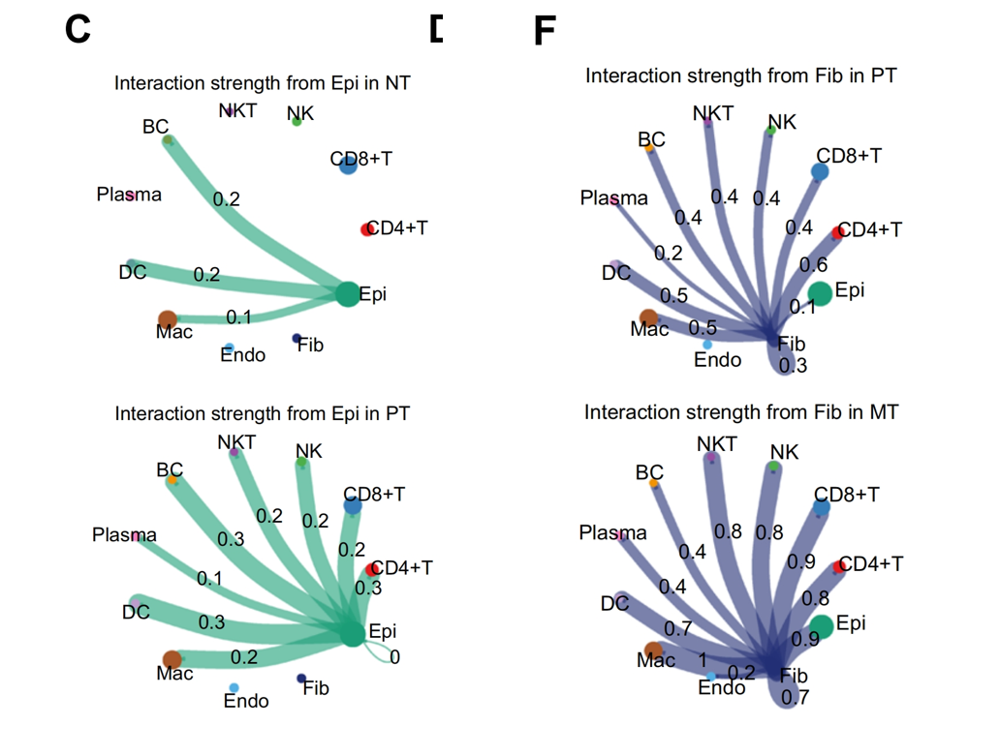
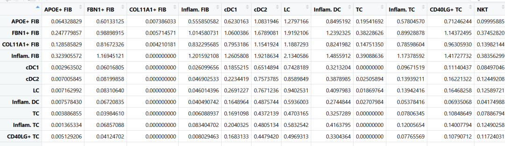
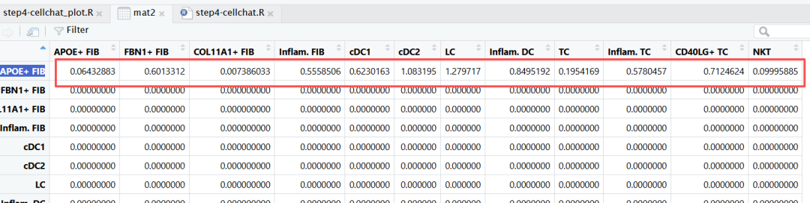
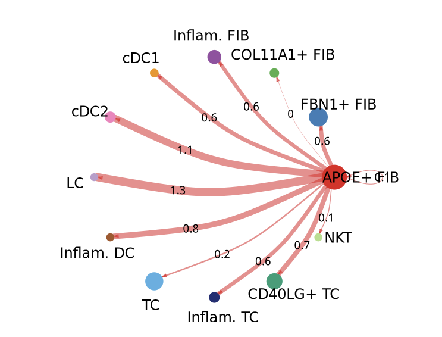
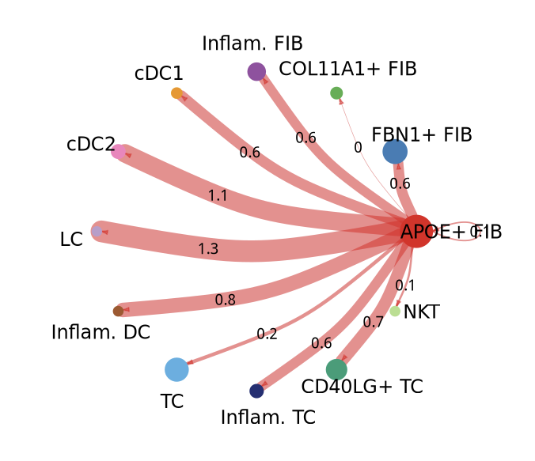
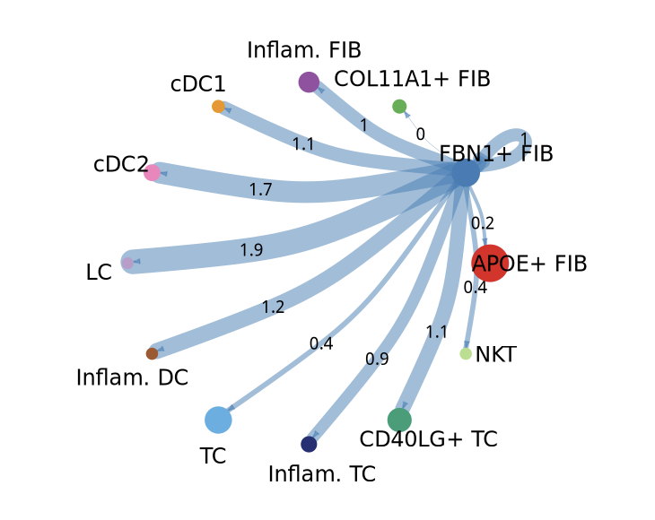
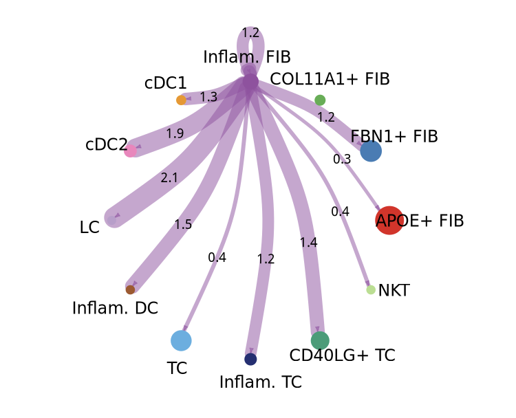

# cellchat可视化：好看的细胞通讯互作贝壳图

- 专辑：绘图小技巧2026
- 公众号：生信技能树
- 发布时间：2026-04-01 23:39
- 原文：[微信公众平台](https://mp.weixin.qq.com/s?__biz=MzAxMDkxODM1Ng%3D%3D&mid=2247550763&idx=1&sn=cb468e8ecad0fff9bc2da46f2ed31648&chksm=9b4b4790ac3cce86a0776ba122f66532df4af03093ac5d77204d669df35bf3c2af0656ee765b)

---
> 2024年2月27号发表在 J Transl Med. 杂志，文献标题为《Integrative single-cell transcriptomic analyses reveal the cellular ontological and functional heterogeneities of primary and metastatic liver tumors》。

如果你还没有生信入门，看看我们4月份全新升级的课程吧：[生信入门&数据挖掘线上直播课2026年4月班](https://mp.weixin.qq.com/s?__biz=MzAxMDkxODM1Ng%3D%3D&mid=2247550580&idx=1&sn=902a5d5279eff6fd8fca564f981f8c55#wechat_redirect)

这个图使用CellChat进行了细胞间相互作用分析，以探索每组中由配体-受体介导的细胞间通讯。**图C** 展示了恶性肝细胞（癌细胞）向其他细胞类型发送信号的能力，比较了正常组织和原发灶的差异（上为NT，下为PT）。**图F** 展示了成纤维细胞向其他细胞类型发送信号的能力，比较了原发灶和转移灶的差异（上为PT，下为NT）。



图注如下：

> Fig. 7 Cell–cell interaction networks in primary liver tumors and metastatic liver tumors
>
> C.Circle plot showing the interaction intensities of the outgoing interactions of malignant hepatocytes with other cell types in NTs (top) and PTs (bottom), respectively
>
> F.Circle plot showing the interaction intensities of the outgoing interactions of fibroblasts with other cell types in PTs (top) and MTs (bottom), respectively

我们前面的结果：

细胞通讯分析结果：[NC高分杂志cellchat细胞通讯结果个性化绘制之弦图](https://mp.weixin.qq.com/s?__biz=MzAxMDkxODM1Ng%3D%3D&mid=2247544913&idx=1&sn=fb5ab3ded41912c8019a81a54f76d685#wechat_redirect)

https://htmlpreview.github.io/?https://github.com/jinworks/CellChat/blob/master/tutorial/CellChat-vignette.html

## 示例数据

本来要使用上面教程里面的数据，都跑好了细胞通讯，但是有点问题。

我们这次就用官网的数据跑个cellchat分析吧。

数据下载的地方：https://figshare.com/articles/dataset/scRNA-seq_data_of_human_skin_from_patients_with_atopic_dermatitis/24470719?file=42997198

基本的分析流程如下：

```r
library(CellChat)
packageVersion("CellChat") # [1] ‘2.2.0’
library(patchwork)
library(Hmisc)
library(tidyverse)
library(circlize)
library(ggsci)
library(igraph)
library(gtools)
library(ComplexHeatmap)

ptm = Sys.time()
# This is a combined data from two biological conditions: normal and diseases
load("data_humanSkin_CellChat.rda")
data.input = data_humanSkin$data# normalized data matrix
meta = data_humanSkin$meta# a dataframe with rownames containing cell mata data
cell.use = rownames(meta)[meta$condition == "LS"] # extract the cell names from disease data

# Subset the input data for CelChat analysis
data.input = data.input[, cell.use]
meta = meta[cell.use, ]
unique(meta$labels) # check the cell labels

# 创建对象
cellchat <- createCellChat(object = data.input, meta = meta, group.by = "labels")
levels(cellchat@idents) # check the cell types
CellChatDB <- CellChatDB.human # use CellChatDB.mouse if running on mouse data
showDatabaseCategory(CellChatDB)

dplyr::glimpse(CellChatDB$interaction) # show the structure of the database
unique(CellChatDB$interaction$annotation) # check the annotation of interactions

# use a subset of CellChatDB for cell-cell communication analysis
CellChatDB.use <- subsetDB(CellChatDB, search = "Secreted Signaling", key = "annotation") # use Secreted Signaling
CellChatDB.use <- CellChatDB # use all databases
cellchat@DB <- CellChatDB.use # set the used database in the object
cellchat <- subsetData(cellchat) # subset the expression data of signaling genes for saving computation cost
cellchat <- identifyOverExpressedGenes(cellchat)
cellchat <- identifyOverExpressedInteractions(cellchat)
cellchat <- computeCommunProb(cellchat, type = "triMean")
cellchat <- filterCommunication(cellchat, min.cells = 10)
df.net <- subsetCommunication(cellchat)

# 在信号通路水平上推断细胞间通讯
cellchat <- computeCommunProbPathway(cellchat)
# 计算聚合的细胞间通讯网络
cellchat <- aggregateNet(cellchat)
save(cellchat, file = "cellchat.RData")
```

到这里标准的细胞亚群间的细胞通讯就做完了。

## 绘图

上面的细胞通讯图类似一个贝壳，所以我们叫贝壳图，展示的是某个亚群与其他所有亚群之间的通讯情况，边的大小就是通讯的强度 pro值（这个值其实有个问题一直没去探索，就是很多数据的结果这里这个值真的超级小，达到了10E-7这种级别的小，你可以看看自己的结果是不是也这样）。

prob含义：[cellchat细胞通讯中 prob 与 pval 的含义是什么?](https://mp.weixin.qq.com/s?__biz=MzAxMDkxODM1Ng%3D%3D&mid=2247536318&idx=1&sn=cf0c131962bac2313a172952b91b1e1f#wechat_redirect)

### 整理数据：

```r
load("cellchat.RData")
ls()
cellchat
head(cellchat@meta)
table(cellchat@meta$labels)

# 检查每个细胞群组发出的信号
# “Microglia”（小胶质细胞）
mat <- cellchat@net$weight
# par(mfrow = c(3,4), xpd=TRUE)
nrow(mat)
dimnames(mat)

groupSize <- as.numeric(table(cellchat@idents))
groupSize
```

mat矩阵的行列都是细胞亚群。

值表示每一行的细胞亚群发送信号到每列的细胞亚群，内容如下：



上面的单个贝壳图，需要构造一个单独的矩阵，只保留一行有值，其他值都是0。

比如这里我们绘制 **APOE+ FIB** 亚群与其他所有亚群的贝壳通讯：

```r
i <- 1
mat2 <- matrix(0, nrow = nrow(mat), ncol = ncol(mat), dimnames = dimnames(mat))
mat2[i, ] <- mat[i, ] # 只有i细胞亚群 与所有的列细胞间有连边
mat2
max(mat)
max(mat2)
```



mat2 的内容就是上面这样。

### **APOE+ FIB** 亚群绘图

```r
netVisual_circle(mat2,
                 vertex.weight = groupSize,
                 weight.scale = T,
                 label.edge = T, # 边上显示pro值
                 alpha.edge = 0.5, # 修改边的透明度
                 edge.width.max = 15, # 修改边的粗细
                 edge.weight.max = max(mat),
                 title.name = rownames(mat))
```



可以调整边的粗细变得更萌：

```r
netVisual_circle(mat2,
                 vertex.weight = groupSize,
                 weight.scale = T,
                 label.edge = T, # 边上显示pro值
                 alpha.edge = 0.5, # 修改边的透明度
                 edge.width.max = 20, # 修改边的粗细
                 edge.weight.max = max(mat),
                 title.name = rownames(mat))
```



边的颜色与细胞亚群那个点的颜色是一致的，我们换个亚群看看：

```r
# 边的颜色与点的颜色是一样的
i <- 2
mat2 <- matrix(0, nrow = nrow(mat), ncol = ncol(mat), dimnames = dimnames(mat))
mat2[i, ] <- mat[i, ] # 只有i细胞亚群 与所有的列细胞间有连边
mat2
max(mat)
max(mat2)
netVisual_circle(mat2,
                 vertex.weight = groupSize,
                 weight.scale = T,
                 label.edge = T, # 边上显示pro值
                 alpha.edge = 0.5, # 修改边的透明度
                 edge.width.max = 20,
                 edge.weight.max = max(mat),
                 title.name = rownames(mat))
```



```r
# 边的颜色与点的颜色是一样的
i <- 2
mat2 <- matrix(0, nrow = nrow(mat), ncol = ncol(mat), dimnames = dimnames(mat))
mat2[i, ] <- mat[i, ] # 只有第一行细胞亚群 Microglia 与所有的列细胞间有连边
mat2
max(mat)
max(mat2)
netVisual_circle(mat2,
                 vertex.weight = groupSize,
                 weight.scale = T,
                 label.edge = T, # 边上显示pro值
                 alpha.edge = 0.5, # 修改边的透明度
                 edge.width.max = 20,
                 edge.weight.max = max(mat),
                 title.name = rownames(mat))
```



是不是好看起来啦！

友情转发：

- [生信入门&数据挖掘线上直播课2026年4月班](https://mp.weixin.qq.com/s?__biz=MzAxMDkxODM1Ng%3D%3D&mid=2247550580&idx=1&sn=902a5d5279eff6fd8fca564f981f8c55#wechat_redirect)，AI加持的生信入门课

- [生信故事会](https://mp.weixin.qq.com/mp/appmsgalbum?__biz=MzAxMDkxODM1Ng%3D%3D&action=getalbum&album_id=1679199708449144836#wechat_redirect)，来看看他们的生信入门故事

- [生信马拉松答疑专辑](https://mp.weixin.qq.com/mp/appmsgalbum?__biz=MzAxMDkxODM1Ng%3D%3D&action=getalbum&album_id=3690970204957147140#wechat_redirect)，获取你的生信专属答疑

- [GEO数据实战训练直播（学员免收门票）](https://mp.weixin.qq.com/s?__biz=MzAxMDkxODM1Ng%3D%3D&mid=2247549988&idx=1&sn=5b71601f72f465f8010ef1f3e13a3287#wechat_redirect)，课后有大量案例实战训练

- [花小钱办大事—你生信入门的第一款服务器](https://mp.weixin.qq.com/s?__biz=MzUzMTEwODk0Ng%3D%3D&mid=2247536917&idx=1&sn=a38efde1fd1b01616fa2bf961926beab#wechat_redirect)

<!-- wechat-article-fetcher: complete -->
