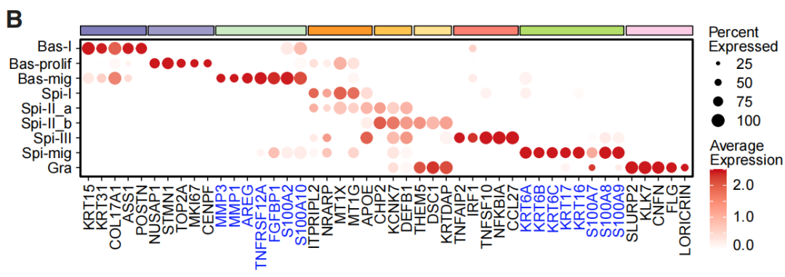
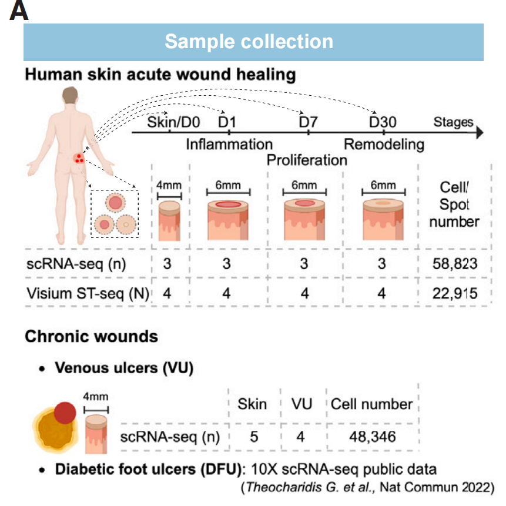
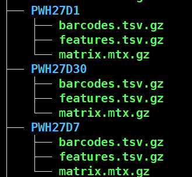
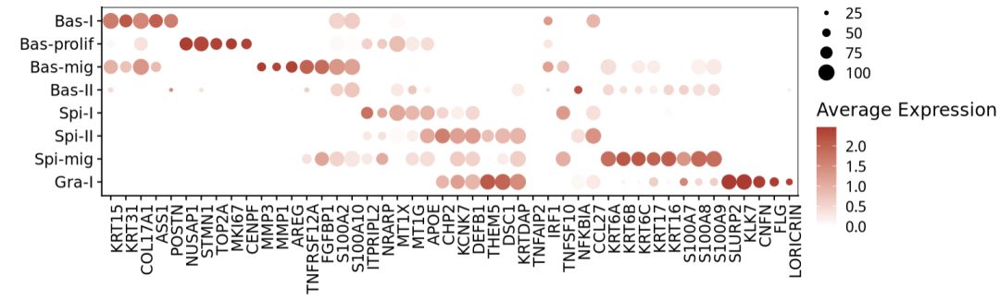
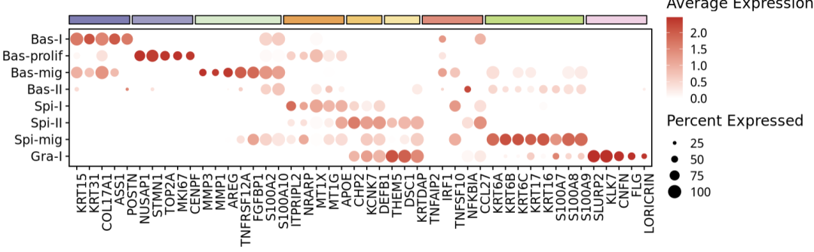

# 顶刊杂志同款高颜值的单细胞maker基因气泡图

- 专辑：绘图小技巧2026
- 公众号：生信技能树
- 发布时间：2026-04-06 22:55
- 原文：[微信公众平台](https://mp.weixin.qq.com/s?__biz=MzAxMDkxODM1Ng%3D%3D&mid=2247550805&idx=1&sn=71d6558cadb9854b13505ea49e6d9a94&chksm=9b4b47eeac3ccef85cfeeae6cfe4784df9d860ede763457c59379f49606bb6dbc4a1035ebb6a)

---
> 今天学习这篇2025年3月6号发表在 Cell Stem Cell 杂志（IF20.4/Q1）上的文献，标题为《Spatiotemporal single-cell roadmap of human skin wound healing》。今天复现里面的这个marker基因气泡图，是不是很好看！

如果你还没有生信入门，看看我们4月份全新升级的课程吧：[生信入门&数据挖掘线上直播课2026年4月班](https://mp.weixin.qq.com/s?__biz=MzAxMDkxODM1Ng%3D%3D&mid=2247550580&idx=1&sn=902a5d5279eff6fd8fca564f981f8c55#wechat_redirect)。

这个图展示的是作者的 keratinocyte 亚群细分的亚群中，挑选的一些marker基因的表达气泡图，也是大部分单细胞文献里面使用的一个。图的上方有注释条。



图注：

Figure 2 Spatiotemporal dissection of human wound re-epithelialization

(A) UMAP of keratinocyte (KC) subclusters.  (B) Dot plot of marker gene expression.

## 图的数据

图来自这个数据，Human skin acute wound single-cell RNA-seq data：https://www.ncbi.nlm.nih.gov/geo/query/acc.cgi?acc=GSE241132

取样情况：



去下载下来，然后整理成下面的这个格式：



### 读取：

```r
###
### Create: Jianming Zeng
### Date:  2023-12-31
### Email: jmzeng1314@163.com
### Blog: http://www.bio-info-trainee.com/
### Forum:  http://www.biotrainee.com/thread-1376-1-1.html
### CAFS/SUSTC/Eli Lilly/University of Macau
### Update Log: 2023-12-31   First version
### Update Log: 2024-12-09   by juan zhang (492482942@qq.com)
###
rm(list=ls())
library(dplyr)
library(Seurat)
library(data.table)
library(ggplot2)
library(patchwork)
library(stringr)
# 创建目录
getwd()
gse <- "GSE241132"
dir.create(gse)

###### step1: 导入数据 ######
samples <- list.dirs("GSE241132/", recursive = F, full.names = F)
samples
scRNAlist <- lapply(samples, function(pro){
#pro <- samples[1]
print(pro)
  folder <- file.path("GSE241132/", pro)
  counts <- Read10X(folder, gene.column = 2)
  sce <- CreateSeuratObject(counts, project=pro, min.cells = 3)
return(sce)
})
names(scRNAlist) <-  samples
scRNAlist

# merge
sce.all <- merge(scRNAlist[[1]], y=scRNAlist[-1], add.cell.ids=samples)
sce.all <- JoinLayers(sce.all) # seurat v5
sce.all

meta <- fread("GSE241132/GSE241132_cell_metadata.txt.gz",data.table = F)
head(meta)
rownames(meta) <- meta$barcode

sce.all <- subset(sce.all, cells = rownames(meta))
sce.all <- AddMetaData(sce.all, metadata = meta)
sce.all

# 查看特征
as.data.frame(sce.all@assays$RNA$counts[1:10, 1:2])
head(sce.all@meta.data, 10)
table(sce.all$orig.ident)
table(sce.all$oldCellTypes_InATACproject)
table(sce.all$newMainCellTypes)
table(sce.all$newCellTypes)
table(sce.all$newCellTypes,sce.all$newMainCellTypes)

library(qs)
qsave(sce.all, file="GSE241132/sce.all.qs")
```

### 提取其中的 keratinocytes 细胞

```r
head(sce.all@meta.data)
kera_sub <- subset(sce.all, newMainCellTypes=="Keratinocyte")
kera_sub

kera_sub <- NormalizeData(kera_sub)
kera_sub <- FindVariableFeatures(kera_sub, nfeatures = 2000)
kera_sub <- ScaleData(kera_sub)
kera_sub <- RunPCA(kera_sub)
```

## 开始绘图

作者挑选的marker：

```r
# manually select the top 5-8 representative markers according to the top20 marker genes
top_repre_markers <- c("KRT15", "KRT31", "COL17A1", "ASS1", "POSTN",
                       "NUSAP1", "STMN1", "TOP2A", "MKI67", "CENPF",
                       "MMP3", "MMP1", "AREG", "TNFRSF12A", "FGFBP1", "S100A2", "S100A10",
                       "ITPRIPL2", "NRARP", "MT1X", "MT1G", "APOE",
                       "CHP2", "KCNK7", "DEFB1",
                       "THEM5", "DSC1", "KRTDAP",
                       "TNFAIP2", "IRF1", "TNFSF10", "NFKBIA", "CCL27",
                       "KRT6A", "KRT6B", "KRT6C", "KRT17", "KRT16", "S100A7", "S100A8", "S100A9",
                       "SLURP2", "KLK7", "CNFN", "FLG", "LORICRIN")
```

这个图气泡的地方很简单：

```r
table(kera_sub$newCellTypes)
fac_levs <- c("Bas-I", "Bas-prolif", "Bas-mig", "Bas-II",
              "Spi-I", "Spi-II","Spi-mig",
              "Gra-I")

kera_sub$upCellTypes <- factor(kera_sub$newCellTypes, levels = rev(fac_levs))
plot_marker <- DotPlot(kera_sub, features = top_repre_markers,
                       group.by = "upCellTypes", cols = c("white", "#cb181d"),
                       dot.scale = 5, col.min = 0, dot.min = 0.1) +
  labs(x="", y="") +
  theme(axis.text.x = element_text(angle = 90, hjust = 1),
        panel.border = element_rect(colour = "black", fill=NA)
        )

plot_marker
```

结果如下：



### 添加上方的注释条

我本来想用老俊俊的 jjAnno 包的，但是我发现老俊俊没有更新这个包了。用起来会报错。这里我用了一下他的源码，抠出来关键的地方，优化一下。

参考的源码：

https://github.com/junjunlab/jjAnno/blob/master/R/annoSegment.R

设置线段的起始点：

```r
xPosition = list(c(1,6,11,18,23,26,29,34,42), # 线段的起点
                 c(5,10,17,22,25,28,33,41,46)) # 线段的终点
yPosition = 9
# 线段颜色
pCol = c('#7f7db6','#9d9ac4',"#d2eac8","#f09e45","#f5c664","#fae49b","#eb8777","#bcdd78","#f5cfe4")
```

调整坐标：

```r
## annoManual = T,
xmin <- xPosition[[1]] - 0.6
xmax <- xPosition[[2]] + 0.2

ymin <- yPosition[[1]] - 0.1
ymax <- yPosition[[1]] + 0.4
nPoints <- max(length(xmin),length(ymin))
nPoints
```

使用循环借助 grid 添加绘图区域外的线段：

```r
# plot
object = plot_marker
for (i in 1:nPoints)  {
  object <- object +
    ggplot2::annotation_custom(
      grob = grid::rectGrob(
        gp = grid::gpar(col = "black",fill = pCol[i],
                        lwd = 1.3, lty = "solid", lineend = 'square', alpha = 1 )
      ),
      xmin = xmin[i],
      xmax = xmax[i],
      ymin = ymin,    # 需要高度
      ymax = ymax     # 需要高度
    ) +
    coord_cartesian(ylim = c(1, 8), clip = "off")
}
object +
  theme(plot.margin = margin(t = 30, unit = "pt"))
```

最终结果如下：



#### 完美！欢迎一键三连！

### 最后，来自朋友的吐槽：

A：为什么还能看到代码？

我：我还在手搓代码，没有钱跑AI \[苦涩\] 。让我的代码进入你的模型库吧~

友情转发：

- [生信入门&数据挖掘线上直播课2026年4月班](https://mp.weixin.qq.com/s?__biz=MzAxMDkxODM1Ng%3D%3D&mid=2247550580&idx=1&sn=902a5d5279eff6fd8fca564f981f8c55#wechat_redirect)，系统的生信入门课

- [生信故事会](https://mp.weixin.qq.com/mp/appmsgalbum?__biz=MzAxMDkxODM1Ng%3D%3D&action=getalbum&album_id=1679199708449144836#wechat_redirect)，来看看他们的生信入门故事

- [生信马拉松答疑专辑](https://mp.weixin.qq.com/mp/appmsgalbum?__biz=MzAxMDkxODM1Ng%3D%3D&action=getalbum&album_id=3690970204957147140#wechat_redirect)，获取你的生信专属答疑

- [GEO数据实战训练直播（学员免收门票）](https://mp.weixin.qq.com/s?__biz=MzAxMDkxODM1Ng%3D%3D&mid=2247549988&idx=1&sn=5b71601f72f465f8010ef1f3e13a3287#wechat_redirect)，课后有大量案例实战训练

- [花小钱办大事—你生信入门的第一款服务器](https://mp.weixin.qq.com/s?__biz=MzUzMTEwODk0Ng%3D%3D&mid=2247536917&idx=1&sn=a38efde1fd1b01616fa2bf961926beab#wechat_redirect)

<!-- wechat-article-fetcher: complete -->
