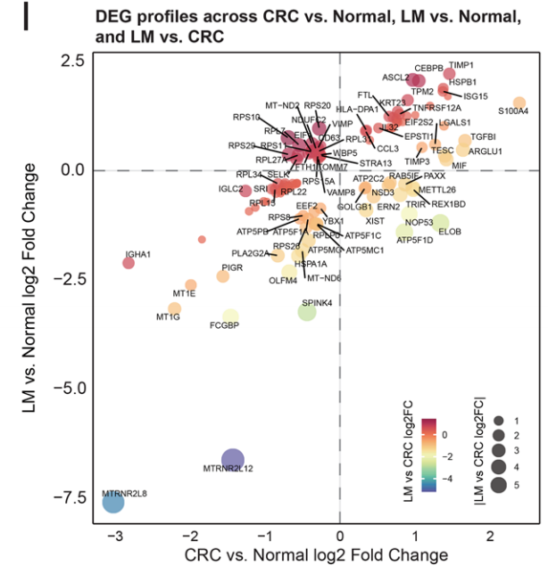
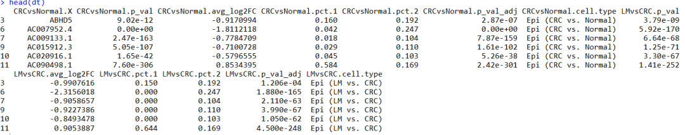
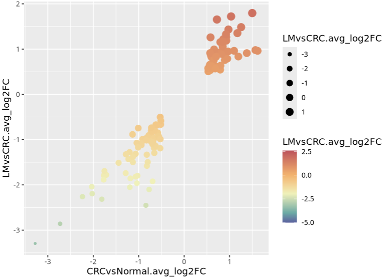
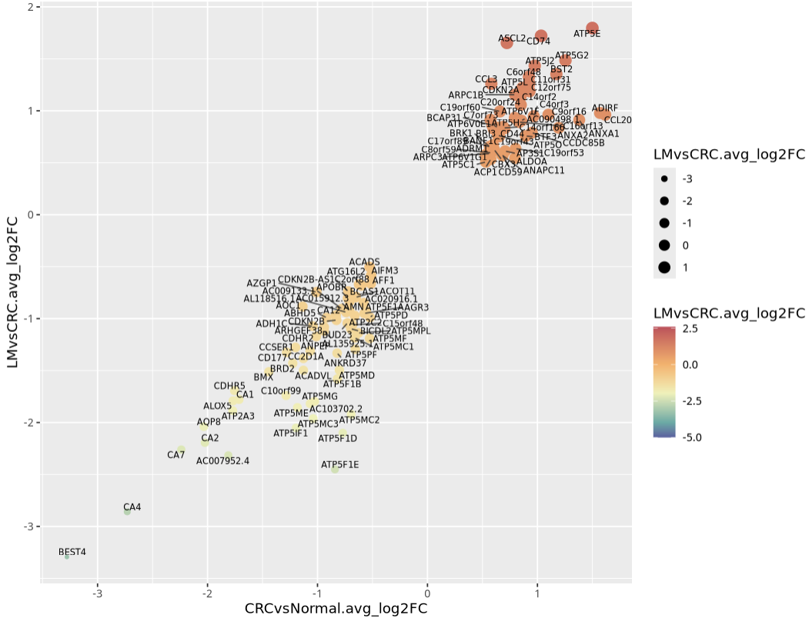
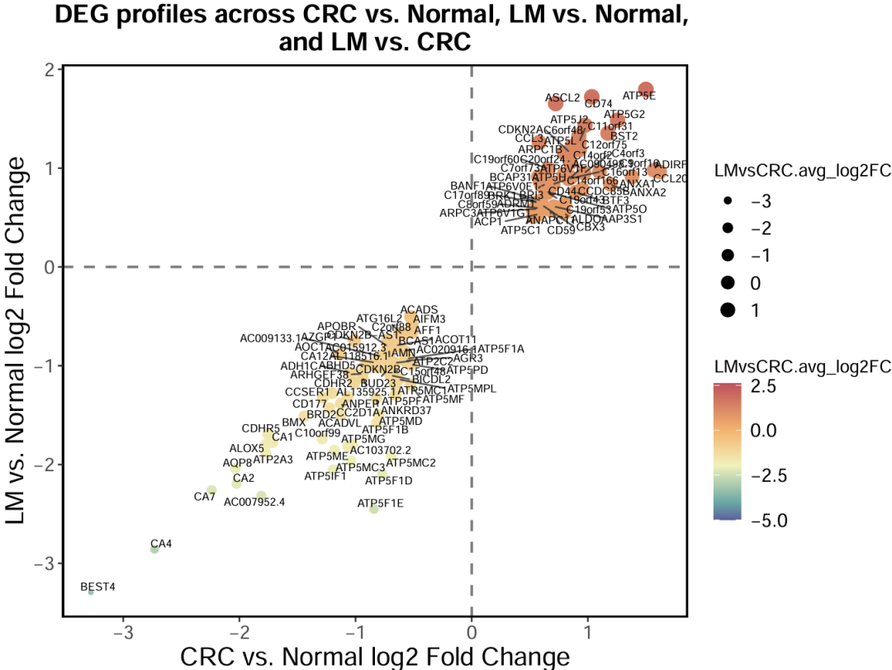

# 高分文献差异结果可视化：散点图展示三个差异分组结果

- 专辑：绘图小技巧2026
- 公众号：生信技能树
- 发布时间：2026-04-17 22:05
- 原文：[微信公众平台](https://mp.weixin.qq.com/s?__biz=MzAxMDkxODM1Ng%3D%3D&mid=2247551072&idx=1&sn=c4df0c821f9472e0e883f447548acf2a&chksm=9b4b48dbac3cc1cd0e24834204c7fdc14ac76170f910c65ffeef0094ed5d06182dc988099c8f)

---
> 今天的图文来自2025年11月发表的文献《Dynamic remodelling of epithelial plasticity in colorectal cancer from single-cell and spatially resolved perspectives》，图是一个二维散点图，却展示了三个差异分组的结果：x坐标是差异CRC vs Normal的log2FC值，y坐标是差异LM vs Normal 的log2FC值，然后点的颜色和大小是第三个差异分组 LM vs CRC的差异 log2FC值！

图如下，为文献中的Fig2I：



> Fig. 2 Single-cell transcriptomic analysis of epithelial cell subtypes and CNV states in colorectal cancer and liver metastasis
>
> (I) Scatter plot showing shared differentially expressed genes (DEGs) among the three group comparisons: CRC High CNV vs. Normal normal CNV, LM high CNV vs. Normal normal CNV, and lm high CNV vs. CRC high CNV. The x-axis represents CRC vs. Normal, the y-axis represents LM vs. Normal, and color/size indicate LM vs. CRC.

## 示例数据

上图的数据在文献的补充材料：

https://pmc.ncbi.nlm.nih.gov/articles/instance/12642194/bin/12967_2025_7380_MOESM2_ESM.csv

https://pmc.ncbi.nlm.nih.gov/articles/instance/12642194/bin/12967_2025_7380_MOESM3_ESM.csv

但是文献只给了两个差异分组的结果，第三个差异结果这里就用两个差异中的一个好了，代码环节到时候自己应用的时候稍微修改一下就很好！

读取进来：

```r
rm(list=ls())
library(ggplot2)
library(ggrepel)

# 1.读取数据
diff1 <- read.csv("data/12967_2025_7380_MOESM2_ESM.csv",skip = 2)
table(diff1$cell.type)
diff1 <- diff1[diff1$cell.type=="Epi (CRC vs. Normal)",]
colnames(diff1) <- paste0("CRCvsNormal.",colnames(diff1))
head(diff1)


diff2 <- read.csv("data/12967_2025_7380_MOESM3_ESM.csv",skip = 2)
table(diff2$cell.type)
diff2 <- diff2[diff2$cell.type=="Epi (LM vs. CRC)",]
colnames(diff2) <- paste0("LMvsCRC.",colnames(diff2))
head(diff2)


# 合并
dt <- merge(diff1, diff2, by.x = "CRCvsNormal.X",by.y = "LMvsCRC.X")
dt <- dt[abs(dt$LMvsCRC.avg_log2FC)>0.5,]
dt <- dt[abs(dt$CRCvsNormal.avg_log2FC)>0.5,]
head(dt)
```



因为没有第三个分组，所以这里两个分组的交集基因就比较多，直接用选114个基因作图好了，最终效果 会跟文献的原图有一些出入：

```r
# 缺少一个差异，这里就直接取114个基因做交集好了
dt <- dt[1:114,]

range(dt$CRCvsNormal.avg_log2FC)
range(dt$LMvsCRC.avg_log2FC)
```

## 绘图

首先是一个基本的散点图：

```r
## 2.ggplot2绘图
p <- ggplot(data = dt, aes(x=CRCvsNormal.avg_log2FC, y=LMvsCRC.avg_log2FC)) +
  geom_point(aes(size = LMvsCRC.avg_log2FC, color=LMvsCRC.avg_log2FC), shape = 19) + # stroke：设置点的边框宽度。
  scale_size_continuous(range = c(1, 4)) +  # 调整点的大小范围
  scale_color_gradientn(
    colors = c("#5961a3", "#54aca5", "#eff1b4", "#fdae61", "#cb4958"),
    values = scales::rescale(c(-5, -4, -2, 0, 2.5)),  # 关键节点位置
    limits = c(-5, 2.6))
p
```



添加带连线的散点：

```r
p1 <- p  +
  geom_text_repel(data= dt, aes(x=CRCvsNormal.avg_log2FC, y=LMvsCRC.avg_log2FC,label = CRCvsNormal.X), size =2.4,
                  force_pull=2,         # 设置标签吸引力为 0，标签不会被强制拉回到数据点
                  point.padding = 0,     # 设置文本标签与对应点之间的最小距离
                  box.padding = 0.01,       # 设置标签与数据点之间的最小距离,值：0.5
                  min.segment.length = 0.03,  # 长度大于0就可以添加引线
                  segment.color="grey20",
                  segment.size=0.5,        # 设置引导线的粗细
                  segment.alpha=0.8,       # 文本标签中连接线段的透明度
                  max.overlaps = Inf,
                  seed = 123, max.time = 1, max.iter = Inf)

p1
```



最后添加虚线，修改一下主题：

```r
p2 <- p1 +
  geom_vline(xintercept = 0, linetype = "dashed", color = "gray50", linewidth = 0.8) +
  geom_hline(yintercept = 0, linetype = "dashed", color = "gray50", linewidth = 0.8) +
  scale_alpha_continuous(range = c(0.3, 1)) +  # 调整透明度范围
  xlab(label = "CRC vs. Normal log2 Fold Change") +
  ylab(label = "LM vs. Normal log2 Fold Change") +
  ggtitle("DEG profiles across CRC vs. Normal, LM vs. Normal,
and LM vs. CRC")
p2

p3 <- p2 +
  theme_bw() +
  theme (legend.position = "right",
         legend.text = element_text(size = 12),
         panel.border = element_rect( color = "black", fill = NA, linewidth = 1.2 ),
         # 去掉所有背景格子线
         panel.grid.major = element_blank(),   # 去掉主要网格线
         panel.grid.minor = element_blank(),   # 去掉次要网格线
         plot.title = element_text(size = 16, face = "bold",hjust = 0.5),
         axis.title.x = element_text(size = 16),
         axis.title.y = element_text(size = 16),
         axis.text.x = element_text(size = 12),
         axis.text.y = element_text(size = 12))

p3
ggsave(filename = "Fig2I.pdf",width = 8,height = 6,plot = p3)
```

结果如下：



这里的点有点多，稍微有点拥挤，可以后期使用AI拉开一点，文章的数据比这里更稀疏一点所以没有这么挤在一起！

今天分享到这~

友情转发：

- [生信入门&数据挖掘线上直播课2026年4月班](https://mp.weixin.qq.com/s?__biz=MzAxMDkxODM1Ng%3D%3D&mid=2247550580&idx=1&sn=902a5d5279eff6fd8fca564f981f8c55#wechat_redirect)，系统的生信入门课

- [生信故事会](https://mp.weixin.qq.com/mp/appmsgalbum?__biz=MzAxMDkxODM1Ng%3D%3D&action=getalbum&album_id=1679199708449144836#wechat_redirect)，来看看他们的生信入门故事

- [生信马拉松答疑专辑](https://mp.weixin.qq.com/mp/appmsgalbum?__biz=MzAxMDkxODM1Ng%3D%3D&action=getalbum&album_id=3690970204957147140#wechat_redirect)，获取你的生信专属答疑

- [GEO数据实战训练直播（学员免收门票）](https://mp.weixin.qq.com/s?__biz=MzAxMDkxODM1Ng%3D%3D&mid=2247549988&idx=1&sn=5b71601f72f465f8010ef1f3e13a3287#wechat_redirect)，课后有大量案例实战训练

- [花小钱办大事—你生信入门的第一款服务器](https://mp.weixin.qq.com/s?__biz=MzUzMTEwODk0Ng%3D%3D&mid=2247536917&idx=1&sn=a38efde1fd1b01616fa2bf961926beab#wechat_redirect)

<!-- wechat-article-fetcher: complete -->
