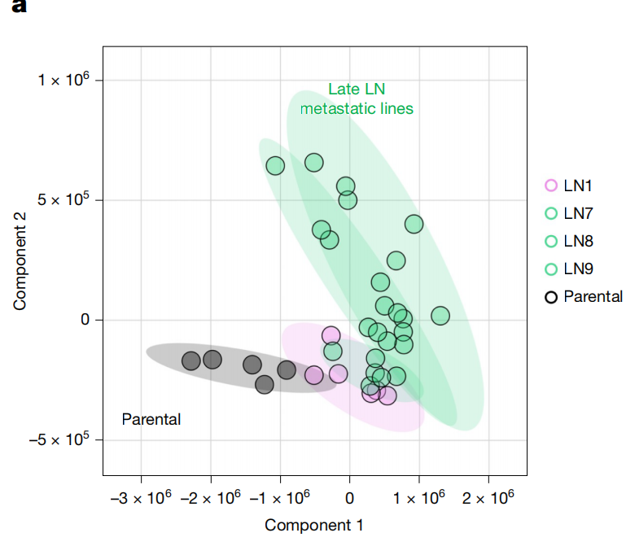
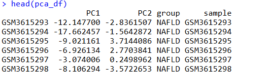
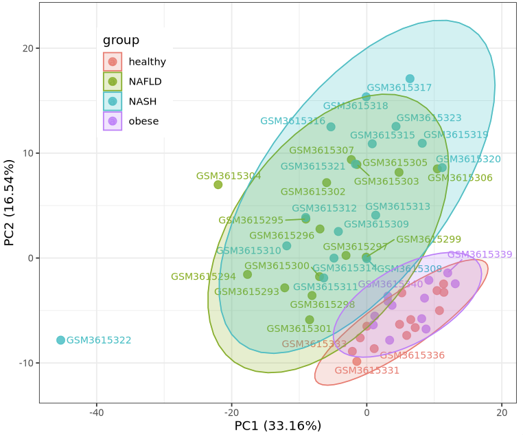
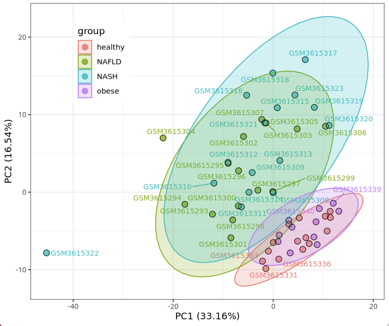
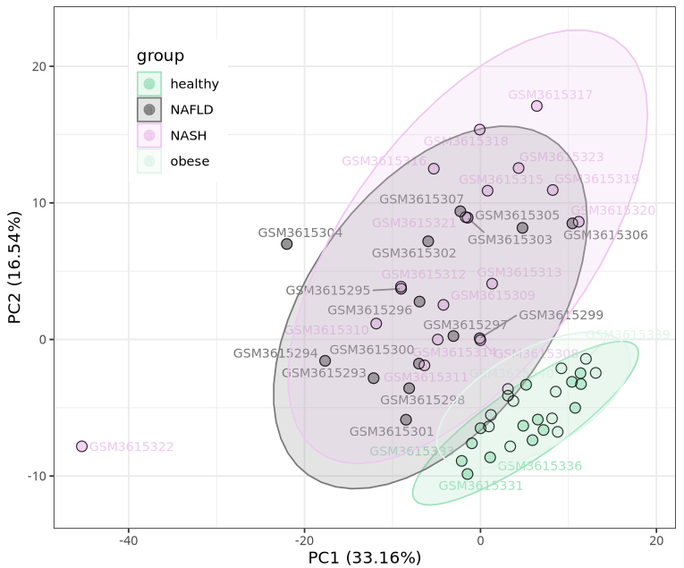
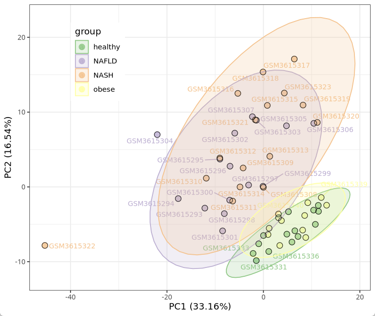
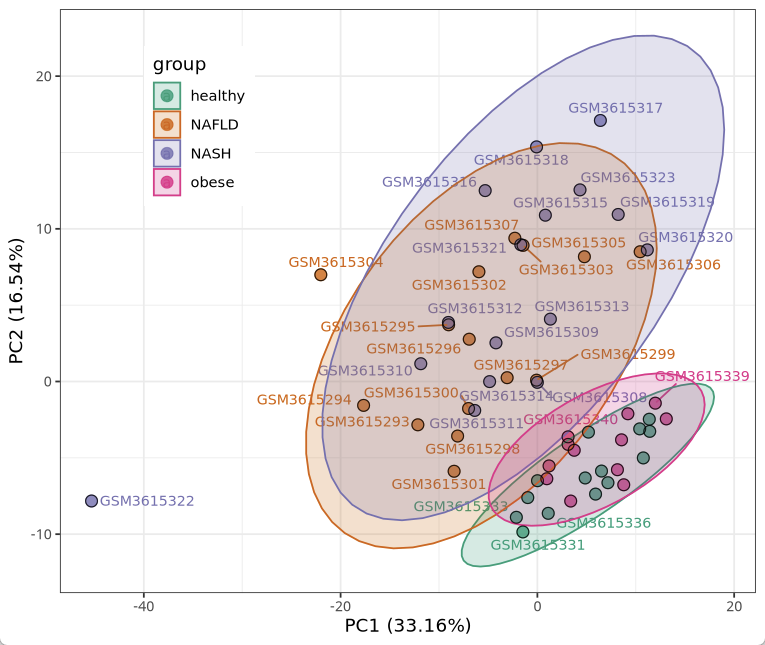
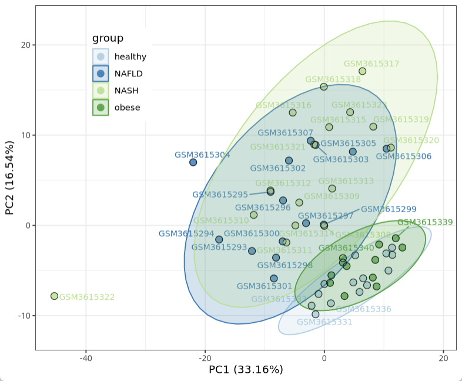
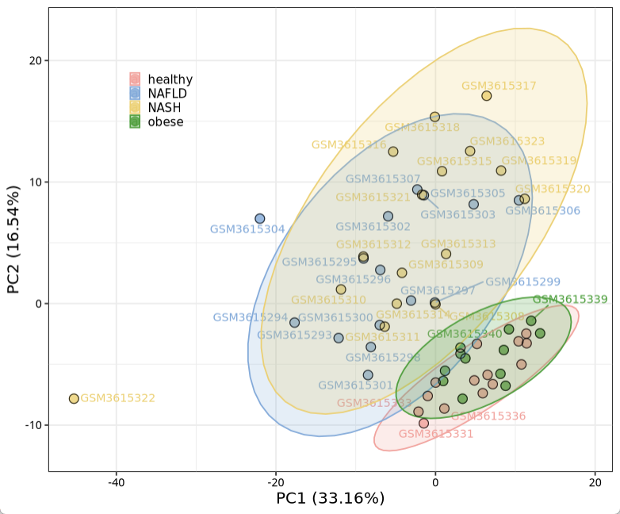

# Nature顶刊同款高颜值PCA分析图

- 专辑：绘图小技巧2026
- 公众号：生信技能树
- 发布时间：2026-04-22 22:34
- 原文：[微信公众平台](https://mp.weixin.qq.com/s?__biz=MzAxMDkxODM1Ng%3D%3D&mid=2247551190&idx=1&sn=e0dcceb8ca37da1fd45b3c755dfb5c95&chksm=9b4b486dac3cc17bac4b57ea79d7b425b673b7c2afcc42625174ffee9f9ad36919690ca6a440)

---
> 今天分享一个来自2025年11月发表在nature杂志上的pca结果图，文献为《Lymph node environment drives FSP1 targetability in metastasizing melanoma》，pca图来自文献中的Figure2a，展示的是基于代谢物的样本分类。



图注：

> **Fig. 2: De novo GSH synthesis is reduced in LN metastatic melanoma cells.**
>
> a, Principal component analysis (PCA) of metabolomic profiles from the B16-F0 (parental) and LN1, 7–9 lines.

## 示例数据

上图是代谢物，但是我们同样可以用于转录组的pca结果美化，这次我挑了一个四分组的数据。

链接：https://www.ncbi.nlm.nih.gov/geo/download/?acc=GSE126848

需要下载的文件有：

PFKM表达：GSE126848_norm_counts_FPKM_GRCh38.p13_NCBI.tsv.gz

样本分组信息：GSE126848_series_matrix.txt.gz

基因id与name对应关系：Human.GRCh38.p13.annot.tsv.gz

```r
rm(list=ls())
library(tidyverse)
library(ggrepel)
library(FactoMineR)
library(factoextra)
library(RColorBrewer)
library(ggExtra)
library(cols4all)
library(ggplot2)
library(data.table)
library(limma)

exp <- fread("GSE126848_norm_counts_FPKM_GRCh38.p13_NCBI.tsv.gz",data.table = F)
exp[1:6,1:6]

id2name <- fread("Human.GRCh38.p13.annot.tsv.gz",data.table = F)
head(id2name)

# 合并
exp_symbol <- merge(id2name[,1:2], exp, by.x="GeneID",by.y="GeneID")
exp_symbol <- avereps(exp_symbol[,-c(1,2)],ID = exp_symbol$Symbol) # 重复进取均值
kp <- rowSums(exp_symbol) >0.01 ;table(kp)
exp_symbol <- exp_symbol[kp, ]
head(exp_symbol)
range(exp_symbol)

# 样本分组
library(GEOquery)
gset = getGEO(filename = "GSE126848_series_matrix.txt.gz",getGPL = F)
pd = pData(gset)
identical(rownames(pd),colnames(exp_symbol))
group_list= pd$`disease:ch1`
table(group_list)
```

这样表达矩阵和样本分组就处理好啦！

## PCA分析

下面是使用 prcomp 做一下pca分析，表达矩阵需要进行log转换以及转置：

```r
data <- log10(exp_symbol+1)
data <- t(data)
pca <- prcomp(data, scale. = F)  # 进行标准化 PCA 计算
# 计算 PCA 解释的方差比例
var_explained <- pca$sdev^2 / sum(pca$sdev^2)
var_explained
sum(var_explained) # 累积和为1

# 提取 PCA 结果
pca_df <- as.data.frame(pca$x[, 1:2])
#pca_df$group <- colData(airway)$dex
pca_df$group <- group_list
pca_df$sample <- rownames(pca_df)
```



## PCA图美化

基本pca图：

```r
# 绘图
p <- ggplot(pca_df, aes(x = PC1, y = PC2, color = group)) +
  geom_point(size = 3, alpha = 0.8) +
  geom_text_repel(aes(label = sample), size = 3) +  # 使用 ggrepel 避免重叠
  stat_ellipse(aes(fill = group), alpha = 0.2, geom = "polygon") +
  labs(x = paste0("PC1 (", round(var_explained[1]*100, 2), "%)"),
       y = paste0("PC2 (", round(var_explained[2]*100, 2), "%)")) +
  theme_bw() +
  theme()
p
```



散点加个外边圈：

```r
#  #个性化散点属性
p1 <- p +
  geom_point(data = pca$x, aes(x = PC1,y = PC2), shape = 21, size = 3,
             stroke = 0.5, alpha = 0.8, color = "black" )
p1
```



换个颜色，跟文献同款颜色：

```r
mycol <- c(healthy="#8ce5bb",NAFLD="#7a7a7a",NASH="#f6c6f4",obese="#dcf7ea")

p2 <- p1 +
  scale_fill_manual(values = mycol) + #填充颜色自定义
  scale_color_manual(values = mycol) #描边颜色自定义
p2
```



也可以再换个自己喜欢的：

```r
c4a_gui() #查看色板
mycol <- c4a('accent',4) #配色挑选
mycol <- c4a('dark2', 4)
mycol <- c4a('paired', 4)
mycol <- c4a('pastel1', 4)
mycol <- c4a('area7', 4)

p2 <- p1 +
  scale_fill_manual(values = mycol) + #填充颜色自定义
  scale_color_manual(values = mycol) #描边颜色自定义
p2
```







最后修改一下相关主题细节：

```r
p3 <- p2 +
  theme(panel.background = element_rect(fill = 'white', colour = 'black'),  # 设置背景为白色，边框为黑色
        axis.title = element_text(colour = "black", size = 12, margin = margin(t = 12)),
        axis.text = element_text(color = "black"),  # 设置轴刻度文字颜色
        plot.title = element_blank(),  # 不显示标题
        legend.title = element_blank(),  # 不显示图例标题
        legend.key = element_blank(),  # 使图例背景透明
        legend.text = element_text(color = "black", size = 9),  # 设置图例文本颜色和大小
        legend.spacing.x = unit(0.06, 'cm'),  # 设置图例文本之间的水平间距
        legend.key.width = unit(0.01, 'cm'),  # 设置图例的水平大小
        legend.key.height = unit(0.01, 'cm'),  # 设置图例的垂直大小
        legend.background = element_blank(),  # 使图例背景透明
        legend.position = c(0.2, 0.8) # 图例位置
        )
p3
```



今天分享到这~

友情转发：

- [生信入门&数据挖掘线上直播课2026年4月班](https://mp.weixin.qq.com/s?__biz=MzAxMDkxODM1Ng%3D%3D&mid=2247550580&idx=1&sn=902a5d5279eff6fd8fca564f981f8c55#wechat_redirect)，系统的生信入门课

- [生信故事会](https://mp.weixin.qq.com/mp/appmsgalbum?__biz=MzAxMDkxODM1Ng%3D%3D&action=getalbum&album_id=1679199708449144836#wechat_redirect)，来看看他们的生信入门故事

- [生信马拉松答疑专辑](https://mp.weixin.qq.com/mp/appmsgalbum?__biz=MzAxMDkxODM1Ng%3D%3D&action=getalbum&album_id=3690970204957147140#wechat_redirect)，获取你的生信专属答疑

- [GEO数据实战训练直播（学员免收门票）](https://mp.weixin.qq.com/s?__biz=MzAxMDkxODM1Ng%3D%3D&mid=2247549988&idx=1&sn=5b71601f72f465f8010ef1f3e13a3287#wechat_redirect)，课后有大量案例实战训练

- [花小钱办大事—你生信入门的第一款服务器](https://mp.weixin.qq.com/s?__biz=MzUzMTEwODk0Ng%3D%3D&mid=2247536917&idx=1&sn=a38efde1fd1b01616fa2bf961926beab#wechat_redirect)

<!-- wechat-article-fetcher: complete -->
