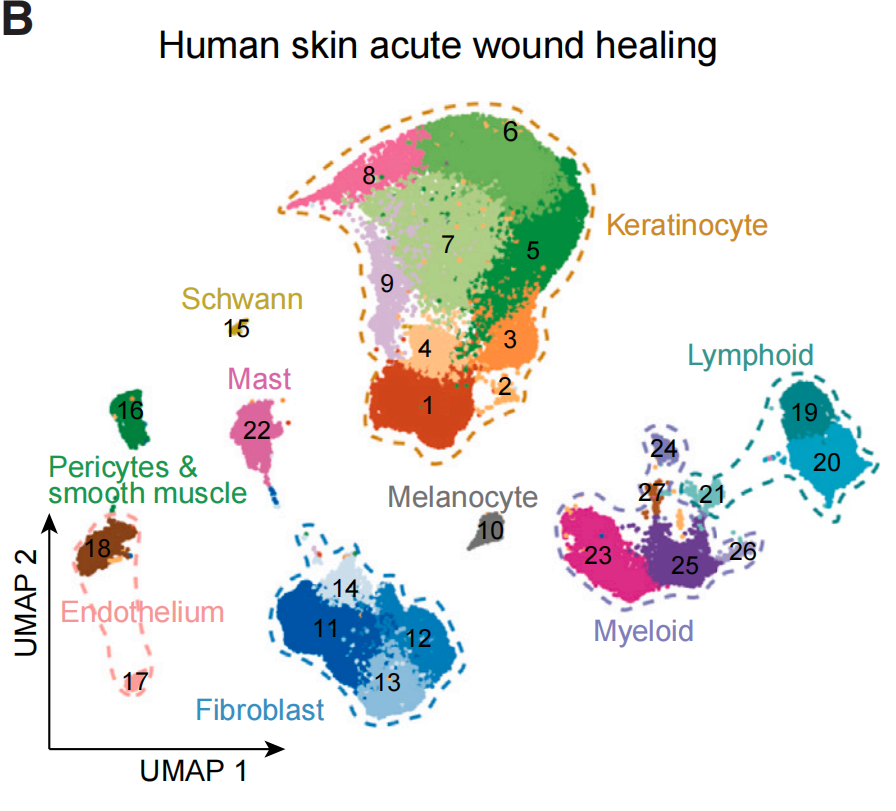
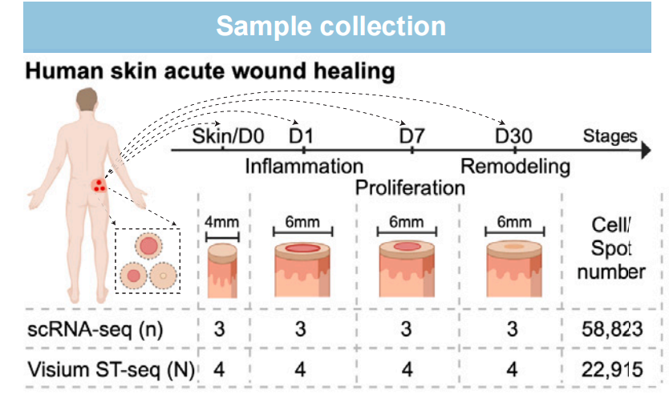
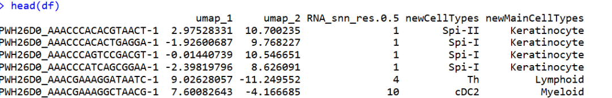
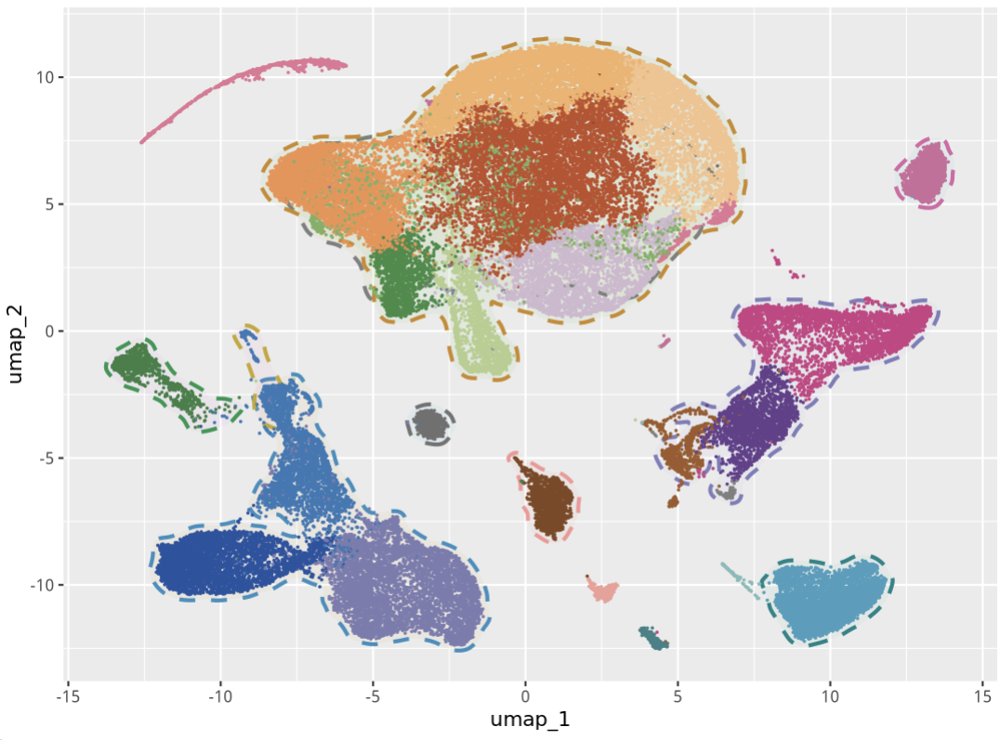
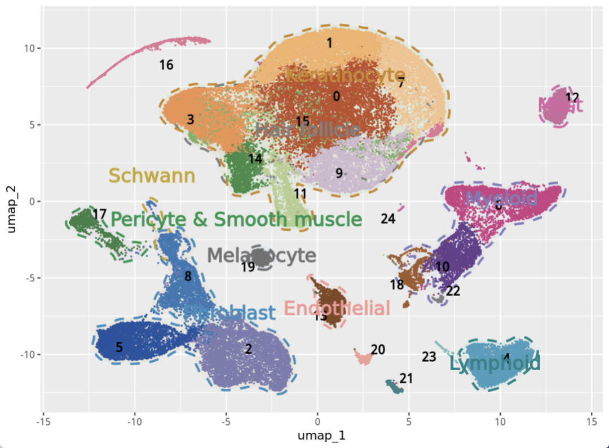
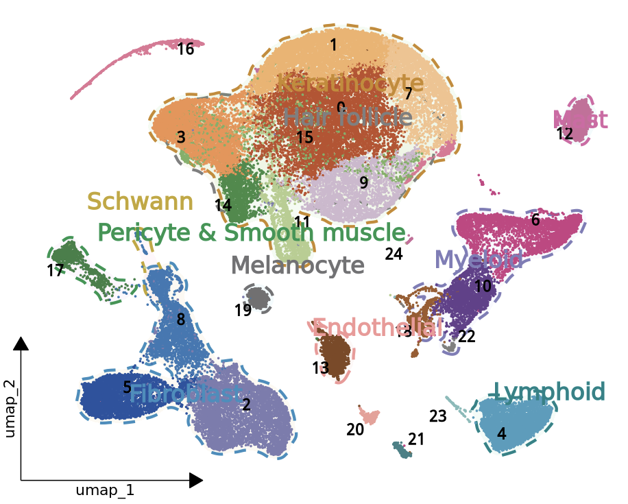

# 高分杂志同款单细胞umap加圈：升级版本

- 专辑：绘图小技巧2026
- 公众号：生信技能树
- 发布时间：2026-04-27 17:49
- 原文：[微信公众平台](https://mp.weixin.qq.com/s?__biz=MzAxMDkxODM1Ng%3D%3D&mid=2247551309&idx=1&sn=be7698e613fa58b484b87120f5a246c2&chksm=9b4b49f6ac3cc0e0270d1b8a53f3acc5d34c31a0b820e382c04d9ed0f9347d610e8660e6ca1c)

---
> 前面我们画过一个单细胞加圈图：[给你的单细胞umap图加个cell杂志同款的圈](https://mp.weixin.qq.com/s?__biz=MzAxMDkxODM1Ng%3D%3D&mid=2247537290&idx=1&sn=ad76831349df67bb5236370dab088536#wechat_redirect)。那个圈感觉比较圆滑，今天看到另外一篇文献也有个加圈的，来自2025年3月6号发表在 cell-stem-cell 杂志（IF=25.269/Q1）上，文献为《Spatiotemporal single-cell roadmap of human skin wound healing》，加圈的如下，感觉更好看啊！

此外，新一期的0基础生信入门班报名开始啦，详细介绍见：[AI加持，全新改版！生信入门&数据挖掘线上直播课5月班](https://mp.weixin.qq.com/s?__biz=MzAxMDkxODM1Ng%3D%3D&mid=2247551296&idx=1&sn=ff5a01abb63312f300ca9fb1cf38393a#wechat_redirect)

这个图也是每个亚群都有数字标签加颜色，圈是加在大群外面的，以及还需要加上大群的亚群名字！



图注：

> Figure 1. A spatiotemporal map of human skin wound healing
>
> (B) UMAP of human acute wound (ACW) scRNA-seq

## 数据情况

研究采集了同一批个体在受伤前的完整皮肤，以及伤后第1天（Wound1）、第7天（Wound7）和第30天（Wound30）的全层同心伤口边缘组织样本（图1A；表S1）。



Single-cell-Wound 单细胞数据放到GEO上面：

https://www.ncbi.nlm.nih.gov/geo/query/acc.cgi?acc=GSE241132

```r
GSM7717079 Donor5, Skin
GSM7717080 Donor5, Wound1
GSM7717081 Donor5, Wound7
GSM7717082 Donor5, Wound30
GSM7717083 Donor4, Skin
GSM7717084 Donor4, Wound1
GSM7717085 Donor4, Wound7
GSM7717086 Donor4, Wound30
GSM7717087 Donor3, Skin
GSM7717088 Donor3, Wound1
GSM7717089 Donor3, Wound7
GSM7717090 Donor3, Wound30
```

#### 注释情况：

从人类急性伤口样本中获得了58,823个细胞，为九种主要细胞类型：

- **keratinocytes**（KRT5高表达或KRT10高表达）

- \*\*fibroblasts (FBs)\*\*（COL1A1+）

- **myeloid cells**（LYZ+和HLA-DRA+）

- **lymphoid cells**（CD3D+或NKG7+）

- **endothelial cells**（PECAM1+）

- **mast cells**（TPSAB1+和TPSB2+）

- **pericytes and smooth muscle cells**（ACTA2+和MYH11+）

- **melanocytes**（TYRP1+和PMEL+）

- **Schwann cells**（SOX10+和SOX2+）（图1B、1C）

下载下来然后读取：

```r
### Update Log: 2024-12-09   by juan zhang (492482942@qq.com)
rm(list=ls())
library(dplyr)
library(future)
library(Seurat)
library(data.table)
library(ggplot2)
library(qs)
# 创建目录
getwd()
gse <- "GSE241132"
dir.create(gse)

# 方式一：标准文件夹
###### step1: 导入数据 ######
samples <- list.dirs("GSE241132/", recursive = F, full.names = F)
samples
scRNAlist <- lapply(samples, function(pro){
#pro <- samples[1]
print(pro)
  folder <- file.path("GSE241132/", pro)
  counts <- Read10X(folder, gene.column = 2)
  sce <- CreateSeuratObject(counts, project=pro, min.cells = 3)
return(sce)
})
names(scRNAlist) <-  samples
scRNAlist

# merge
sce.all <- merge(scRNAlist[[1]], y=scRNAlist[-1], add.cell.ids=samples)
sce.all <- JoinLayers(sce.all) # seurat v5
sce.all

meta <- fread("GSE241132/GSE241132_cell_metadata.txt.gz",data.table = F)
head(meta)
rownames(meta) <- meta$barcode
sce.all <- subset(sce.all, cells = rownames(meta))
sce.all <- AddMetaData(sce.all, metadata = meta)
sce.all

# 查看特征
head(sce.all@meta.data, 10)
table(sce.all$newMainCellTypes)
table(sce.all$newCellTypes)
table(sce.all$newCellTypes,sce.all$newMainCellTypes)
qsave(sce.all, file="GSE241132/sce.all.qs")
```

上面的数据作者有注释好的信息，这里就不做注释了，你自己的数据是任何一个注释后的seurat就可以了！

然后经过简单的降维聚类分群拿到聚类信息和umap坐标！

现在开始绘图！

## umap加圈绘图

上面的图本质是散点图，亚群标签就是点的label。

#### 先提取数据：

```r
# 绘图
df <- FetchData(object=sce.all, vars=c("umap_1","umap_2","RNA_snn_res.0.5","newCellTypes","newMainCellTypes"))
head(df)
table(df$RNA_snn_res.0.5,df$newMainCellTypes)
```



需要用到的就是上面这几列了！

#### 设置颜色

这里需要有亚群 RNA_snn_res.0.5的颜色，大群 newMainCellTypes的颜色，都从文献里面抠出来：

```r
# 设置颜色
# 细分亚群颜色
cols1 <- c("#c04e2a","#f3b169","#f0924f","#f5c28c","#cfb8cf","#b4ce8e","#3d8b46","#7ab062","#e27596", #0,1,3,7,9,11,14,15,16 #Keratinocyte
          "#cb3e83","#653f8c","#9f5a2a","#7c7cb0", #6,10,18,22 Myeloid
          "#95bcd9","#2253a1","#3579b5", #2,5,8 Fibroblast
          "#814722","#ef9f98",# 13,20 Endothelial
          "#388045",# 17, Pericyte & Smooth muscle
          "#cd6c9b","#cd6c9b",# 12,24 mast
          "#479ebe","#398287","#80bcba", #4,21,23 Lymphoid
          "#717071"#19,Melanocyte
          )
names(cols1) <- c(0,1,3,7,9,11,14,15,16,
                 6,10,18,2,
                 2,5,8,
                 13,20,
                 17,
                 12,24,
                 4,21,23,
                 19)

# 大群颜色
cols2 <- c("#cb8929","#018387","#7f7db9","#727274","#368fbf","#f49797","#19964f",
           "#d866a6","#c5a730")
names(cols2) <- c("Keratinocyte","Lymphoid","Myeloid","Melanocyte","Fibroblast","Endothelial","Pericyte & Smooth muscle",
                  "Mast","Schwann")

# 两个合在一起使用
cols <- c(cols1,cols2)
```

#### 计算label的位置：

```r
## 计算每个细分亚群label所处的位置
sub_type_med <- df %>%
  group_by(RNA_snn_res.0.5) %>%
  summarise(umap_1 = median(umap_1), umap_2 = median(umap_2))
sub_type_med

## 计算每个大label所处的位置，生成后AI去挪动位置好了
main_type_med <- df %>%
  group_by(newMainCellTypes) %>%
  summarise(umap_1 = median(umap_1)+1, umap_2 = median(umap_2)+1)
main_type_med
```

## 开始绘图

使用ggplot2。

#### 先来个基本的三点和外圈：

```r
p <- ggplot(df , aes(x = umap_1, y = umap_2)) +
  stat_unchull(aes(fill = newMainCellTypes, color = newMainCellTypes),
               alpha = 0.05, size = 1, lty = 2, delta=0.25, show.legend=F) +
  geom_point(aes(color = RNA_snn_res.0.5), size = 0.2, show.legend = FALSE) + #亚群的颜色
  scale_color_manual(values = cols)
p
```



嗯，这个圈感觉比前面写的那个好！

#### 添加标签

```r
# 数字标签
p1 <- p +
  geom_text_repel(data=sub_type_med, aes(label=RNA_snn_res.0.5),color="black" ,
                  fontface="bold",show.legend=F, size=4)
p1

# 大亚群标签
p2 <- p1 +
  geom_text_repel(data=main_type_med, aes(label=newMainCellTypes, color=newMainCellTypes),
                  fontface="bold",show.legend=F, size=6)
p2
```



#### 调整主题和加小箭头

根据这个：[一行代码给你的单细胞UMAP图添加左下角小箭头坐标轴](https://mp.weixin.qq.com/s?__biz=MzAxMDkxODM1Ng%3D%3D&mid=2247546483&idx=1&sn=acea4ccfb046a373c767523ccc41a266#wechat_redirect)

给umap添加一个小箭头坐标：

```r
# 极速安装
# install.packages("tidydr")
library(tidydr)
p3 <- p2 +
  theme_dr() + # 应用带小箭头的坐标轴主题（来自tidydr包）
  theme(aspect.ratio = 1,
        panel.background = element_blank(),
        panel.grid = element_blank(),
        axis.line = element_line(arrow = arrow(type = "closed", length = unit(0.1, "inches")) ),
        axis.title = element_text(hjust = 0.05, size=12))
p3
```



完美！如果对你有帮助，欢迎一键三连~

友情转发：

- [AI加持，全新改版！生信入门&数据挖掘线上直播课5月班](https://mp.weixin.qq.com/s?__biz=MzAxMDkxODM1Ng%3D%3D&mid=2247551296&idx=1&sn=ff5a01abb63312f300ca9fb1cf38393a#wechat_redirect)，系统的生信入门课

- [生信故事会](https://mp.weixin.qq.com/mp/appmsgalbum?__biz=MzAxMDkxODM1Ng%3D%3D&action=getalbum&album_id=1679199708449144836#wechat_redirect)，来看看他们的生信入门故事

- [生信马拉松答疑专辑](https://mp.weixin.qq.com/mp/appmsgalbum?__biz=MzAxMDkxODM1Ng%3D%3D&action=getalbum&album_id=3690970204957147140#wechat_redirect)，获取你的生信专属答疑

- [GEO数据实战训练直播（学员免收门票）](https://mp.weixin.qq.com/s?__biz=MzAxMDkxODM1Ng%3D%3D&mid=2247549988&idx=1&sn=5b71601f72f465f8010ef1f3e13a3287#wechat_redirect)，课后有大量案例实战训练

- [花小钱办大事—你生信入门的第一款服务器](https://mp.weixin.qq.com/s?__biz=MzUzMTEwODk0Ng%3D%3D&mid=2247536917&idx=1&sn=a38efde1fd1b01616fa2bf961926beab#wechat_redirect)

<!-- wechat-article-fetcher: complete -->
