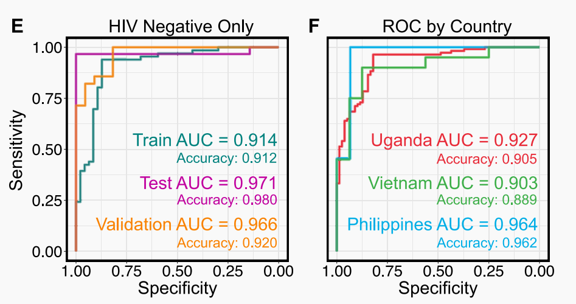
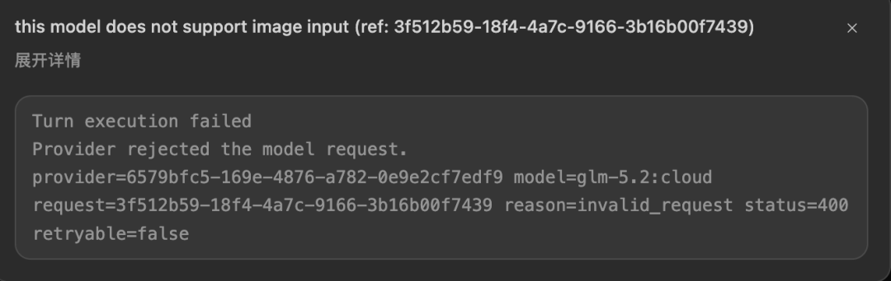
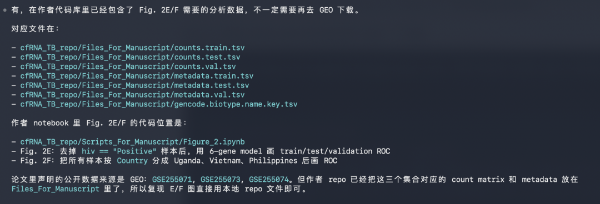
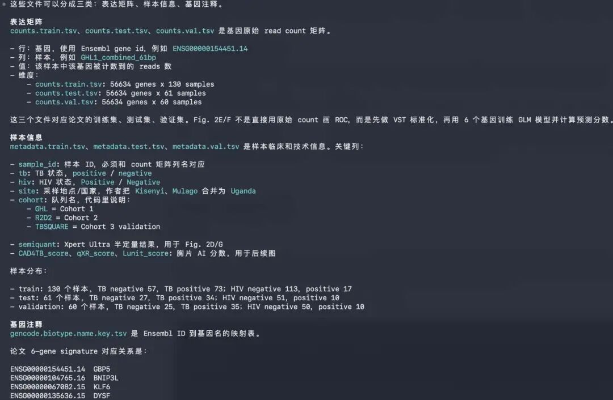
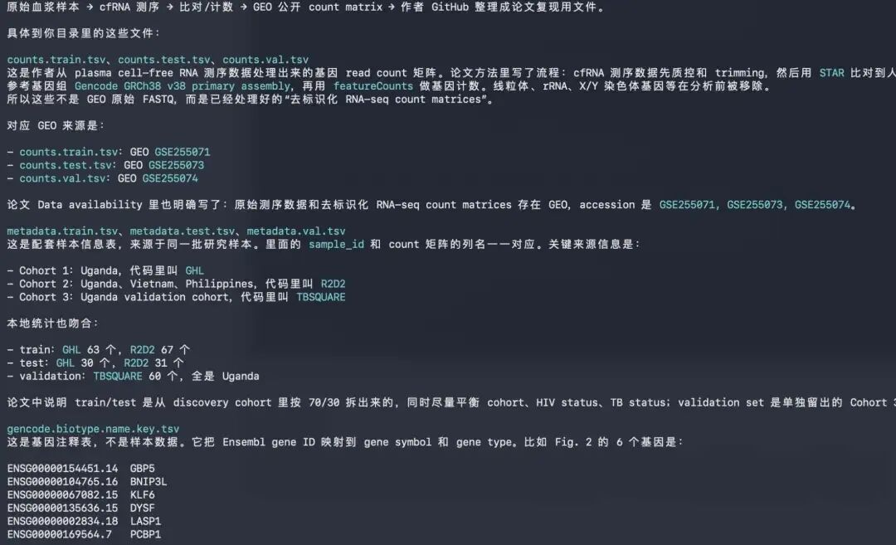
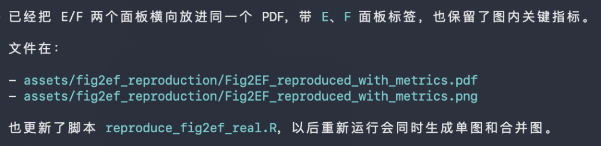
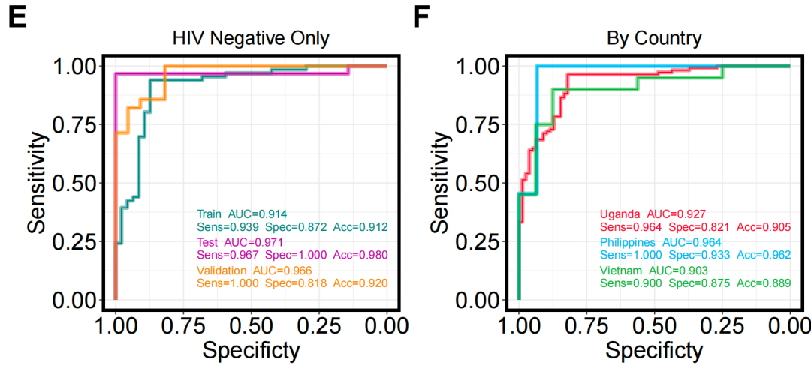

# 使用AI复现NC同款高颜值ROC曲线：三步搞定！

- 专辑：绘图小技巧2026
- 公众号：生信技能树
- 发布时间：2026-06-23 22:51
- 原文：[微信公众平台](https://mp.weixin.qq.com/s?__biz=MzAxMDkxODM1Ng%3D%3D&mid=2247552382&idx=1&sn=e7e18b0150b1534bdbf443b2ebc4766f&chksm=9b4b4dc5ac3cc4d3ee96992b35ee6033dfba2bae2d00696ca2bfd779eaa6d6a9801fa6310b00)

---
> 前面我们使用AI复现了一个图片，非常完美：[新的绘图打开方式：codex一句话完美复现高分杂志同款小提琴图！](https://mp.weixin.qq.com/s?__biz=MzAxMDkxODM1Ng==&mid=2247551833&idx=1&sn=1b63552dc15487d7a34f10dd09c50fda&scene=21#wechat_redirect)。
>
> 但是那个比较简单，而且绘图的数据我还是手搓的。可能没有充分展示AI的绘图实力！
>
> 这里我们来个难一点的：看看这个 2024年6月10号发表在 Nature Communications杂志上的一篇文献，标题为《Circulating cell-free RNA in blood as a host response biomarker for detection of tuberculosis》。

**复现的图为：**Fig. 2: Performance of the 6-gene signature identified in plasma cfRNA. 图E,F：

E.Performance of the 6-gene TB score when the model is re-evaluated without HIV-positive individuals.

F.Performance of the 6-gene TB score when separating samples by country (red = Uganda, green = Vietnam, light-blue = Philippines).



#### 要做出这个图，思路是这个样子的：

1.需要理解图在原文中的含义，说明了什么？

2.绘图的数据来源

3.发出AI指令，让AI绘图。

## 首先是这两个图的含义：

我使用的模型为最近很火的GLM5.2，配置方法：

[Ollama：使用 Claude Code 与 GLM-5.2 进行 Vibe Coding 的配置指南](https://mp.weixin.qq.com/s?__biz=MzAxMDkxODM1Ng==&mid=2247552296&idx=1&sn=470d33c0fee6fc89541a0b15d71e9e7a&scene=21#wechat_redirect)。

提示语：

```r
[41467_2024_Article_49245.pdf](./41467_2024_Article_49245.pdf) 解读这篇文献中的Fig. 2: Performance of the 6-gene signature identified in plasma cfRNA，E,F这两个图。
```

#### AI给出的解读：

这篇文章是 Nature Communications 2024 年发表的论文（doi: 10.1038/s41467-024-49245-6），研究主题是利用血浆 cfRNA（cell-free RNA）中的 6 基因 signature 诊断结核病（TB）。Fig. 2 展示了该 6 基因 signature（GBP5、BNIP3L、KLF6、DYSF、LASP1、PCBP1）在血浆 cfRNA 中的性能。

#### E 图展示的是**把 HIV 阳性个体剔除后，重新评估 6 基因 TB score 的诊断性能**。

**背景与逻辑：**

- HIV 感染会干扰宿主免疫基因的表达谱（尤其是干扰素通路相关基因），可能影响 cfRNA 诊断签名的准确性。

- 作者想验证：模型性能下降，是否部分由 HIV 阳性样本的误分类造成？

**关键发现（正文对应）：**

1.  **剔除 HIV 阳性样本后，模型在 test 和 validation 集上性能均有提升**。

2.  提升的主要原因来自 **HIV+/TB- 患者的误分类**——在 8 个被误判的 HIV 阳性样本中，有 7 个是 HIV+/TB-（即 HIV 阳性但非结核的患者），这些患者被错误地判为 TB 阳性。

3.  这说明 HIV 感染本身会诱导类似 TB 的宿主基因表达模式，造成假阳性；剔除后模型特异性提高。

**图表呈现形式：** 通常为 ROC 曲线（与图 B 风格一致，dark-green = train, purple = test, gold = validation），对比"含 HIV"与"剔除 HIV"两种情况下的 AUC 变化。

#### F 图展示的是**按样本采集国家分层后，6 基因 TB score 的诊断性能**。

**背景与逻辑：**

- 本研究涵盖**三个国家**的队列（Cohort 1/2/3 对应不同地区），跨国验证是评估诊断标志物泛化能力（generalizability）的关键。

- 不同地区在人群遗传背景、结核流行株、HIV 共感染率、样本采集方式上均有差异，可能影响模型表现。

**关键发现（正文对应）：**

- 模型性能**对国家来源稳健（robust）**，三个国家的 AUC 均 \> 0.9：

  - 🇺🇬 **Uganda（乌干达）= 0.93**

  - 🇻🇳 **Vietnam（越南）= 0.90**

  - 🇵🇭 **Philippines（菲律宾）= 0.96**

- 这表明 6 基因签名的判别能力**独立于地理区域和队列**，具有跨地域的稳定性。

**图表呈现形式：** 同样为 ROC 曲线，三条曲线分别用红（Uganda）、绿（Vietnam）、浅蓝（Philippines）表示，便于直观比较三条曲线下面积。

#### E、F 两图的共同意义

E、F 两图共同回答了一个核心问题：**这个 6 基因 cfRNA signatures 是否足够稳健，可以推广到不同临床场景？**

[TABLE]

## 绘图的数据来源

#### 提示词：

```r
给出目录下面41467_2024_Article_49245.pdf这个E,F图的数据来源，并下载，作者还提供了代码可以参考：https://github.com/DanielEweisLaBolle/cfRNA_TB，已经下载到当前目录了。
```

现在这个模型在使用过程中我好像忽略了他的一个问题：



所以接下来我换用了codex里面的chatgpt模型。

上面的提示语作者在代码文件中找到了对应的数据：



#### 文件的内容：



#### 数据来源

当前目录里的作者代码库已经包含 Fig. 2E/F 所需的“处理后复现数据”；这些数据的公开上游来源是 GEO GSE255071/GSE255073/GSE255074，再往上是论文中 251 个疑似 TB 患者血浆 cfRNA RNA-seq 数据。



## AI绘图复现

现在图的含义和数据都清楚了。我们可以直接让AI复现这两个图，并保存代码。

那如果前面两个环节中你都没有基础搞懂，这个时候AI绘图复现的意义其实也不是很大。

你觉得呢？

即使复现出来了，你也只是得到了一张同款图，根本没有能力内化转为己用。

对于生信0基础的你，看看这个把自己打醒吧：[AI 都会写代码了，我还要从零学生信吗？](https://mp.weixin.qq.com/s?__biz=MzAxMDkxODM1Ng==&mid=2247552344&idx=1&sn=91b6ff0a06d107527b700b96a2bef038&scene=21#wechat_redirect)

生信技能树的生信0基础学习班快来：[AI加持，全新改版！生信入门&数据挖掘线上直播课7月班](https://mp.weixin.qq.com/s?__biz=MzAxMDkxODM1Ng==&mid=2247552327&idx=1&sn=1bc2a9de8551f1bfd0673f2e7f4e4e60&scene=21#wechat_redirect)。

#### 提示词：

```r
根据上面的数据以及作者的代码，请复现e,f这两个图，这两个图的结果放在一个pdf文件中。
```

过程：



复现结果：会比原文多放了两个指标，导致准确率那个指标只显示了一个A。让它修正一下：

```r
你的图有个指标准确率 不在图的框框里面，请调整一下。
```



完美！

AI的复现脚本比较长，可以找我发给你R脚本：jzhang0527。请备注AI绘图脚本。

今天分享到这里~


生信技能树数十年如一日的0基础生信入门班你值得拥有，7月份的课程如下：

[AI加持，全新改版！生信入门&数据挖掘线上直播课7月班](https://mp.weixin.qq.com/s?__biz=MzAxMDkxODM1Ng==&mid=2247552327&idx=1&sn=1bc2a9de8551f1bfd0673f2e7f4e4e60&scene=21#wechat_redirect)

添加小助手报名吧，提供超有情绪价值的陪伴学习和答疑（助教团队，温柔耐心的新叶老师一对一远程答疑！！！）


<!-- wechat-article-fetcher: complete -->
